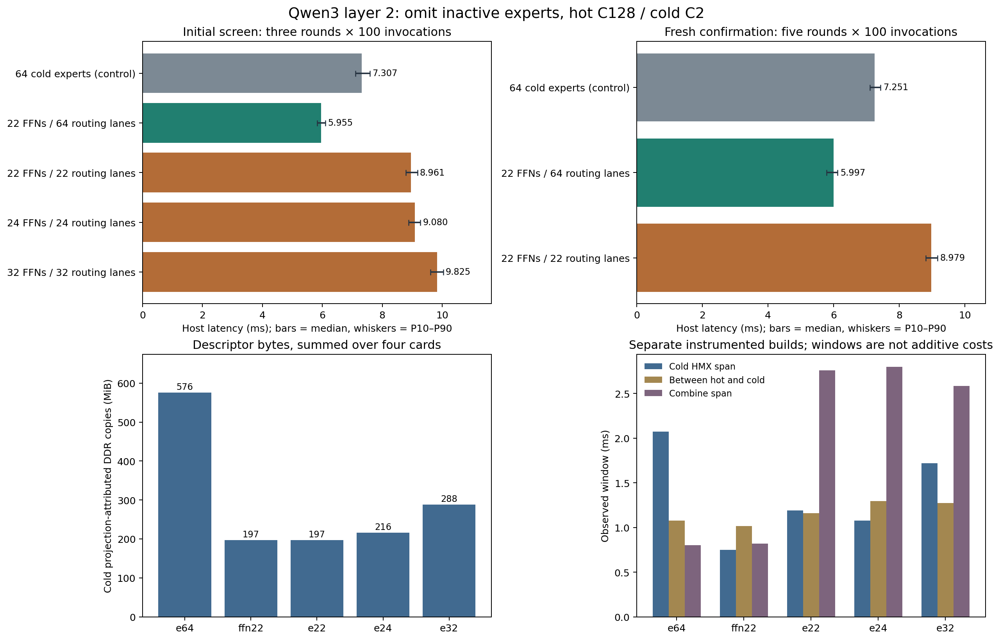
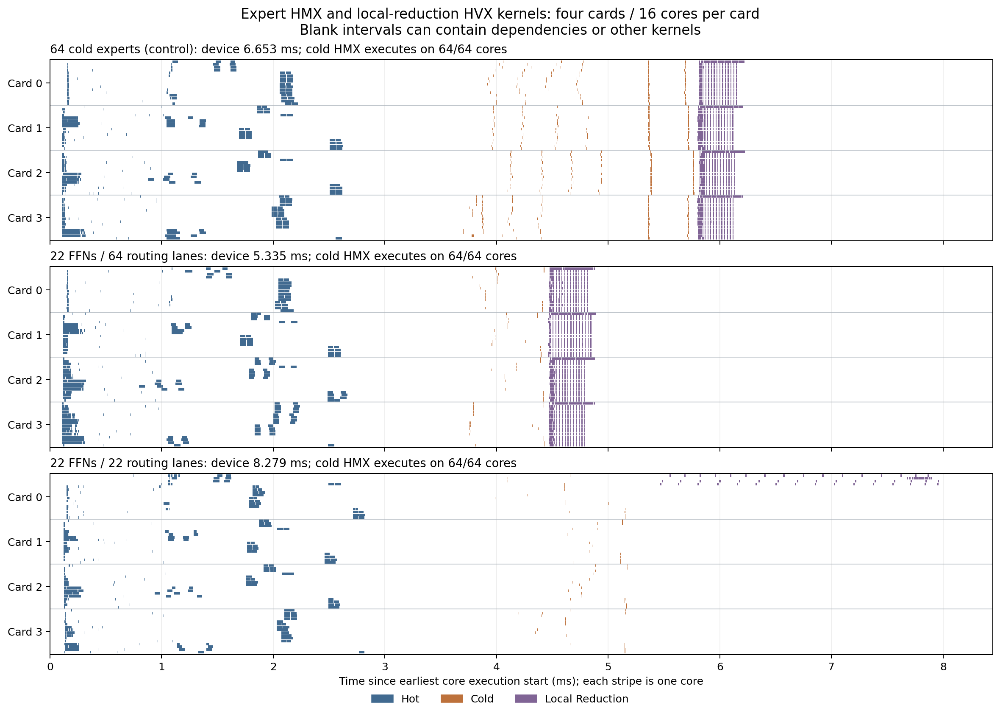

# Qwen3 layer-2 active-expert oracle

Measured 2026-09-22 on four AI 100 cards, 16 cores/card, SDK 1.21.6, FP16.

**Omitting the 42 inactive cold experts' FFNs, while preserving the existing
routing/accumulation layout, reduces isolated MoE host latency from 7.251 to
5.997 ms: 17.29% lower, 1.209× speedup.** This is an additional improvement over
the [routing-retuned baseline](../routing_retune/README.md), which already removes
the redundant zero-accumulator read and tiles the local output reduction.

Activation information can therefore expose useful headroom even where small
padding changes give similar latency. The successful graph removes expert weight
work as well as arithmetic. However, compacting the whole cold path is slower:
8.979 ms, 23.84% above the control. Its compiled reduction placement and P2P
traffic change substantially. This experiment demonstrates feasibility for one
known input; it is neither an online policy nor a global optimization bound.

## Scope and graph construction

The source is `../routing_retune/c2_tree/model.onnx`: trained Qwen3-30B-A3B,
zero-based layer 2, batch 1, 128 tokens, hidden 2048, intermediate 768,
128 experts, top-8 routing. The replay uses the same first 128 tokens of GSM8K
prompt 41. All 64 hot experts are active. Of the 64 cold experts, eight receive
two tokens, fourteen receive one, and 42 receive none. There are 994 hot and
30 cold assignments, 1024 in total.

**Token capacities stay hot128/cold2 in every case.** The numbers 22, 24 and 32
below are expert-bank widths, not token capacities. Both stages span all four
cards; they are not assigned to separate pairs of cards.

| Case | Cold FFN width | Cold routing/accumulation width | Change |
|---|---:|---:|---|
| `e64` | 64 | 64 | Byte-identical source graph; reuse its QPCs |
| `ffn22` | 22 | 64 | Slice packed input before FFNs; restore 42 zero output rows afterwards |
| `e22` | 22 | 22 | Also shorten cold packing, routing and accumulator updates |
| `e24` | 24 | 24 | Keep two empty slots to test an aligned width |
| `e32` | 32 | 32 | Keep ten empty slots to test a power-of-two width |

All modified cases shorten the external-data prefixes of the cold gate, up and
down weight banks. Retained weights are unchanged FP16 bytes at their original
offsets. The existing expert order already puts the active cold experts first;
this experiment performs no additional weight permutation. Hot weights,
capacities, hot expert projections and final reduction nodes are protected by
structural checks.

For `ffn22`, `[64,2,2048]` packed input is sliced to `[22,2,2048]`; the down
projection's result is concatenated with 42 zero rows. The source routing,
gather/scatter and full `[64,128,2048]` accumulation graph remain intact.
The compiler can still change internal tiling and optimize around the added
Slice/Concat, so unchanged source nodes do not imply identical machine code.

For `e22/e24/e32`, cold routing rows and prefix-scan zero tensors are also
shortened. Only the corresponding prefix of the hot accumulator is updated;
its untouched tail is concatenated back before the original full reduction.
That tail contains hot contributions and must not be zeroed. A separate full
cold-count diagnostic preserves all 128 output counts, including omitted slots.

The benchmark rejects inputs with changed captured counts, nonfinite/negative
routing values, assignments to omitted experts or capacity overflow. Selection
and omission are static; no captured token positions or prefix sums are embedded
as graph constants. CPU checks also exercise different valid cold masks.

## Uninstrumented host measurements

The initial screen has three rounds × 100 timed invocations per case:

| Case | Median, ms | P10–P90, ms |
|---|---:|---:|
| `e64` | 7.307 | 7.102–7.592 |
| `ffn22` | 5.955 | 5.830–6.098 |
| `e22` | 8.961 | 8.788–9.174 |
| `e24` | 9.080 | 8.875–9.271 |
| `e32` | 9.825 | 9.604–10.033 |

A fresh confirmation has five rounds × 100 invocations per case:

| Case | Median, ms | P10–P90, ms | Per-round medians, ms |
|---|---:|---:|---|
| `e64` | 7.251 | 7.104–7.432 | 7.214, 7.264, 7.275, 7.268, 7.207 |
| `ffn22` | 5.997 | 5.790–6.122 | 5.986, 5.817, 6.022, 6.015, 6.021 |
| `e22` | 8.979 | 8.815–9.164 | 9.018, 8.925, 8.972, 9.011, 8.966 |

`ffn22` beats the control in all five paired round medians. The pooled saving is
1.253425 ms. Rounding the fully compact cold path to 24 or 32 experts did not
recover its performance in the screen. FFN-only widths 24/32 are supported by
the exporter but were not measured; this is not an exhaustive width search.

All host timings use `-stats-level=0`, ten warmups per round and reversed case
order in alternate rounds. The timed interval includes set-data, enqueue,
input/output transfer and completion wait. Compilation, loading, activation,
weight regrouping and warmup are excluded. No compilation overlaps measurements.
P10/P90 describe invocation spread, not confidence intervals.



## Physical work and card/core placement

These measurements use separate `-stats-level=70` builds. Each row takes every
metric from the same median whole-device-duration sample among three validated
captures. Instrumented device times are separate from the host timing cohort.

| Case | Device, ms | Hot HMX span, ms | Between groups, ms | Cold HMX span, ms | Combine span, ms | Outgoing P2P, MiB |
|---|---:|---:|---:|---:|---:|---:|
| `e64` | 6.653 | 2.512 | 1.078 | 2.074 | 0.803 | 63.985 |
| `ffn22` | 5.335 | 2.557 | 1.017 | 0.748 | 0.820 | 62.632 |
| `e22` | 8.279 | 2.701 | 1.162 | 1.191 | 2.759 | 97.889 |
| `e24` | 8.407 | 2.684 | 1.294 | 1.079 | 2.799 | 98.966 |
| `e32` | 9.172 | 2.793 | 1.275 | 1.721 | 2.583 | 101.272 |

These are observational windows, not additive operator costs. HMX spans run
from the first projection kernel's start to the last one's completion and
include intervening gaps. Combine spans cover local reduction through final
reduction completion. Outgoing P2P payload is counted once, not again at receive.
P2P byte counts are identical across all three captures of each variant.

| Case | Logical cold weights, MiB | Observed cold projection DDR copies, MiB | Largest per-core cold DDR copies, MiB | All static constants in QPC, MiB |
|---|---:|---:|---:|---:|
| `e64` | 576 | 576.000 | 9.00 | 1152.278 |
| `ffn22` | 198 | 197.063 | 3.75 | 774.606 |
| `e22` | 198 | 197.297 | 3.75 | 774.334 |
| `e24` | 216 | 216.000 | 3.75 | 792.341 |
| `e32` | 288 | 288.000 | 4.50 | 864.362 |

All cases retain 576 MiB of logical hot weights. Removing 42 experts eliminates
378 MiB of logical cold weights, 32.8125% of the layer's six weight banks.
The static-constant segments and QPC shrink accordingly; this is physical
omission from the compiled program, not merely zero routing weights.
`ffn22`'s instrumented QPC is 777.938 MiB versus 1155.688 MiB for the control.

DDR totals sum SDK descriptor bytes for observed DDR-to-TCM copy events
attributed to the three cold projections. They are not memory-controller
counters, and attribution alone does not establish that every copied byte is a
weight. Totals need not equal logical bank sizes exactly. They are nevertheless
consistent with the large reduction in retained weight storage. The graph is
resident in device memory during timing; transfers from device DDR to core TCM
remain part of execution. DMA issue durations are not used to infer bandwidth.

**Both hot and cold HMX stages still execute on all 64 cores in every variant.**
The compiler redistributes the smaller cold FFNs; it does not simply leave
42 cores unused. For `ffn22`, the largest per-core recorded cold HMX compute
sum falls from 49.375 to 11.824 µs, while the cold stage's wall-clock span falls
by 1.326 ms. Its largest per-core HMX dependency-wait sum within that stage
falls from 2.026 to 0.735 ms. These maxima may come from different cores and
must not be added into a synthetic critical path. Waits include dependencies
and scheduling, not only weight transfers.

The HMX kernel count actually rises from 384 to 432 after the tiling change,
despite lower arithmetic time and latency. Expert count, kernel count and
latency are different quantities. P2P falls only about 2.1% for `ffn22`; the
large latency change is concentrated in the cold expert interval, alongside
much smaller projection DDR copies and shorter dependency waits.

The fully compact path also removes weights, but changes the output layout:

- `e64/ffn22`: every reduction tile has a partial kernel on all 16 cores of each
  card and a second local merge on core 0. Reduced outputs account for 1.5 MiB
  of P2P traffic.
- `e22/e24/e32`: each reduction tile runs one kernel on each of card 0's cores
  0–3; the other cards no longer perform these local reduction kernels. The
  analyzer explicitly recognizes this different lowering rather than treating
  those kernels as the previous core-0 merges.
- In `e22`, copies attributed to the 16 reduction-input Slice nodes send
  29 MiB across cards, and the cold accumulator gather adds 8 MiB. Neither has
  outgoing P2P traffic in the control. The combine interval grows by about
  1.96 ms even though its maximum per-core reduction arithmetic is smaller.

These observations support a layout/communication explanation for the compact
path's regression. They do not prove that every implementation of a 22-wide
cold path must be slower. The successful `ffn22` graph shows the value of
preserving distributed accumulation while omitting inactive expert work.



## Validation and research implications

- 3,000 timed invocations across the screen and confirmation. All 30 saved
  timing-round outputs are byte-identical to the original FP16 C2 replay;
  only the final output of each round is saved, not every invocation.
- All 15 saved profiling outputs match their respective uninstrumented
  references bit for bit. Full counts match, sum to 1024, and have no overflow.
- Every modified graph passes ONNX checking. CPU evaluation of the actual
  original and rewritten cold branches uses smaller deterministic FP16 banks
  with captured, empty and random cold masks. Full accumulators and all counts
  match exactly; random nonzero hot accumulator tails test their preservation.
- Structural checks protect hot computation, capacity constants, final
  reductions and all unrelated initializers. The current exporter reproduces
  the measured ONNX graphs exactly. Export records retain graph/input hashes
  and the original/new cold weight shapes, offsets and lengths.
- Every hardware run checks all four cards Ready, 16 free cores, zero loaded
  and active networks before and after execution.

The result supports pursuing activation-aware omission that preserves a good
distributed layout. It does not establish research novelty or attainable
online speedup. Active-set detection, graph selection, changing expert banks,
weight migration/loading and rebuilding layouts are excluded. The retained
experts and weights are known before compilation. An online implementation
would have to retain enough of the measured 1.253 ms saving after those costs.

This is one captured layer/prompt/precision. Other active sets, prefill lengths,
layers, multiple chunks and full-model integration remain unmeasured for this
rewrite. Previous full-model oracle results do not include this new omission.

## Artifacts and reproduction

`screen.json`, `confirm.json`, `profiles.json` and `report_validation.json`
retain the results. Each case contains graph/export checks, compile commands,
logs, raw timing samples and output validation. Profiled cases also contain
SDK captures, decoded traces, constant-segment metadata and per-core work,
projection-copy and P2P CSVs. The analysis retains per-node and per-port P2P
totals. All such large artifacts stay local; scripts and this report are tracked.

QPCs are in `/dev/shm/qwen3_active_wentao_20260922`. The control reuses the
byte-identical `c2_tree` QPCs in `/dev/shm/qwen3_retune_wentao_20260922`.
These RAM paths are ephemeral. Rebuild their source experiment if necessary.
Use a new output/scratch directory for a fresh run:

```bash
QWEN_PY=/home/chihao/qeff-venv/bin/python
QWEN_ROOT=9.17.2026/real_model/oracle_padding
QWEN_ACTIVE_OUT="$QWEN_ROOT/active_oracle_rerun"
QWEN_ACTIVE_RAM=/dev/shm/qwen3_active_rerun
run_active() {
  "$QWEN_PY" tools/moe_qwen3_active_oracle.py "$@" \
    --cold "$QWEN_ROOT/cold_capacity_control" \
    --source "$QWEN_ROOT/routing_retune" \
    --source-scratch /dev/shm/qwen3_retune_wentao_20260922 \
    --out "$QWEN_ACTIVE_OUT" --scratch "$QWEN_ACTIVE_RAM" \
    --base-scratch /dev/shm/qwen3_cold_wentao_20260922
}
run_active export --cases e64 ffn22 e22 e24 e32
run_active compile --cases e64 ffn22 e22 e24 e32
run_active timing --cases e64 ffn22 e22 e24 e32 --timing-prefix screen
run_active timing-summary --cases e64 ffn22 e22 e24 e32 \
  --timing-prefix screen --summary-name screen
run_active compile --cases e64 ffn22 e22 e24 e32 --stats-level 70
run_active profile --cases e64 ffn22 e22 e24 e32 --stats-level 70 --timing-prefix screen
run_active analyze --cases e64 ffn22 e22 e24 e32 --stats-level 70 --summary-name profiles
run_active timing --cases e64 ffn22 e22 --rounds 5 --timing-prefix confirm
run_active timing-summary --cases e64 ffn22 e22 --rounds 5 \
  --timing-prefix confirm --summary-name confirm
```

The existing `moe_single_host` must be present in `--base-scratch` (built from
`tools/moe_single_qpc_host.cpp` by the preceding experiments). Profiling uses
separate instrumented binaries but validates against the same graph's saved
stats-level-0 output. No instrumented timing is pooled into the host cohorts.

Regenerate the PNG/PDF/SVG figures and validate summaries against raw samples:

```bash
/tmp/qwen3_profile_plot_wentao_20260921/bin/python \
  tools/moe_qwen3_active_oracle_report.py --root "$QWEN_ACTIVE_OUT"
```
