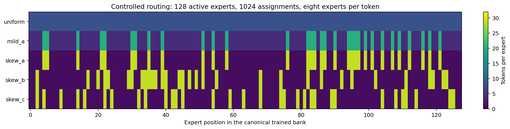
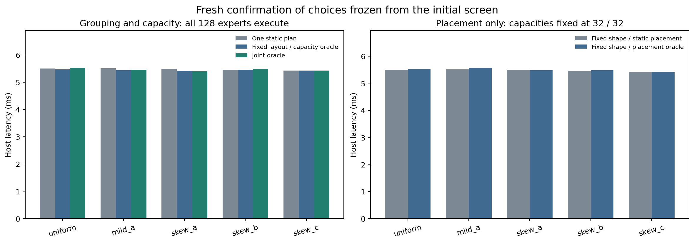
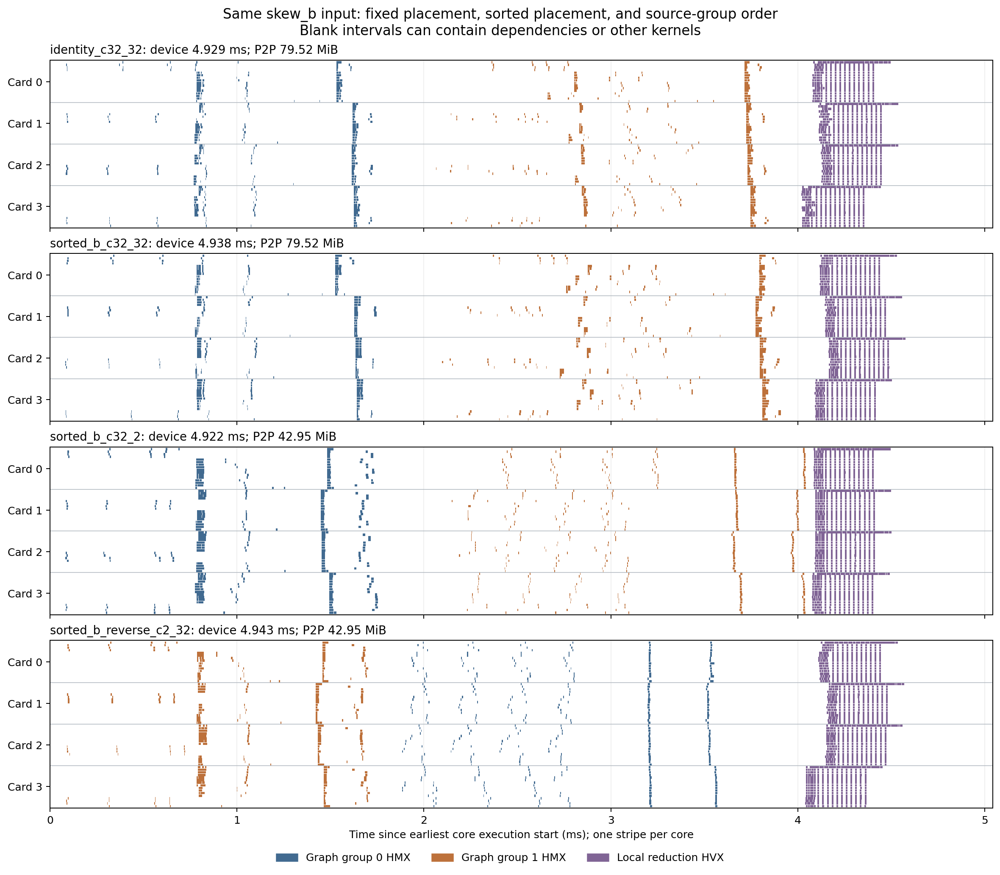

# All-experts-active placement and capacity oracle

This experiment tests whether knowing expert loads helps when **every expert
must execute**. It retains all 128 trained Qwen3-30B-A3B layer-2 experts and
their 1152 MiB of FP16 weights in every graph. No expert or token assignment
is omitted. Measurements use four AI 100 cards, 16 cores/card, SDK 1.21.6.

[RESULTS.md](RESULTS.md) contains the fresh confirmation, frozen plan choices,
raw-sample validation and separate card/core profile measurements.

## Result

**Changing expert layout adds no demonstrated benefit over a calibrated fixed
layout with per-input capacity selection in this tested small-capacity regime.**
Five fresh confirmation rounds give the following equal-weight means of the
five per-input pooled medians:

| Frozen policy | Host latency, ms |
|---|---:|
| Best tested one static plan (`aggregate_c32_32`) | 5.4763 |
| Fixed layout, per-input capacity oracle | 5.4427 |
| Fixed 32/32 shape, per-input placement oracle | 5.4961 |
| Joint placement, capacity and source-group-order oracle | 5.4572 |

The joint choices save **19.1 µs (0.35%)** against the static plan, but are
**14.5 µs (0.27%) slower** than fixed layout with capacity selection, winning
only two of five paired round means in the latter comparison. Choices were
selected from the initial sweep and frozen before confirmation; these small
differences do not establish statistical significance or imply that an ideal
oracle must be slower. The apparent 0.8% joint advantage in the screen shrinks
on fresh timing. Selection, reconfiguration and weight movement are excluded.

Profiling explains why smaller tensors alone do not provide much headroom
here: 32/2 cuts P2P payload by 45.99% relative to 32/32, yet device latency stays
near 4.9 ms and substantial projection DDR traffic and dependency waits remain.
Swapping the source groups also fails to force the opposite FFN execution
order. The following sections document those mechanisms and the limits of
this conclusion.

The screen and confirmation total **25,500 timed invocations**. All 255 saved
timing outputs pass the independent reference check (maximum relative L2
0.0813%, rounded up), and all 18 saved profiling outputs match their same-graph
uninstrumented references bit for bit. Every expert remains active.

## Controlled routing inputs

The hidden input is the captured `[128,2048]` FP16 activation from the existing
layer-2 replay. Routing is synthesized independently of the trained router so
that row and column counts are controlled. These are numerical/performance
stress inputs, not additional natural-language prompts or accuracy evaluations.

| Input | Expert token counts | Active experts | Assignments |
|---|---|---:|---:|
| `uniform` | All 128 experts receive 8 tokens | 128 | 1024 |
| `mild_a` | 32 experts receive 20; 96 receive 4 | 128 | 1024 |
| `skew_a` | 32 experts receive 29; 96 receive 1 | 128 | 1024 |
| `skew_b` | Same histogram, different hot set | 128 | 1024 |
| `skew_c` | Same histogram, different hot set | 128 | 1024 |

Every token selects eight distinct experts with weight exactly 1/8. A
Havel-Hakimi construction realizes the specified counts; 8192 degree-preserving
2x2 switch attempts randomize co-occurrence afterwards. Token order, tie breaks
and hot sets use recorded deterministic seeds. The three hot sets have a union
of 72 experts, exceeding one 64-expert group. The `a` set is shared by the mild
and skewed inputs, exposing both a changing histogram and changing hot IDs.



Expert numbers refer to positions in the preceding experiment's canonical
trained bank. Changing layout applies the same permutation to the input routing
columns and to all three expert weight matrices. All 384 matrices per layout
are verified byte for byte after materialization. Inverse routing permutations
recover the canonical inputs exactly. The hidden input never changes.

## Candidate family and fair controls

The source graph is `../routing_retune/c2_tree/model.onnx`. It already includes
zero-read removal, the parallel integer prefix scan and tiled local reduction.
Every original ONNX node is preserved. Only four dedicated capacity constants
and the external trained-weight ordering change. Every bank remains 64 experts
wide; both stages span all four cards. Placement is expressed through expert
permutations in this topology; the compiler determines actual core placement.

There are six materialized layouts: identity, a fixed bit-reversal stripe,
descending aggregate load, and descending load for each of hot sets a/b/c.
Nominal hot-last plans exchange the two complete 64-expert source groups while
retaining the same weights and routing-to-weight associations. Actual HMX
execution order is checked in the traces, not inferred from source order.

The initial 21 graphs cover common 32/32 capacities, uniform 8/8, useful
per-group capacities for each layout, exact 29/29 and 20/20 controls, and both
32/1 versus 1/32 and 32/4 versus 4/32 source-group orders. After capacity 1 proved
unfavorable in the initial screen, seven capacity-2 controls were added before
final plan selection. This prevents a poor unit-capacity lowering from deciding
the conclusion. The candidate family has 28 graphs and 60 valid plan/input
pairs. It is a bounded measured search, not a proof of globally optimal mapping.

Five policies are chosen from the measured screen:

| Policy | What may change between inputs? |
|---|---|
| One static plan | Nothing; select the best tested single graph that safely handles every input |
| Fixed shape / static placement | Nothing; select one layout at capacities 32/32 |
| Fixed layout / capacity oracle | Keep one layout; choose its best tested safe capacities per input |
| Fixed shape / placement oracle | Keep capacities 32/32; choose the best tested layout per input |
| Joint oracle | Choose the best tested safe placement, capacity and source-group order per input |

All six layouts, including those designed for individual hot sets, are eligible
to win the static comparison. The fixed-layout capacity oracle is a stronger
baseline than a conservative constant shape: it already receives free knowledge
of the current counts. Comparing the joint oracle against it isolates the
additional value of changing layout within the tested family.

Selection minimizes the equal-weight arithmetic mean of the five per-input
median latencies. The screen chooses all plans once; the confirmation reuses
those choices without selecting new winners. `selection.json` records every
choice and candidate score. No runtime selection, sorting, weight migration,
compilation or loading cost is included in any policy's execution latency.



## Timing and validation

The initial screen and capacity-2 extension each use three rounds of 100 timed
invocations per valid plan/input pair, with ten warmups before each round/input.
The multiple-input host keeps one QPC resident while testing its inputs and
reverses input order on alternate rounds. The two screen cohorts are retained
separately and combined only for selecting the confirmation plans.

Confirmation uses five outer rounds, reverses plan order on alternate rounds,
and collects 100 timed invocations for each selected plan/input pair per round.
The timed interval is buffer binding, enqueue and completion wait, including
host/device input/output transfer. Input permutation, host buffer preparation,
loading, activation, warmup and file writes are outside the interval. Compiler
jobs and profiling never overlap these host timing measurements.

Every measured graph has profiling disabled (`-stats-level=0`). The separate
`-stats-level=70` builds provide three validated traces per profiled input.
Each reported profile row uses every metric from the same median whole-device
duration sample. P2P payload counts outgoing transfers once. Actual projection
DDR-copy descriptors are reported separately from logical weight-bank volume;
compiler tiling, residency and activation copies can change the former even
though the latter is fixed.



The three profiled 32/32 layouts have identical operation-descriptor signatures
(card/core, operator index, name, kind, memory class and output size). The same
identity QPC also sends identical P2P payload for uniform and skewed routing.
Expert permutation changes the routed values and trained matrices assigned to
the slots without changing this compiled operation inventory or its placement.

For `skew_b`, sorted placement at 32/2 reduces outgoing P2P from 79.523 to
42.950 MiB, a **45.99% reduction**, while the representative device duration
stays near 4.9 ms. The six projection kernel descriptors retain the same counts
and output-size histogram: 384 HMX kernels per graph group. Recorded compute
does not fall in proportion to the 16-fold decrease in the smaller capacity.
Both groups still use all 64 cores, and projection-attributed DDR copies remain
large: 1131 MiB at 32/32 and 1068 MiB at 32/2. All five profiled QPCs have exactly
1152.278 MiB of static constants. These observations separate reductions in
logical padded rows/P2P volume from reductions on the execution critical path.

**Source-group order is not an execution-order control.** In all three captures
of `sorted_b_reverse_c2_32`, the compiler runs graph group 1's capacity-32 FFNs
before graph group 0's capacity-2 FFNs. The regular 32/2 graph also runs its
larger group first. The reversed graph subsequently has a longer tail between
the last expert GEMM and final reduction. The profiler therefore records source
group identities, actual HMX order and chronological gaps separately. This
comparison does not establish a bound for an arbitrarily forced kernel order.

The independent reference directly evaluates all selected trained expert FFNs
in FP32, promoting the exact stored FP16 weights and captured hidden input.
The maximum permitted relative L2 error was fixed at **0.5% before hardware
measurements**. It is not relaxed after measuring a candidate. FP16 accumulation
order can change with permutation, so cross-layout bit identity is not required.
Repeated outputs from the same graph/input must be bit-identical, and profiling
outputs must match their same-graph uninstrumented references bit for bit.

Every saved hardware output has finite values, exact full routing counts,
128 active experts, exactly 1024 assignments, and no capacity overflow. The
report generator rechecks raw output files and raw timing samples. Only the
last output per timing round/input is saved, not every timed invocation.
Resource guards require all four cards Ready, 16 free cores and no loaded or
active networks before and after each program run.

## Limits of the inference

This is a static two-stage, 64-expert-per-stage compiled graph. It does not
search different group widths, arbitrary kernel schedules, sparse token-centric
accumulation, pipelined partial expert execution or alternative parallelism.
An oracle over these candidates is not an ideal hardware lower bound.

The inputs use one 128-token hidden activation and synthetic routing with peaks
of 20 or 29 tokens/expert. They deliberately test load changes within the small
capacity regime. They do not establish results for larger token counts, peaks
above 32, longer prefill chunks, other layers or natural prompts. Earlier
capacity sweeps already show different behavior at capacities 64/128. Any
conclusion about adaptation must retain this scope.

The policies assume the chosen graph and correctly placed weights are already
resident. An online implementation must pay selection and any reconfiguration
costs from its measured execution saving. This experiment does not establish
research novelty or full-model speedup.

## Reproduction and artifacts

Scripts and Markdown are tracked. ONNX, trained bank copies, QPCs, timing data,
outputs, decoded traces, CSV/JSON analyses and PNG/PDF/SVG figures remain local.
`experiment.json` records all permutations, workload counts, hashes and eligible
plans. QPCs are under `/dev/shm/qwen3_all_active_wentao_20260922`; this RAM storage
is ephemeral. Extracted static-constant segments are on disk under
`constant_segments/`, with byte sizes and SHA256 hashes in each plan's package
metadata. Original checkpoint files are read-only.

From the repository root, define the driver using new output/scratch paths:

```bash
QWEN_PY=/home/chihao/qeff-venv/bin/python
QWEN_ROOT=9.17.2026/real_model/oracle_padding
QWEN_ALL_OUT="$QWEN_ROOT/all_active_rerun"
QWEN_ALL_RAM=/dev/shm/qwen3_all_active_rerun
run_all() {
  "$QWEN_PY" tools/moe_qwen3_all_active.py "$@" \
    --out "$QWEN_ALL_OUT" --scratch "$QWEN_ALL_RAM" \
    --source "$QWEN_ROOT/routing_retune/c2_tree/model.onnx" \
    --cold "$QWEN_ROOT/cold_capacity_control"
}
run_all prepare
run_all build-host
run_all reference
run_all compile
run_all timing
run_all summary
run_all capacity2-controls
QWEN_C2_PLANS=(aggregate_c32_2 sorted_a_c32_2 sorted_a_reverse_c2_32
  sorted_b_c32_2 sorted_b_reverse_c2_32 sorted_c_c32_2 sorted_c_reverse_c2_32)
run_all compile --plans "${QWEN_C2_PLANS[@]}"
run_all timing --prefix capacity2 --plans "${QWEN_C2_PLANS[@]}"
run_all summary --prefix capacity2
run_all merge-screen
run_all summary --prefix combined
run_all select --prefix combined
```

Compile the distinct plans listed in `profile_selection.json` with
`compile --stats-level 70 --plans ...`, then run `profile` and `analyze` with
`--stats-level 70 --prefix combined --selection "$QWEN_ALL_OUT/profile_selection.json"`.
Profiling covers a common static plan, identical-shape placement controls,
both selected source-group orders, and a second input on the same fixed QPC.

```bash
run_all timing --prefix confirm --outer-rounds 5 --rounds 1 \
  --selection "$QWEN_ALL_OUT/selection.json"
run_all summary --prefix confirm
/tmp/qwen3_profile_plot_wentao_20260921/bin/python \
  tools/moe_qwen3_all_active_report.py --root "$QWEN_ALL_OUT"
```

Do not overlap compilation or profiling with timing. The report regenerates
`RESULTS.md`, `comparison.json` and the three figures from validated raw files.
