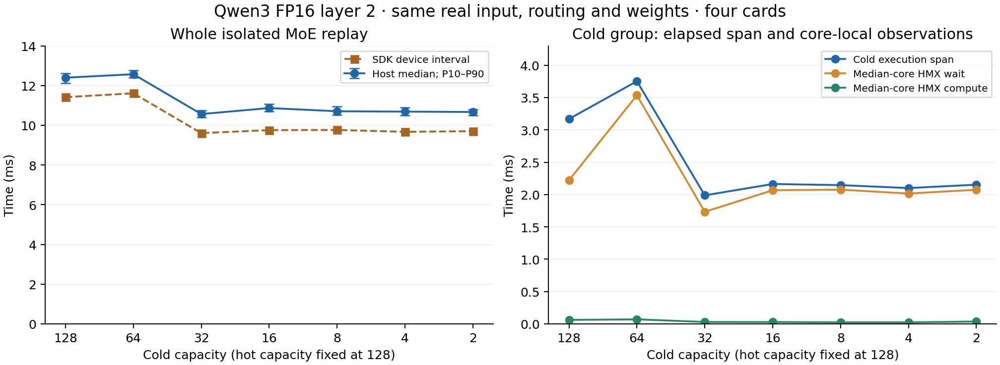
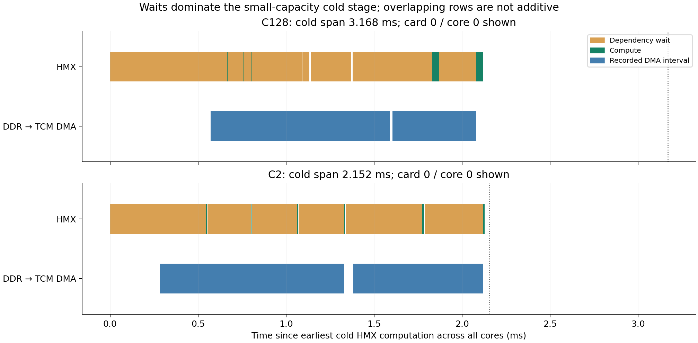

# Controlled cold-group capacity sweep

Measured 2026-09-22, SDK/runtime/firmware 1.21.6, cards 0–3, 16 cores per card.

**With weights, routing and expert order fixed, shrinking cold capacity from 128 to 2 reduces isolated MoE host latency from 12.396 to 10.669 ms (13.93% reduction, 1.162×).** C32 is the fastest tested capacity at 10.564 ms. The smallest logical capacity is not the fastest compiled graph.

## Controlled scope

- Trained Qwen3-30B-A3B FP16 MoE, zero-based layer 2, batch 1, 128 tokens, hidden size 2048, intermediate size 768, top 8 of 128 experts.
- Capture the actual expert input and already-regrouped routing by running the trained model prefix on the same saved GSM8K prompt 41. Both captures repeat bit for bit; all 128 expert counts exactly match the earlier full-model calibration.
- Keep two sequential groups of 64 experts, the same bank order and four-card partition, and hot capacity C128. The captured maxima are hot 92 / cold 2. Both groups execute HMX work on all 64 cores in every trace.
- Sweep cold C128, C64, C32, C16, C8, C4, C2. After normalizing the cold Slice end and valid-row Range stop, all exported ONNX graphs are byte-identical. All six trained weight-bank references and the replay input hash are identical.
- This controls logical expert placement and compilation options; physical kernel tiling, packing and scheduling remain compiler decisions and may change with capacity.
- The replay begins after routing and routing-column permutation. It includes native packing, both expert groups, unpacking and dense combination, plus a single-input ABI split and diagnostic count output. Host timing includes input/output transfer, enqueue and wait; it excludes compilation, loading, activation, warmups and prefix capture.

This is an isolated layer replay with hot C128, not another full-model measurement. Its cold-stage timings must not replace the earlier 48-layer averages (approximately 3.2 → 1.7 ms), which used layer-specific hot capacities and a different surrounding execution schedule.

## Results

All QPCs use `-stats-level=70`. Host values are medians of 300 invocations (three rounds × 100, 10 warmups per round, reversed capacity order in round 2). P10/P90 describe individual invocation spread, not confidence intervals. Each case also has three independent SDK traces; all trace metrics in a row come from the same median-device-duration trace.

| Cold capacity | Host median, ms | Host P10–P90, ms | SDK device interval, ms | Cold execution span, ms |
|---:|---:|---:|---:|---:|
| 128 | 12.396 | 12.112–12.618 | 11.415 | 3.168 |
| 64 | 12.570 | 12.389–12.772 | 11.609 | 3.753 |
| 32 | 10.564 | 10.396–10.746 | 9.605 | 1.988 |
| 16 | 10.867 | 10.701–11.058 | 9.756 | 2.163 |
| 8 | 10.705 | 10.514–10.952 | 9.763 | 2.146 |
| 4 | 10.687 | 10.508–10.887 | 9.671 | 2.101 |
| 2 | 10.669 | 10.500–10.805 | 9.703 | 2.152 |



## Kernels and waits

Cold execution span runs from the earliest cold HMX convolution start to the latest cold HMX convolution end across the four cards. It includes intervening dependencies and transfers; it is not pure GEMM arithmetic.

| Cold capacity | Cold HMX events per core | Median-core HMX compute, ms | Median-core HMX dependency wait within cold span, ms |
|---:|---:|---:|---:|
| 128 | 26 | 0.0613 | 2.2210 |
| 64 | 6 | 0.0703 | 3.5347 |
| 32 | 6 | 0.0295 | 1.7329 |
| 16 | 6 | 0.0286 | 2.0666 |
| 8 | 6 | 0.0240 | 2.0758 |
| 4 | 6 | 0.0237 | 2.0157 |
| 2 | 6 | 0.0367 | 2.0741 |

At C2, the cold span is 2.152 ms, while median-core HMX compute is only 0.0367 ms and its clipped dependency waits are 2.074 ms. The corresponding busiest-core HMX compute is 0.0514 ms. The trace therefore supports a dependency/transfer floor, rather than millisecond-scale HMX arithmetic at C2.

The SDK emits `sync HMX` with zero visible duration and records its actual duration in `opSyncDurUs`. We reconstruct each wait as `[ts, ts + opSyncDurUs]`, clip it to the cold-stage span, and sum only within each individual HMX thread. Every wait is paired with its compute event by core and lowered operation ID; wait-end/compute-start discrepancies are recorded and required to be below 1 µs. We also reject overlapping waits on a thread. Pre-stage waits are excluded, preventing earlier hot work from being charged to the cold stage. This follows the SDK analyzer’s treatment of `opSyncDurUs` (`/opt/qti-aic/tools/opstats-profiling/qaic-opstats-analyzer.py`).

Core-local compute and wait totals are separate observations, not values to add across 64 parallel cores or subtract from global wall time. A sync event identifies a blocked dependency; it does not establish whether that entire wait is caused by DDR, communication, vector work, or scheduling.

The following fixed card-0/core-0 examples show HMX waits alongside recorded DDR→TCM DMA intervals attributed to the three cold projections. DMA intervals can include asynchronous completion/queueing and overlap HMX waits. They are not additive exclusive memory costs. The illustrated core is chosen in advance, not selected for the largest wait.



C128 executes 26 cold HMX convolution events per core; every C64–C2 case executes six. The cold stage remains on all 64 cores even though 42 of its 64 experts receive no tokens in this captured input. The source graph still describes all 64 experts; this capacity specialization does not remove empty experts from the topology. Testing the benefit of omitting them is a separate ablation. The available trace does not establish useful arithmetic for every padded row or expose enough physical matrix tile dimensions to claim an exact hardware minimum row size.

## Work that capacity does not remove

- The compiled static constants occupy **1,208,164,608 bytes** in both C128 and C2, with identical per-card sizes. Hashes differ, so the packages are not byte-identical; the unchanged source bank references establish trained-weight identity. Each cold group still contains 64 × 3 × 2048 × 768 × 2 bytes = **576 MiB** of logical FP16 weights. Constant storage size is not a measurement of runtime DDR traffic.
- Native dense combination still has a `[64,128,2048]` FP16 accumulator, **32 MiB**, independent of cold capacity. The final local/global combination remains expensive.
- Hot capacity stays C128; this work is intentionally unchanged by the sweep.

| Observed phase, ms | Cold C128 | Cold C2 |
|---|---:|---:|
| Hot group | 2.806 | 2.829 |
| Between groups | 1.419 | 1.726 |
| Cold group | 3.168 | 2.152 |
| Last unpack | 0.639 | 0.130 |
| Final combine | 2.883 | 2.366 |

These five nonoverlapping phases omit initial packing/input handling and trailing device work; they are not a complete accounting of host latency. Phase boundaries do not isolate exclusive causal memory/communication costs.

## Algorithm implications

1. Select from measured compiled capacities. Minimum-safe capacity alone is not a latency optimizer: C64 is slower than C128 here, and C32 has the best measured host median. The roughly 1% advantage of C32 over C2 is specific to this input and build.
2. Further large gains need to address work that survives small padding: inactive expert execution, weight movement/dependencies, and dense scatter/reduction. The next useful ablation is to omit empty experts or replace dense combination with a sparse token-oriented path while preserving numerical output.
3. Keep runtime selection, grouping changes, additional prompts/layers, and other precisions as separate experiments. This FP16 layer-2 result does not establish their overhead or generalization.

## Validation and artifacts

- Seven structurally controlled graphs; identical captured input and weight references.
- 2,100 timed invocations, with the saved final output from every timing round bit-identical to C128. The host does not save or compare every intermediate invocation.
- 21 profiled invocations, every saved output bit-identical to its timing reference.
- All saved expert counts exact; top-8 assignments sum to 1024; no capacity overflow.
- All 21 traces cover four cards × 16 cores in both expert stages. Devices return Ready with all 16 cores free and no loaded or active networks after every host/profile run.
- Equality validates padding equivalence to the trained FP16 control; it is not an independent FP32 accuracy test.

`summary.json`, `samples.csv`, `graph_validation.json`, `package_audit.json` and each `c*/analysis/` contain the measurements. Each case retains ONNX, export metadata, compiler logs, timing runs, raw SDK stats and merged traces. Prefix captures and input hashes are in `prefix/`. QPCs and extracted constant packages are in the RAM scratch directory and are reproducible, not persistent artifacts.

The charts are also saved as PDF and SVG. Large experiment artifacts stay local under the repository’s existing policy; scripts and this report are committed.

## Reproduce

Use a fresh output and scratch directory. The SDK/QEff Python environment needs NumPy and ONNX; the report environment needs NumPy and Matplotlib. The full-model oracle graphs, materialized weights and saved reference prompt must already exist.

```bash
experiment_out=9.17.2026/real_model/oracle_padding/cold_capacity_repeat
experiment_scratch=/dev/shm/qwen3_cold_capacity_repeat
for action in prefix export compile timing profile analyze; do
  /home/chihao/qeff-venv/bin/python tools/moe_qwen3_cold_capacity.py "$action" \
    --oracle 9.17.2026/real_model/oracle_padding \
    --out "$experiment_out" --scratch "$experiment_scratch"
done
/home/chihao/qeff-venv/bin/python tools/moe_qwen3_cold_capacity.py package \
  --oracle 9.17.2026/real_model/oracle_padding \
  --out "$experiment_out" --scratch "$experiment_scratch" --capacities 128 2
/tmp/qwen3_profile_plot_wentao_20260921/bin/python \
  tools/moe_qwen3_cold_capacity_report.py --root "$experiment_out"
```
