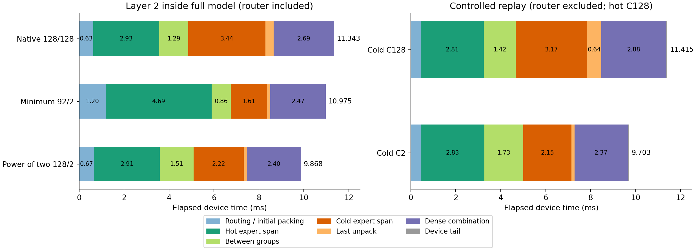
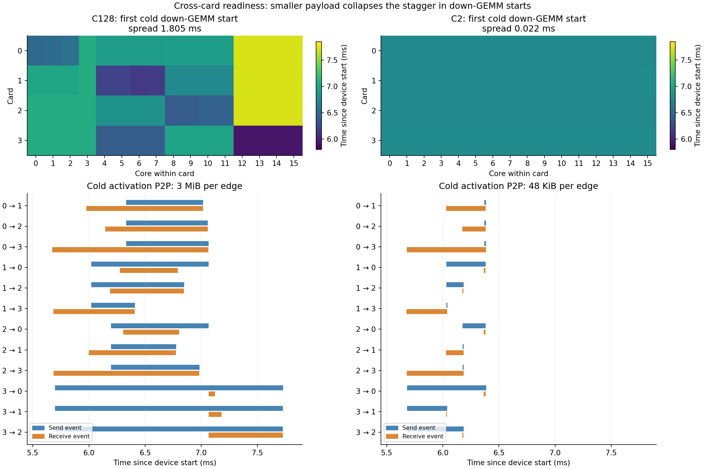
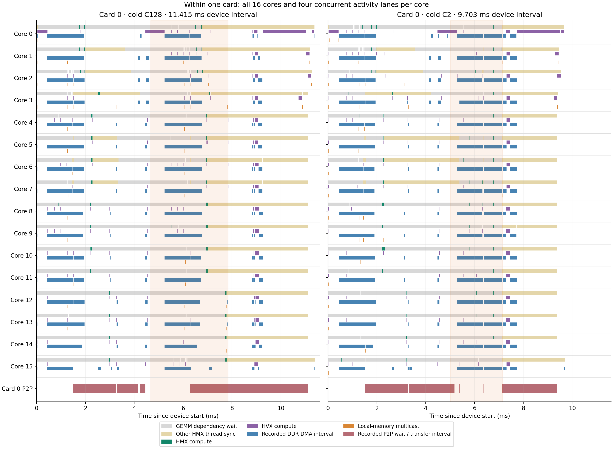

# Qwen3 layer 2: card and core profiling

Analyzed 2026-09-22; trained Qwen3-30B-A3B FP16, batch 1, prefill 128, top 8 of 128 experts, four AI 100 cards × 16 cores; SDK 1.21.6.

**The large-padding cold stage exposes cross-card activation dependencies. Small padding nearly removes the stagger in down-projection starts, but retains weight-sized DDR copies, core-0 routing/reduction work and dense combination. These are distinct mechanisms; the traces do not support calling every wait a weight wait.**

## Scope and timing

Two views of the same zero-based layer are kept separate:

- **Inside the full model:** the router-inclusive MoE interval for native C128/128, regrouped minimum C92/2, and regrouped power-of-two C128/2. Each row uses its median layer-2 duration among three existing validated traces. Expert regrouping changes between native and the two oracle cases.
- **Controlled replay:** the same captured layer input, already-regrouped routing, weights and expert order; hot C128 is fixed and only cold capacity changes C128 → C2. The replay excludes router and routing-column permutation; it includes packing, both groups, dense combination, an input ABI split and a diagnostic count output. Each row uses the median whole-device duration among three saved captures.

The input is the first 128 tokens of saved GSM8K prompt 41. These measurements are input-specific. Both sequential expert groups span **all four cards** and every core; they are not assigned to separate pairs of cards. The compiler chooses physical tiling and intermediate placement.

### Layer inside the full model

| FP16 policy | Capacities | Routing / initial pack | Hot span | Between groups | Cold span | Last unpack | Dense combine | Total MoE |
|---|---|---:|---:|---:|---:|---:|---:|---:|
| Native | 128 / 128 | 0.635 | 2.932 | 1.291 | 3.436 | 0.360 | 2.688 | 11.343 |
| Minimum + regrouping | 92 / 2 | 1.196 | 4.694 | 0.864 | 1.611 | 0.138 | 2.472 | 10.975 |
| Power-of-two + regrouping | 128 / 2 | 0.671 | 2.915 | 1.508 | 2.225 | 0.151 | 2.399 | 9.868 |

All table values are milliseconds. Hot/cold label group 0/1 in the regrouped graphs; native groups retain their original expert order. The minimum-policy hot stage is slower in this layer; the smaller cold group alone does not determine the complete layer speedup. The full-model interval starts at router HMX work and ends at final-combine compute; it excludes earlier speculative prefetch and the following residual.

### Controlled replay: complete device interval

| Observational phase, ms | Cold C128 | Cold C2 |
|---|---:|---:|
| Input handling / initial packing (no router) | 0.446 | 0.446 |
| Hot expert span | 2.806 | 2.829 |
| Between groups | 1.419 | 1.726 |
| Cold expert span | 3.168 | 2.152 |
| Last unpack | 0.639 | 0.130 |
| Dense combination | 2.883 | 2.366 |
| Device tail | 0.054 | 0.054 |
| **Device total** | **11.415** | **9.703** |
| Host median, 300 invocations | 12.396 | 10.669 |

These phases add exactly to the device interval. Boundaries are device start, first/last hot HMX, first/last cold HMX, first local reduction, last final-combine compute, and device end. DMA, packing and scheduling can overlap a labeled expert span; these are elapsed phases, not exclusive causal costs. Local and global reductions also overlap between cards and remain one combination phase.



## Between cards: activation exchange releases groups of cores

Cold `Mul_9` is the activation after gate/up and SiLU, before the down projection. Its exchange has 12 directed edges: each card sends to all three peers. The down projection then consumes locally available and remotely produced shards. The source-node mapping comes from the compiled graph and SDK dependencies.

| Outgoing P2P payload, counted once per directed edge | C128 | C2 |
|---|---:|---:|
| Hot intermediate activations (`Mul_4`) | 36.0000 MiB | 36.0000 MiB |
| Cold intermediate activations (`Mul_9`) | 36.0000 MiB | 0.5625 MiB |
| Hot accumulator update (`Add`) | 24.0000 MiB | 24.0000 MiB |
| Cold accumulator update (`Add_2`) | 24.0000 MiB | 0.3750 MiB |
| Cold input packing (`CtxGather3D_3/n14`) | 0.0000 MiB | 1.5000 MiB |
| Final partial results (`Einsum_3`) | 1.5000 MiB | 1.5000 MiB |
| All replay P2P sites, including index exchange | 121.5938 MiB | 63.9851 MiB |

Cold intermediate payload falls from **3 MiB to 48 KiB per edge (64×)**. The complete cold activation exchange falls from 36 MiB to 0.5625 MiB. C2 introduces an additional 1.5 MiB P2P site during input packing; smaller logical shapes can change the compiler communication plan.

| First cold down-GEMM start across all 64 cores | C128 | C2 |
|---|---:|---:|
| Representative spread, ms | 1.805219 | 0.022062 |
| Range across three captures, ms | 1.763–1.812 | 0.019–0.022 |

The clearest direct dependencies are on card 3 in C128. Core groups 0–3, 4–7 and 8–11 consume activation shards from cards 0, 1 and 2 respectively; cores 12–15 start earlier on the locally produced shard. Representative edges:

| Card 3 consumer | Remote activation producer | Receive event ends, ms | Down GEMM starts, ms | Gap, µs |
|---|---|---:|---:|---:|
| Core 0 | `3<-0` | 7.231427 | 7.231469 | 0.042 |
| Core 4 | `3<-1` | 6.574530 | 6.574531 | 0.001 |
| Core 8 | `3<-2` | 7.148749 | 7.148750 | 0.001 |

Times in this dependency table are the original SDK trace timestamps. These edges directly establish activation readiness gating those GEMMs. They do **not** establish a universal hardware receive-then-send order: card-3 send markers are already open while receive intervals are active. Other cores can wait beyond a particular receive end because of additional dependencies and collective scheduling.



The chart shows each send and receive separately. Their recorded intervals need not have identical endpoints; they can include queueing/collective completion. Payload divided by these durations is not a reliable physical link bandwidth.

## Within a card: vector preparation, local exchange and HMX waits

Each card has 16 active HMX cores. The trace also separates vector work (HVX), DDR-to-local-memory DMA, and local-memory multicast/copy operations. A local multicast can fan out, so descriptor output bytes are not physical on-chip fabric traffic after replication.

- Both routing prefix sums (`CumSum`, `CumSum_1`) execute on **core 0 of each card**, about 0.399 ms of HVX work apiece. The second prefix sum starts at different times on the four cards because preceding work has different readiness.
- There are **242 explicit true cross-core dependency edges** per trace in both variants. Of these, 236 originate in local multicast operations, mainly core-0 input/routing preparation feeding other cores. This counts compiler dependencies, not all hardware transfers; multicast fanout can be implicit.
- An explicit within-card example is the C2 card-0/core-0 `Where_5` multicast (a one-byte routing predicate). It finishes at SDK timestamp 0.183678 ms and feeds `Sub_3` on cores 4, 8 and 12, whose copy operations start around 4.712–4.721 ms. This establishes the broadcast dependency, but its early completion means it cannot explain those later multi-millisecond waits.
- Cold intermediate local multicast descriptors change from 180 operations / 22.5 MiB of output-size fields at C128 to 60 / 0.1758 MiB at C2. The cold HMX execution still uses all 64 cores, including when 42 of the 64 cold experts receive no tokens.
- Dense combination first reduces local contributions, then exchanges partial results and combines them on card 0. A long DDR-backed HVX local reduction runs on core 0 of each card: up to 1.650 ms at C128 and 1.612 ms at C2. The final card-0 reduction uses cores 0–3, with up to about 0.242 ms per core. The source dense accumulator remains `[64,128,2048]` FP16 (32 MiB).



Each core row has four sublanes: HMX wait/compute, HVX work, DDR DMA, and local-memory multicast. The cold HMX span is lightly shaded. GEMM dependency waits and other HMX thread synchronization use separate colors. The additional bottom row shows recorded P2P endpoint intervals involving card 0; these include waiting and are not continuous link utilization. Rows execute concurrently; the figure must not be read as a sum of costs. All cards and individual lowered operations are available in the CSV artifacts.

### What the idle-looking gaps mean

White space in the original chart was not a complete core-idle measurement: it omitted P2P, HVX/DMA-issue waits, some local copies and cacheable-DDR gathers. The original gray HMX lane also included end-of-program synchronization, not just waits preceding GEMMs. The updated chart separates that synchronization and adds P2P intervals.

For the C2 representative capture, the main card-0 intervals are below. Times are milliseconds since device execution starts, matching the chart.

| Interval | What is happening | Why many compute engines have no work |
|---|---|---|
| Approximately 2.0–4.5 ms | Hot-group activation/index exchange, unpacking and accumulator update | Many cores wait on P2P and packing dependencies before cold-stage inputs are ready; brief down-GEMM and vector work still occurs within this window. |
| 4.496–4.867 ms | Core 0 zeroes the dense accumulator (0.371 ms) | This vector stage has limited core participation. |
| 4.871–5.270 ms | Core 0 computes the cold routing prefix sum (0.399 ms) | Other cores cannot use the resulting packing indices until ready. |
| 7.742–9.354 ms | Core 0 performs the dense local reduction (1.612 ms) | Expert GEMMs have finished; other cores wait for final combination and output synchronization. |

All 16 card-0 cores finish their last GEMM by 7.132 ms, although the complete replay lasts 9.703 ms. Core 8, for example, waits in `aicendcyclestats` around 7.128–7.731 ms and then in an output semaphore around 7.739–9.392 ms. This is waiting for graph completion, not additional expert arithmetic or evidence of continuous weight DMA. The short stats operation itself must not be charged the full preceding wait as profiling overhead.

Remote final-result receive events on card 0 remain open until 9.246–9.391 ms. Their long intervals include waiting for remote producers; they do not show that the links transfer continuously. The profile exposes limited parallelism and dependency sequencing in the compiled route/unpack/combine path. It does not establish that every such gap can be removed or overlapped safely.

### Actual compute work, separate from elapsed spans

Values below sum compute durations within each participating core and then take the maximum core. They are **not operator latency** and cannot be added to the phase table. Reductions aggregate their TCM and DDR portions on each core.

| Operation | Active cores C128 / C2 | C128 max-core work, ms | C2 max-core work, ms |
|---|---:|---:|---:|
| Hot gate (`MatMul`) | 64 / 64 | 0.0833 | 0.0948 |
| Hot up (`MatMul_1`) | 64 / 64 | 0.0025 | 0.0027 |
| Hot down (`MatMul_2`) | 64 / 64 | 0.0825 | 0.1137 |
| Cold gate (`MatMul_3`) | 64 / 64 | 0.0029 | 0.0108 |
| Cold up (`MatMul_4`) | 64 / 64 | 0.0026 | 0.0134 |
| Cold down (`MatMul_5`) | 64 / 64 | 0.0785 | 0.0394 |
| Hot prefix sum (`CumSum`) | 4 / 4 | 0.3992 | 0.3991 |
| Cold prefix sum (`CumSum_1`) | 4 / 4 | 0.3993 | 0.3991 |
| Local dense reduction (`Einsum_3`) | 64 / 64 | 1.7929 | 1.7549 |
| Final card-0 reduction (`Einsum_4`) | 4 / 4 | 0.2424 | 0.2414 |

### What remains at small capacity

| Cold-stage observation | C128 | C2 |
|---|---:|---:|
| HMX compute, median core, ms | 0.06135 | 0.03669 |
| HMX dependency wait clipped to cold span, median core, ms | 2.22099 | 2.07407 |
| Repeated projection DDR-copy payload | 576 MiB | 576 MiB |
| Repeated projection DDR-copy events | 1664 | 384 |

The repeated copies total exactly 64 × 3 × 2048 × 768 × 2 bytes = **576 MiB** in both cases. C128 uses twelve 256 KiB copies per core for each gate/up projection and two 1.5 MiB copies for down; C2 uses two 1.5 MiB copies per projection per core. Matching sizes and dataflow strongly identify these as weight tiles. The stats-level-70 descriptor omits operand buffer names, so exact source-buffer attribution remains an inference. C128 has one additional 384 KiB `MatMul_5`-attributed copy on card 3/core 15; it is retained as unclassified and excluded from the repeated-weight total.

Two C2 card-0/core-0 examples connect delayed GEMMs directly to projection DDR-copy completion:

| Consumer | Copy OC | Payload | Recorded copy end, ms | GEMM start, ms | Gap, µs |
|---|---:|---:|---:|---:|---:|
| Last `MatMul_4` | 2566 | 1.5 MiB | 6.482386 | 6.482437 | 0.052 |
| Last `MatMul_5` | 2833 | 1.5 MiB | 7.272124 | 7.272125 | 0.001 |

Earlier copies in the same batch can have sub-microsecond visible durations while their dependent HMX operations remain blocked for hundreds of microseconds. The SDK event representation includes asynchronous issue/completion behavior; do not interpret every visible copy end as physical data-ready time. These examples support a remaining weight-transfer/dependency floor, but do not prove DDR bandwidth saturation or partition all waiting time between weights, activations and scheduling.

## Implications for the MoE algorithm

1. **Padding helps activation exchange and unpacking.** For this replay, the cold span falls 3.168 → 2.152 ms, unpacking 0.639 → 0.130 ms, and combination 2.883 → 2.366 ms. The between-group interval grows 1.419 → 1.726 ms. Compiler tiling and communication changes matter alongside logical tensor size.
2. **Capacity alone preserves the expert/weight topology.** Skipping empty experts or changing active expert placement is a separate experiment needed to reduce the persistent weight payload. This profile does not measure its speedup.
3. **The dense route-and-combine path is a second target.** Prefix sums and core-0 reductions survive tiny cold padding. A sparse token-oriented combine or different partition could address them, but requires its own correctness and timing comparison.
4. **Optimize measured dependencies, not an assumed card order.** C128 shows remote activations releasing core groups; C2 has a different placement/schedule and nearly simultaneous down starts. Neither implies a fixed architectural ordering across all invocations.

## Validation and artifacts

- Reused six existing bit-exact captures; no new hardware execution or model changes. Both hot and cold stages cover four cards × 16 cores in every capture.
- Full-flow decode reproduces the original device durations and representative samples. C128 device range is 11.385–11.435 ms; C2 is 9.685–9.729 ms.
- Paired 21,453 C128 and 20,304 C2 dependency flows per capture with no missing endpoints. IDs are paired in event-file order because the decoder reuses them across cards; work is keyed by process/thread/operation ID.
- Every P2P send is matched to a receive by source, destination and transaction ID; payload sizes agree. Only outgoing payloads contribute to byte totals.
- HMX waits use `opSyncDurUs`, not the zero visible sync duration; waits are clipped to the cold interval and checked for per-thread overlap. All wait/compute pairs agree within 1 µs. Overlapping DMA, waits and parallel core work are not added.
- Compiler descriptors are copied locally and decoded with the installed SDK binary’s embedded `AICOpstatsDesc.proto` schema. Schema, descriptor and trace hashes are saved.

`summary.json` and `full_model_layer2.csv` hold the main results. Each `c*/sample*/` contains `work.csv`, `waits.csv`, `cores.csv`, `nodes.csv`, `p2p.csv`, `p2p_summary.csv`, `flows.csv`, `cross_core.csv`, `producers.csv`, and `cold_copies.csv`. `idle_gap_check.json` records the figure-relative gap audit. Full-flow traces are in `c*/trace/`; metadata is in `c*/metadata/`. Charts are available as PNG, PDF and SVG. Large local artifacts follow the repository ignore policy; scripts and this report are committed.

## Reproduce from the saved captures

The QEff environment supplies protobuf; the plot environment supplies NumPy and Matplotlib. `--decode` needs the sweep QPCs in scratch. Once decoded and descriptors extracted, rerun without `--decode` to use the persistent local artifacts.

```bash
/home/chihao/qeff-venv/bin/python tools/moe_qwen3_layer_detail.py \
  --cold 9.17.2026/real_model/oracle_padding/cold_capacity_control \
  --profile 9.17.2026/real_model/oracle_padding/layer_profile \
  --out 9.17.2026/real_model/oracle_padding/layer2_detail \
  --scratch /dev/shm/qwen3_cold_wentao_20260922 --decode
/tmp/qwen3_profile_plot_wentao_20260921/bin/python \
  tools/moe_qwen3_layer_detail_report.py \
  --root 9.17.2026/real_model/oracle_padding/layer2_detail
```
