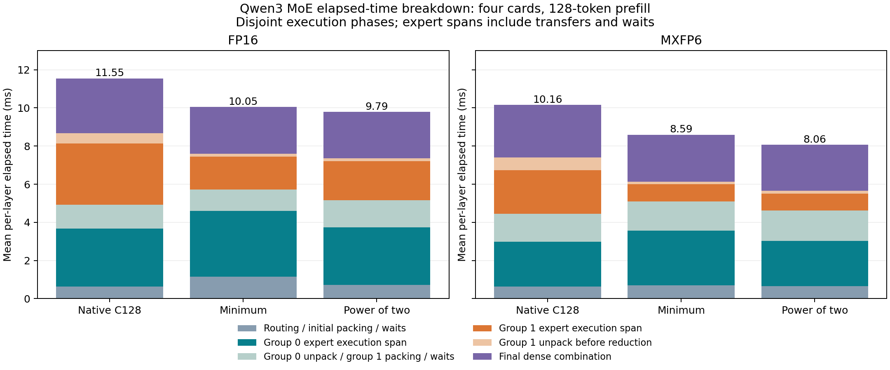

# Additive MoE elapsed-time breakdown

Saved Qwen3-30B-A3B traces, 48 layers, first 128-token chunk, four AI 100 cards, matched stats-level=70 builds. All 864 layer/sample intervals were checked.

The six disjoint time intervals below add up to the existing MoE measurement. For each layer, all components come from the capture with median total MoE latency; the table averages those 48 representative captures. Component medians are not taken independently.

| Case | Routing / initial packing | Group 0 execution | Between groups | Group 1 execution | Last unpack | Final combine | Total MoE |
|---|---:|---:|---:|---:|---:|---:|---:|
| native128_fp16 | 0.6333 | 3.0459 | 1.2529 | 3.1905 | 0.5402 | 2.8838 | 11.5466 |
| min_fp16 | 1.1615 | 3.4418 | 1.1239 | 1.7133 | 0.1459 | 2.4612 | 10.0475 |
| pow2_fp16 | 0.7271 | 3.0038 | 1.4290 | 2.0470 | 0.1464 | 2.4339 | 9.7871 |
| native128_mxfp6 | 0.6298 | 2.3629 | 1.4543 | 2.2775 | 0.6734 | 2.7584 | 10.1564 |
| min_mxfp6 | 0.6976 | 2.8778 | 1.5254 | 0.8889 | 0.1469 | 2.4505 | 8.5871 |
| pow2_mxfp6 | 0.6652 | 2.3604 | 1.5973 | 0.8885 | 0.1358 | 2.4121 | 8.0593 |

All values above are milliseconds. Group 0/1 mean hot/cold in regrouped cases; native C128 retains its original expert order.

## Boundaries and interpretation

1. Router HMX start → first group-0 expert HMX event: routing, first packing and any readiness waits.
2. First → last group-0 expert HMX event: its three GEMMs, interleaved activation work, transfers and waits.
3. Last group-0 → first group-1 HMX event: first output unpacking, second packing and waits.
4. First → last group-1 expert HMX event: its three GEMMs and intervening work/waits.
5. Last group-1 HMX event → first final local-reduction HVX event: remaining unpacking and waits.
6. First final local reduction → last final cross-card-combine compute event: dense combination and waits.

These are execution phases, not exclusive causal costs of named operators. Asynchronous copies may overlap phase boundaries, and an expert execution span is not pure matrix arithmetic. The table does not claim an exact split of memory transfer, communication and synchronization costs.

For MXFP6 layer 31 in min/pow2, validated cold-group counts are zero and no GEMM events exist. Its group-1 execution/last-unpack intervals are zero; all work between group-0 completion and final reduction belongs to the transition. This avoids inventing a missing-GEMM timestamp.

## Recorded engine work, separate from wall time

The next table is the maximum summed recorded busy time on one core/engine within each named category. Parallel cores are never summed. These values cannot be added to the elapsed phases above or subtracted to obtain a precise memory-stall budget.

| Case | Group 0 HMX | Group 1 HMX | First CumSum HVX | Second CumSum HVX | Local reduction HVX | Final reduction HVX | First input Gather |
|---|---:|---:|---:|---:|---:|---:|---:|
| native128_fp16 | 0.2022 | 0.1163 | 0.3991 | 0.3992 | 1.8034 | 0.2426 | 0.0111 |
| min_fp16 | 0.2074 | 0.0494 | 0.3991 | 0.3991 | 1.7761 | 0.2438 | 0.0137 |
| pow2_fp16 | 0.2364 | 0.0472 | 0.3995 | 0.3996 | 1.7424 | 0.2440 | 0.0182 |
| native128_mxfp6 | 0.3590 | 0.1192 | 0.3994 | 0.3995 | 1.7773 | 0.2438 | 0.0107 |
| min_mxfp6 | 0.2721 | 0.0444 | 0.3996 | 0.3914 | 1.7602 | 0.2427 | 0.0057 |
| pow2_mxfp6 | 0.2988 | 0.0456 | 0.3994 | 0.3914 | 1.7469 | 0.2426 | 0.0115 |

All values are milliseconds, using the same representative captures as the additive table.

## What padding changes

| Case | Mean group 0 capacity | Mean group 1 capacity | Mean padded expert rows | Actual assignments |
|---|---:|---:|---:|---:|
| native128_fp16 | 128.00 | 128.00 | 16384.00 | 1024 |
| min_fp16 | 94.42 | 2.04 | 6173.33 | 1024 |
| pow2_fp16 | 121.33 | 2.33 | 7914.67 | 1024 |
| native128_mxfp6 | 128.00 | 128.00 | 16384.00 | 1024 |
| min_mxfp6 | 94.27 | 1.96 | 6158.67 | 1024 |
| pow2_mxfp6 | 121.33 | 2.15 | 7902.67 | 1024 |

Minimum padding still leaves about six padded rows per actual token-expert assignment. The hot group averages capacity about 94, so it is reduced much less than the cold group, which averages about 2. Both groups retain 64 experts.

The graph changes packed expert activations `[64,C,2048]` and intermediate activations `[64,C,768]`. It retains the 128-token routing/packing scans and the logical dense output accumulator `[64,128,2048]`, reshaped to `[4,16,128,2048]` for final reductions. That accumulator is 32 MiB at FP16, independent of C. The graph also retains all `128 × 3 × 2048 × 768` expert parameters per layer: 1.125 GiB in FP16. These are logical sizes, not measurements of traffic or physical compiler allocations.

Consequently, the 62% reduction in logical padded rows is not a 62% reduction in all MoE work. The cold execution interval shrinks strongly, but substantial dense combination remains, and the hot execution/packing intervals can regress for smaller irregular shapes. Power-of-two shapes improve aggregate timing despite more padded rows. The traces show the scheduling outcome; they do not establish its precise compiler or hardware cause.

A targeted next experiment is to optimize the full-size scatter/reduction path and inspect transfers/waits in the hot expert interval. Changing only the routing-column permutation targets less than 1% of the current interval.

## Reproduction

```bash
python tools/moe_qwen3_breakdown.py \
  --root 9.17.2026/real_model/oracle_padding/layer_profile \
  --out 9.17.2026/real_model/oracle_padding/layer_profile/new_breakdown --plot
```

`--plot` requires Matplotlib. The analysis otherwise uses the standard library and the helper functions in `moe_qwen3_routing_profile.py`. Outputs must be new. [samples.csv](samples.csv) contains every capture; [layers.csv](layers.csv) contains the chosen per-layer capture; [summary.json](summary.json) records validation. No new model compilation or device execution was needed.


