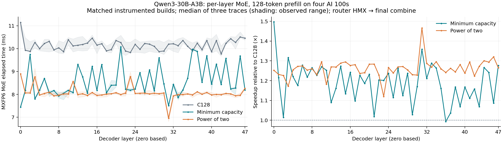

# Measured per-layer MoE timings

This interim MXFP6 table is retained for reference. The completed
[combined FP16 and MXFP6 report](../results/README.md) includes both precisions,
capacity-policy comparisons and validation/accuracy qualifications.

Matched stats-level=70 full-model traces, 48 layers, 4 cards, T128, one input.

Interval: Earliest router HMX start to latest final Einsum_4 compute end across four cards; excludes earlier input conversion/prefetch and any following residual operation.

Each number is the median of three detailed traces. These are instrumented, in-model elapsed times, not isolated-operator or uninstrumented latencies. Native C128 uses the original expert order; minimum and power-of-two use the same calibrated regrouping.

Host timings come from a separate 60-invocation run of the same instrumented QPC. Host timings and detailed-capture device timings have different measurement conditions; do not subtract a trace interval from the separate host measurement.

| Precision | Policy | Mean MoE ms/layer | MoE speedup, ratio of sums | Per-layer speedup range | Full-model host median ms |
|---|---|---:|---:|---:|---:|
| mxfp6 | native128 | 10.1564 | 1.0000× | 1.0000–1.0000× | 537.920 |
| mxfp6 | min | 8.5871 | 1.1828× | 0.9934–1.4970× | 453.995 |
| mxfp6 | pow2 | 8.0593 | 1.2602× | 1.1202–1.4661× | 429.529 |

## MXFP6

| Layer | C128 ms | Minimum caps | Minimum ms | Speedup | Power-of-two caps | Power-of-two ms | Speedup |
|---:|---:|---|---:|---:|---|---:|---:|
| 0 | 11.1442 | 46/6 | 7.4445 | 1.4970× | 64/8 | 8.8974 | 1.2525× |
| 1 | 9.9286 | 100/4 | 8.1709 | 1.2151× | 128/4 | 8.0621 | 1.2315× |
| 2 | 9.8801 | 88/2 | 9.7421 | 1.0142× | 128/2 | 8.0604 | 1.2258× |
| 3 | 10.2710 | 52/2 | 7.8024 | 1.3164× | 64/2 | 8.7646 | 1.1719× |
| 4 | 10.0014 | 106/2 | 8.1921 | 1.2208× | 128/2 | 7.9723 | 1.2545× |
| 5 | 10.2238 | 68/2 | 8.6967 | 1.1756× | 128/2 | 8.0364 | 1.2722× |
| 6 | 10.3166 | 113/1 | 8.0729 | 1.2779× | 128/1 | 8.0967 | 1.2742× |
| 7 | 9.9432 | 110/1 | 8.1646 | 1.2178× | 128/1 | 7.9370 | 1.2528× |
| 8 | 10.0362 | 106/1 | 7.9340 | 1.2650× | 128/1 | 7.9630 | 1.2603× |
| 9 | 9.8682 | 109/1 | 8.0445 | 1.2267× | 128/1 | 8.0189 | 1.2306× |
| 10 | 10.3881 | 99/2 | 8.1776 | 1.2703× | 128/2 | 8.0182 | 1.2956× |
| 11 | 10.1180 | 52/2 | 8.0779 | 1.2526× | 64/2 | 8.5635 | 1.1815× |
| 12 | 10.1476 | 86/1 | 9.3142 | 1.0895× | 128/1 | 7.9921 | 1.2697× |
| 13 | 10.1824 | 69/2 | 8.7684 | 1.1613× | 128/2 | 8.0253 | 1.2688× |
| 14 | 10.2451 | 103/1 | 8.0483 | 1.2730× | 128/1 | 7.9501 | 1.2887× |
| 15 | 10.4591 | 78/1 | 9.2222 | 1.1341× | 128/1 | 8.0778 | 1.2948× |
| 16 | 10.1537 | 108/2 | 8.1711 | 1.2426× | 128/2 | 7.9528 | 1.2768× |
| 17 | 10.2111 | 81/2 | 9.3060 | 1.0973× | 128/2 | 7.9728 | 1.2807× |
| 18 | 9.9016 | 113/1 | 8.0662 | 1.2275× | 128/1 | 8.0085 | 1.2364× |
| 19 | 9.9585 | 120/1 | 8.3968 | 1.1860× | 128/1 | 8.0305 | 1.2401× |
| 20 | 10.3545 | 110/1 | 8.4044 | 1.2320× | 128/1 | 8.0696 | 1.2831× |
| 21 | 10.2642 | 96/1 | 10.0771 | 1.0186× | 128/1 | 7.9954 | 1.2838× |
| 22 | 9.8948 | 101/2 | 8.2229 | 1.2033× | 128/2 | 8.0555 | 1.2283× |
| 23 | 9.8316 | 55/5 | 8.1837 | 1.2014× | 64/8 | 8.7766 | 1.1202× |
| 24 | 10.1854 | 100/3 | 8.2334 | 1.2371× | 128/4 | 8.0445 | 1.2661× |
| 25 | 9.9695 | 73/3 | 8.9455 | 1.1145× | 128/4 | 8.0478 | 1.2388× |
| 26 | 10.2274 | 103/2 | 8.0996 | 1.2627× | 128/2 | 8.0562 | 1.2695× |
| 27 | 10.1940 | 77/1 | 9.0664 | 1.1244× | 128/1 | 8.0179 | 1.2714× |
| 28 | 10.0998 | 113/2 | 8.1606 | 1.2376× | 128/2 | 8.0523 | 1.2543× |
| 29 | 9.8705 | 90/2 | 9.5978 | 1.0284× | 128/2 | 8.0251 | 1.2300× |
| 30 | 9.8961 | 118/1 | 8.4622 | 1.1694× | 128/1 | 8.0572 | 1.2282× |
| 31 | 10.1954 | 121/1 | 7.5053 | 1.3584× | 128/1 | 6.9543 | 1.4661× |
| 32 | 10.2120 | 118/1 | 8.4337 | 1.2109× | 128/1 | 7.9349 | 1.2870× |
| 33 | 10.1297 | 112/2 | 7.8651 | 1.2879× | 128/2 | 7.9866 | 1.2683× |
| 34 | 10.3573 | 107/2 | 8.1949 | 1.2639× | 128/2 | 7.9936 | 1.2957× |
| 35 | 10.1010 | 67/4 | 8.7006 | 1.1610× | 128/4 | 8.0188 | 1.2597× |
| 36 | 9.9030 | 93/3 | 9.9692 | 0.9934× | 128/4 | 7.9761 | 1.2416× |
| 37 | 10.2394 | 95/4 | 9.8774 | 1.0367× | 128/4 | 8.1109 | 1.2624× |
| 38 | 9.9588 | 121/2 | 8.5291 | 1.1676× | 128/2 | 8.0052 | 1.2440× |
| 39 | 10.3511 | 89/1 | 9.6825 | 1.0690× | 128/1 | 8.0806 | 1.2810× |
| 40 | 9.8686 | 111/2 | 8.4505 | 1.1678× | 128/2 | 7.9732 | 1.2377× |
| 41 | 10.3518 | 86/2 | 9.3211 | 1.1106× | 128/2 | 8.0001 | 1.2940× |
| 42 | 9.7709 | 105/3 | 8.4364 | 1.1582× | 128/4 | 7.9865 | 1.2234× |
| 43 | 10.2323 | 89/1 | 9.5727 | 1.0689× | 128/1 | 8.0396 | 1.2727× |
| 44 | 10.4328 | 105/2 | 8.2371 | 1.2666× | 128/2 | 8.0220 | 1.3005× |
| 45 | 10.2724 | 109/1 | 8.2751 | 1.2414× | 128/1 | 7.9406 | 1.2936× |
| 46 | 10.5085 | 93/1 | 9.6734 | 1.0863× | 128/1 | 7.9607 | 1.3200× |
| 47 | 10.4552 | 61/2 | 8.1885 | 1.2768× | 64/2 | 8.2641 | 1.2651× |

Raw numbers and the range across three samples are in [layers.csv](layers.csv). Engine-level measurements remain in each case’s analysis directory. Do not add engine spans or busy times across cores to estimate elapsed time.
