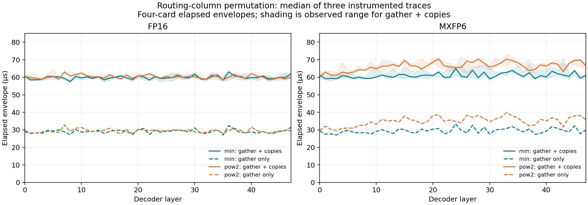

# Routing-column permutation profile

Analyzed 2026-09-22 using the validated 2026-09-21 full-model traces: 48 layers, four AI 100 cards, one 128-token input, three captures per case. This analysis reuses saved traces; no new model execution or compilation was needed.

**The routing-column permutation is a small cost in these traces.** It survives compilation as `oracle_L{layer}_routing_gather` / `aicgather` on the HVX DMA engine. All 64 cores across four cards have a recorded gather in every regrouped layer/sample. The native C128 traces contain no such oracle permutation.

| Case | Gather busiest-core busy time, µs | Gather elapsed envelope, µs | Gather + associated copies envelope, µs | Envelope / MoE | Sum over 48 layers, ms |
|---|---:|---:|---:|---:|---:|
| min_fp16 | 24.08 | 29.13 | 59.86 | 0.597% | 2.873 |
| pow2_fp16 | 24.15 | 29.44 | 60.24 | 0.616% | 2.892 |
| min_mxfp6 | 24.11 | 29.46 | 60.99 | 0.715% | 2.927 |
| pow2_mxfp6 | 24.09 | 34.96 | 66.25 | 0.823% | 3.180 |

Each value averages the 48 per-layer medians of three captures. The broad envelope starts at the earliest event attributed to this permutation and ends at its latest event across all cards/cores. It includes local copies, VTCM transfers, multicast and intervening gaps; it is not all active kernel time. The gather envelope includes only `aicgather` events. Busy time is the maximum per-core sum on the gather engine, never the sum over 64 parallel cores.

Treating the broad envelope as entirely serial would assign only about 3 ms across the entire 48-layer model to this operation. This is a direct-cost estimate, not a measured speedup from deleting it. Overlap can reduce the saving; changing the graph could also change scheduling. A causal ablation has not been run.

## Comparison with unchanged vector work

These numbers use a different metric: mean of per-layer median busiest-core HVX busy time. They identify substantial work that remains; they are not an additive wall-time breakdown.

| Case | First-group cumulative sum, ms | Local final reduction, ms | Final cross-card reduction node, ms |
|---|---:|---:|---:|
| native128_fp16 | 0.3992 | 1.8110 | 0.2423 |
| min_fp16 | 0.3991 | 1.7739 | 0.2439 |
| pow2_fp16 | 0.3996 | 1.7422 | 0.2440 |
| native128_mxfp6 | 0.3995 | 1.7752 | 0.2437 |
| min_mxfp6 | 0.3996 | 1.7597 | 0.2425 |
| pow2_mxfp6 | 0.3994 | 1.7465 | 0.2425 |

The last column is HVX compute attributed to the cross-card reduction node; it does not measure all communication time. These traces do not establish a complete memory-bandwidth-versus-communication breakdown.

Offline sorting and weight regrouping remain outside inference timing. The measured permutation reorders the dense token-to-expert routing matrix using a fixed expert order. It does not move expert weights or permute a full hidden-state tensor.

## Validation and reproduction

Checked 576 regrouped layer/sample intervals, all within their corresponding MoE boundaries, with complete four-card/core coverage. Native controls were checked separately. Independent raw-trace cross-checks completed for 4 traces (the first capture of each regrouped case when `--verify-raw` is supplied).

```bash
python tools/moe_qwen3_routing_profile.py \
  --root 9.17.2026/real_model/oracle_padding/layer_profile \
  --out 9.17.2026/real_model/oracle_padding/layer_profile/new_routing_profile \
  --verify-raw --plot
```

The output directory must be new. `--plot` requires Matplotlib; other analysis uses only the Python standard library. Timings and plots are local artifacts under the repository policy. Per-layer medians and observed ranges are in [layers.csv](layers.csv); individual captures are in [samples.csv](samples.csv).


