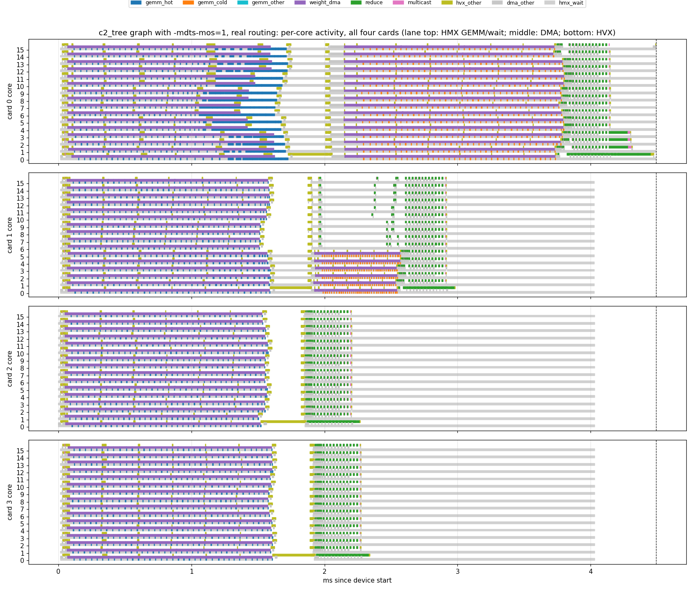
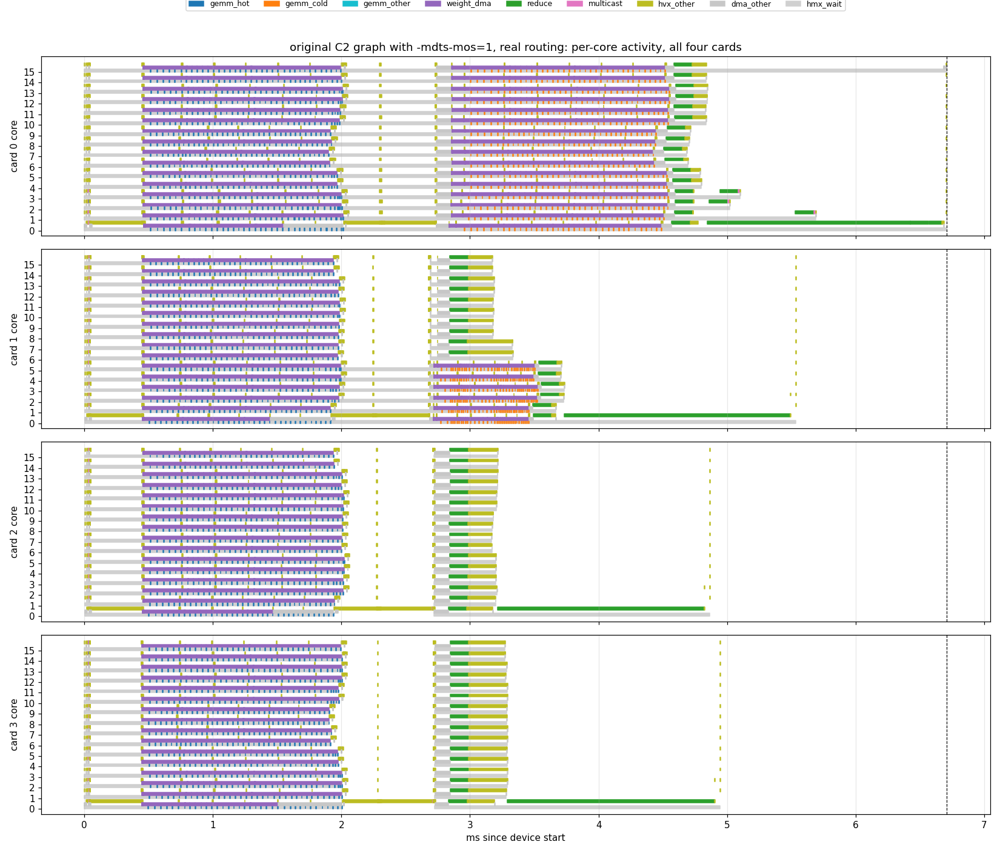
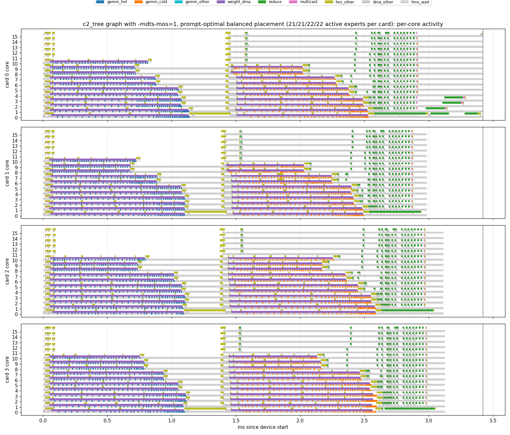
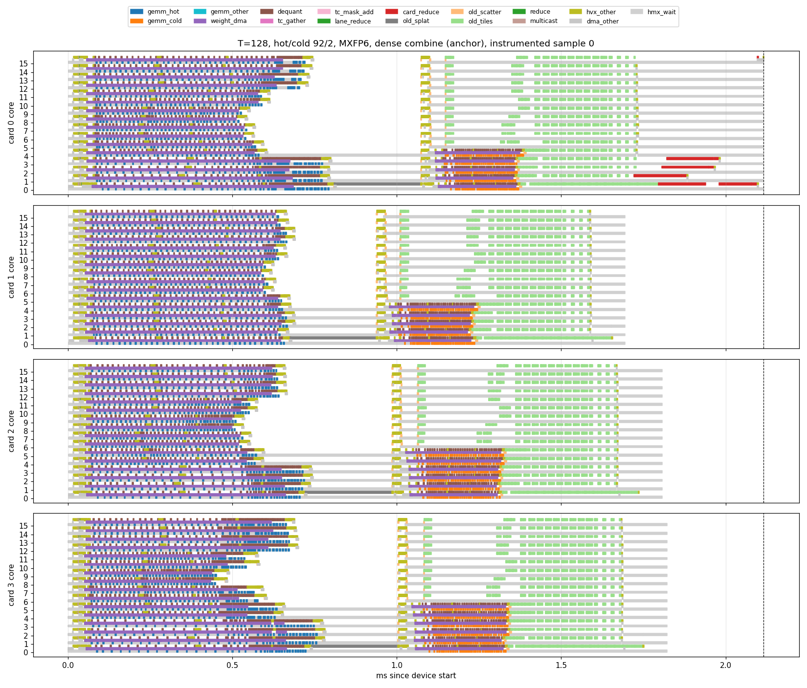
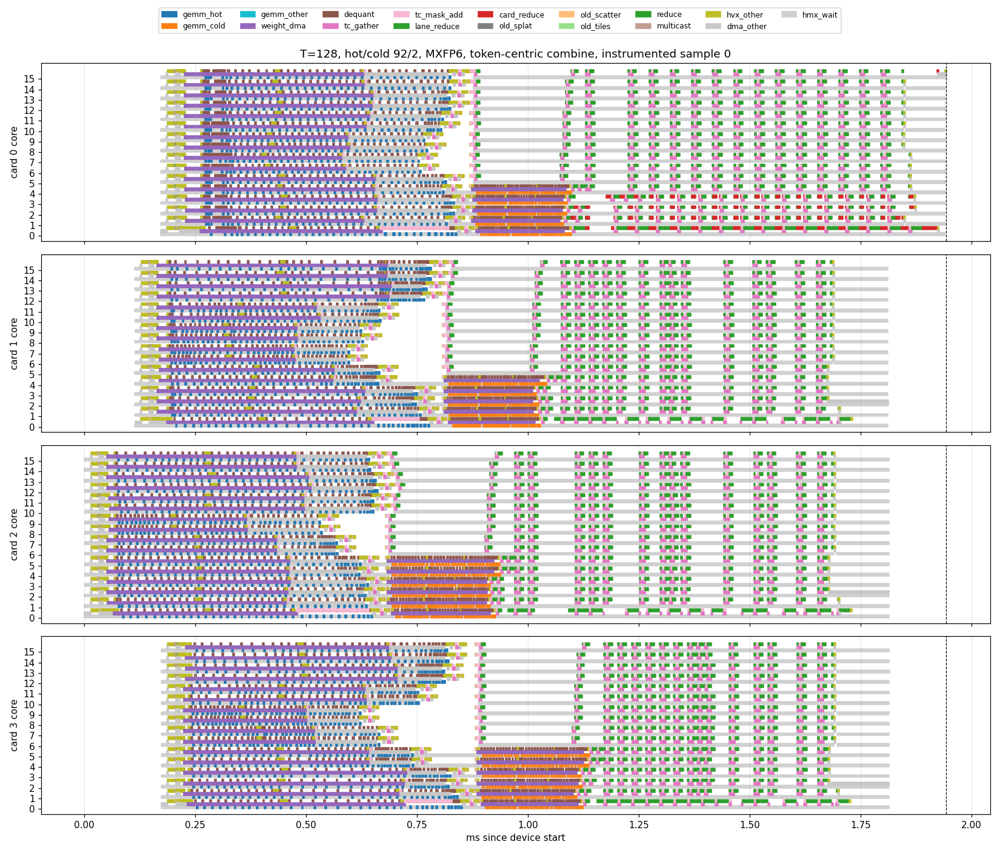
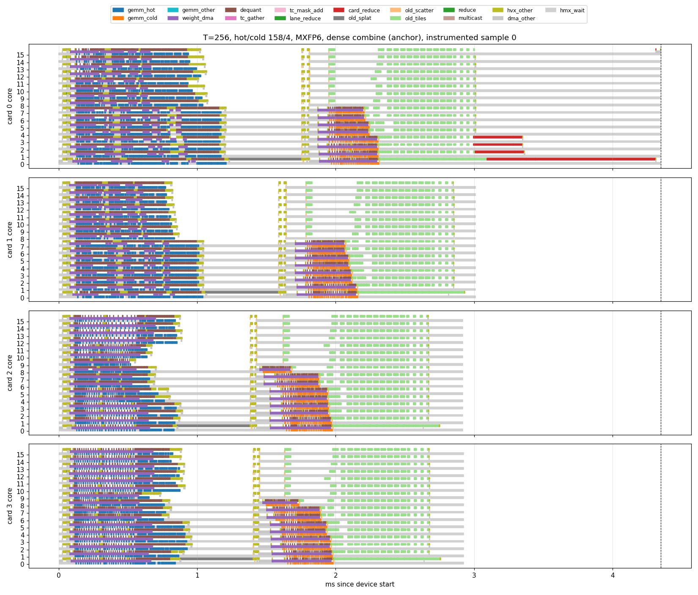
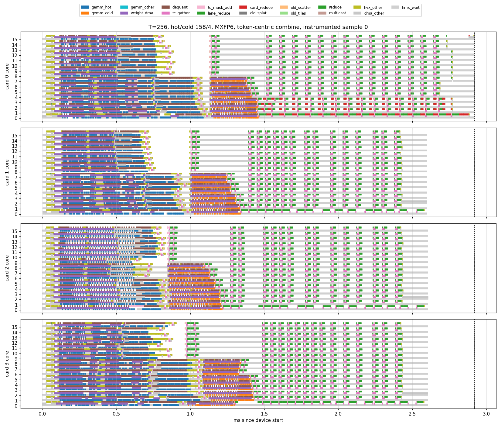
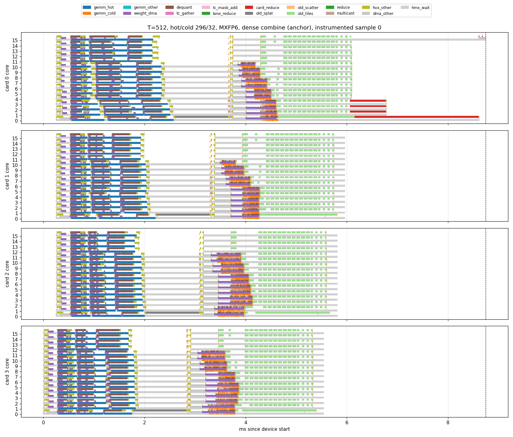
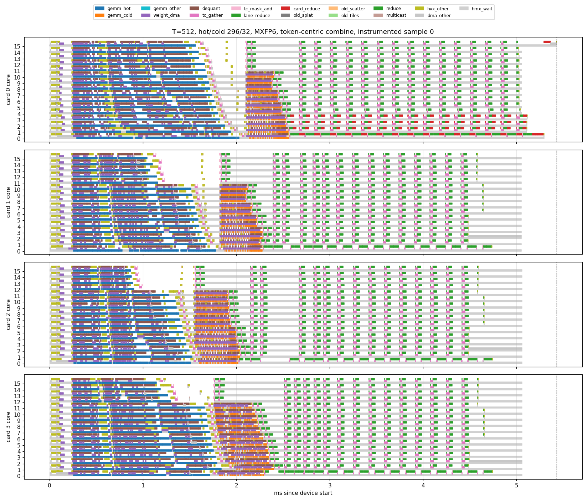

# Expert-parallel down projection with `-mdts-mos=1`: layer-2 redo and detailed profile

Measured 2026-09-22 on four AI 100 cards, 16 cores each, SDK 1.21.6, FP16, trained
Qwen3-30B-A3B layer 2 replays with the captured prompt-41 routing unless stated.
All baselines are the default compile, measured in the same session as the flag
builds, back to back. Every flag build reproduces its baseline output bit for bit.

**With the default compile, gate and up are expert-parallel but the down projection
is tensor-parallel across the four cards.** Each card computes a 512-column slice of
the down output for all 64 experts, which needs an all-gather of the intermediate
activation (36 MiB per stage at C128) and a re-shard of the down output (24 MiB per
stage) before the accumulator. Adding `-mdts-mos=1` to `qaic-compile` makes the down
projection expert-parallel too. Cross-card traffic per layer falls from 121.6 MiB to
1.5 MiB, and the current-best replay (`routing_retune/c2_tree`) falls from
7.27 ms to 5.00 ms host latency. After the fix, padding no longer changes latency
on this layer at T=128, the load-sorted hot/cold regrouping is slower than the native expert
order, and the critical path is weight streaming for the active experts on the
busiest card plus the dense reduction tail. At T=256 and 512 (E6, E7) per-stage
capacities with hot/cold grouping return 5–9%, and the T-scaled combine tail on
card 0 becomes the largest item. In MXFP6 (E8), the production precision, the layer
is 26–40% faster at T=128 but no longer weight-bound at any chunk size: capacity is
worth 9–12% from T=128 on, larger chunks gain nothing per token, and the
accumulator path is half to two thirds of the layer. On the full 48-layer prefill (E9) the flag
alone takes the MXFP6 model from 546.7 to 352.0 ms on the same graph, bit-exact,
while the earlier static regrouping becomes counterproductive. Porting the layer-2
rewrites to all layers (E10) reaches 242.8 ms, 2.05× the production baseline,
still bit-exact; grouping and capacities add nothing at model scale. A token-centric combine that removes the dense
accumulator (E11) is bit-exact and cuts the MXFP6 layer 10% at T=128, 27% at T=256
and 31% at T=512, restoring the per-token gain of larger chunks; on the full model it gives 231.8 ms,
2.14× the production baseline (E12). The profiling round after it (E13) puts the
remaining combine at a constant 5 µs per token, a serialized 16-tile pipeline, and the
hot stage compute-bound at T=512; the next steps are an eight-row combine and
exact-shape expert compute.

## 1. What the flag does

`-mos` is the degree of weight splitting across cores; `-mdts-mos` is the same knob
across multi-device tensor slices. The default heuristic split the `[64,768,2048]`
down weight four ways along N. Degree 1 forbids cutting any weight matrix across
cards, so the batch (lane) axis is the only way left to distribute the batched
MatMul: 16 whole experts per card, one per core. Measured on `c2_tree` (hot 128,
cold 2), instrumented builds:

| `-mdts-mos` | What is cut across cards | P2P per layer | Device time |
|---|---|---:|---:|
| default | down, 4 ways along N | 64.0 MiB | 6.59 ms |
| 1 | nothing | 1.5 MiB | 4.47–4.52 ms |
| 2 | nothing observed | 1.5 MiB | 4.41 ms |
| 4 | gate, up and down, all 4 ways | 160.0 MiB | 9.65 ms |

Compile-time signature of the fix: the down weight on each core becomes 12 column
tiles adding up to one full 3 MiB expert matrix, the same shape as gate and up, and
the intra-card multicasts that redistributed the activation disappear. Rewriting the
down MatMul as Einsum, splitting it along N, splitting it by lanes, or transposing
the weights did not change the compiler's decision.

Side effect, still unexplained: with the flag, experts that receive no tokens
neither load weights nor run GEMMs. On the real input 42 of the 64 cold experts are
empty; cards 2 and 3 run no cold GEMMs at all. With a synthetic input where all
128 experts are active, every core runs both stages and the output is still
bit-identical to the baseline.

## 2. Layer-2 redo with the flag (E1–E4)

Host timing: 3 rounds × 100 iterations, 10 warmups, order reversed in the middle
round, baseline and flag QPC back to back. E1, E2 and E4 use `-stats-level=70` on
both sides (matched); E3 uses `-stats-level=0`. Raw samples are in `layer_redo/`.

**E1, cold capacity sweep, hot 128 (`cold_capacity_control` graphs):**

| Cold capacity | Baseline, ms | Flag, ms | Flag/base |
|---:|---:|---:|---:|
| 128 | 12.333 | 7.657 | 0.62 |
| 64 | 12.674 | 7.732 | 0.61 |
| 32 | 10.590 | 7.704 | 0.73 |
| 16 | 10.688 | 7.674 | 0.72 |
| 8 | 10.633 | 7.607 | 0.72 |
| 4 | 10.643 | 7.663 | 0.72 |
| 2 | 10.643 | 7.687 | 0.72 |

**E2, hot capacity with cold 2:**

| Hot capacity | Baseline, ms | Flag, ms |
|---:|---:|---:|
| 128 | 10.641 | 7.658 |
| 96 | 11.839 | 7.679 |
| 92 | 11.744 | 7.594 |

The baseline penalty for non-power-of-two hot capacity (hot span 4.2 ms instead of
2.8) disappears. Both sweeps are flat within the round-to-round spread of about
0.1 ms: **capacity no longer changes latency on this layer.**

**E4, expert regrouping with real routing.** The native expert order was rebuilt by
inverse-permuting the routing columns and the six weight banks with the oracle plan
(`layer_redo/e4_native_permutation.json`). Native groups have 39 and 47 active
experts with maxima 92 and 34; the sorted layout has 64 and 22.

| Layout and capacities | Baseline, ms | Flag, ms |
|---|---:|---:|
| Sorted 128/2 | 10.643 | 7.687 |
| Sorted 92/2 | 11.744 | 7.594 |
| Native 128/128 | 12.271 | 6.907 |
| Native 92/34 | 12.417 | 6.880 |

Regrouping was worth 1.6 ms with the default compile and costs 0.7–0.8 ms with the
flag. Native outputs differ from the sorted reference by a relative L2 of 1.1e-5
(summation order), identically for both compiles.

**E3, all-experts-active plans** (`all_active` graphs and synthetic workloads,
11 plans, 2 outer passes × 3 rounds × 100 iterations, flag QPCs compiled from the
stored plan graphs, baselines are the stored QPCs). Means over the five workloads:

| Policy (frozen selections from `all_active/RESULTS.md`) | Baseline, ms | Flag, ms |
|---|---:|---:|
| One static plan | 5.462 | 4.926 |
| Fixed layout, capacity oracle | 5.431 | 4.924 |
| Fixed shape, placement oracle | 5.454 | 4.944 |
| Joint oracle | 5.408 | 4.947 |
| No regrouping, 32/32 | 5.500 | 4.923 |
| Best tested plan per workload | 5.395 | 4.892 |

Per plan and workload the flag gives 9–12%; all policies sit within 0.05 ms of each
other in both regimes.

## 3. Detailed profile: what is the bottleneck now

Full-flow captures (`--flow-events full`), 3 samples each, analyzed with
`scripts/detail_analyze.py` and `scripts/detail_timeline.py`. The repo's
`moe_qwen3_layer_detail.py` rejects these traces because the four cards no longer
finish their stages in lockstep, so the scripts here recompute the same per-core,
per-node, P2P and dependency metrics without that assumption. Representative
samples by median device time; CSVs are in `detail/`.

### 3.1 Current-best graph `c2_tree` with the flag: 4.49 ms device, 5.00 ms host

Card 0 is the critical path from start to finish. Its timeline (ms since device
start, from `detail/c2tree_flag/card0_timeline.csv`):

| Window | What card 0 does | Cost | Share |
|---|---|---:|---:|
| 0.07–1.73 | Hot stage: gate, up, down weights streamed from DDR (3 × 48 MiB per card), GEMMs follow each stream | 1.66 ms | 37% |
| 1.73–2.27 | Hot unpack and scatter, 0.26 ms zero-splat of the accumulator slice on one core, 40 µs routing scan on 64 cores, gather of the accumulator for the cold update | 0.54 ms | 12% |
| 2.27–3.80 | Cold stage: 16 active experts on card 0, again 3 × 48 MiB of weights | 1.53 ms | 34% |
| 3.80–4.21 | 16 local reduction tiles, 23 µs each on 16 cores, one tile every 25 µs | 0.41 ms | 9% |
| 4.21–4.49 | Final cross-card combine on 4 cores of card 0, then output copy | 0.28 ms | 6% |

The other cards: card 1 runs 6 active cold experts and finishes at 2.96 ms, cards
2 and 3 run no cold experts and finish at 2.30 ms. Their partial sums reach card 0
by 2.98 ms (the only P2P left, 3 × 0.5 MiB). Cards 2 and 3 therefore idle for the
last 2.2 ms, 48% of the layer.

Per-core arithmetic is negligible: median HMX busy per core is 45–50 µs in the hot
stage and 4 µs in the cold stage, against 1.2–1.5 ms of HMX dependency waits.
Weight DMA per card is 144 MiB per stage; the stage span of 1.5–1.6 ms gives about
90 GB/s, so **a stage costs about 0.1 ms per active expert on the busiest card.**
Card 1's six cold experts took 0.65 ms, card 0's sixteen took 1.53 ms.

### 3.2 Original graph (`cold_capacity_control/c2`) with the flag: 6.7 ms device

Same stages, plus the items the `c2_tree` rewrites removed: the two routing prefix
sums on core 0 (0.40 ms each, at 0.05–0.45 and 2.33–2.73), and the DDR-backed local
reduction on core 0 (1.72 ms, 4.51–6.43) followed by the final combine to 6.67 ms.
Cards 2 and 3 finish at 4.8–4.9 ms.

### 3.3 Levers, in order of size

1. **Balance active experts across cards.** Card 0 carries 32 active experts over
   the two stages, cards 2 and 3 carry 16. A balanced 21–22 per card would cut the
   two GEMM stages from 3.2 to about 2.1 ms. E4 already shows the native order doing
   part of this (6.9 vs 7.7 ms). Regrouping should target this balance, not padded
   rows; the runtime expert-ID selection work is the natural vehicle.
2. **Weight bytes.** With the exchange gone, DDR streaming of active experts is the
   floor: 9 MiB per active expert per card at about 90 GB/s. MXFP6 weights would cut
   the bytes 2.7×; prefetching the next stage during the 0.5 ms inter-stage gap would
   hide part of it (the DMA engine is idle from 1.63 to 2.15 ms on card 0).
3. **Inter-stage gap.** The 0.26 ms accumulator zero-splat runs on a single core
   after the hot GEMMs although it depends on nothing; hoisting or pre-zeroing it
   saves about 0.25 ms per stage boundary.
4. **Reduction tail.** 0.69 ms after card 0's last GEMM: the 16 local tiles could
   overlap the cold GEMMs (HVX is idle then), and the final combine uses 4 cores of
   the busiest card; moving it to a lightly loaded card or spreading it over 16
   cores would shorten the tail.

Applying 1, 3 and 4 would put this layer near 2.7 ms for this input, against 4.49 ms
now, 7.27 ms before the flag and 12.4 ms for the original C128 graph. These are
projections from the timeline, not measurements.

## 3.4 How much balancing can give, from the 48-layer routing counts

With the flag there is no cross-card synchronization between the two stages, so a
layer costs about `max over cards (active experts on the card) × 0.1 ms` plus the
fixed part. From the device-captured prompt-41 counts of all 48 layers
(`scripts/balance_placements.py`), the maximum active count on any card is:

| Placement | Mean over 48 layers | Layer 2 per card | Est. GEMM ms per layer |
|---|---:|---|---:|
| Deployed load-sorted hot/cold, contiguous | 28.7 | 32 / 22 / 16 / 16 | 2.87 |
| Native expert order | 22.8 | 23 / 20 / 18 / 25 | 2.28 |
| Hot contiguous, cold dealt round-robin | 20.6 | 22 / 22 / 21 / 21 | 2.06 |
| Snake or LPT on per-expert counts | 20.5 | 21 / 21 / 22 / 22 | 2.05 |
| Lower bound `ceil(active/4)` | 20.5 | 22 | 2.05 |

The count-based rows are fitted on the same prompt and are therefore optimistic;
the native row and the bound are not fitted. The E4 measurement agrees with the
model: it predicts 0.7 ms between native and sorted on layer 2, and 0.75 ms was
measured. Active experts per layer range from 65 to 109, mean 80.

## 3.5 Placement upper bound for this prompt (E5)

To measure how much balancing can give, the expert order was optimized directly on
prompt 41: LPT on the per-expert token counts of layer 2 (`scripts/make_perm_graph.py`,
`placement/order_balanced.json`), 32 experts per card, the two lightest cards mapped
to cards 0 and 1, active experts alternated between a card's two stages, capacity
128/128. Active experts per card become 21/21/22/22, against 32/22/16/16 for the
deployed sorted layout and 23/20/18/25 for the native order. Same weights, same
routing, permuted consistently; counts are exact and outputs differ from the sorted
reference only by summation order (relative L2 1.2e-5).

Host medians, 3 alternating rounds × 100 iterations, all with the flag:

| Graph | Sorted hot/cold | Native order | Balanced (prompt-optimal) |
|---|---:|---:|---:|
| `c2_tree`, instrumented | 5.358 | 4.529 | 4.358 |
| `c2_tree`, uninstrumented | 4.833 | – | 3.793 |
| original C2, instrumented | 7.661 | 6.856 | 6.794 |

Uninstrumented, the balanced placement is 1.27× faster than the sorted layout with
the flag (3.79 vs 4.83 ms), about 1.9× faster than `c2_tree` with the default compile
(7.27 ms) and about 3.3× faster than the original C128 graph (12.4 ms).

The balanced build's device time is 3.42 ms (sorted: 4.49). All four cards now
finish within 0.5 ms of each other (2.93, 3.04, 3.05, 3.42 ms). Card 0's timeline:
hot stage 0.07–1.14 ms on 11 cores, gap 0.34 ms with the single-core zero-splat,
cold stage 1.48–2.53 ms on 10 cores, reduction tiles to 2.98 ms, final 4-core
combine to 3.38 ms. With the loads level, the tail after the last GEMM (0.85 ms,
25% of the layer) and the inter-stage gap are the next targets; per active expert
the stages still cost about 0.1 ms per card.

This is an upper bound for placement alone: the order is fitted to the very input it
is measured on, and the gain over the unfitted native order is only 0.17 ms on
`c2_tree`, so a calibrated static layout would land between the two.

## 3.6 Larger prefill chunks (E6)

Bytes per token should fall with the chunk length T because the active-expert set grows
sublinearly. Variants of the `c2_tree` graph were built for T = 128, 256 and 512
(`scripts/make_chunk.py`: tree scans and reduction tiles regenerated for T, capacity T for
both stages, LPT placement fitted to each variant's counts). Routing is synthesized to
realize prescribed per-expert counts; the T=128 synthetic control reproduces the real
input's timing (3.92 vs 3.93 ms), so timing depends on counts, not on values. "Same set"
keeps the 86 experts of prompt 41 with counts scaled by T/128; "grown" adds inactive
experts with small counts to reach 98 (T=256) and 110 (T=512) active experts, in line
with the routing study's coverage growth. Uninstrumented host medians, flag builds,
3 alternating rounds × 100 iterations:

| Variant | Active experts | Weight MiB per token | Chunk, ms | µs per token | vs T=128 |
|---|---:|---:|---:|---:|---:|
| T=128, real routing | 86 | 6.05 | 3.93 | 30.7 | – |
| T=128, synthetic control | 86 | 6.05 | 3.92 | 30.7 | 0% |
| T=256, same set | 86 | 3.02 | 6.68 | 26.1 | −15% |
| T=256, grown | 98 | 3.45 | 7.07 | 27.6 | −10% |
| T=512, same set | 86 | 1.51 | 11.66 | 22.8 | −26% |
| T=512, grown | 110 | 1.93 | 12.45 | 24.3 | −21% |

Weight bytes per token halve and quarter, but time per token falls only 10–26%. The
instrumented T=256 grown profile (`chunk_size/T256_grow_profile/`, device 6.15 ms,
cards end 4.3 / 4.6 / 4.8 / 6.1 ms) shows why:

- **The GEMM stages grow.** Hot 1.07 → 1.46 ms and cold 1.05 → 1.74 ms although the
  weight bytes per card barely change. Recorded HMX busy per core rises from about
  55 µs to 0.77–1.0 ms per stage: with capacity T every active expert computes T rows,
  so padded GEMM work, negligible at T=128, is a co-bottleneck at T=256. Capacity
  tuning, irrelevant at T=128, matters again for larger chunks.
- **The dense accumulator path scales with T.** The single-core zero-splat doubles to
  0.52 ms, the accumulator gathers and scatters double, the 16 reduction tiles take
  46 µs each instead of 23.
- **The final combine spills.** At T=128 the four-core combine is a 243 µs TCM
  reduction; at T=256 the compiler adds an 836 µs DDR-backed reduction on one core, and
  the combine window grows from 0.24 to 1.28 ms, all on card 0 after the other cards
  have finished.

Larger chunks therefore only pay off together with the accumulator redesign: a
token-centric combine, a distributed final combine, and per-group capacities. If the
combine tail returned to its T=128 cost, the T=256 layer would be near 4.9 ms, or
19 µs per token.

## 3.7 Capacity at larger chunks (E7)

E1 and E2 showed that with the flag the capacity no longer changes latency at T=128,
because every padded GEMM hides under the weight stream. Section 3.6 predicted this
would stop holding at T ≥ 256: the down projection runs compute-bound after its
prefetched weights land, and the token gathers and expert-output scatters grow with
the capacity. E7 measures it. `scripts/make_cap.py` builds the `c2_tree` flag graph
for T = 256 and 512 with the E6 "grown" counts (98 and 110 active experts), separate
capacities for the two stages and one of two placements:

- **lpt**: the E6 placement (LPT over active experts, alternating a card's two stages,
  capacity T in both stages);
- **hc**: stage 0 holds the 64 experts with the largest counts, spread round-robin
  over the cards (16 active per card); stage 1 holds the rest, its active experts
  spread round-robin starting at card 3, inactive experts filling the gaps. Per-card
  totals are the same as LPT (24/24/25/25 and 27/27/28/28), so the two baselines
  differ only in grouping. Capacities per stage: T, 32, or the oracle value, the
  largest count in the group (158/4 at T=256, 296/8 at T=512). No tokens are dropped
  by construction.

Uninstrumented builds, `moe_single_host`, 3 alternating rounds × 100 iterations, all
14 QPCs in one session, cards idle-checked before each round. Every `hc` variant
reproduces the `hc` T/T output bit for bit; `hc` and `lpt` differ by at most
4.9e-4 (summation order). Full table with rounds: `chunk_size/capacity/summary.md`.

| T | Placement | Capacity hot/cold | Padded rows / real | Chunk, ms | µs per token | vs hc T/T | vs LPT T/T |
|---:|---|---:|---:|---:|---:|---:|---:|
| 256 | lpt | 256/256 | 12.3× | 7.031 | 27.5 | 1.030 | 1.000 |
| 256 | hc | 256/256 | 12.3× | 6.826 | 26.7 | 1.000 | 0.971 |
| 256 | hc | 256/32 | 8.5× | 6.773 | 26.5 | 0.992 | 0.963 |
| 256 | hc | 256/4 | 8.1× | 6.652 | 26.0 | 0.974 | 0.946 |
| 256 | hc | 158/256 | 9.2× | 6.783 | 26.5 | 0.994 | 0.965 |
| 256 | hc | 158/32 | 5.5× | 6.537 | 25.5 | 0.958 | 0.930 |
| 256 | hc | **158/4** | 5.0× | **6.485** | **25.3** | **0.950** | **0.922** |
| 512 | lpt | 512/512 | 13.8× | 12.496 | 24.4 | 1.011 | 1.000 |
| 512 | hc | 512/512 | 13.8× | 12.355 | 24.1 | 1.000 | 0.989 |
| 512 | hc | 512/32 | 8.4× | 12.067 | 23.6 | 0.977 | 0.966 |
| 512 | hc | 512/8 | 8.1× | 12.006 | 23.4 | 0.972 | 0.961 |
| 512 | hc | 296/512 | 10.4× | 12.143 | 23.7 | 0.983 | 0.972 |
| 512 | hc | **296/32** | 5.0× | **11.227** | **21.9** | **0.909** | **0.898** |
| 512 | hc | 296/8 | 4.7× | 11.292 | 22.1 | 0.914 | 0.904 |

**Capacity is worth 5% at T=256 and 9% at T=512**, 8% and 10% against the E6
baselines once the grouping change is included; per token the layer goes from
30.7 µs (T=128) to 25.3 (T=256) and 21.9 (T=512). The reductions are free: bit-exact
outputs, no change to the graph beyond four constants and the lane order.

- **Grouping alone helps a little now** (3% at T=256, 1% at T=512). With 16
  active experts per card the hot stage runs at the weight-stream bound (93–101 µs
  per expert), and the cold stage with 8–9 experts per card finishes sooner. E4's
  counter-result at T=128 came from card concentration, not from grouping.
- **The two reductions interact.** At T=512 the cold-only builds save 0.29–0.35 ms
  and the hot-only build 0.21 ms, but both together save 1.06–1.13 ms; at T=256 the
  singles save 0.04–0.17 ms and the pair 0.29–0.34 ms. Rounds agree within 0.1 ms,
  so this is not noise; the compiler's schedule and buffer placement change with
  each pair of capacity constants (the same hot capacity of 296 gives a hot stage of
  1.7–1.85 ms in the 296/512 build and 2.0–2.5 ms in the 296/8 build).
- **The instrumented profiles exaggerate the effect** (T=512 device time 11.98 →
  9.96 ms for 512/512 → 296/8, against 1.1 ms in host timing) and show the single
  reductions as sub-additive, so they are used below only to attribute where stage
  time goes, not to size the saving.

Where the time went, instrumented (`chunk_size/capacity/*_profile/`, figures
`*_cores.png`):

| Profile | Device, ms | Cards 1–3 end, ms | Card 0 tail after its cold stage, ms | Hot stage, µs per expert | Cold stage, µs per expert | Gathers + scatters, MiB |
|---|---:|---:|---:|---:|---:|---:|
| T=256 lpt 256/256 (E6) | 6.15 | 4.3 / 4.6 / 4.8 | 2.1 | 97–122 | 117–145 | 194 + 128 |
| T=256 hc 158/4 | 5.50 | 4.0 / 4.0 / 4.0 | 2.2 | 93–101 | 100–113 | 74 + 40 |
| T=512 hc 512/512 | 11.98 | 8.2 / 7.8 / 8.6 | 4.8 | 141–185 | 167–188 | 404 + 256 |
| T=512 hc 296/8 | 9.96 | 6.7 / 7.0 / 7.2 | 4.2 | 125–157 | 113–123 | 169 + 76 |

- At T=256 the oracle capacities bring both stages back to the weight-stream bound
  (about 95 µs per active expert for 9 MiB at 95 GB/s), the cold GEMMs shrink to
  4 µs per core, and cards 1–3 finish together at 4.0 ms. Card 0 still ends 1.5 ms
  later: 16 reduction tiles reading 64 MiB, a 0.29 ms TCM combine and the 0.83 ms
  DDR-backed combine. **That tail is now 40% of the device time.**
- At T=512 the hot stage stays 0.2–1.0 ms above the 1.5 ms weight-stream bound in
  every build, and the per-core GEMM events (which include stalls) run 0.9–2.7 ms
  per stage: with 16 active experts per card, each processing 296 or more rows,
  hot-stage compute is exposed. The T-scaled path is larger still: 1.3 ms of
  reduction tiles on every card after the cold stage, then on card 0 alone a 0.57 ms
  TCM combine, a 1.70 ms DDR-backed combine and the output copies, about 3 ms in
  the uninstrumented layer, or 27% of it.

So the earlier optimizations return in a new role at T ≥ 256: the hot/cold grouping
is what makes a small cold capacity legal, and the per-stage capacity removes the
part of the stage time that scaled with padded rows. They should stay in the design
for larger chunks, but they cannot deliver the chunk-size gain on their own: with the
card-0 combine tail back at its T=128 cost (0.7 ms), the T=512 layer would be near
7.5 ms, or 14.6 µs per token, against 21.9 now. For the hot stage at T=512 a finer
split (four groups of 32 lanes with per-group oracle capacities 296/44/8/4) would
cut the padded rows a further 1.7×, from 4.7× to 2.7× the real rows.

## 3.8 MXFP6 weights: the replay series in the production precision (E8)

Every replay result above is FP16. The production model compiles its expert weights
to MXFP6 (`-mxfp6-matmul`: constant MatMul weights are stored as MXFP6 E2M3 and
dequantized on the HVX at run time, 2.55× smaller QPCs). E8 recompiles the graphs of
E1–E7 in MXFP6, always with `-mdts-mos=1`, and times them against FP16 anchors of the
same graphs in the same session: same inputs, same host binaries, uninstrumented
builds, 3 alternating rounds × 100 iterations (the all-active block uses the
multi-input host, 2 outer passes × 3 rounds). Raw samples and specs are in `mxfp6/`.

**Correctness.** MXFP6 outputs behave like FP16 under graph changes: bit-exact across
capacities, relative L2 of about 1e-5 across placements (summation order), routing
counts exact everywhere. Against the FP16 output of the same graph the MXFP6 result
differs by a relative L2 of 1.13e-2 on the real prompt-41 routing, for every
real-routing graph. On the synthetic-routing inputs of E6/E7 the figure is 3.7e-2 to
9.9e-2, because those outputs have half the norm (eight equal 1/8 weights on arbitrary
experts) with the same absolute error per token; it says nothing about model quality,
for which the repo's full-model number (18.8% at the logits after 48 layers) stands.

**T=128, sorted layout, original graph family (E1/E2 mirror):**

| Graph, hot/cold capacity | FP16 flag, ms | MXFP6 flag, ms | MXFP6 no flag, ms |
|---|---:|---:|---:|
| `cold_capacity_control/c128`, 128/128 | 7.284 | 5.460 | 10.845 |
| c64, 128/64 | – | 5.531 | – |
| c32, 128/32 | – | 5.540 | – |
| c16, 128/16 | – | 5.361 | – |
| c8, 128/8 | – | 5.465 | – |
| c4, 128/4 | – | 5.338 | – |
| c2, 128/2 | 7.266 | 5.348 | 8.563 |
| hot 96 / cold 2 | – | 5.342 | – |
| hot 92 / cold 2 | – | 5.313 | – |
| E4 native order, 128/128 | – | 5.129 | – |
| E4 native order, 92/34 | – | 5.053 | – |

**T=128, placement, `c2_tree` family, real routing (E4/E5 mirror):**

| Layout | FP16 flag, ms | MXFP6 flag, ms | MXFP6 / FP16 | µs per token, MXFP6 |
|---|---:|---:|---:|---:|
| Sorted 128/2 (current best before E5) | 4.953 | 3.276 (5.644 without the flag) | 0.66 | 25.6 |
| Native order 128/128 | 4.212 | 2.777 | 0.66 | 21.7 |
| Balanced LPT 128/128 (E5) | 3.946 | 2.825 | 0.72 | 22.1 |

**All-experts-active plans (E3 mirror):** all eleven plans run at 2.94–3.08 ms in
MXFP6 against 4.84–5.04 ms in FP16 (0.60–0.62×), and the frozen policies again sit
within 0.05 ms of each other: one static plan 2.967, capacity oracle 2.991, placement
oracle 2.991, joint oracle 3.015, no regrouping 2.989, best plan per workload 2.964 ms
(FP16: 4.885–4.956). Per-plan table in `mxfp6/summary.md`.

**Chunk size × capacity, hot/cold placement, grown counts (E6/E7 mirror):**

| T | Capacity hot/cold | FP16, ms | MXFP6, ms | MXFP6 / FP16 | µs per token, MXFP6 | MXFP6 vs its T/T |
|---:|---:|---:|---:|---:|---:|---:|
| 128 | 128/128 | 3.928 | 2.848 | 0.725 | 22.2 | 1.000 |
| 128 | 92/2 (oracle) | 3.896 | 2.596 | 0.666 | 20.3 | 0.912 |
| 256 | 256/256 | 6.767 | 5.914 | 0.874 | 23.1 | 1.000 |
| 256 | 256/4 | – | 5.574 | – | 21.8 | 0.943 |
| 256 | 158/256 | – | 5.650 | – | 22.1 | 0.955 |
| 256 | 158/32 | – | 5.227 | – | 20.4 | 0.884 |
| 256 | 158/4 (oracle) | 6.509 | 5.197 | 0.798 | 20.3 | 0.879 |
| 512 | 512/512 | 12.312 | 11.347 | 0.922 | 22.2 | 1.000 |
| 512 | 512/8 | – | 10.558 | – | 20.6 | 0.930 |
| 512 | 296/512 | – | 10.729 | – | 21.0 | 0.946 |
| 512 | 296/32 | 11.285 | 9.924 | 0.879 | 19.4 | 0.875 |
| 512 | 296/8 (oracle) | – | 10.031 | – | 19.6 | 0.884 |

LPT placement in MXFP6: 2.871 / 5.729 / 11.571 ms at T = 128 / 256 / 512 with
capacity T, against 2.848 / 5.914 / 11.347 for hot/cold, so grouping itself is worth
nothing once the bytes shrink.

What changes with the production precision:

- **MXFP6 is worth 26–40% at T=128** depending on the graph, but only 13–20% at
  T=256 and 8–12% at T=512. The weight bytes fall 2.6× (774 → 302 MiB per layer at
  T=128 in the profile), the time does not follow, because everything that is not
  the weight stream stays.
- **The flag stays essential.** Without `-mdts-mos=1` the MXFP6 graphs are 1.14–1.99×
  slower; the exchange is a fixed 121 MiB of P2P whatever the weight format.
- **The chunk-size gain is gone.** Per token the layer costs 20.3 µs at T=128, 20.3
  at T=256 and 19.4 at T=512 with oracle capacities. In FP16 it fell 30.7 → 25.3 →
  21.9. The MXFP6 advantage shrinks with T (0.67 → 0.80 → 0.88×) because the
  token-scaled work that FP16 hid under the weight stream is exposed at every T.
- **Capacity matters more, from T=128 on.** Flat in FP16 at T=128, the oracle
  capacities save 9% on the balanced layout in MXFP6 (2.85 → 2.60 ms), and 12% at
  T=256 and T=512; hot and cold reductions are now roughly additive. On the sorted
  layout the sweep stays nearly flat (5.46 → 5.35), because there the cold stage still
  streams 16 experts per card on cards 0 and 1: capacity shows as soon as a stage's
  weight stream is shorter than its padded compute, which the balanced layout's 5–6
  cold experts per card is. With all 128 experts active and capacities 8–32 (E3) the
  plans are still indistinguishable.
- **Balance stops paying at T=128.** Native order and balanced placement tie
  (2.78 vs 2.83 ms); sorted → balanced is still 14% (3.28 → 2.83).

Where the time goes, instrumented MXFP6 profiles (`mxfp6/*_mxfp6_profile/`, figures
`mxfp6/*_cores.png`), against the FP16 profiles of the same graphs:

| Profile | Device, ms FP16 → MXFP6 | Weights DDR, MiB | Hot stage, µs per expert (floor 37) | Cold stage, µs per expert | Inter-stage gap + card-0 tail, ms | Share of device time |
|---|---:|---:|---:|---:|---:|---:|
| T=128 balanced, real routing | 3.43 → 2.34 | 774 → 302 | 95 → 39–48 | 100–103 → 52–57 | 0.36 + 0.83 | 51% |
| T=256 hot/cold 158/4 | 5.50 → 4.35 | 882 → 345 | 93–101 → 47–68 | 100–113 → 44–55 | 0.74 + 2.04 | 64% |
| T=512 hot/cold 296/8 | 9.96 → 8.62 | 990 → 387 | 100–157 → 100–111 | 113–123 → 57–65 | 1.34 + 4.5 | 68% |

- At T=128 the hot stage reaches the MXFP6 weight floor on cards 1–3 (39–42 µs per
  expert for 3.4 MiB). The dequantize kernels (`blockdequantize_mxfp6`, HVX) take
  about 0.27 ms per core per stage and hide under the DMA, since the HVX is otherwise
  idle during the expert stages. The accumulator traffic (gathers 85, scatters 64,
  splat 32, tiles 32 MiB) is unchanged and is now 41% of the DDR bytes; the splat gap
  and the card-0 tail (tiles, TCM combine) are unchanged at 1.2 ms and are half the
  layer.
- At T=256 the hot stage sits above the floor (47–68 µs per expert): dequantize up to
  0.5 ms per core per stage and the 158-row GEMMs are no longer covered by a 0.57 ms
  weight stream. Gap and tail are unchanged at 2.8 ms, two thirds of the layer.
- At T=512 the hot stage is GEMM-bound: 1.4–1.6 ms of HMX time per core for 16
  experts of 296 rows, the same as in FP16, against a 0.6 ms weight stream. Weight
  stages take 2.5 of the 8.6 ms; the splat gap (1.3 ms), reduction tiles (1.8 ms) and
  final combine (2.7 ms) take 5.8.

Against the MXFP6 weight floor (busiest card × 3.4 MiB at 95 GB/s: 0.82 / 0.93 /
1.04 ms) the measured layer is 3.2× / 5.6× / 9.5× longer at T = 128 / 256 / 512. In
the production precision the layer is therefore not weight-bound at any chunk size,
and the levers reorder: the token-scaled accumulator path first (tiled final combine,
then the token-centric combine), then the padded GEMM compute at T ≥ 256 (finer
groups or exact per-expert shapes; the 296-row hot stage at T=512 costs three times
its weight stream), then capacity and grouping as measured here (9–12%), and balance
last. Larger prefill chunks pay nothing in MXFP6 until the first two are done.

## 3.9 Full 48-layer prefill with the flag (E9)

The replay results were finally checked on the whole model: Qwen3-30B-A3B, 48
layers, four cards, the same GSM8K prompt 41 (128 tokens, context 256), MXFP6
weights, uninstrumented compiles, `tools/moe_qwen3_baseline.py` with 3 rounds × 20
invocations against the saved FP32 reference. The shared QEfficient export is gone,
so the graphs were rebuilt: the 341 non-expert tensors (2.9 GB) were regenerated from
the HF checkpoint with the QEfficient conventions (transposed MatMul weights, rotary
caches in fp32 rounded to fp16, `scripts/rebuild_full_graph.py`), and the expert
banks were restored to native order by inverting the sorted128 plan on the workspace
copy (`scripts/build_native_banks.py`, checked bit for bit against the E4 native
banks of layer 2). The rebuilt native C128 program reproduces the historical MXFP6
run **bit for bit** at the logits and its latency (497.1 vs 496.5 ms). The two
surviving earlier QPCs were re-run in the same session as anchors: native FP16
573.2 ms (5.03% error, historical 572.3) and minimum-capacity MXFP6 425.4 ms
(historical 425.5).

**Retained-state KV and the flag do not combine.** With `-mdts-mos=1` (and `=2`) the
compiler no longer pairs the 96 KV-cache inputs with their `_RetainedState` outputs:
the QPC exposes 192 KV buffers as ordinary fp16 IO instead of 4 bindings. The
measurement therefore uses prefill-only graphs (`scripts/kvfree_graph.py`: KV inputs
replaced by fp16 zero initializers, retained outputs dropped), which are numerically
identical (bit-exact logits) but cost about 50 ms more than the retained-state
program even without the flag, so the flag is read within the KV-free pair. Making
the flag coexist with retained state is a compiler question for the deployed model.

| Program (MXFP6, T=128, 4 cards) | KV cache | Flag | Host median, ms | Rounds, ms | Logits rel. L2 vs FP32 | Next token |
|---|---|---|---:|---|---:|---|
| Native C128, rebuilt (production baseline) | retained | no | 497.1 | 497.4 / 497.2 / 496.4 | 0.1884 | ' jav' ✓ |
| Native C128, prefill-only | zeros | no | 546.7 | 546.5 / 546.9 / 547.0 | 0.1884 (bit-exact) | ✓ |
| **Native C128, prefill-only** | zeros | **yes** | **352.0** | 352.1 / 352.0 / 352.0 | 0.1884 (bit-exact) | ✓ |
| Static oracle: minimum capacities, sorted regrouping | zeros | yes | 366.5 | 366.4 / 366.5 / 366.4 | 0.1720 | ✓ |
| Static oracle: power-of-two capacities, sorted regrouping | zeros | yes | 375.4 | 375.7 / 375.4 / 375.2 | 0.1720 | ✓ |
| Minimum capacities, earlier QPC (anchor) | retained | no | 425.4 | 425.4 / 425.5 / 425.4 | 0.1720 | ✓ |
| Native C128 FP16, earlier QPC (anchor) | retained | no | 573.2 | 573.2 / 573.1 / 573.4 | 0.0503 | ✓ |

- **The flag alone is worth 1.55× on the whole prefill** (546.7 → 352.0 ms on the
  same graph, 2.75 ms per token), 29% below the retained-state production baseline
  even with the prefill-only penalty included, and it changes no logit. Per MoE
  layer that is about 4 ms, in line with the layer-2 replay of the original graph in
  MXFP6 (10.85 → 5.46 ms).
- **The static oracle regrouping is now counterproductive**: 366.5 and 375.4 ms
  against 352.0 for the native order. Before the flag it was the repo's headline
  (496 → 425 ms, 14%); with the flag the sorted layout's card concentration (27.7
  active experts on the busiest card per layer against 22.9 native, from the saved
  routing counts) costs more than the smaller capacities save, exactly as E4 and E8
  found on layer 2. Power-of-two capacities are slower than minimum ones, the
  reverse of the pre-flag order, because in MXFP6 the padded rows are exposed.
- **Balance has little left on the full model.** Over the 48 layers the LPT bound
  is 20.5 active experts on the busiest card against 22.9 for the native order
  (mean 80.6 active experts per layer), and E8 showed native and balanced tying at
  T=128 in MXFP6.

What the layer-2 stack would add: the current-best replay graph (`c2_tree`, tiled
reduction, tree scans, hot/cold oracle capacities on a balanced layout) runs the
MXFP6 layer in 2.6 ms against 5.5 ms for the original graph with the flag, so
porting those rewrites to all 48 layers would take the prefill from 352 to roughly
210 ms before the combine redesign; with the combine tail removed as well the
replay points to about 150 ms, or 3.3× the production baseline. The routing counts
of this run (`full_model/run_kvfree_native_flag/counts_i32.bin`) are the input for
that per-layer build.

Artifacts: `full_model/` holds the rebuilt graph directories (`native_c128`,
`min_caps`, `pow2_caps` and their `_kvfree` variants), the shared non-expert weight
files, the native-order bank file (54 GB), the compile logs, and one `run_*`
directory per row with `result.json`, timing samples and routing counts. QPCs were
deleted after the runs (10 minutes each to recompile).

## 3.10 The layer-2 stack on all 48 layers (E10)

`scripts/build_full_stack.py` applies the replay rewrites to every layer of the
prefill-only native graph: zero-read removal (`CtxGather3D_2` + `Add`), the 16-token
tiled local reduction (`Einsum_3`), Hillis-Steele tree scans for both routing prefix
sums (CPU-checked), and optionally the hot/cold regrouping of E7/E8 (stage 0 = the 64
largest-count experts round-robin over cards, active cold experts round-robin from
card 3; routing `Gather` before the `Transpose`, banks materialized per layer) with
per-stage oracle capacities. Same protocol as E9: MXFP6, `-mdts-mos=1`, KV-free
graphs, 3 rounds × 20 invocations, one session, anchor recompiled and re-run.

| Program (MXFP6, T=128, 4 cards, flag, prefill-only) | Host median, ms | Rounds, ms | Logits rel. L2 | Dropped assignments |
|---|---:|---|---:|---:|
| Native C128 (anchor; E9 352.0) | 352.5 | 352.7 / 352.6 / 352.1 | 0.1884, bit-exact historical | 0 |
| **Native order + rewrites, capacity 128/128** | **242.8** | 242.8 / 243.0 / 243.0 | **0.1884, bit-exact historical** | 0 |
| Hot/cold regrouping + rewrites, 128/128 | 251.6 | 251.9 / 251.3 / 251.8 | 0.1745 | 0 |
| Hot/cold + oracle capacities from the native run's counts | 253.1 | 253.3 / 252.8 / 253.6 | 0.1666 | 32 |
| Hot/cold + oracle capacities recalibrated on its own routing | 249.5 | 249.6 / 249.3 / 249.6 | 0.1745 | 0 |

- **The rewrites are worth another 31%** on top of the flag (352.5 → 242.8 ms) and
  change no logit. Against the production baseline (497.1 ms, retained state, no
  flag) the model now prefills 2.05× faster, 2.25× on the same prefill-only graph
  (546.7 → 242.8), at 1.90 ms per token. Subtracting the ~50 ms prefill-only penalty
  measured in E9 puts a retained-state version of this program near 190 ms, or 2.6×.
- **Grouping and capacity buy nothing at model scale in MXFP6.** Regrouping costs
  3.6% (242.8 → 251.6 ms) although it lowers the busiest card from 22.9 to the LPT
  bound of 20.5 active experts per layer, and the oracle capacities recover only
  0.8% (251.6 → 249.5) despite cutting padded rows from 12.3× to 5.9× the real rows.
  This matches E8 (native ≈ balanced at T=128) and E9 (static oracles slower than
  native with the flag): once the weight stream is short, the remaining time is the
  token-scaled accumulator path, which neither lever touches.
- **Routing is not invariant to the regrouping.** Reordering experts changes the fp16
  summation order of the two stages; from layer 3 on this flips top-8 decisions for a
  few tokens per layer (up to 23 of 1024 assignments in deep layers), so the
  regrouped programs are not bit-exact with the native one (relative L2 against FP32
  0.1745 vs 0.1884, same next token). Capacities derived from the native run were
  therefore exceeded in 18 layers and 32 assignments were silently truncated; the
  recalibrated build, whose capacities come from a run of the same layout, truncates
  none and reproduces that run's routing exactly. Any static or runtime capacity
  policy needs its counts taken under the numerics it will run with, and an overflow
  check after the fact.

Where this leaves the full model: 243 ms is the rewrites plus the flag; the
remaining structural items are the ones the MXFP6 profiles of E8 identified, the
splat gap, the reduction tiles and the DDR-backed final combine on card 0, which do
not change with grouping or capacity and are the target of the combine redesign.

Artifacts: `full_model/stack_*` graph directories with `plan.json` (per-layer order,
capacities, active experts per card), `full_model/run_stack_*` results and routing
counts, compile logs; `scripts/build_full_stack.py`, `scripts/run_e10.sh`,
`scripts/run_e10b.sh`.

## 3.11 Combine redesign: tiled final combine and token-centric combine (E11)

The dense combine path, half to two thirds of the MXFP6 layer (3.8, 3.10), was
rebuilt on the layer-2 replay (`scripts/make_tokencombine.py`, applied to the E7/E8
hot/cold oracle graphs at T = 128, 256, 512; MXFP6, `-mdts-mos=1`, uninstrumented,
3 alternating rounds × 100 iterations, anchors recompiled in the same session):

- **Tiled final combine.** The cross-card sum over the [4, T, 2048] partials, one
  Einsum that the compiler ran on four cores of card 0 and spilled to DDR at T ≥ 256,
  becomes 16 token tiles, one per core.
- **Token-centric combine.** The [64 lanes, T, 2048] accumulator disappears: no zero
  splat, no scatters, no read-modify-write between stages, no reduction tiles. The
  routing path already computes, for every (lane, token), the slot of that token in
  the lane's compact expert output (`Where_1`/`Where_5`, sentinel INT32_MAX when not
  routed). Per token tile of T/16 tokens, each stage's weighted expert outputs are
  gathered by that slot with the existing `CtxGather3D` on the 64-lane axis, masked by
  the routing mask, the two stages are added per lane, the 16 lanes of each card are
  reduced, then the four cards. Association order is the one the dense path used, and
  the 64-lane axis stays the partition axis the compiler already splits over cards.
  Two dead ends on the way: the device gather does not zero-fill out-of-range indices
  (the CPU reference does), so a safe index and an explicit mask are required; and
  expressing the per-card work as explicit lane slices made the compiler distribute
  the tiles across cards and ship the expert outputs around (P2P 3 → 78 MiB, device
  time 4.3 → 8.6 ms), which the lane-axis formulation avoids.

| T | Anchor (hot/cold oracle), ms | Tiled final combine, ms | Token-centric, ms | Output vs anchor | µs per token, token-centric |
|---:|---:|---:|---:|---|---:|
| 128 | 2.641 | 2.601 (−1.5%) | **2.384 (−9.7%)** | bit-exact, both | 18.6 |
| 256 | 5.249 | 4.350 (−17%) | **3.809 (−27%)** | bit-exact, both | 14.9 |
| 512 | 9.931 | 8.482 (−15%) | **6.836 (−31%)** | bit-exact, both | 13.4 |

Per token the layer now falls with the chunk again, 18.6 → 14.9 → 13.4 µs, where E8
had it flat at 20 µs. Instrumented profiles (`combine/*_mxfp6_profile/`, figures
`combine/*_cores.png`), against the E8 anchors:

| T=256, MXFP6 | Anchor 158/4 | Token-centric |
|---|---:|---:|
| Device time, ms | 4.35 | 2.92 |
| Cards 1–3 end / card 0 end, ms | 2.75–2.93 / 4.35 | 2.60 / 2.92 |
| Inter-stage gap on card 0, ms | 0.74 | 0.05 |
| Cold stage, µs per expert | 44–55 | 39–49 (weight floor 37) |
| Accumulator traffic: splat + scatters + tiles, MiB | 64 + 40 + 64 | 0 |
| Combine gathers, MiB | – | 128 |
| Combine work after the cold stage, ms | 2.0 (tiles 0.66, TCM combine 0.29, DDR combine 0.83, copies) | 1.1 (gathers and lane reduce on all cores) + 0.3 (card reduce on card 0) |

At T=128 the device time goes 2.34 → 1.94 ms and the card-0 tail from 0.5 to 0.13 ms.
What remains of the combine is now parallel gather-and-reduce work rather than
serialized traffic, and it has an obvious next cut: the gather reads all 64 lanes for
every token (the safe index points non-routed lanes at row 0), eight times the eight
rows a token needs; a per-token compaction of the (lane, slot) pairs would cut those
128 MiB to 16 and shorten the 1.1 ms accordingly. The expert stages themselves are at
the weight floor at T=128 and above it at T=256 and 512 (hot stage 43–60 µs per
expert with 158 rows), which is the exact-shape work of direction 2.

**On the full model (E12).** The same combine applied to all 48 layers
(`scripts/build_full_stack.py --combine tokencentric`, native order, rewrites,
MXFP6, flag, prefill-only) runs the 128-token prefill in **231.8 ms** against 243.0 ms
for the E10 program recompiled in the same session (rounds 231.8 / 231.6 / 231.8 vs
242.9 / 243.2 / 242.9), logits bit-exact against the historical MXFP6 run. That is
2.14× the production baseline of 497 ms, 2.36× on the same prefill-only graph, and
about 7% of the MoE share, in line with the replay's 10% at T=128; the larger gains
of the combine belong to larger chunks, which the fixed 128-token specialization of
the baseline tool does not exercise.

## 3.12 Profiling round after the combine redesign (E13)

Instrumented MXFP6 profiles of the token-centric replay at T = 128, 256, 512 and of
the exact anchors (hot/cold oracle capacities), analysed per phase and per core
(`scripts/tail_breakdown.py`, `scripts/tile_timeline.py`; CSVs in `combine/`). Card 0
is the critical card; stage rates are µs per active expert against the MXFP6 weight
floor of 37 µs (3.4 MiB at 95 GB/s).

| T | Device, ms (anchor) | µs per token | Prologue | Hot stage, 16 experts per card | Gap | Cold stage | Combine tail, cards 1–3 / card 0 | Card 0 extra |
|---:|---:|---:|---:|---|---:|---|---|---:|
| 128 | 1.94 (2.11) | 15.2 | 0.05–0.23 | 0.62 ms, 38 µs/exp, at the floor | 0.03 | 0.22–0.25 ms, 42–46 µs/exp | 0.59–0.79 / 0.85 ms | 0.2 |
| 256 | 2.92 (4.35) | 11.4 | 0.08 | 0.73–1.01 ms, 46–63 µs/exp | 0.04 | 0.32–0.45 ms, 40–50 µs/exp | 1.15–1.37 / 1.46 ms | 0.33 |
| 512 | 5.43 (8.75) | 10.6 | 0.10 | 1.42–1.93 ms, 89–121 µs/exp | 0.04 | 0.45–0.64 ms, 40–53 µs/exp | 2.35–2.71 / 2.87 ms | 0.7 |

Whole-layer busiest-core time by engine at T=512: GEMM (HMX) 1.65 ms, dequantize
(HVX) 1.56, combine lane reduce (HVX) 1.49, combine card reduce (HVX, card 0) 0.97,
weight DMA 0.92, combine gathers (DMA) 0.44.

What the round says:

- **The combine is now a serialized tile pipeline, not a traffic problem.** Its cost
  is a constant 5.1–5.5 µs per token at every T: the 16 tiles complete one after
  another at 63 / 105 / 190 µs per tile for 1 / 2 / 4 MiB of gathered rows per card
  per tile, about 23 GB/s per card, a quarter of the DDR bandwidth. The tile chain
  is gather (DDR, lane-partitioned over the 16 cores) → mask → add → a card-wide
  lane reduction with cross-core multicast → six P2P transfers → the card reduction
  on four cores of card 0. Because each tile's lane reduction occupies all 16 cores,
  tiles cannot overlap, and card 0 finishes 0.2–0.7 ms after the others.
- **The gathers read four times the rows they need.** With the safe index, every
  card gathers 32 rows per token (16 lanes × 2 stages) of which at most 8 are routed
  there.
- **The expert stages have split.** The cold stage sits at the floor everywhere now
  that the accumulator traffic is gone. The hot stage is at the floor at T=128,
  0.15–0.4 ms above it at T=256, and compute-bound at T=512 (89–121 µs per expert:
  16 experts of 296 rows per card, HMX and dequantize both above 1.5 ms per core).
- **Nothing else is left to take.** Prologue 0.1 ms, inter-stage gap 0.04 ms, cold
  stage at the floor, P2P at 1.5–6 MiB.

Shares of the layer at T=512: hot stage 36% (two thirds of it above the weight
floor), cold 8%, combine 53%, the rest 3%. At T=256: 35 / 11 / 50 / 4%.

The two design candidates and their measured ceilings:

1. **Eight-row combine.** Gather, per card and token, only the up-to-eight (lane, slot)
   pairs of that token that live on the card, built from the router's top-k output
   through the static lane order and the existing slot tensors, as a [4, T, 8] index
   with a sentinel for the other cards. Four times fewer gathered rows, and the
   reduction becomes an 8-row sum per token that a single core can own, which removes
   the card-wide lane reduction that serializes the tiles. Ceiling if the tail falls to
   the per-tile latency of about 0.3 ms: −1.0 ms at T=256 (−35%), −2.2 ms at T=512
   (−40%). Spreading the card reduction over the four cards (reduce-scatter) takes the
   remaining 0.3–0.7 ms of card-0 extra.
2. **Exact-shape expert compute.** Row-chunked GEMMs and split hot experts so the hot
   stage returns toward the weight floor: worth 0.15–0.4 ms at T=256 and about 1.3 ms
   at T=512 (24% of the layer).

With both, the T=512 layer would sit near 1.9 ms, about 3.7 µs per token, against
10.6 now, 17.1 for the anchor and 20 before the combine work.

Per-core figures (`scripts/detail_plot2.py`; colours: blue/orange hot and cold GEMMs,
purple weight DMA, brown dequantize, pink gathers and mask, green lane reduction, red
card reduction; grey splat, light orange scatters and light green tiles are the dense
combine's ops in the anchors). Each pair is the dense-combine anchor above the
token-centric build for the same graph and chunk:

In the anchors the splat and the scatters open a gap between the stages, the tiles
follow the cold stage on all cores, and card 0 alone runs the final combine. In the
token-centric builds the stages are back to back, the gathers start during the hot
stage, and the tail is the sequence of green lane reductions across all 16 cores of
every card followed by the red card reductions on four cores of card 0.

**Against the naive design (E14).** The same session also timed the most naive
configuration, both stages at capacity T, with and without the token-centric combine
(`combine/e14_timing_stats0.json`, 3 alternating rounds × 100, MXFP6, flag, hot/cold
placement; all twelve outputs bit-exact within each T):

| T | Naive T/T, dense combine | Naive T/T, token-centric | Oracle capacities, dense | Oracle capacities, token-centric | Both vs naive | µs per token, naive → both |
|---:|---:|---:|---:|---:|---:|---:|
| 128 | 2.752 | 2.422 (−12%) | 2.588 (−6%) | **2.201** | −20% | 21.5 → 17.2 |
| 256 | 5.813 | 4.112 (−29%) | 5.028 (−14%) | **3.491** | −40% | 22.7 → 13.6 |
| 512 | 11.074 | 8.560 (−23%) | 9.663 (−13%) | **6.451** | −42% | 21.6 → 12.6 |

The combine is the larger lever at every chunk, and capacity is worth more once the
combine is fixed (−9 / −15 / −25% on the token-centric graphs against −6 / −14 / −13%
on the dense ones), most at T=512 where the padded compute is exposed. The profile of
the naive token-centric build at T=256 shows where: its cold stage, 8–9 experts per
card at capacity 256, runs at 85–93 µs per expert against 40–50 with capacity 4, i.e.
the 256-row GEMMs of a short stage stand fully above its weight stream, while the hot
stage is nearly unchanged (46–72 µs per expert). Absolute times in this session are
5–8% below E11's for identical programs (2.201 vs 2.384 ms for the T=128
token-centric build), the largest session-to-session spread seen in this work; within
one session the rounds agree to 0.1 ms, so only same-session ratios are compared.

The full-model profile (item 2 of this round) waits on a compiler fix: with
`-mdts-mos=1` the KV cache cannot be retained (3.9), so a traced full-model program
would carry the prefill-only structure and its 50 ms penalty.

## 4. Limits

- One layer, one real prompt plus five synthetic workloads (E6) and fourteen
  synthetic capacity variants at T=256 and 512 (E7). FP16 except E8, which repeats
  the series in MXFP6; MXFP6 accuracy is reported as relative L2 against the FP16
  output of the same graph, not against an FP32 reference or a model-quality gate. The instrumented
  builds used for E1, E2 and E4 timing carry profiling overhead on both sides of
  each comparison; the E7 profiles at T=512 overstate the capacity saving about
  twofold relative to the uninstrumented host timing and are used for attribution
  only.
- Full-model results (E9) come from rebuilt graphs whose non-expert weights were
  regenerated from the checkpoint; the rebuilt native program is bit-exact against
  the historical MXFP6 logits, which validates the reconstruction. The flag builds
  are prefill-only (zero KV cache) because retained state does not pair under the
  flag; that costs about 50 ms against a retained-state program.
- The earlier full 48-layer redo could not be compiled: the shared QEfficient export under
  `/home/chihao/models/qwen3_30b_a3b/ep` disappeared on 2026-09-22 at 16:31, and
  every non-expert weight of the full-model graphs (`diagnostic_graph`,
  `min_fp16_graph`, `layer_profile/pow2_fp16_graph`) references it through their
  `weights` symlink. Only the expert banks in `weights_fp16` are local. A re-export
  is needed before full-model results can be measured; the local copies of the
  partition config, specialization file and a KV-only custom IO list are in
  `scripts/` and `scripts/mdp_ts_4.json`.
- The empty-expert skip is data dependent and its mechanism is not established.
- `-mdts-mos=1` also forbids weight splitting for the dense layers of a full model
  (attention, LM head); its effect there is unmeasured.

## 5. Reproduction

All scripts under `scripts/` were written for the session scratchpad and hard-code its
path in `S=` (and the QEfficient venv python in `PY=`); set both to your own locations
before running. Measurement outputs (QPCs, traces, CSVs, JSON) stay local per the
repository whitelist; the tables in this document carry the numbers.

Compile any replay graph with the project's flags plus `-mdts-mos=1`; the partition
config copy is `scripts/mdp_ts_4.json`. `scripts/compile_probe.sh` compiles a graph
and prints the compile-time op inventory (`scripts/qpc_inventory.py`) used to detect
the slicing. Timing used the existing `moe_single_host` and `multi_input_host`
binaries through `scripts/e1_timing.py`, `scripts/pair_timing.py` and
`scripts/e3_placement.py`. Profiles: `qaic-runner` with 5 iterations and 3 profiled
samples, `qaic-opstats --flow-events full --merge-mq-traces true`, `qaic-qpc
extract -s '*opstatsdesc.bin'`, then `scripts/detail_analyze.py <trace> <meta dir>
<label> <out>` and `scripts/detail_timeline.py <trace> <meta dir> <out> <card>`;
figures from `scripts/detail_plot.py`. The native-order graphs were built with
`scripts/make_variants.py`-style edits recorded in `layer_redo/e4_native_permutation.json`.
E6 and E7 chunk variants: `scripts/make_chunk.py <T> <counts.npy> <out>` and
`scripts/make_cap.py <T> <counts.npy> <out> <C_hot> <C_cold> <hc|lpt>` (counts in
`chunk_size/capacity/*_info.json` order; the native-order expert banks and the
real hidden rows come from the E4 files), `scripts/run_e7.sh` (build, compile,
time with `scripts/e7_timing.py`, profile with `scripts/profile_case.sh`),
`scripts/e7_summary.py` and `scripts/e7_profile_compare.py` for the tables,
`scripts/core_dump.py <trace> <card> <core> <t0 ms> <t1 ms>` for a per-core event
listing. E8: `scripts/run_e8.sh` compiles every graph with and without
`-mxfp6-matmul`, times blocks A/B/D with `scripts/e7_timing.py`, runs the all-active
plans with `scripts/e8_allactive.py`, profiles three MXFP6 builds, and
`scripts/e8_summary.py` writes `mxfp6/summary.md`; `scripts/mx_kinds.py <trace>
[kind regex]` lists op kinds by engine (dequantize kernels). E9: `scripts/rebuild_full_graph.py
<src.onnx> <out dir> <shared weights dir> [banks dir]`, `scripts/build_native_banks.py <out dir>`,
`scripts/kvfree_graph.py <src dir> <out dir>`, `scripts/run_e9e.sh` (compile with the
README flag set, run through `tools/moe_qwen3_baseline.py`), `scripts/qpc_bindings.py <qpc>`
to check that a QPC hides its KV cache. E10: `scripts/build_full_stack.py <src dir> <out dir>
<counts_i32.bin> --regroup native|hc --caps 128|oracle --rewrites 0|1 [--banks <dir>]
[--poscounts <counts of a run of the same layout>]`, driven by `scripts/run_e10.sh` and
`scripts/run_e10b.sh`. E11: `scripts/make_tokencombine.py <src dir> <out dir> tiledfinal|tokencentric` on a
replay graph dir, driven by `scripts/run_e11.sh`; the same combine is available in
`scripts/build_full_stack.py --combine tokencentric` for the full model. E13: `scripts/tail_breakdown.py <analysis dir> <T> <label>` and
`scripts/tile_timeline.py <analysis dir> [tiles]` on a `detail_analyze.py` output; profiles via
`scripts/run_e13.sh`; the naive-vs-oracle matrix via `scripts/run_e14.sh`. Layer QPCs recompile in 10–20 s, full-model QPCs in
about 10 minutes.
