# Expert-parallel down projection with `-mdts-mos=1`: layer-2 redo and detailed profile

Measured 2026-09-22 on four AI 100 cards, 16 cores each, SDK 1.21.6, FP16, trained
Qwen3-30B-A3B layer 2 replays with the captured prompt-41 routing unless stated.
All baselines are the default compile, measured in the same session as the flag
builds, back to back. Every flag build reproduces its baseline output bit for bit.

**With the default compile, gate and up are expert-parallel but the down projection
is tensor-parallel across the four cards.** Each card computes a 512-column slice of
the down output for all 64 experts, which needs an all-gather of the intermediate
activation (36 MiB per stage at C128) and a re-shard of the down output (24 MiB per
stage) before the accumulator. Adding `-mdts-mos=1` to `qaic-compile` makes the down
projection expert-parallel too. Cross-card traffic per layer falls from 121.6 MiB to
1.5 MiB, and the current-best replay (`routing_retune/c2_tree`) falls from
7.27 ms to 5.00 ms host latency. After the fix, padding no longer changes latency
on this layer at T=128, the load-sorted hot/cold regrouping is slower than the native expert
order, and the critical path is weight streaming for the active experts on the
busiest card plus the dense reduction tail. At T=256 and 512 (E6, E7) per-stage
capacities with hot/cold grouping return 5–9%, and the T-scaled combine tail on
card 0 becomes the largest item. In MXFP6 (E8), the production precision, the layer
is 26–40% faster at T=128 but no longer weight-bound at any chunk size: capacity is
worth 9–12% from T=128 on, larger chunks gain nothing per token, and the
accumulator path is half to two thirds of the layer. On the full 48-layer prefill (E9) the flag
alone takes the MXFP6 model from 546.7 to 352.0 ms on the same graph, bit-exact,
while the earlier static regrouping becomes counterproductive. Porting the layer-2
rewrites to all layers (E10) reaches 242.8 ms, 2.05× the production baseline,
still bit-exact; grouping and capacities add nothing at model scale. A token-centric combine that removes the dense
accumulator (E11) is bit-exact and cuts the MXFP6 layer 10% at T=128, 27% at T=256
and 31% at T=512, restoring the per-token gain of larger chunks; on the full model it gives 231.8 ms,
2.14× the production baseline (E12). The profiling round after it (E13) puts the
remaining combine at a constant 5 µs per token, a serialized 16-tile pipeline, and the
hot stage compute-bound at T=512; the eight-row, token-owned combine (E15)
then takes the MXFP6 layer to 2.20/3.21/5.72 ms at T=128/256/512 (−16/−38/−43% vs the
oracle-capacity anchor), leaving the cross-card root and exact-shape expert compute; the refinements tried in
E16 (fp16 partials, smaller index build, a reduce-scatter expression) gain nothing, and
the reduce-scatter collapses onto card 0 with a DDR spill under this compiler. Finally, the KV-cache pairing the flag
broke is restored by a head-parallel attention block (E17): the full model keeps its
KV cache on device and prefills in 148.1 ms against the 499.0 ms production baseline
measured in the same session, 3.37×, with retained state. Splitting the hottest
experts across several lanes with a smaller capacity (E18) halves the hot stage at
T=512, −16% on the layer (row-chunking the GEMMs instead costs 25–66%), and leaves the
card-0 cross-card root as the largest item. Kept deployable, with all 128 experts and the
cold stage widened to 76 lanes (E19), the split keeps −10% at both T=256 and T=512; the
rest of the oracle gain is lost to the compiler's core mapping of a 19-lane batch (20- or
32-lane stages collapse onto 4 cores per card). On real routing from 74 prompts (E20) a
calibrated static plan loses 3–4% and drops 0.1% of assignments to outliers; the compiler
has no data-dependent control flow, but weights selected by a runtime index cost nothing,
so one graph per chunk size sorts the experts by count at run time and serves every prompt
without drops, at +4/+18/+8% today, a scheduling cost with a known fix. Across MMLU,
SWE-bench Lite and HumanEval (E21) the hot experts change (cross-domain overlap 0.4–0.6,
a GSM8K-calibrated plan covers only half of a coding prompt's tokens) but the sorted
count statistics do not, and the one dynamic graph served all 200 prompts of the four
workloads without a drop. Built as a per-card sort with native-order routing chains (E22), the
dynamic split runs at parity with the static oracle at T=128 and 4–6% behind at 256/512; the
banks stay replicated on every card because the compiler keeps only a single-constant `Gather`
fast. One partition per card (E23) stores each bank once and keeps MXFP6, but the runtime
executes partitions in sequence, so a single inference gets slower and only pipelined
throughput gains. Across eight workloads and all 48 layers (E24) the hottest experts are
workload-specific, so a fixed layout's safe capacities converge on the chunk length. On the
full model (E26) the token-owned combine gives the best program, 131.9 ms against 496.6 ms for
the production baseline (3.77×); the runtime sort is 5% slower at 128-token chunks, where
capacity does not matter, and saves 20–31% per layer against naive T/T at 256–512 tokens.
Compiled with 512 KiB tiles (E27), which help only gathered weights, the runtime sort becomes
the fastest full-model program at 128-token chunks too: 128.7 ms, 3.85× the production baseline.
At 256-token chunks (E28, held-out prompt) the runtime sort prefills in 217.0 ms against 258.3 ms
for naive T/T (−16%) and 505.6 ms for the production baseline (2.33×), 1180 tokens/s against 991
and 506, with no capacity overflow. At 512 (E29) it needs 1024 KiB tiles and takes 427.2 ms
against 495.8 ms for naive T/T (−14%) and 1048.4 ms for production (2.45×), 1198 tokens/s:
with the hot stage kept at T, which some layer always fills, the advantage levels off at
14–16%, below the replay's 20/31% at hot capacities calibrated on layer 2 without margin.
Offline (E30), a run-time lane split with a small third stage would need 32–46% of today's padded rows; placing
experts that fire together on one card halves the cards a token touches but doubles the cold capacity and saves
little, since the full model already reduces the MoE partial sums with a reduce-scatter over the four cards (3% of
the model at 512 tokens), while spreading those experts balances the cards. In the full model the elementwise final
sum stays distributed and saves 2.4% on two layers at T=512 (E31); the slower hot stages of two SoCs follow the
physical SoC, which throttles under the shared 150 W cap of the AI 100 Ultra board, not the graph.
An end-to-end profile at 512 tokens (E32) puts the hot stage at a quarter of each layer. Tiering the per-card ranks
into three stages of 8, 8 and 16 lanes per card with capacities T, a calibrated middle one and T/8 (E34) cuts the
512-token model from 426 to 362 ms (−15%, bit-identical, 2.90× the production baseline) and the 256-token model by
3.6%; at T=512 the hot stage is bound by the card's shared memory traffic, and each extra stage costs a sequential window.
Using the cores that wait during the eight-lane tiers (E35) does not work: splitting each top expert over two lanes keeps
the tier on 8 cores per card and doubles its dequantization (+6% on two layers), and without depth-first scheduling the
stages still run one after another (+1%). The full ladder (E36) takes the 48-layer model from 494.6 / 505.3 / 1049.1 ms
(production) to 122.2 / 206.2 / 356.3 ms at T = 128 / 256 / 512, 4.05× / 2.45× / 2.94×; in that order the reductions give
2.06–2.37× and the padding work after them 1.06–1.38×. Against a naive T/T baseline with the same compile (E37: the flag,
head-parallel attention, the export's own combine, every expert at capacity T), the reductions alone give 2.06–2.38×, the
padding work alone at most 1.05× (0.69–0.85× with three tiers, which need one dense accumulator per tier width), and both
together 2.18–3.27×: the padding work pays only after the reductions. Matched for weight indirection and tile size (E38), the rank-bound capacities make the run-time-ranked program 1.13 / 1.13 /
1.27× faster at T = 128 / 256 / 512 and RankTier is 1.06–1.17× faster than the best static program: the static GEMMs at a
tuned tile size skip most padded rows, the gathered ones do not, so the earlier 1.06–1.37× mixed a tile effect into the
padding series. Fixed-size block scheduling built from the same stage body (E39) is 1.26× (calibrated) to 1.51× (dropless)
slower than RankTier at T=512 and still 1.12× slower with a trace-specialized schedule, because every block slot streams its
expert's weights. Consecutive chunks through the retained cache are bit-identical to the capacity-T program, and one
program with capacity profiles detects a forced overflow and reruns the chunk bit-exactly (E40). Evaluated on held-out
documents of eight workloads, the deployed ranked capacities overflow in none of 1872 chunks while a fixed expert order
needs capacity T (E41), and with the dense path already repaired the token-owned combine still gives 1.46× (E42).

## 1. What the flag does

`-mos` is the degree of weight splitting across cores; `-mdts-mos` is the same knob
across multi-device tensor slices. The default heuristic split the `[64,768,2048]`
down weight four ways along N. Degree 1 forbids cutting any weight matrix across
cards, so the batch (lane) axis is the only way left to distribute the batched
MatMul: 16 whole experts per card, one per core. Measured on `c2_tree` (hot 128,
cold 2), instrumented builds:

| `-mdts-mos` | What is cut across cards | P2P per layer | Device time |
|---|---|---:|---:|
| default | down, 4 ways along N | 64.0 MiB | 6.59 ms |
| 1 | nothing | 1.5 MiB | 4.47–4.52 ms |
| 2 | nothing observed | 1.5 MiB | 4.41 ms |
| 4 | gate, up and down, all 4 ways | 160.0 MiB | 9.65 ms |

Compile-time signature of the fix: the down weight on each core becomes 12 column
tiles adding up to one full 3 MiB expert matrix, the same shape as gate and up, and
the intra-card multicasts that redistributed the activation disappear. Rewriting the
down MatMul as Einsum, splitting it along N, splitting it by lanes, or transposing
the weights did not change the compiler's decision.

Side effect, still unexplained: with the flag, experts that receive no tokens
neither load weights nor run GEMMs. On the real input 42 of the 64 cold experts are
empty; cards 2 and 3 run no cold GEMMs at all. With a synthetic input where all
128 experts are active, every core runs both stages and the output is still
bit-identical to the baseline.

## 2. Layer-2 redo with the flag (E1–E4)

Host timing: 3 rounds × 100 iterations, 10 warmups, order reversed in the middle
round, baseline and flag QPC back to back. E1, E2 and E4 use `-stats-level=70` on
both sides (matched); E3 uses `-stats-level=0`. Raw samples are in `layer_redo/`.

**E1, cold capacity sweep, hot 128 (`cold_capacity_control` graphs):**

| Cold capacity | Baseline, ms | Flag, ms | Flag/base |
|---:|---:|---:|---:|
| 128 | 12.333 | 7.657 | 0.62 |
| 64 | 12.674 | 7.732 | 0.61 |
| 32 | 10.590 | 7.704 | 0.73 |
| 16 | 10.688 | 7.674 | 0.72 |
| 8 | 10.633 | 7.607 | 0.72 |
| 4 | 10.643 | 7.663 | 0.72 |
| 2 | 10.643 | 7.687 | 0.72 |

**E2, hot capacity with cold 2:**

| Hot capacity | Baseline, ms | Flag, ms |
|---:|---:|---:|
| 128 | 10.641 | 7.658 |
| 96 | 11.839 | 7.679 |
| 92 | 11.744 | 7.594 |

The baseline penalty for non-power-of-two hot capacity (hot span 4.2 ms instead of
2.8) disappears. Both sweeps are flat within the round-to-round spread of about
0.1 ms: **capacity no longer changes latency on this layer.**

**E4, expert regrouping with real routing.** The native expert order was rebuilt by
inverse-permuting the routing columns and the six weight banks with the oracle plan
(`layer_redo/e4_native_permutation.json`). Native groups have 39 and 47 active
experts with maxima 92 and 34; the sorted layout has 64 and 22.

| Layout and capacities | Baseline, ms | Flag, ms |
|---|---:|---:|
| Sorted 128/2 | 10.643 | 7.687 |
| Sorted 92/2 | 11.744 | 7.594 |
| Native 128/128 | 12.271 | 6.907 |
| Native 92/34 | 12.417 | 6.880 |

Regrouping was worth 1.6 ms with the default compile and costs 0.7–0.8 ms with the
flag. Native outputs differ from the sorted reference by a relative L2 of 1.1e-5
(summation order), identically for both compiles.

**E3, all-experts-active plans** (`all_active` graphs and synthetic workloads,
11 plans, 2 outer passes × 3 rounds × 100 iterations, flag QPCs compiled from the
stored plan graphs, baselines are the stored QPCs). Means over the five workloads:

| Policy (frozen selections from `all_active/RESULTS.md`) | Baseline, ms | Flag, ms |
|---|---:|---:|
| One static plan | 5.462 | 4.926 |
| Fixed layout, capacity oracle | 5.431 | 4.924 |
| Fixed shape, placement oracle | 5.454 | 4.944 |
| Joint oracle | 5.408 | 4.947 |
| No regrouping, 32/32 | 5.500 | 4.923 |
| Best tested plan per workload | 5.395 | 4.892 |

Per plan and workload the flag gives 9–12%; all policies sit within 0.05 ms of each
other in both regimes.

## 3. Detailed profile: what is the bottleneck now

Full-flow captures (`--flow-events full`), 3 samples each, analyzed with
`scripts/detail_analyze.py` and `scripts/detail_timeline.py`. The repo's
`moe_qwen3_layer_detail.py` rejects these traces because the four cards no longer
finish their stages in lockstep, so the scripts here recompute the same per-core,
per-node, P2P and dependency metrics without that assumption. Representative
samples by median device time; CSVs are in `detail/`.

### 3.1 Current-best graph `c2_tree` with the flag: 4.49 ms device, 5.00 ms host

Card 0 is the critical path from start to finish. Its timeline (ms since device
start, from `detail/c2tree_flag/card0_timeline.csv`):

| Window | What card 0 does | Cost | Share |
|---|---|---:|---:|
| 0.07–1.73 | Hot stage: gate, up, down weights streamed from DDR (3 × 48 MiB per card), GEMMs follow each stream | 1.66 ms | 37% |
| 1.73–2.27 | Hot unpack and scatter, 0.26 ms zero-splat of the accumulator slice on one core, 40 µs routing scan on 64 cores, gather of the accumulator for the cold update | 0.54 ms | 12% |
| 2.27–3.80 | Cold stage: 16 active experts on card 0, again 3 × 48 MiB of weights | 1.53 ms | 34% |
| 3.80–4.21 | 16 local reduction tiles, 23 µs each on 16 cores, one tile every 25 µs | 0.41 ms | 9% |
| 4.21–4.49 | Final cross-card combine on 4 cores of card 0, then output copy | 0.28 ms | 6% |

The other cards: card 1 runs 6 active cold experts and finishes at 2.96 ms, cards
2 and 3 run no cold experts and finish at 2.30 ms. Their partial sums reach card 0
by 2.98 ms (the only P2P left, 3 × 0.5 MiB). Cards 2 and 3 therefore idle for the
last 2.2 ms, 48% of the layer.

Per-core arithmetic is negligible: median HMX busy per core is 45–50 µs in the hot
stage and 4 µs in the cold stage, against 1.2–1.5 ms of HMX dependency waits.
Weight DMA per card is 144 MiB per stage; the stage span of 1.5–1.6 ms gives about
90 GB/s, so **a stage costs about 0.1 ms per active expert on the busiest card.**
Card 1's six cold experts took 0.65 ms, card 0's sixteen took 1.53 ms.

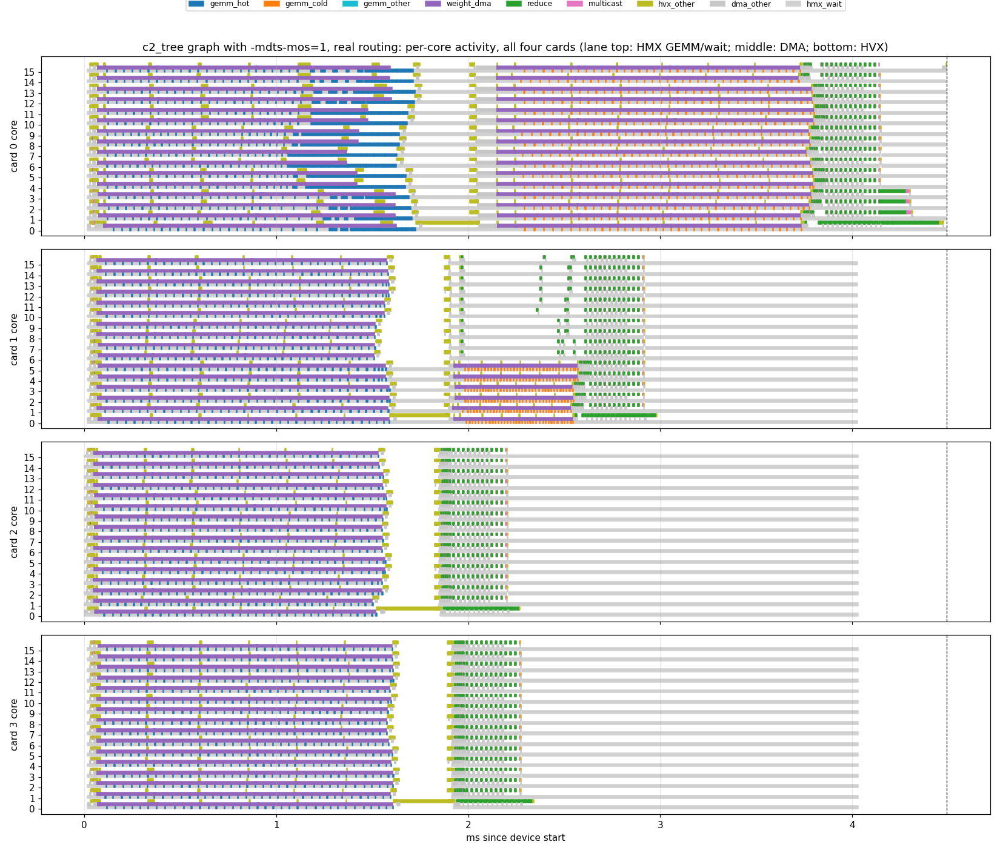

### 3.2 Original graph (`cold_capacity_control/c2`) with the flag: 6.7 ms device

Same stages, plus the items the `c2_tree` rewrites removed: the two routing prefix
sums on core 0 (0.40 ms each, at 0.05–0.45 and 2.33–2.73), and the DDR-backed local
reduction on core 0 (1.72 ms, 4.51–6.43) followed by the final combine to 6.67 ms.
Cards 2 and 3 finish at 4.8–4.9 ms.

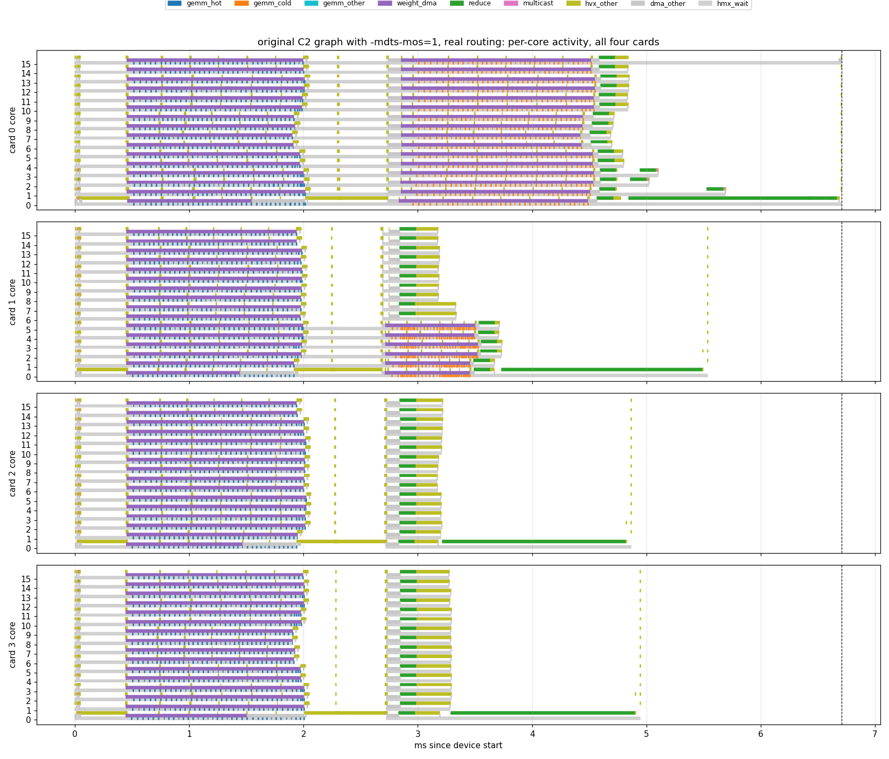

### 3.3 Levers, in order of size

1. **Balance active experts across cards.** Card 0 carries 32 active experts over
   the two stages, cards 2 and 3 carry 16. A balanced 21–22 per card would cut the
   two GEMM stages from 3.2 to about 2.1 ms. E4 already shows the native order doing
   part of this (6.9 vs 7.7 ms). Regrouping should target this balance, not padded
   rows; the runtime expert-ID selection work is the natural vehicle.
2. **Weight bytes.** With the exchange gone, DDR streaming of active experts is the
   floor: 9 MiB per active expert per card at about 90 GB/s. MXFP6 weights would cut
   the bytes 2.7×; prefetching the next stage during the 0.5 ms inter-stage gap would
   hide part of it (the DMA engine is idle from 1.63 to 2.15 ms on card 0).
3. **Inter-stage gap.** The 0.26 ms accumulator zero-splat runs on a single core
   after the hot GEMMs although it depends on nothing; hoisting or pre-zeroing it
   saves about 0.25 ms per stage boundary.
4. **Reduction tail.** 0.69 ms after card 0's last GEMM: the 16 local tiles could
   overlap the cold GEMMs (HVX is idle then), and the final combine uses 4 cores of
   the busiest card; moving it to a lightly loaded card or spreading it over 16
   cores would shorten the tail.

Applying 1, 3 and 4 would put this layer near 2.7 ms for this input, against 4.49 ms
now, 7.27 ms before the flag and 12.4 ms for the original C128 graph. These are
projections from the timeline, not measurements.

## 3.4 How much balancing can give, from the 48-layer routing counts

With the flag there is no cross-card synchronization between the two stages, so a
layer costs about `max over cards (active experts on the card) × 0.1 ms` plus the
fixed part. From the device-captured prompt-41 counts of all 48 layers
(`scripts/balance_placements.py`), the maximum active count on any card is:

| Placement | Mean over 48 layers | Layer 2 per card | Est. GEMM ms per layer |
|---|---:|---|---:|
| Deployed load-sorted hot/cold, contiguous | 28.7 | 32 / 22 / 16 / 16 | 2.87 |
| Native expert order | 22.8 | 23 / 20 / 18 / 25 | 2.28 |
| Hot contiguous, cold dealt round-robin | 20.6 | 22 / 22 / 21 / 21 | 2.06 |
| Snake or LPT on per-expert counts | 20.5 | 21 / 21 / 22 / 22 | 2.05 |
| Lower bound `ceil(active/4)` | 20.5 | 22 | 2.05 |

The count-based rows are fitted on the same prompt and are therefore optimistic;
the native row and the bound are not fitted. The E4 measurement agrees with the
model: it predicts 0.7 ms between native and sorted on layer 2, and 0.75 ms was
measured. Active experts per layer range from 65 to 109, mean 80.

## 3.5 Placement upper bound for this prompt (E5)

To measure how much balancing can give, the expert order was optimized directly on
prompt 41: LPT on the per-expert token counts of layer 2 (`scripts/make_perm_graph.py`,
`placement/order_balanced.json`), 32 experts per card, the two lightest cards mapped
to cards 0 and 1, active experts alternated between a card's two stages, capacity
128/128. Active experts per card become 21/21/22/22, against 32/22/16/16 for the
deployed sorted layout and 23/20/18/25 for the native order. Same weights, same
routing, permuted consistently; counts are exact and outputs differ from the sorted
reference only by summation order (relative L2 1.2e-5).

Host medians, 3 alternating rounds × 100 iterations, all with the flag:

| Graph | Sorted hot/cold | Native order | Balanced (prompt-optimal) |
|---|---:|---:|---:|
| `c2_tree`, instrumented | 5.358 | 4.529 | 4.358 |
| `c2_tree`, uninstrumented | 4.833 | – | 3.793 |
| original C2, instrumented | 7.661 | 6.856 | 6.794 |

Uninstrumented, the balanced placement is 1.27× faster than the sorted layout with
the flag (3.79 vs 4.83 ms), about 1.9× faster than `c2_tree` with the default compile
(7.27 ms) and about 3.3× faster than the original C128 graph (12.4 ms).

The balanced build's device time is 3.42 ms (sorted: 4.49). All four cards now
finish within 0.5 ms of each other (2.93, 3.04, 3.05, 3.42 ms). Card 0's timeline:
hot stage 0.07–1.14 ms on 11 cores, gap 0.34 ms with the single-core zero-splat,
cold stage 1.48–2.53 ms on 10 cores, reduction tiles to 2.98 ms, final 4-core
combine to 3.38 ms. With the loads level, the tail after the last GEMM (0.85 ms,
25% of the layer) and the inter-stage gap are the next targets; per active expert
the stages still cost about 0.1 ms per card.

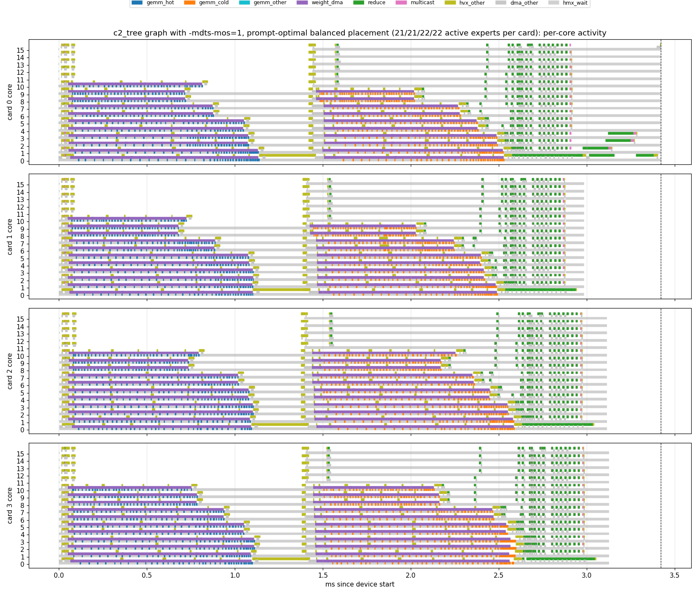

This is an upper bound for placement alone: the order is fitted to the very input it
is measured on, and the gain over the unfitted native order is only 0.17 ms on
`c2_tree`, so a calibrated static layout would land between the two.

## 3.6 Larger prefill chunks (E6)

Bytes per token should fall with the chunk length T because the active-expert set grows
sublinearly. Variants of the `c2_tree` graph were built for T = 128, 256 and 512
(`scripts/make_chunk.py`: tree scans and reduction tiles regenerated for T, capacity T for
both stages, LPT placement fitted to each variant's counts). Routing is synthesized to
realize prescribed per-expert counts; the T=128 synthetic control reproduces the real
input's timing (3.92 vs 3.93 ms), so timing depends on counts, not on values. "Same set"
keeps the 86 experts of prompt 41 with counts scaled by T/128; "grown" adds inactive
experts with small counts to reach 98 (T=256) and 110 (T=512) active experts, in line
with the routing study's coverage growth. Uninstrumented host medians, flag builds,
3 alternating rounds × 100 iterations:

| Variant | Active experts | Weight MiB per token | Chunk, ms | µs per token | vs T=128 |
|---|---:|---:|---:|---:|---:|
| T=128, real routing | 86 | 6.05 | 3.93 | 30.7 | – |
| T=128, synthetic control | 86 | 6.05 | 3.92 | 30.7 | 0% |
| T=256, same set | 86 | 3.02 | 6.68 | 26.1 | −15% |
| T=256, grown | 98 | 3.45 | 7.07 | 27.6 | −10% |
| T=512, same set | 86 | 1.51 | 11.66 | 22.8 | −26% |
| T=512, grown | 110 | 1.93 | 12.45 | 24.3 | −21% |

Weight bytes per token halve and quarter, but time per token falls only 10–26%. The
instrumented T=256 grown profile (`chunk_size/T256_grow_profile/`, device 6.15 ms,
cards end 4.3 / 4.6 / 4.8 / 6.1 ms) shows why:

- **The GEMM stages grow.** Hot 1.07 → 1.46 ms and cold 1.05 → 1.74 ms although the
  weight bytes per card barely change. Recorded HMX busy per core rises from about
  55 µs to 0.77–1.0 ms per stage: with capacity T every active expert computes T rows,
  so padded GEMM work, negligible at T=128, is a co-bottleneck at T=256. Capacity
  tuning, irrelevant at T=128, matters again for larger chunks.
- **The dense accumulator path scales with T.** The single-core zero-splat doubles to
  0.52 ms, the accumulator gathers and scatters double, the 16 reduction tiles take
  46 µs each instead of 23.
- **The final combine spills.** At T=128 the four-core combine is a 243 µs TCM
  reduction; at T=256 the compiler adds an 836 µs DDR-backed reduction on one core, and
  the combine window grows from 0.24 to 1.28 ms, all on card 0 after the other cards
  have finished.

Larger chunks therefore only pay off together with the accumulator redesign: a
token-centric combine, a distributed final combine, and per-group capacities. If the
combine tail returned to its T=128 cost, the T=256 layer would be near 4.9 ms, or
19 µs per token.

## 3.7 Capacity at larger chunks (E7)

E1 and E2 showed that with the flag the capacity no longer changes latency at T=128,
because every padded GEMM hides under the weight stream. Section 3.6 predicted this
would stop holding at T ≥ 256: the down projection runs compute-bound after its
prefetched weights land, and the token gathers and expert-output scatters grow with
the capacity. E7 measures it. `scripts/make_cap.py` builds the `c2_tree` flag graph
for T = 256 and 512 with the E6 "grown" counts (98 and 110 active experts), separate
capacities for the two stages and one of two placements:

- **lpt**: the E6 placement (LPT over active experts, alternating a card's two stages,
  capacity T in both stages);
- **hc**: stage 0 holds the 64 experts with the largest counts, spread round-robin
  over the cards (16 active per card); stage 1 holds the rest, its active experts
  spread round-robin starting at card 3, inactive experts filling the gaps. Per-card
  totals are the same as LPT (24/24/25/25 and 27/27/28/28), so the two baselines
  differ only in grouping. Capacities per stage: T, 32, or the oracle value, the
  largest count in the group (158/4 at T=256, 296/8 at T=512). No tokens are dropped
  by construction.

Uninstrumented builds, `moe_single_host`, 3 alternating rounds × 100 iterations, all
14 QPCs in one session, cards idle-checked before each round. Every `hc` variant
reproduces the `hc` T/T output bit for bit; `hc` and `lpt` differ by at most
4.9e-4 (summation order). Full table with rounds: `chunk_size/capacity/summary.md`.

| T | Placement | Capacity hot/cold | Padded rows / real | Chunk, ms | µs per token | vs hc T/T | vs LPT T/T |
|---:|---|---:|---:|---:|---:|---:|---:|
| 256 | lpt | 256/256 | 12.3× | 7.031 | 27.5 | 1.030 | 1.000 |
| 256 | hc | 256/256 | 12.3× | 6.826 | 26.7 | 1.000 | 0.971 |
| 256 | hc | 256/32 | 8.5× | 6.773 | 26.5 | 0.992 | 0.963 |
| 256 | hc | 256/4 | 8.1× | 6.652 | 26.0 | 0.974 | 0.946 |
| 256 | hc | 158/256 | 9.2× | 6.783 | 26.5 | 0.994 | 0.965 |
| 256 | hc | 158/32 | 5.5× | 6.537 | 25.5 | 0.958 | 0.930 |
| 256 | hc | **158/4** | 5.0× | **6.485** | **25.3** | **0.950** | **0.922** |
| 512 | lpt | 512/512 | 13.8× | 12.496 | 24.4 | 1.011 | 1.000 |
| 512 | hc | 512/512 | 13.8× | 12.355 | 24.1 | 1.000 | 0.989 |
| 512 | hc | 512/32 | 8.4× | 12.067 | 23.6 | 0.977 | 0.966 |
| 512 | hc | 512/8 | 8.1× | 12.006 | 23.4 | 0.972 | 0.961 |
| 512 | hc | 296/512 | 10.4× | 12.143 | 23.7 | 0.983 | 0.972 |
| 512 | hc | **296/32** | 5.0× | **11.227** | **21.9** | **0.909** | **0.898** |
| 512 | hc | 296/8 | 4.7× | 11.292 | 22.1 | 0.914 | 0.904 |

**Capacity is worth 5% at T=256 and 9% at T=512**, 8% and 10% against the E6
baselines once the grouping change is included; per token the layer goes from
30.7 µs (T=128) to 25.3 (T=256) and 21.9 (T=512). The reductions are free: bit-exact
outputs, no change to the graph beyond four constants and the lane order.

- **Grouping alone helps a little now** (3% at T=256, 1% at T=512). With 16
  active experts per card the hot stage runs at the weight-stream bound (93–101 µs
  per expert), and the cold stage with 8–9 experts per card finishes sooner. E4's
  counter-result at T=128 came from card concentration, not from grouping.
- **The two reductions interact.** At T=512 the cold-only builds save 0.29–0.35 ms
  and the hot-only build 0.21 ms, but both together save 1.06–1.13 ms; at T=256 the
  singles save 0.04–0.17 ms and the pair 0.29–0.34 ms. Rounds agree within 0.1 ms,
  so this is not noise; the compiler's schedule and buffer placement change with
  each pair of capacity constants (the same hot capacity of 296 gives a hot stage of
  1.7–1.85 ms in the 296/512 build and 2.0–2.5 ms in the 296/8 build).
- **The instrumented profiles exaggerate the effect** (T=512 device time 11.98 →
  9.96 ms for 512/512 → 296/8, against 1.1 ms in host timing) and show the single
  reductions as sub-additive, so they are used below only to attribute where stage
  time goes, not to size the saving.

Where the time went, instrumented (`chunk_size/capacity/*_profile/`, figures
`*_cores.png`):

| Profile | Device, ms | Cards 1–3 end, ms | Card 0 tail after its cold stage, ms | Hot stage, µs per expert | Cold stage, µs per expert | Gathers + scatters, MiB |
|---|---:|---:|---:|---:|---:|---:|
| T=256 lpt 256/256 (E6) | 6.15 | 4.3 / 4.6 / 4.8 | 2.1 | 97–122 | 117–145 | 194 + 128 |
| T=256 hc 158/4 | 5.50 | 4.0 / 4.0 / 4.0 | 2.2 | 93–101 | 100–113 | 74 + 40 |
| T=512 hc 512/512 | 11.98 | 8.2 / 7.8 / 8.6 | 4.8 | 141–185 | 167–188 | 404 + 256 |
| T=512 hc 296/8 | 9.96 | 6.7 / 7.0 / 7.2 | 4.2 | 125–157 | 113–123 | 169 + 76 |

- At T=256 the oracle capacities bring both stages back to the weight-stream bound
  (about 95 µs per active expert for 9 MiB at 95 GB/s), the cold GEMMs shrink to
  4 µs per core, and cards 1–3 finish together at 4.0 ms. Card 0 still ends 1.5 ms
  later: 16 reduction tiles reading 64 MiB, a 0.29 ms TCM combine and the 0.83 ms
  DDR-backed combine. **That tail is now 40% of the device time.**
- At T=512 the hot stage stays 0.2–1.0 ms above the 1.5 ms weight-stream bound in
  every build, and the per-core GEMM events (which include stalls) run 0.9–2.7 ms
  per stage: with 16 active experts per card, each processing 296 or more rows,
  hot-stage compute is exposed. The T-scaled path is larger still: 1.3 ms of
  reduction tiles on every card after the cold stage, then on card 0 alone a 0.57 ms
  TCM combine, a 1.70 ms DDR-backed combine and the output copies, about 3 ms in
  the uninstrumented layer, or 27% of it.

So the earlier optimizations return in a new role at T ≥ 256: the hot/cold grouping
is what makes a small cold capacity legal, and the per-stage capacity removes the
part of the stage time that scaled with padded rows. They should stay in the design
for larger chunks, but they cannot deliver the chunk-size gain on their own: with the
card-0 combine tail back at its T=128 cost (0.7 ms), the T=512 layer would be near
7.5 ms, or 14.6 µs per token, against 21.9 now. For the hot stage at T=512 a finer
split (four groups of 32 lanes with per-group oracle capacities 296/44/8/4) would
cut the padded rows a further 1.7×, from 4.7× to 2.7× the real rows.

## 3.8 MXFP6 weights: the replay series in the production precision (E8)

Every replay result above is FP16. The production model compiles its expert weights
to MXFP6 (`-mxfp6-matmul`: constant MatMul weights are stored as MXFP6 E2M3 and
dequantized on the HVX at run time, 2.55× smaller QPCs). E8 recompiles the graphs of
E1–E7 in MXFP6, always with `-mdts-mos=1`, and times them against FP16 anchors of the
same graphs in the same session: same inputs, same host binaries, uninstrumented
builds, 3 alternating rounds × 100 iterations (the all-active block uses the
multi-input host, 2 outer passes × 3 rounds). Raw samples and specs are in `mxfp6/`.

**Correctness.** MXFP6 outputs behave like FP16 under graph changes: bit-exact across
capacities, relative L2 of about 1e-5 across placements (summation order), routing
counts exact everywhere. Against the FP16 output of the same graph the MXFP6 result
differs by a relative L2 of 1.13e-2 on the real prompt-41 routing, for every
real-routing graph. On the synthetic-routing inputs of E6/E7 the figure is 3.7e-2 to
9.9e-2, because those outputs have half the norm (eight equal 1/8 weights on arbitrary
experts) with the same absolute error per token; it says nothing about model quality,
for which the repo's full-model number (18.8% at the logits after 48 layers) stands.

**T=128, sorted layout, original graph family (E1/E2 mirror):**

| Graph, hot/cold capacity | FP16 flag, ms | MXFP6 flag, ms | MXFP6 no flag, ms |
|---|---:|---:|---:|
| `cold_capacity_control/c128`, 128/128 | 7.284 | 5.460 | 10.845 |
| c64, 128/64 | – | 5.531 | – |
| c32, 128/32 | – | 5.540 | – |
| c16, 128/16 | – | 5.361 | – |
| c8, 128/8 | – | 5.465 | – |
| c4, 128/4 | – | 5.338 | – |
| c2, 128/2 | 7.266 | 5.348 | 8.563 |
| hot 96 / cold 2 | – | 5.342 | – |
| hot 92 / cold 2 | – | 5.313 | – |
| E4 native order, 128/128 | – | 5.129 | – |
| E4 native order, 92/34 | – | 5.053 | – |

**T=128, placement, `c2_tree` family, real routing (E4/E5 mirror):**

| Layout | FP16 flag, ms | MXFP6 flag, ms | MXFP6 / FP16 | µs per token, MXFP6 |
|---|---:|---:|---:|---:|
| Sorted 128/2 (current best before E5) | 4.953 | 3.276 (5.644 without the flag) | 0.66 | 25.6 |
| Native order 128/128 | 4.212 | 2.777 | 0.66 | 21.7 |
| Balanced LPT 128/128 (E5) | 3.946 | 2.825 | 0.72 | 22.1 |

**All-experts-active plans (E3 mirror):** all eleven plans run at 2.94–3.08 ms in
MXFP6 against 4.84–5.04 ms in FP16 (0.60–0.62×), and the frozen policies again sit
within 0.05 ms of each other: one static plan 2.967, capacity oracle 2.991, placement
oracle 2.991, joint oracle 3.015, no regrouping 2.989, best plan per workload 2.964 ms
(FP16: 4.885–4.956). Per-plan table in `mxfp6/summary.md`.

**Chunk size × capacity, hot/cold placement, grown counts (E6/E7 mirror):**

| T | Capacity hot/cold | FP16, ms | MXFP6, ms | MXFP6 / FP16 | µs per token, MXFP6 | MXFP6 vs its T/T |
|---:|---:|---:|---:|---:|---:|---:|
| 128 | 128/128 | 3.928 | 2.848 | 0.725 | 22.2 | 1.000 |
| 128 | 92/2 (oracle) | 3.896 | 2.596 | 0.666 | 20.3 | 0.912 |
| 256 | 256/256 | 6.767 | 5.914 | 0.874 | 23.1 | 1.000 |
| 256 | 256/4 | – | 5.574 | – | 21.8 | 0.943 |
| 256 | 158/256 | – | 5.650 | – | 22.1 | 0.955 |
| 256 | 158/32 | – | 5.227 | – | 20.4 | 0.884 |
| 256 | 158/4 (oracle) | 6.509 | 5.197 | 0.798 | 20.3 | 0.879 |
| 512 | 512/512 | 12.312 | 11.347 | 0.922 | 22.2 | 1.000 |
| 512 | 512/8 | – | 10.558 | – | 20.6 | 0.930 |
| 512 | 296/512 | – | 10.729 | – | 21.0 | 0.946 |
| 512 | 296/32 | 11.285 | 9.924 | 0.879 | 19.4 | 0.875 |
| 512 | 296/8 (oracle) | – | 10.031 | – | 19.6 | 0.884 |

LPT placement in MXFP6: 2.871 / 5.729 / 11.571 ms at T = 128 / 256 / 512 with
capacity T, against 2.848 / 5.914 / 11.347 for hot/cold, so grouping itself is worth
nothing once the bytes shrink.

What changes with the production precision:

- **MXFP6 is worth 26–40% at T=128** depending on the graph, but only 13–20% at
  T=256 and 8–12% at T=512. The weight bytes fall 2.6× (774 → 302 MiB per layer at
  T=128 in the profile), the time does not follow, because everything that is not
  the weight stream stays.
- **The flag stays essential.** Without `-mdts-mos=1` the MXFP6 graphs are 1.14–1.99×
  slower; the exchange is a fixed 121 MiB of P2P whatever the weight format.
- **The chunk-size gain is gone.** Per token the layer costs 20.3 µs at T=128, 20.3
  at T=256 and 19.4 at T=512 with oracle capacities. In FP16 it fell 30.7 → 25.3 →
  21.9. The MXFP6 advantage shrinks with T (0.67 → 0.80 → 0.88×) because the
  token-scaled work that FP16 hid under the weight stream is exposed at every T.
- **Capacity matters more, from T=128 on.** Flat in FP16 at T=128, the oracle
  capacities save 9% on the balanced layout in MXFP6 (2.85 → 2.60 ms), and 12% at
  T=256 and T=512; hot and cold reductions are now roughly additive. On the sorted
  layout the sweep stays nearly flat (5.46 → 5.35), because there the cold stage still
  streams 16 experts per card on cards 0 and 1: capacity shows as soon as a stage's
  weight stream is shorter than its padded compute, which the balanced layout's 5–6
  cold experts per card is. With all 128 experts active and capacities 8–32 (E3) the
  plans are still indistinguishable.
- **Balance stops paying at T=128.** Native order and balanced placement tie
  (2.78 vs 2.83 ms); sorted → balanced is still 14% (3.28 → 2.83).

Where the time goes, instrumented MXFP6 profiles (`mxfp6/*_mxfp6_profile/`, figures
`mxfp6/*_cores.png`), against the FP16 profiles of the same graphs:

| Profile | Device, ms FP16 → MXFP6 | Weights DDR, MiB | Hot stage, µs per expert (floor 37) | Cold stage, µs per expert | Inter-stage gap + card-0 tail, ms | Share of device time |
|---|---:|---:|---:|---:|---:|---:|
| T=128 balanced, real routing | 3.43 → 2.34 | 774 → 302 | 95 → 39–48 | 100–103 → 52–57 | 0.36 + 0.83 | 51% |
| T=256 hot/cold 158/4 | 5.50 → 4.35 | 882 → 345 | 93–101 → 47–68 | 100–113 → 44–55 | 0.74 + 2.04 | 64% |
| T=512 hot/cold 296/8 | 9.96 → 8.62 | 990 → 387 | 100–157 → 100–111 | 113–123 → 57–65 | 1.34 + 4.5 | 68% |

- At T=128 the hot stage reaches the MXFP6 weight floor on cards 1–3 (39–42 µs per
  expert for 3.4 MiB). The dequantize kernels (`blockdequantize_mxfp6`, HVX) take
  about 0.27 ms per core per stage and hide under the DMA, since the HVX is otherwise
  idle during the expert stages. The accumulator traffic (gathers 85, scatters 64,
  splat 32, tiles 32 MiB) is unchanged and is now 41% of the DDR bytes; the splat gap
  and the card-0 tail (tiles, TCM combine) are unchanged at 1.2 ms and are half the
  layer.
- At T=256 the hot stage sits above the floor (47–68 µs per expert): dequantize up to
  0.5 ms per core per stage and the 158-row GEMMs are no longer covered by a 0.57 ms
  weight stream. Gap and tail are unchanged at 2.8 ms, two thirds of the layer.
- At T=512 the hot stage is GEMM-bound: 1.4–1.6 ms of HMX time per core for 16
  experts of 296 rows, the same as in FP16, against a 0.6 ms weight stream. Weight
  stages take 2.5 of the 8.6 ms; the splat gap (1.3 ms), reduction tiles (1.8 ms) and
  final combine (2.7 ms) take 5.8.

Against the MXFP6 weight floor (busiest card × 3.4 MiB at 95 GB/s: 0.82 / 0.93 /
1.04 ms) the measured layer is 3.2× / 5.6× / 9.5× longer at T = 128 / 256 / 512. In
the production precision the layer is therefore not weight-bound at any chunk size,
and the levers reorder: the token-scaled accumulator path first (tiled final combine,
then the token-centric combine), then the padded GEMM compute at T ≥ 256 (finer
groups or exact per-expert shapes; the 296-row hot stage at T=512 costs three times
its weight stream), then capacity and grouping as measured here (9–12%), and balance
last. Larger prefill chunks pay nothing in MXFP6 until the first two are done.

## 3.9 Full 48-layer prefill with the flag (E9)

The replay results were finally checked on the whole model: Qwen3-30B-A3B, 48
layers, four cards, the same GSM8K prompt 41 (128 tokens, context 256), MXFP6
weights, uninstrumented compiles, `tools/moe_qwen3_baseline.py` with 3 rounds × 20
invocations against the saved FP32 reference. The shared QEfficient export is gone,
so the graphs were rebuilt: the 341 non-expert tensors (2.9 GB) were regenerated from
the HF checkpoint with the QEfficient conventions (transposed MatMul weights, rotary
caches in fp32 rounded to fp16, `scripts/rebuild_full_graph.py`), and the expert
banks were restored to native order by inverting the sorted128 plan on the workspace
copy (`scripts/build_native_banks.py`, checked bit for bit against the E4 native
banks of layer 2). The rebuilt native C128 program reproduces the historical MXFP6
run **bit for bit** at the logits and its latency (497.1 vs 496.5 ms). The two
surviving earlier QPCs were re-run in the same session as anchors: native FP16
573.2 ms (5.03% error, historical 572.3) and minimum-capacity MXFP6 425.4 ms
(historical 425.5).

**Retained-state KV and the flag do not combine.** With `-mdts-mos=1` (and `=2`) the
compiler no longer pairs the 96 KV-cache inputs with their `_RetainedState` outputs:
the QPC exposes 192 KV buffers as ordinary fp16 IO instead of 4 bindings. The
measurement therefore uses prefill-only graphs (`scripts/kvfree_graph.py`: KV inputs
replaced by fp16 zero initializers, retained outputs dropped), which are numerically
identical (bit-exact logits) but cost about 50 ms more than the retained-state
program even without the flag, so the flag is read within the KV-free pair. Making
the flag coexist with retained state looked like a compiler question for the deployed
model; 3.15 resolves it at the graph level (head-parallel attention).

| Program (MXFP6, T=128, 4 cards) | KV cache | Flag | Host median, ms | Rounds, ms | Logits rel. L2 vs FP32 | Next token |
|---|---|---|---:|---|---:|---|
| Native C128, rebuilt (production baseline) | retained | no | 497.1 | 497.4 / 497.2 / 496.4 | 0.1884 | ' jav' ✓ |
| Native C128, prefill-only | zeros | no | 546.7 | 546.5 / 546.9 / 547.0 | 0.1884 (bit-exact) | ✓ |
| **Native C128, prefill-only** | zeros | **yes** | **352.0** | 352.1 / 352.0 / 352.0 | 0.1884 (bit-exact) | ✓ |
| Static oracle: minimum capacities, sorted regrouping | zeros | yes | 366.5 | 366.4 / 366.5 / 366.4 | 0.1720 | ✓ |
| Static oracle: power-of-two capacities, sorted regrouping | zeros | yes | 375.4 | 375.7 / 375.4 / 375.2 | 0.1720 | ✓ |
| Minimum capacities, earlier QPC (anchor) | retained | no | 425.4 | 425.4 / 425.5 / 425.4 | 0.1720 | ✓ |
| Native C128 FP16, earlier QPC (anchor) | retained | no | 573.2 | 573.2 / 573.1 / 573.4 | 0.0503 | ✓ |

- **The flag alone is worth 1.55× on the whole prefill** (546.7 → 352.0 ms on the
  same graph, 2.75 ms per token), 29% below the retained-state production baseline
  even with the prefill-only penalty included, and it changes no logit. Per MoE
  layer that is about 4 ms, in line with the layer-2 replay of the original graph in
  MXFP6 (10.85 → 5.46 ms).
- **The static oracle regrouping is now counterproductive**: 366.5 and 375.4 ms
  against 352.0 for the native order. Before the flag it was the repo's headline
  (496 → 425 ms, 14%); with the flag the sorted layout's card concentration (27.7
  active experts on the busiest card per layer against 22.9 native, from the saved
  routing counts) costs more than the smaller capacities save, exactly as E4 and E8
  found on layer 2. Power-of-two capacities are slower than minimum ones, the
  reverse of the pre-flag order, because in MXFP6 the padded rows are exposed.
- **Balance has little left on the full model.** Over the 48 layers the LPT bound
  is 20.5 active experts on the busiest card against 22.9 for the native order
  (mean 80.6 active experts per layer), and E8 showed native and balanced tying at
  T=128 in MXFP6.

What the layer-2 stack would add: the current-best replay graph (`c2_tree`, tiled
reduction, tree scans, hot/cold oracle capacities on a balanced layout) runs the
MXFP6 layer in 2.6 ms against 5.5 ms for the original graph with the flag, so
porting those rewrites to all 48 layers would take the prefill from 352 to roughly
210 ms before the combine redesign; with the combine tail removed as well the
replay points to about 150 ms, or 3.3× the production baseline. The routing counts
of this run (`full_model/run_kvfree_native_flag/counts_i32.bin`) are the input for
that per-layer build.

Artifacts: `full_model/` holds the rebuilt graph directories (`native_c128`,
`min_caps`, `pow2_caps` and their `_kvfree` variants), the shared non-expert weight
files, the native-order bank file (54 GB), the compile logs, and one `run_*`
directory per row with `result.json`, timing samples and routing counts. QPCs were
deleted after the runs (10 minutes each to recompile).

## 3.10 The layer-2 stack on all 48 layers (E10)

`scripts/build_full_stack.py` applies the replay rewrites to every layer of the
prefill-only native graph: zero-read removal (`CtxGather3D_2` + `Add`), the 16-token
tiled local reduction (`Einsum_3`), Hillis-Steele tree scans for both routing prefix
sums (CPU-checked), and optionally the hot/cold regrouping of E7/E8 (stage 0 = the 64
largest-count experts round-robin over cards, active cold experts round-robin from
card 3; routing `Gather` before the `Transpose`, banks materialized per layer) with
per-stage oracle capacities. Same protocol as E9: MXFP6, `-mdts-mos=1`, KV-free
graphs, 3 rounds × 20 invocations, one session, anchor recompiled and re-run.

| Program (MXFP6, T=128, 4 cards, flag, prefill-only) | Host median, ms | Rounds, ms | Logits rel. L2 | Dropped assignments |
|---|---:|---|---:|---:|
| Native C128 (anchor; E9 352.0) | 352.5 | 352.7 / 352.6 / 352.1 | 0.1884, bit-exact historical | 0 |
| **Native order + rewrites, capacity 128/128** | **242.8** | 242.8 / 243.0 / 243.0 | **0.1884, bit-exact historical** | 0 |
| Hot/cold regrouping + rewrites, 128/128 | 251.6 | 251.9 / 251.3 / 251.8 | 0.1745 | 0 |
| Hot/cold + oracle capacities from the native run's counts | 253.1 | 253.3 / 252.8 / 253.6 | 0.1666 | 32 |
| Hot/cold + oracle capacities recalibrated on its own routing | 249.5 | 249.6 / 249.3 / 249.6 | 0.1745 | 0 |

- **The rewrites are worth another 31%** on top of the flag (352.5 → 242.8 ms) and
  change no logit. Against the production baseline (497.1 ms, retained state, no
  flag) the model now prefills 2.05× faster, 2.25× on the same prefill-only graph
  (546.7 → 242.8), at 1.90 ms per token. Subtracting the ~50 ms prefill-only penalty
  measured in E9 puts a retained-state version of this program near 190 ms, or 2.6×.
- **Grouping and capacity buy nothing at model scale in MXFP6.** Regrouping costs
  3.6% (242.8 → 251.6 ms) although it lowers the busiest card from 22.9 to the LPT
  bound of 20.5 active experts per layer, and the oracle capacities recover only
  0.8% (251.6 → 249.5) despite cutting padded rows from 12.3× to 5.9× the real rows.
  This matches E8 (native ≈ balanced at T=128) and E9 (static oracles slower than
  native with the flag): once the weight stream is short, the remaining time is the
  token-scaled accumulator path, which neither lever touches.
- **Routing is not invariant to the regrouping.** Reordering experts changes the fp16
  summation order of the two stages; from layer 3 on this flips top-8 decisions for a
  few tokens per layer (up to 23 of 1024 assignments in deep layers), so the
  regrouped programs are not bit-exact with the native one (relative L2 against FP32
  0.1745 vs 0.1884, same next token). Capacities derived from the native run were
  therefore exceeded in 18 layers and 32 assignments were silently truncated; the
  recalibrated build, whose capacities come from a run of the same layout, truncates
  none and reproduces that run's routing exactly. Any static or runtime capacity
  policy needs its counts taken under the numerics it will run with, and an overflow
  check after the fact.

Where this leaves the full model: 243 ms is the rewrites plus the flag; the
remaining structural items are the ones the MXFP6 profiles of E8 identified, the
splat gap, the reduction tiles and the DDR-backed final combine on card 0, which do
not change with grouping or capacity and are the target of the combine redesign.

Artifacts: `full_model/stack_*` graph directories with `plan.json` (per-layer order,
capacities, active experts per card), `full_model/run_stack_*` results and routing
counts, compile logs; `scripts/build_full_stack.py`, `scripts/run_e10.sh`,
`scripts/run_e10b.sh`.

## 3.11 Combine redesign: tiled final combine and token-centric combine (E11)

The dense combine path, half to two thirds of the MXFP6 layer (3.8, 3.10), was
rebuilt on the layer-2 replay (`scripts/make_tokencombine.py`, applied to the E7/E8
hot/cold oracle graphs at T = 128, 256, 512; MXFP6, `-mdts-mos=1`, uninstrumented,
3 alternating rounds × 100 iterations, anchors recompiled in the same session):

- **Tiled final combine.** The cross-card sum over the [4, T, 2048] partials, one
  Einsum that the compiler ran on four cores of card 0 and spilled to DDR at T ≥ 256,
  becomes 16 token tiles, one per core.
- **Token-centric combine.** The [64 lanes, T, 2048] accumulator disappears: no zero
  splat, no scatters, no read-modify-write between stages, no reduction tiles. The
  routing path already computes, for every (lane, token), the slot of that token in
  the lane's compact expert output (`Where_1`/`Where_5`, sentinel INT32_MAX when not
  routed). Per token tile of T/16 tokens, each stage's weighted expert outputs are
  gathered by that slot with the existing `CtxGather3D` on the 64-lane axis, masked by
  the routing mask, the two stages are added per lane, the 16 lanes of each card are
  reduced, then the four cards. Association order is the one the dense path used, and
  the 64-lane axis stays the partition axis the compiler already splits over cards.
  Two dead ends on the way: the device gather does not zero-fill out-of-range indices
  (the CPU reference does), so a safe index and an explicit mask are required; and
  expressing the per-card work as explicit lane slices made the compiler distribute
  the tiles across cards and ship the expert outputs around (P2P 3 → 78 MiB, device
  time 4.3 → 8.6 ms), which the lane-axis formulation avoids.

| T | Anchor (hot/cold oracle), ms | Tiled final combine, ms | Token-centric, ms | Output vs anchor | µs per token, token-centric |
|---:|---:|---:|---:|---|---:|
| 128 | 2.641 | 2.601 (−1.5%) | **2.384 (−9.7%)** | bit-exact, both | 18.6 |
| 256 | 5.249 | 4.350 (−17%) | **3.809 (−27%)** | bit-exact, both | 14.9 |
| 512 | 9.931 | 8.482 (−15%) | **6.836 (−31%)** | bit-exact, both | 13.4 |

Per token the layer now falls with the chunk again, 18.6 → 14.9 → 13.4 µs, where E8
had it flat at 20 µs. Instrumented profiles (`combine/*_mxfp6_profile/`, figures
`combine/*_cores.png`), against the E8 anchors:

| T=256, MXFP6 | Anchor 158/4 | Token-centric |
|---|---:|---:|
| Device time, ms | 4.35 | 2.92 |
| Cards 1–3 end / card 0 end, ms | 2.75–2.93 / 4.35 | 2.60 / 2.92 |
| Inter-stage gap on card 0, ms | 0.74 | 0.05 |
| Cold stage, µs per expert | 44–55 | 39–49 (weight floor 37) |
| Accumulator traffic: splat + scatters + tiles, MiB | 64 + 40 + 64 | 0 |
| Combine gathers, MiB | – | 128 |
| Combine work after the cold stage, ms | 2.0 (tiles 0.66, TCM combine 0.29, DDR combine 0.83, copies) | 1.1 (gathers and lane reduce on all cores) + 0.3 (card reduce on card 0) |

At T=128 the device time goes 2.34 → 1.94 ms and the card-0 tail from 0.5 to 0.13 ms.
What remains of the combine is now parallel gather-and-reduce work rather than
serialized traffic, and it has an obvious next cut: the gather reads all 64 lanes for
every token (the safe index points non-routed lanes at row 0), eight times the eight
rows a token needs; a per-token compaction of the (lane, slot) pairs would cut those
128 MiB to 16 and shorten the 1.1 ms accordingly. The expert stages themselves are at
the weight floor at T=128 and above it at T=256 and 512 (hot stage 43–60 µs per
expert with 158 rows), which is the exact-shape work of direction 2.

**On the full model (E12).** The same combine applied to all 48 layers
(`scripts/build_full_stack.py --combine tokencentric`, native order, rewrites,
MXFP6, flag, prefill-only) runs the 128-token prefill in **231.8 ms** against 243.0 ms
for the E10 program recompiled in the same session (rounds 231.8 / 231.6 / 231.8 vs
242.9 / 243.2 / 242.9), logits bit-exact against the historical MXFP6 run. That is
2.14× the production baseline of 497 ms, 2.36× on the same prefill-only graph, and
about 7% of the MoE share, in line with the replay's 10% at T=128; the larger gains
of the combine belong to larger chunks, which the fixed 128-token specialization of
the baseline tool does not exercise.

## 3.12 Profiling round after the combine redesign (E13)

Instrumented MXFP6 profiles of the token-centric replay at T = 128, 256, 512 and of
the exact anchors (hot/cold oracle capacities), analysed per phase and per core
(`scripts/tail_breakdown.py`, `scripts/tile_timeline.py`; CSVs in `combine/`). Card 0
is the critical card; stage rates are µs per active expert against the MXFP6 weight
floor of 37 µs (3.4 MiB at 95 GB/s).

| T | Device, ms (anchor) | µs per token | Prologue | Hot stage, 16 experts per card | Gap | Cold stage | Combine tail, cards 1–3 / card 0 | Card 0 extra |
|---:|---:|---:|---:|---|---:|---|---|---:|
| 128 | 1.94 (2.11) | 15.2 | 0.05–0.23 | 0.62 ms, 38 µs/exp, at the floor | 0.03 | 0.22–0.25 ms, 42–46 µs/exp | 0.59–0.79 / 0.85 ms | 0.2 |
| 256 | 2.92 (4.35) | 11.4 | 0.08 | 0.73–1.01 ms, 46–63 µs/exp | 0.04 | 0.32–0.45 ms, 40–50 µs/exp | 1.15–1.37 / 1.46 ms | 0.33 |
| 512 | 5.43 (8.75) | 10.6 | 0.10 | 1.42–1.93 ms, 89–121 µs/exp | 0.04 | 0.45–0.64 ms, 40–53 µs/exp | 2.35–2.71 / 2.87 ms | 0.7 |

Whole-layer busiest-core time by engine at T=512: GEMM (HMX) 1.65 ms, dequantize
(HVX) 1.56, combine lane reduce (HVX) 1.49, combine card reduce (HVX, card 0) 0.97,
weight DMA 0.92, combine gathers (DMA) 0.44.

What the round says:

- **The combine is now a serialized tile pipeline, not a traffic problem.** Its cost
  is a constant 5.1–5.5 µs per token at every T: the 16 tiles complete one after
  another at 63 / 105 / 190 µs per tile for 1 / 2 / 4 MiB of gathered rows per card
  per tile, about 23 GB/s per card, a quarter of the DDR bandwidth. The tile chain
  is gather (DDR, lane-partitioned over the 16 cores) → mask → add → a card-wide
  lane reduction with cross-core multicast → six P2P transfers → the card reduction
  on four cores of card 0. Because each tile's lane reduction occupies all 16 cores,
  tiles cannot overlap, and card 0 finishes 0.2–0.7 ms after the others.
- **The gathers read four times the rows they need.** With the safe index, every
  card gathers 32 rows per token (16 lanes × 2 stages) of which at most 8 are routed
  there.
- **The expert stages have split.** The cold stage sits at the floor everywhere now
  that the accumulator traffic is gone. The hot stage is at the floor at T=128,
  0.15–0.4 ms above it at T=256, and compute-bound at T=512 (89–121 µs per expert:
  16 experts of 296 rows per card, HMX and dequantize both above 1.5 ms per core).
- **Nothing else is left to take.** Prologue 0.1 ms, inter-stage gap 0.04 ms, cold
  stage at the floor, P2P at 1.5–6 MiB.

Shares of the layer at T=512: hot stage 36% (two thirds of it above the weight
floor), cold 8%, combine 53%, the rest 3%. At T=256: 35 / 11 / 50 / 4%.

The two design candidates and their measured ceilings:

1. **Eight-row combine.** Gather, per card and token, only the up-to-eight (lane, slot)
   pairs of that token that live on the card, built from the router's top-k output
   through the static lane order and the existing slot tensors, as a [4, T, 8] index
   with a sentinel for the other cards. Four times fewer gathered rows, and the
   reduction becomes an 8-row sum per token that a single core can own, which removes
   the card-wide lane reduction that serializes the tiles. Ceiling if the tail falls to
   the per-tile latency of about 0.3 ms: −1.0 ms at T=256 (−35%), −2.2 ms at T=512
   (−40%). Spreading the card reduction over the four cards (reduce-scatter) takes the
   remaining 0.3–0.7 ms of card-0 extra.
2. **Exact-shape expert compute.** Row-chunked GEMMs and split hot experts so the hot
   stage returns toward the weight floor: worth 0.15–0.4 ms at T=256 and about 1.3 ms
   at T=512 (24% of the layer).

With both, the T=512 layer would sit near 1.9 ms, about 3.7 µs per token, against
10.6 now, 17.1 for the anchor and 20 before the combine work.

Per-core figures (`scripts/detail_plot2.py`; colours: blue/orange hot and cold GEMMs,
purple weight DMA, brown dequantize, pink gathers and mask, green lane reduction, red
card reduction; grey splat, light orange scatters and light green tiles are the dense
combine's ops in the anchors). Each pair is the dense-combine anchor above the
token-centric build for the same graph and chunk:

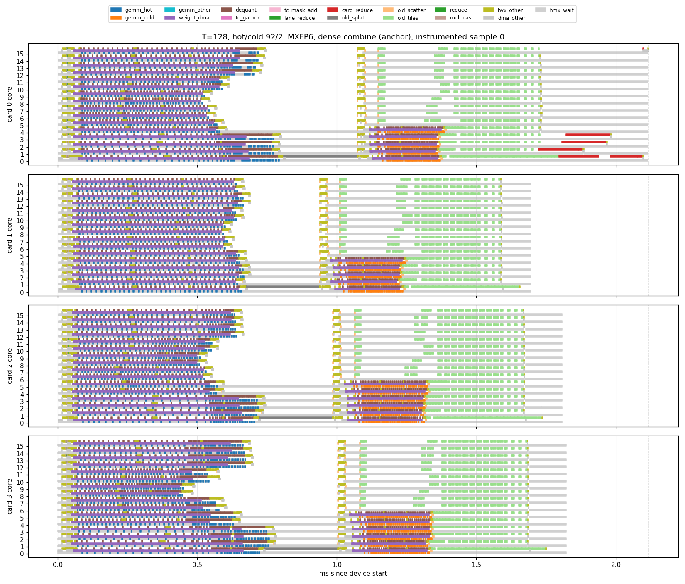
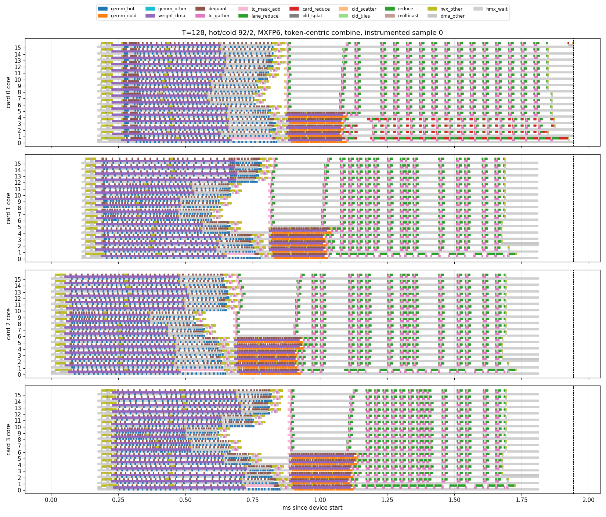
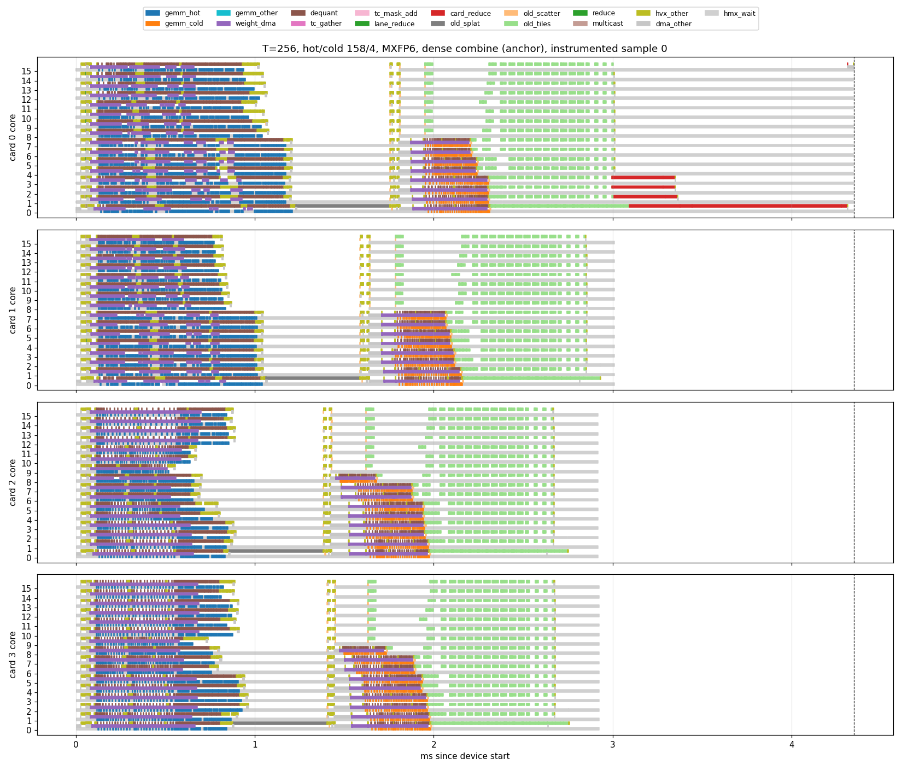
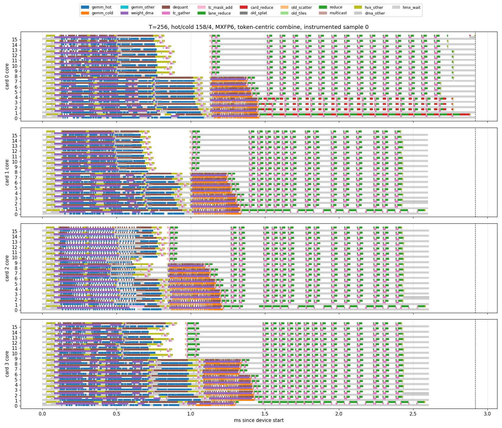
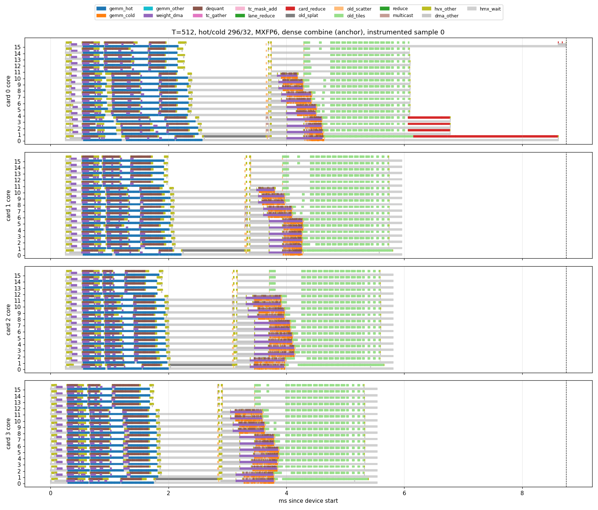
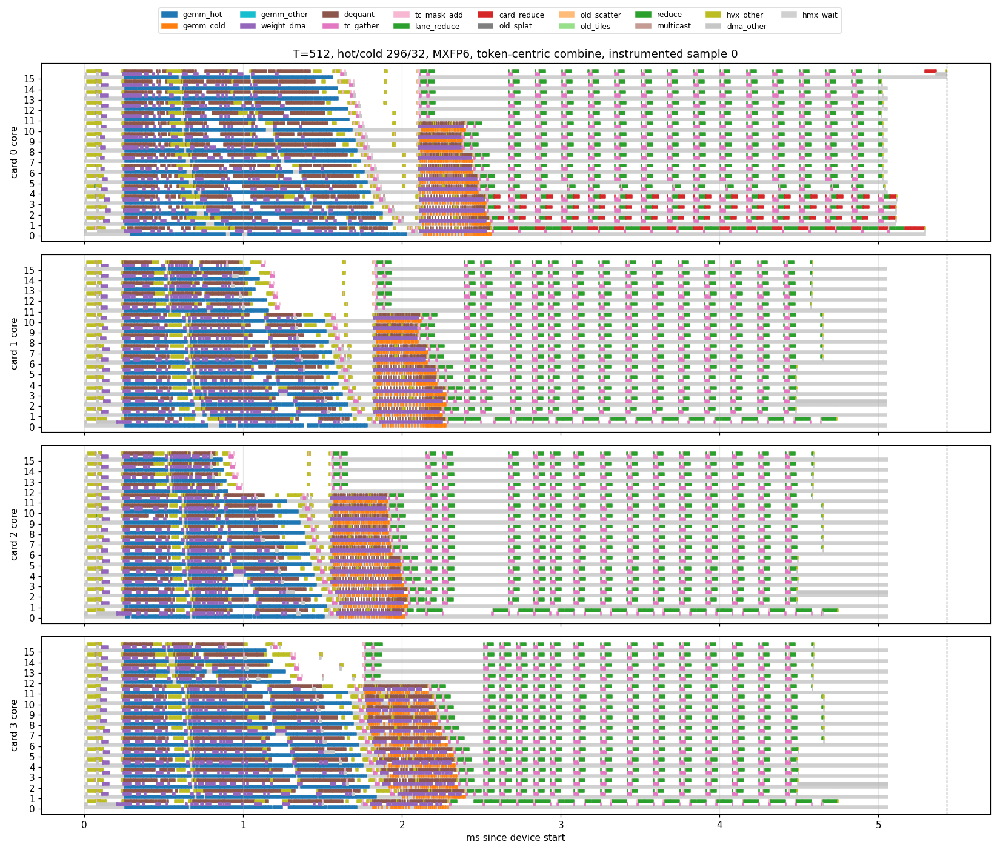

In the anchors the splat and the scatters open a gap between the stages, the tiles
follow the cold stage on all cores, and card 0 alone runs the final combine. In the
token-centric builds the stages are back to back, the gathers start during the hot
stage, and the tail is the sequence of green lane reductions across all 16 cores of
every card followed by the red card reductions on four cores of card 0.

**Against the naive design (E14).** The same session also timed the most naive
configuration, both stages at capacity T, with and without the token-centric combine
(`combine/e14_timing_stats0.json`, 3 alternating rounds × 100, MXFP6, flag, hot/cold
placement; all twelve outputs bit-exact within each T):

| T | Naive T/T, dense combine | Naive T/T, token-centric | Oracle capacities, dense | Oracle capacities, token-centric | Both vs naive | µs per token, naive → both |
|---:|---:|---:|---:|---:|---:|---:|
| 128 | 2.752 | 2.422 (−12%) | 2.588 (−6%) | **2.201** | −20% | 21.5 → 17.2 |
| 256 | 5.813 | 4.112 (−29%) | 5.028 (−14%) | **3.491** | −40% | 22.7 → 13.6 |
| 512 | 11.074 | 8.560 (−23%) | 9.663 (−13%) | **6.451** | −42% | 21.6 → 12.6 |

The combine is the larger lever at every chunk, and capacity is worth more once the
combine is fixed (−9 / −15 / −25% on the token-centric graphs against −6 / −14 / −13%
on the dense ones), most at T=512 where the padded compute is exposed. The profile of
the naive token-centric build at T=256 shows where: its cold stage, 8–9 experts per
card at capacity 256, runs at 85–93 µs per expert against 40–50 with capacity 4, i.e.
the 256-row GEMMs of a short stage stand fully above its weight stream, while the hot
stage is nearly unchanged (46–72 µs per expert). Absolute times in this session are
5–8% below E11's for identical programs (2.201 vs 2.384 ms for the T=128
token-centric build), the largest session-to-session spread seen in this work; within
one session the rounds agree to 0.1 ms, so only same-session ratios are compared.

The full-model profile (item 2 of this round) waits on a compiler fix: with
`-mdts-mos=1` the KV cache could not be retained (3.9, lifted in 3.15), so a traced
full-model program would have carried the prefill-only structure and its 50 ms penalty.

## 3.13 Token-owned combine (E15)

The design that matches the problem of 3.12: ownership by token instead of by lane.
`scripts/make_tokencombine.py ... tokenowned` recovers each token's eight positions
with a `TopK` over the routing columns, maps position → (stage, lane, card, slot) with
integer arithmetic and a `GatherElements` on the existing slot tensors, and builds a
`[4 cards, T·8]` index per stage whose entries are the row of that expert's output in
the card's stage block (reshaped, layout-preserving, to `[4, 16·C, 2048]`) or a masked
zero when the expert lives on another card or in the other stage. One `CtxGather3D`
per stage then fetches at most eight rows per token per card, the two stages are
masked and added, `ReduceSum` over the eight rows gives the card's `[T, 2048]` partial
with no cross-core traffic, and the tiled cross-card combine finishes. Same protocol
as E11 (MXFP6, flag, hot/cold oracle capacities, anchors recompiled in the session):

| T | Anchor, ms | Token-centric (E11 design), ms | Token-owned, ms | vs token-centric | vs anchor | µs per token |
|---:|---:|---:|---:|---:|---:|---:|
| 128 | 2.613 | 2.389 | **2.198** | −8% | −16% | 17.2 |
| 256 | 5.198 | 3.741 | **3.208** | −14% | −38% | 12.5 |
| 512 | 9.949 | 6.817 | **5.717** | −16% | −43% | 11.2 |

Outputs agree with the anchor to a relative L2 of 1–2e-5 (eight rows summed per token
instead of lanes then cards), routing counts exact.

The T=256 profile (`combine/T256_tokenowned_mxfp6_profile/`) shows the compiler did
what the graph asked within a card: every core gathers its own tokens' rows (25 µs
median), masks and adds them (20 µs) and reduces them locally (15 µs, one
`aicbatchedreduceadd` per core, no multicast), so the per-card combine work after the
cold stage fell from 1.2 ms to under 0.1 ms and cards 1–3 finish at 1.69 ms against
2.6 before. Two items remain, both visible in the trace:

- **The cross-card combine is still rooted on card 0**: 0.57 ms on five cores, and it
  now carries 6.9 MiB of P2P instead of 3, because the per-card partials leave the
  `ReduceSum` in fp32. A cast to fp16 before the cross-card step halves the transfer;
  spreading the final reduction over the four cards (reduce-scatter) removes the root.
- **The index build costs 0.25–0.36 ms per core** and is lowered into about 1,200
  tiny kernels per card (copies, multicasts, boolean reductions), scheduled between the
  stages, which widens the inter-stage gap from 0.04 to 0.3–0.5 ms. It depends only
  on the routing, so it can be computed once, with fewer and larger ops, under the hot
  stage.

With those two, the T=256 layer should approach 1.8 ms on device (about 7 µs per
token), leaving the expert stages as the whole of the layer.

## 3.14 Final combine refinements and the profiling round after them (E16)

The three refinements suggested by the E15 profile were built as stackable variants
of the token-owned combine (`scripts/make_tokencombine.py to_fp16|to_idx|to_rs`) and
timed in one session with the anchors and the E15 base (MXFP6, flag, hot/cold oracle
capacities, 3 alternating rounds × 100):

| T | Anchor (dense) | Token-owned (E15) | + fp16 partials | + broadcast index build | + reduce-scatter |
|---:|---:|---:|---:|---:|---:|
| 128 | 2.613 | 2.189 | 2.012 | 2.188 | 2.213 |
| 256 | 5.298 | 3.226 | 3.220 | 3.199 | 4.314 |
| 512 | 9.926 | 5.694 | 5.688 | 5.660 | 8.157 |

- **Casting the per-card partials to fp16** halves the cross-card bytes (P2P 6.9 → 3.6
  MiB at T=256 in the profile) but changes the time by nothing at T=256 and 512; the
  cross-card step is latency- and root-bound, not byte-bound. At T=128 every variant,
  base included, alternates between a 2.0 ms and a 2.2 ms mode from round to round,
  so the apparent 8% there is that bimodality, not the cast.
- **The broadcast index build** (one `Equal` against a `[4,1,1]` card range instead of
  a per-card chain) removes about 40 nodes per stage and gives 1%: the index work was
  already hidden under the expert stages.
- **The reduce-scatter expression backfires**, +34% at T=256 and +43% at T=512.
  The profile (`combine/T256_reducescatter_mxfp6_profile/`) shows why: the compiler
  shipped all three partials to card 0 (P2P ports 1→0, 2→0, 3→0 only), materialized
  the transposed `[4, 4, T/4, 2048]` tensor in DDR there and ran the per-quarter
  reduction as one DDR-backed reduce-add on a single core (0.83 ms), the same failure
  mode as the dense `Einsum_4`. A transpose across the card-partitioned axis is not
  lowered as an all-to-all by this compiler, so the reduce-scatter has to be expressed
  some other way or left to the compiler's collectives.

The token-owned combine of E15 therefore stands as the final combine design. Per
layer in MXFP6 it is 2.19 / 3.23 / 5.69 ms at T = 128 / 256 / 512 (17.1 / 12.6 / 11.1
µs per token), against 2.61 / 5.30 / 9.93 for the dense combine with the same
capacities and 2.75 / 5.81 / 11.07 for the naive design (both stages at capacity T,
E14): 20% / 44% / 49% below the naive layer.

Profiles of the kept design at all three chunk sizes (`combine/*_tokenowned_*`), with
the per-core figures next to their anchors:

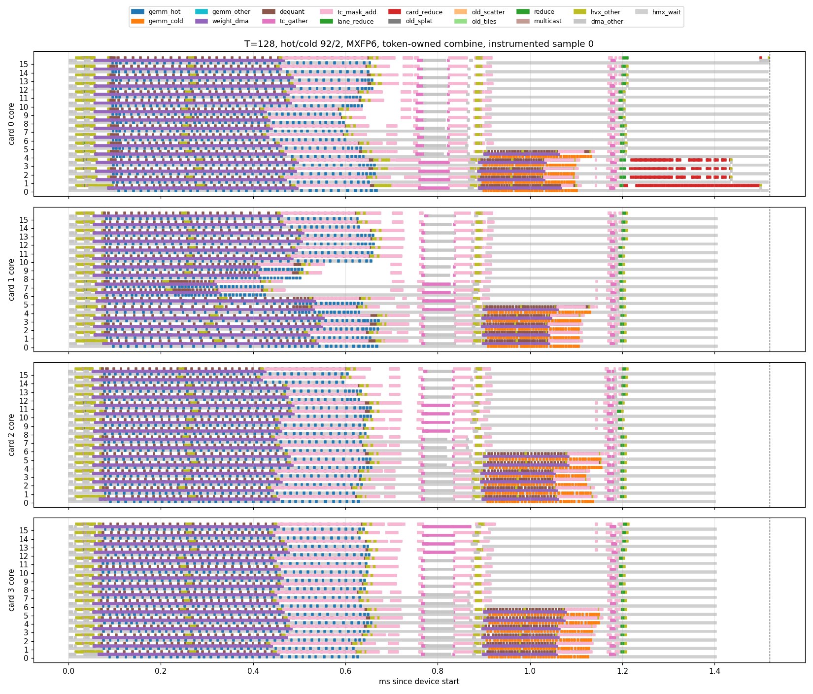

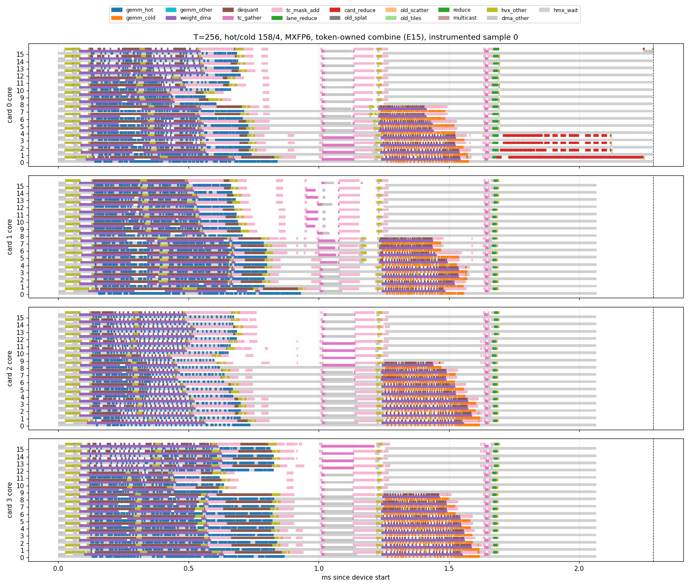

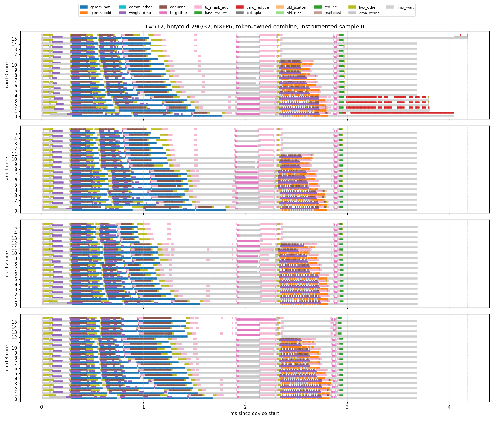

Phase breakdown of the kept design (instrumented device time, card 0):

| T | Device, ms | Prologue | Hot stage, 16 experts per card | Gap (index build) | Cold stage | Per-card combine | Card-0 cross-card root |
|---:|---:|---:|---|---:|---|---:|---:|
| 128 | 1.52 | 0.05 | 0.61 ms, 38 µs/exp (floor) | 0.22 | 0.24 ms, 42–49 µs/exp | 0.06–0.08 | 0.39 |
| 256 | 2.28 | 0.08 | 0.66–0.85 ms, 41–53 µs/exp | 0.30–0.50 | 0.34 ms, 42 µs/exp | 0.07–0.12 | 0.57 |
| 512 | 4.18 | 0.11 | 1.45–1.70 ms, 91–106 µs/exp | 0.51–0.77 | 0.47 ms, 42 µs/exp | 0.12–0.16 | 1.37 |

The cross-card root grows with T (0.39 / 0.57 / 1.37 ms) and is now the single
largest item after the hot stage at T=512; the index-build gap grows with T as well.

What is left after the combine work, in the T=256 token-owned profile (device 2.28 ms):
the hot stage 0.66–0.85 ms (16 experts per card at 41–53 µs per expert against the
37 µs floor), the cold stage 0.33–0.38 ms at the floor, an inter-stage gap of
0.3–0.5 ms in which the index build runs, the per-card combine under 0.1 ms, and the
cross-card root on card 0, 0.57 ms, which no graph-level expression removed. The
remaining levers are therefore the expert stages themselves (exact-shape compute for
the hot stage at T ≥ 256) and, on the compiler side, a distributed cross-card
reduction and the retained-state pairing under the flag.

## 3.15 Retained-state KV cache with the flag: head-parallel attention (E17)

Section 3.9 left one problem open: with `-mdts-mos=1` the compiler exposed all 192
KV-cache buffers as host IO instead of pairing each `past_*` input with its
`_RetainedState` output, so every full-model flag result so far was a prefill-only
graph (about 50 ms penalty, no multi-chunk or decode use). This round finds the
cause and removes it at the graph level, on 2026-09-24, MXFP6, four cards.

**Diagnosis on a 2-layer truncation.** `scripts/truncate_layers.py` cuts the rebuilt
48-layer graph to its first N decoder layers (KV IO kept for those layers, final norm
and LM head rewired), so a retained-state compile takes 40 s instead of 6–11 min.
The pairing depends only on the weight-splitting degree:

| `-mdts-mos` on the 2-layer graph (retained-state compile) | KV buffers exposed | Device ms (stats 70) | P2P MiB | Uninstrumented inferences/s |
|---|---:|---:|---:|---:|
| heuristic (no flag; production setting) | 0 of 8 | 23.27 | 264.6 | 43.1 |
| 1 | 8 | 17.18 | 114.3 | – |
| 2 | 8 | – | – | – |
| 4 | 0 | 34.88 | 672.6 | 28.3 |
| **1 + head-parallel attention (below)** | **0** | **12.52** | **30.3** | **79.8** |
| head-parallel attention, no flag | 8 | – | – | 43.4 |

Degree 4 keeps the pairing and is numerically identical to the heuristic (bit-exact
logits) but splits every expert bank too: the T=256 token-owned replay takes 10.08 ms
at `-mdts-mos=4` against 3.26 ms at 1, and the flag itself remains essential (the same
replay without any flag: 6.61 ms, 83 MiB of P2P against 3.5 MiB, because the down
projection is tensor-sliced again even with the token-owned combine). So the degree is
a global knob: 4 shards every weight across the cards, 1 shards none. What the KV
cache needs is the layout that degree 4 happens to produce for attention: the k/v
projection weights split by output column, i.e. **one KV head per card**, so that the
`CtxScatter` that writes head h and the `CtxGather` that reads it run on the same card
and the input and output slices of the cache coincide. With degree 1 the projections
are not split, the compiler token-splits them instead (the 2-layer `-mdts-mos=1`
profile shows the MoE token gathers multicasting 48 MiB per layer to re-collect a
token-sliced attention output), the cache update is token-sliced while its input is
whole, and the compiler falls back to host IO (its error strings for the strict case
read "Mis-matched retained state input and output splits size" and
"lowerRetainedStateIO: mis-matched input and output cores").

**The rewrite** (`scripts/headpar_graph.py <src dir> <out dir>`) gives the compiler that
layout without asking it to split anything: the KV-head group (4 groups × 8 query
heads) becomes a leading batch axis of every attention op, the same device the expert
banks already use.

- `Expand(x)` → `[4, T, 2048]`; `MatMul` with `Wq_g [4, 2048, 1024]`, `Wk_g [4, 2048, 128]`,
  `Wv_g [4, 2048, 128]` (the export's `[in, out]` weights re-laid out once as fp16
  files under `<out>/weights_hp/`); q/k norm, `[4, 8, T, 128]` / `[4, 1, T, 128]`
  transposes and rotary per group; the K/V updates reshaped to `[1, 4, T, 128]` feed
  the **unchanged** `CtxScatter` nodes, and the unchanged `CtxGather` outputs are read
  back as `[4, 1, ctx, 128]`, expanded to the 8 query heads, scores, mask, softmax and
  the PV product per group; `o_proj` as `[4, T, 1024] @ Wo_g [4, 1024, 2048]` (a pure
  reshape of the existing file) followed by `ReduceSum` over the groups.
- Under `-mdts-mos=1` the batch axis lands one group per card on all 16 cores
  (profile: q/k/v projections, softmax and PV on 64 cores, 16 per card), and the two
  cache ops of head h stay on card h: the 2-layer QPC exposes no KV buffer. Without
  the flag the same graph loses the pairing (the heuristic splits the batched weights
  along another axis), so flag and rewrite are a pair.
- Numerics: the per-group `o_proj` partial sums change the fp16 accumulation order.
  On the 2-layer model the logits differ from the heuristic program by 6.8e-4
  relative L2 (max 0.009 on logits up to 12.6), same argmax, identical with and
  without the flag.

**Full model, retained state, same session** (`tools/moe_qwen3_baseline.py`, 3 rounds
× 20, anchor recompiled and re-run; the FP32 reference tree under `/home/chihao`
had been deleted, it was regenerated locally with the same inputs, see 4):

| Program (MXFP6, T=128, 4 cards, KV retained on device) | Flag | Host median, ms | Rounds, ms | Logits rel. L2 vs FP32 | Next token |
|---|---|---:|---|---:|---|
| Native C128 (production baseline, anchor) | no | 499.0 | 498.0 / 499.6 / 498.9 | 0.1884 | ' jav' ✓ |
| Native C128 + head-parallel attention | yes | 267.6 | 267.7 / 267.4 / 267.6 | 0.1724 | ✓ |
| **Rewrites + token-centric combine + head-parallel attention** | **yes** | **148.1** | 147.6 / 147.9 / 148.7 | 0.1724 | ✓ |
| *for reference, prefill-only (E9/E12): native + flag / stack + token-centric* | yes | 352.0 / 231.8 | | 0.1884 | ✓ |

- **3.37× the production baseline with the KV cache retained**, 1.16 ms per token,
  and 84 ms below the best prefill-only program: the retained-state version is
  cheaper than the KV-free one by more than the 50 ms penalty measured in E9, so
  the head-parallel attention also beats what the compiler made of the original
  attention under the flag. The native graph alone goes 499.0 → 267.6 ms.
- The QPC exposes exactly `input_ids`, `position_ids`, `logits`, `routing_counts`
  (`scripts/qpc_bindings.py`), so the program is usable for multi-chunk prefill and
  decode as the production one is; only the first 128-token chunk is timed here.
- Not bit-exact, for the first time in the series: the attention reordering moves 343
  of 49,152 routing assignments (47 layers touched, from layer 0 on), the logits
  differ from the anchor program by 0.031 relative L2, and the error against FP32 is
  0.1724 against the anchor's 0.1884, inside the band of the other MXFP6 programs
  (0.1720–0.1884); the top-5 next tokens are the same in the same order.

**Profile of the final program** (`-stats-level=70`, `full_model/profile_stack_hp_flag/`;
device 160.0 ms under instrumentation against 148.1 host uninstrumented):
the MoE-to-MoE period is 3.3–3.5 ms per layer, the MoE block 2.9–3.5 ms of it.
Core-busy time splits 86% MoE, 13% attention, 1% rest (99 ms busy per core of 160 ms);
the three expert MatMul families alone are 3.27 s of core time, the token-centric
lane-reduce tiles 0.82 s, then `o_proj` with its cross-card partial exchange 0.32 s,
RMSNorm 0.27 s, the routing scatter 0.22 s, `ReduceSum` of the o_proj groups 0.11 s,
softmax 0.11 s, `q_proj` 0.10 s. Cross-card traffic is 505 MiB for the model,
10.5 MiB per layer, and now mostly attention: the `o_proj` partials are exchanged as an
all-gather of `[4, T, 2048]` (every card receives all four partials and reduces),
plus the `Expand(x)` broadcast; the MoE combine is 14% of it. That exchange is the
same root-and-multicast pattern as the combine's (3.13, 3.14) and the same
reduce-scatter question, now for a dense tensor. What remains to port is the
token-owned combine of E15, which the full-model stack does not yet use.

Artifacts: `full_model/trunc2_native`, `trunc2_headpar` (graphs), `full_model/kvtest/`
(2-layer compile logs, bindings, `run_*` logits, `prof_*` profiles), `native_c128_hp`,
`stack_native_rw_tc_ret`, `stack_native_rw_tc_hp` (48-layer graphs; `weights_hp/` 961 MB
each), `run_native_hp_flag`, `run_anchor3_native_noflag`, `run_stack_hp_flag`,
`profile_stack_hp_flag`, compile logs; `scripts/truncate_layers.py`,
`scripts/headpar_graph.py`, `scripts/trunc_io.py`, `scripts/spans.py`,
`scripts/placement.py`, drivers `scripts/run_kv1.sh` … `run_kv7.sh`.

## 3.16 Exact-shape hot stage: lane-split experts against row-chunked GEMMs (E18)

The token-owned profiles (3.13, 3.14) left the hot stage above the weight floor at
T ≥ 256, and the per-core engine times say why: the HMX time of the 16 hot experts
per card is 44 / 310 / 921 µs per core (median) at capacity 92 / 158 / 296, a 21×
increase for 3.2× the padded rows, while the 36 `blockdequantize_mxfp6` tiles per
core are the same count and bytes at every T (one per 64-column weight tile, not per
row) and the weight DMA is constant. The padded rows are paid on the HMX, and
super-linearly. Two ways of shrinking them were built on the T=256 and T=512
token-owned replays and timed against their anchors in one session (MXFP6, flag,
uninstrumented, 3 alternating rounds × 100; 2026-09-24):

- **Row-chunked GEMMs** (`scripts/make_rowchunk.py <src> <out> <k>`): the hot
  gate/up/SiLU/down chain runs k times on consecutive row chunks of the gathered
  `[64, C, 2048]` activation, outputs concatenated; no routing or weight change.
- **Lane-split experts** (`scripts/make_split.py <T> <counts.npy> <out> <C_hot>`): a
  hot lane is (expert, chunk of C_hot rows). Experts with more than C_hot tokens take
  ⌈count / C_hot⌉ lanes, each a duplicate of the expert's bank holding a consecutive
  chunk of its tokens; the smallest hot experts move to the cold stage until the 64
  hot lanes suffice, empty cold experts are dropped to make room, and the cold
  capacity rises to the largest demoted count. The graph is unchanged: the split
  expert's routing column is presented once per lane, masked to that lane's chunk
  ("virtual lanes"), so mask, scans, slots and the token-owned combine see 64
  ordinary lanes with at most C_hot tokens each. Weight DMA per stage is unchanged
  (64 lanes stream one bank each, as before).

| Variant (token-owned, MXFP6, flag) | C hot / cold | Hot experts (split → extra lanes, demoted) | Padded rows / real | Host median, ms | vs anchor | µs per token |
|---|---:|---|---:|---:|---:|---:|
| T=256 anchor (hc 158/4) | 158 / 4 | 64 | 5.0× | 3.224 | | 12.6 |
| T=256 split | 84 / 4 | 61 (3 → 3, 3 demoted) | 2.75× | 3.015 | −6.5% | 11.8 |
| **T=256 split** | **58 / 8** | 57 (5 → 7, 7 demoted) | 2.06× | **2.991** | **−7.2%** | 11.7 |
| T=512 anchor (hc 296/32) | 296 / 32 | 64 | 5.0× | 5.656 | | 11.0 |
| T=512 row-chunked, k = 2 | 296 / 32 | 64 | 5.0× | 7.050 | +24.7% | 13.8 |
| T=512 row-chunked, k = 4 | 296 / 32 | 64 | 5.0× | 9.387 | +66.0% | 18.3 |
| T=512 split | 148 / 8 | 60 (4 → 4, 4 demoted) | 2.44× | 5.147 | −9.0% | 10.1 |
| T=512 split | 104 / 16 | 52 (9 → 12, 12 demoted) | 1.88× | 4.855 | −14.2% | 9.5 |
| **T=512 split** | **88 / 20** | 48 (11 → 16, 16 demoted) | 1.69× | **4.738** | **−16.2%** | **9.3** |

Outputs of every variant agree with the anchor's to 1e-4–6e-4 relative L2 (the
split changes which lane accumulates a row, nothing else); routing counts are exact.

- **Row chunking is counterproductive**: 2 chunks cost 25%, 4 chunks 66%. The
  compiler does not pipeline the chunks; each one re-streams and re-dequantizes the
  expert's weights, so the weight side is multiplied by k while the HMX work is
  unchanged. Padded rows have to be removed, not re-tiled.
- **Lane splitting halves the hot stage.** In the T=512 profile (`-stats-level=70`,
  `exact_shape/`), the hot stage goes from 1.56–1.97 ms per card (98–123 µs per
  expert) to 0.81–0.99 ms (51–62 µs per expert) at C_hot = 104; the per-core HMX
  time falls from 1020 µs (median, max 1673) to 260 µs (max 447) while dequantize
  (654 → 611 µs) and weight DMA (357 → 441 µs) stay where they were. The stage is now
  bounded by dequantize and DMA, not by the padded GEMM: the same 36 dequantize
  tiles per core that take 143 µs at T=128 take 611 µs here, so the next hot-stage
  lever is on the compiler's side of the MXFP6 path, not in the graph. The cold
  stage grows 0.1 ms (14–15 active experts per card instead of 11–12, at the floor).
- **Splitting shifts the balance the same way hot/cold did**: the demoted experts are
  the ones with 8–20 tokens, exactly the population that the hot capacity padded
  10–30×. With C_hot = 88 the padded rows are 1.69× the real rows against 5.0× in
  the anchor; the returns flatten below C_hot ≈ 100 because the stage is at its
  floor. At T=256 the whole gain is 0.2 ms because the hot stage was only 0.1–0.25 ms
  above the floor to begin with.
- **What is left at T=512** (split 104, device 3.38 ms): the card-0 cross-card root
  1.37 ms (40%), the hot stage 0.85 (25%), the cold stage 0.55 (16%), the index-build
  gap 0.36–0.53 (13%), prologue 0.1. The root and the gap are the T-scaled items of
  3.14, unchanged by this round, and the root is now the single largest item.

For a static plan the split is a routing-table change only (which lane a token's
slot falls in), and in a dynamic setting it is the natural continuation of the
capacity policy: capacities are chosen per lane and the hottest experts are given
several lanes rather than one deep one.

Artifacts: `exact_shape/e18_timing_stats0.json`, `e18_spec.json`, `plans/*.json`
(lane orders, chunks, demotions), `T512_{anchor,split104}_mxfp6_profile/`,
`T512_{anchor,split104}_cores.png`; `scripts/make_split.py`, `scripts/make_rowchunk.py`,
`scripts/e18_hot.py`, `scripts/run_e18.sh` (build, compile, time, profile).

## 3.17 Lane splitting with all 128 experts kept: the widened cold stage (E19)

E18 paid for its extra chunk lanes by dropping cold experts that happened to be empty
for the prompt. A deployed graph cannot do that: 128 experts plus k chunks need
128 + k lanes, and a stage's lane count is what the compiler partitions over the
16 cores of a card. This round keeps every expert and widens the cold stage to
64 + k lanes (`scripts/make_split_wide.py <T> <counts.npy> <out> <C_hot> [C_cold_min]
[cold lanes]`, then `make_tokencombine.py ... tokenowned` and
`scripts/patch_wide_to.py <dir> <cold lanes>`, which generalizes the token-owned index
arithmetic to L1/4 lanes per card). Stage 1 of the graph is re-batched from 64 to L1
lanes: routes sliced instead of reshaped `[2, 64, T]`, scan-chain zeros `[L1, s]`,
banks `[L1, ...]`, counts output `[64 + L1]`. Same protocol as E18, 2026-09-25:

| T=512 variant (token-owned, MXFP6, flag) | Cold lanes (per card) | Host median, ms | vs anchor |
|---|---:|---:|---:|
| anchor (hc 296/32) | 64 (16) | 5.727 | |
| oracle split C_hot 104, empties dropped (E18) | 64 (16) | 4.856 | −15.2% |
| oracle split C_hot 88, empties dropped (E18) | 64 (16) | 4.781 | −16.5% |
| **all experts, split 104, cold widened** | **76 (19)** | **5.172** | **−9.7%** |
| all experts, split 88, cold widened | 80 (20) | 8.238 | +43.8% |
| all experts, split 104, cold widened to two lanes per core | 128 (32) | 9.265 | +62% |
| all experts, split 88, two lanes per core | 128 (32) | 9.025 | +58% |
| the 80- and 128-lane graphs with `-ols=2` / `-ols=4` | | 8.50 / 8.34 / 9.49 | no change |

| T=256 variant | Cold lanes (per card) | Host median, ms | vs anchor |
|---|---:|---:|---:|
| anchor (hc 158/4) | 64 (16) | 3.326 | |
| oracle split C_hot 58, empties dropped (E18) | 64 (16) | 2.990 | −10.1% |
| all experts, split 84, cold widened | 68 (17) | 3.212 | −3.4% |
| **all experts, split 58, cold widened** | **72 (18)** | **3.013** | **−9.4%** |

Outputs match the E18 splits exactly (same relative L2 against the anchor,
6.5e-4 / 3.9e-4), routing counts exact for all 140–192 lanes.

What the profiles show (`exact_shape/T512_wide*_mxfp6_profile/`, `T256_wide58_*`):

- **The compiler maps a stage onto cores by its batch size, and only 16 lanes per
  card gives one lane per core.** With 19 lanes per card it splits the batched
  GEMMs by tiles unevenly over all 16 cores (3 to 36 HMX events per core) and the
  cold stage takes 0.75–0.79 ms instead of 0.55; it also reorders the stages, cold
  first, so the token-owned index build now overlaps the hot stage's weight stream
  (hot-stage DMA 539 µs per core against 441). With 20 or 32 lanes per card it
  packs the whole cold stage onto 4 cores per card, 5 or 8 lanes each, 29–33 MiB of
  weights per core at the ~9 GB/s a single core's DMA reaches: 3.7–4.3 ms for a
  stage that takes 0.5 ms on 16 cores. `-ols` does not change this. At T=256 the
  18-lane stage lands on 12 cores (0.50–0.54 ms against 0.34) but the hot-stage
  saving still carries the variant to −9.4%.
- **The mapping cannot be steered by flags, but it is regular below 16 lanes per
  card.** `-mos=2` and `-mos=4` leave the 80-lane stage on 4 cores (8.18–8.19 ms);
  raising the cold capacity to 64 rows moves it to 5 cores (7.73 ms). Probes with
  16 and 8 cold lanes in total, i.e. 4 and 2 per card (`scripts/make_probe_wide.py`,
  not a valid layout, mapping test only), are split perfectly: each lane's GEMMs are
  divided over 16/lanes cores by column tiles, 9 or 3 HMX events and 0.9 or 0.4 MiB of
  weights on every core, and the stage runs at the card's DMA floor (0.16 / 0.09 ms).
  So the partitioner is balanced whenever the lanes per card divide 16 (1, 2, 4, 8, 16),
  degrades for 17–19 and packs from 20 on; the lane counts a plan generator may use
  are those divisors, one stage each.
- **Inactive lanes are not free in the one-lane-per-core mapping.** The anchor's cold
  stage streams 3.5 MiB on every core although only 11–12 of 16 lanes per card are
  active, so a third 64-lane stage for the demoted experts would cost a full bank
  round (~0.57 ms per card), which cancels most of the T=512 gain and all of the
  T=256 gain; the 16-lane alternative (4 per card) would meet the same packing
  heuristic as the 20- and 32-lane stages.

So the deployable form of lane splitting under this compiler is the 76-lane cold
stage: −9.7% at T=512 and −9.4% at T=256 with all 128 experts present, against
−15/−16% and −10% for the oracle layout. The difference is the compiler's core
assignment for a 19-lane batch and its stage reordering, not the split itself. Given
the probe result, the way to recover it is a third stage of 16 lanes (4 per card) for
the demoted experts: mapped evenly by construction, at its DMA floor of about 0.15 ms
per card, plus the stage's own gathers and combine term; expected to land within
0.1–0.2 ms of the oracle layout at T=512. Not built yet.

Artifacts: `exact_shape/e19*_timing_stats0.json`, `spec19*.json`, `plans/T*_wide*_to.json`,
profiles above; `scripts/make_split_wide.py`, `scripts/patch_wide_to.py`,
`scripts/profile_case2.sh` (IO sizes from the files), drivers `scripts/run_e19.sh`
(compile, time, profile), `run_e19b.sh` (profiles of the 76/80-lane variants),
`run_e19c.sh` (128-lane variants), `run_e19d.sh` (`-ols` and the T=256 profile), `run_e19e.sh` (`-mos`, cold capacity 64),
`run_e19f.sh` (16- and 8-lane mapping probes). E20: see the artifact list at the end of 3.18; the routing data under `realcase/routing/`
is local (gitignored) and regenerates in about eight minutes with `scripts/collect_routing_fp32.py <out dir> <threads>`. E21:
`scripts/download.py <data dir>` (MMLU, SWE-bench Lite via `datasets`), `scripts/make_prompts.py <data dir> <out dir>`,
`scripts/collect_routing_generic.py <out dir> <threads> <prompts.npz>` (driver `scripts/run_e21.sh`),
`scripts/analyze_workloads.py <layer|-1> <T> name=dir ...`, `scripts/run_e21b.sh` (the 200-prompt sweep). E22:
`scripts/make_dyncard4.py <src dir> <out dir> <C_hot> <C_cold>` (the kept variant; `make_dyncard.py`, `make_dyncard2.py`,
`make_dyncard3.py` are the three residency attempts), then `make_tokencombine.py … tokenowned`; drivers `scripts/run_e22.sh`
… `run_e22f.sh` (timing, DRAM per card, profiles, sweeps at T=128/256/512), `run_e22g.sh` (sweeps of the tight
T=256/512 QPCs). E23: see the artifact list at the end of 3.21. E24: `scripts/download_more.py <data dir>`,
`scripts/make_prompts_text.py <jsonl> <name> <out dir> <n> [T]`, collection with `scripts/collect_routing_generic.py` (driver
`scripts/run_e24.sh`), `scripts/calib_study.py <T> <out dir> name=dir ...`. E25: `scripts/make_cap_native.py` (make_cap.py with a
`native` placement), `scripts/run_e25.sh`. E26: `scripts/build_full_dyncard.py <src dir> <out dir> --mode naive|dyncard
[--C_cold 16]` on a `build_full_stack.py --rewrites 1` output, then `scripts/headpar_graph.py`; drivers `scripts/run_e26a.sh`
(two-layer check) and `scripts/run_e26b.sh` (compiles and the four-program session). E27: `build_full_dyncard.py --mode
sortfirst`; drivers `scripts/run_e27.sh` (sort-first and producer-DMA pairs), `run_e27b.sh` (tile-size sweep), `run_e27c.sh` (the
48-layer session with `-size-split-granularity=512` for the runtime sort only).

## 3.18 The real case on one layer: what can be decided at run time, and what it costs (E20)

Everything up to here used one prompt's routing, scaled synthetically for T > 128, and
plans built from it (oracle). This round asks what a deployed graph can do with routing
it only sees at run time, on layer 2, with real routing: 74 chat prompts built from
GSM8K questions (10 natural ones that reach 128 tokens, 40 concatenations to 128 tokens,
16 to 256, 8 to 512) run through the FP32 layer stack on the CPU
(`scripts/collect_routing_fp32.py`; `realcase/routing/*.npz` hold every layer's top-8
indices and weights and the layer-2 MoE input). 2026-09-25.

**What the routing looks like (layer 2, `scripts/analyze_routing.py`,
`realcase/analysis_layer2_T*.txt`):**

| | T=128 (50 prompts) | T=256 (16) | T=512 (8) |
|---|---:|---:|---:|
| active experts per prompt | 80–99 | 91–100 | 102–105 |
| experts empty in every prompt | 11 | 16 | 17 |
| top-64 set, pairwise Jaccard (median / min) | 0.75 / 0.62 | 0.78 / 0.68 | 0.86 / 0.78 |
| calibrated hot set (leave-one-out): share of assignments it covers | 92.9% (min 81%) | 94.1% | 94.3% |
| largest count per prompt (median, range) | 70 (49–92) | 140 (117–151) | 263 (246–280) |
| 65th-largest count per prompt (median, max) | 3, 79 | 6, 25 | 12, 50 |
| static plan (hot set + capacities = max over the other prompts): drops | 1 of 50 prompts, 48 assignments | 1 of 16, 4 | 2 of 8, 37 |
| static plan padded rows vs the per-prompt oracle | 10.7× vs 4.5× | 5.5× vs 4.6× | 4.8× vs 4.3× |
| model time of the static plan vs oracle (expert stages) | at the floor | +3% | +4% |

The hot set is stable enough to calibrate (58 of a prompt's own top-64 are in the
calibrated set), and a static plan loses only 3–4% of expert-stage time in the model at
T ≥ 256 and nothing at T = 128. What a static plan cannot absorb is the outlier: one
prompt in 50 gives 79 tokens to an expert that is cold everywhere else, so the cold
capacity must be 79 or that prompt drops 48 assignments. With a fixed lane order the
choice is headroom (free below about 120 rows, since the cold stage is DMA-bound) or
a 0.1% drop rate.

**Which mechanisms the compiler offers.** Three probes:

- **Control flow: none.** A data-dependent `If` is rejected at compile time
  (`If: Non-constant condition tensor not supported`, `realcase/ifprobe_compile.log`).
  Empty experts are counted in the graph but cannot be skipped; every lane streams its
  bank.
- **Weights selected by a runtime index: free.** The hot stage of the T=128 replay with
  its three banks replaced by `Gather(bank[128, …], idx[64])`, the index arriving with
  the input (`scripts/make_dyngather.py`), runs in 2.796 ms against 2.796 for the static
  MXFP6 anchor, bit-identical output. The compiler lowers the gather to an indirect
  weight DMA that reads the MXFP6 bytes (dequantize kernels present, 3.5 MiB per lane,
  `realcase/profiles/T128_dyngather_mxfp6_profile/`). The price is memory: the QPC grows
  from 453 MB to 2.0 GB (an fp16 copy of the bank is kept in the file), and on the device
  every card must hold all 128 banks, 814 MiB in use per card against 446 for the static
  program, about +0.37 GiB per layer per card.
- **Dynamic hot/cold split: works, one QPC per T for every prompt.**
  `scripts/make_dynsplit.py` counts each expert's tokens in the graph, sorts the 128
  experts by count (`TopK`), gathers the 64 largest into the hot stage and the rest into
  the cold stage, permutes the routing columns by the same order, and keeps static
  capacities calibrated on the sorted order statistics (96/16, 160/32, 288/56 for
  T=128/256/512). All 74 prompts run through the three QPCs with exact sorted counts, no
  dropped assignment, and a per-token error against the FP32 reference of 3.2% median,
  4.8% worst, the MXFP6 level (`realcase/e20_sweep*.txt`).

| Same session, token-owned combine, MXFP6, flag | static oracle anchor | dynamic split | |
|---|---:|---:|---:|
| T=128 (prompt 41) | 2.598 ms | 2.712 ms | +4% |
| T=256 | 3.290 ms | 3.868 ms | +18% |
| T=512 | 5.675 ms | 6.134 ms | +8% |

The overhead is scheduling, not arithmetic: in the T=256 profile
(`realcase/profiles/T256_dynsplit_mxfp6_profile/`) the sort itself is done at 0.04 ms,
but everything that used to run in the prologue now waits for it: the routing
permutation (0.04–0.09 ms), then the scan chains, token gathers and the bank gathers,
which start at 0.15 ms instead of 0. The scan chains end up interleaved with the hot
GEMMs (0.12–1.76 ms instead of the prologue), the hot stage spans 1.24 ms instead of
0.85, and the cold stage starts at 1.70. The fix is structural and not built yet: compute
masks, scans and slot tables in native expert order, independent of the sort, and permute
only the resulting `[128, T]` tables and the banks, so that nothing but the bank gathers
depends on the `TopK`.

**What this buys in the real case.**

- *Empty experts:* identifiable, not skippable. With the dynamic sort they sit at the
  bottom of the order, so a 64 + 32 + 16 lane layout (all divisors of 16 per card) would
  compute every expert that was active in any of the 74 prompts (at most 105) and leave
  16 banks per layer unstreamed, about 0.14 ms per card; a prompt with more than 112
  active experts would lose tokens.
- *Hot/cold split:* dynamic at the cost above; it removes the outlier problem entirely,
  so capacities can follow the order statistics: the largest count varies 49–92 across
  prompts at T=128 and the 65th-largest 2–12, against a static cold capacity of 79.
- *Padding size:* static per stage, but calibrated on sorted counts it carries little
  headroom, about 20–30 rows on the hot stage, 0.1 ms at T ≥ 256, and none on the cold
  stage below ~120 rows. Per-prompt capacity selection would need one program per
  capacity and host-side switching per layer; nothing measured suggests it is worth it.
- *Lane splitting* (3.16, 3.17) composes with the dynamic order: the chunk masks are
  the same running-count arithmetic, applied to the sorted lanes.

Artifacts: `realcase/routing/`, `realcase/analysis_layer2_T*.txt`, `realcase/collect.log`,
`realcase/e20b_dyngather_timing.json`, `realcase/e20c_dynsplit_timing.json`,
`realcase/e20_sweep{128,256,512}.{json,txt}`, `realcase/profiles/`,
`realcase/ifprobe_compile.log`; `scripts/collect_routing_fp32.py`,
`scripts/analyze_routing.py <routing dir> <layer> <T>`, `scripts/make_ifprobe.py`,
`scripts/make_dyngather.py <src> <out>`, `scripts/make_dynsplit.py <src> <out> <C_hot>
<C_cold>` (then `make_tokencombine.py … tokenowned`), `scripts/make_inputs_dyn.py
<routing dir> <out> <T>` with `scripts/ref_moe_l2.py`, drivers `scripts/run_e20a.sh`
(If probe), `run_e20b.sh` (gather probe), `run_e20c.sh` (dynamic split: compile, timing,
sweeps), `run_e20d.sh` (profile).

## 3.19 Other workloads: how the expert pattern changes (E21)

Same collection as E20 for three more workloads, 50 prompts of 128 tokens and 4 of
512 tokens each: MMLU (consecutive test questions with their four choices, shuffled
across subjects), SWE-bench Lite (issue statements) and HumanEval (function stubs),
against the GSM8K set of E20 (`scripts/download.py`, `scripts/make_prompts.py`,
`scripts/collect_routing_generic.py`, `scripts/analyze_workloads.py`;
`realcase/routing_{mmlu,swe,humaneval}/`, `realcase/workloads_*.txt`). 2026-09-25.

**Identities move, shapes do not.** Layer 2, T=128, 50 prompts per workload:

| | GSM8K | MMLU | SWE-bench Lite | HumanEval |
|---|---:|---:|---:|---:|
| active experts per prompt (median, range) | 90, 80–99 | 92, 75–104 | 97, 91–106 | 97, 87–103 |
| never used in the workload | 11 | 5 | 2 | 7 |
| largest count per prompt (median, max) | 70, 92 | 59, 111 | 70, 101 | 66, 96 |
| 65th-largest count (median, max) | 3, 4 | 4, 6 | 4, 7 | 5, 6 |

Calibrated hot sets (top-64 by mean count) overlap with Jaccard 0.75 between GSM8K and
MMLU, but only 0.38–0.56 between either of them and the two coding workloads; roughly
40 of the 64 hot experts are shared across domains, and only 2 experts are unused by
all four workloads. A plan calibrated on one workload and applied to another:

| calibration → evaluation | share of assignments in the hot set | prompts that drop | dropped assignments | cold capacity a drop-free static plan would need |
|---|---:|---:|---:|---:|
| GSM8K → GSM8K | 93% | 0 of 50 | 0 | 79 |
| GSM8K → MMLU | 77% | 5 of 50 | 0.23% | 111 |
| GSM8K → SWE-bench | 52% | 12 of 50 | 0.19% | 101 |
| GSM8K → HumanEval | 50% | 13 of 50 | 0.26% | 96 |
| HumanEval → MMLU | 55% | 17 of 50 | 0.71% | 111 |

Across domains half of the tokens land in the "cold" stage, whose capacity would have
to equal the hot one; the static hot/cold layout does not transfer. The per-layer
profile (`realcase/workloads_perlayer_T128.txt`) shows the same at every depth,
cross-domain Jaccard 0.3–0.5 from layer 0 to 40 and a modest convergence in the last
seven layers (0.5–0.78, 26–33 universally hot experts). At T=512 the picture is the same
(`realcase/workloads_layer2_T512.txt`).

What does transfer is the shape of the sorted count vector: the largest count
59–70 median and at most 111, the 65th-largest 3–5 and at most 7, 75–106 active
experts. These are what the dynamic split (3.18) keys its capacities on.

**One graph, four workloads.** The T=128 dynamic-split QPC recompiled with capacities
128/16 (`scripts/run_e21b.sh`) served all 200 prompts: exact sorted counts on every
prompt, no dropped assignment, per-token error against the FP32 reference 3.0–3.2%
median and 5.0% worst (the MXFP6 level), latency 2.81–2.84 ms median per workload,
input-independent (`realcase/e21_sweep_summary.txt`, `e21_sweep_all_workloads.txt`).

So for deployment the choice is between a static layout calibrated per workload, which
drops 0.2–0.7% of assignments the moment the workload changes, and the dynamic split,
which is workload-agnostic at the cost measured in 3.18 (+4% at T=128 today, a
scheduling cost with a known fix) and the per-card residency of all 128 banks. Skipping
empty experts is off the table either way: the never-used sets are workload-specific.

## 3.20 Per-card dynamic split, built (E22)

Goal: the dynamic hot/cold split of 3.18 with each card sorting only its own 32
experts, so that a card would only need its own banks resident, plus the fix for the
scheduling cost: the mask / prefix-scan / slot-table chain computed once over all 128
experts in native order, with only the row permutations and the bank gathers depending
on the sort (`scripts/make_dyncard*.py`; the chain is cloned from the stage-0 chain of
the E7/E8 anchor graphs, drivers `scripts/run_e22*.sh`). 2026-09-25.

**Residency cannot be expressed.** Three ways to give each card its own bank constant,
all correct (exact counts, outputs within the MXFP6 or fp16 error of the reference),
none acceptable; the fourth row is the formulation that was kept:

| Bank formulation (T=128, per-card sort, native chains) | Weights kept | Host median | DRAM per card |
|---|---|---:|---:|
| four per-card constants, per-card `Gather`, `Concat` into one `[64, …]` weight | fp16: MXFP6 not applied behind the `Concat` (output error 7.5e-4, the fp16 level) | 6.09 ms | not measured |
| one `[4, 32, …]` constant, batch-wise `CtxGather3D` with a `[4, 16]` index | fp16 (output error 7.5e-4) | 9.50 ms | not measured |
| four per-card constants, four 16-lane MatMuls per stage, outputs concatenated | MXFP6 | 8.15 ms | 1278 MiB |
| **one `[128, …]` constant, one `Gather` per matrix with the card-major lane order** | **MXFP6, indirect DMA** | **2.59 ms** | **759 MiB** |

The third row is the telling one: the partitioner spread each of the four 16-lane
MatMuls over all four cards (192 HMX events per card for every one of them, 35 ms of
core time in bank gathers), so a per-card constant ends up on every card anyway. The
only formulation the compiler keeps fast is a single `Gather` on a single constant
feeding the batched MatMul, and that constant is replicated: 759 MiB in use per card
against 420 for the static program (816 for the global dynamic split of 3.18), about
+0.33 GiB per layer per card. Per-card residency would need per-node device placement
inside a tensor-sliced partition, which the partition config used here does not express
(it assigns node lists to whole partitions); a config with one partition per card gives
residency but runs the cards one after another (3.21).

**The per-card sort with native-order chains is at parity.** Same session, token-owned
combine, MXFP6, flag. Capacities are the largest per-card order statistics seen in the
collected prompts (200 over four workloads at T=128, 16 GSM8K prompts at T=256, 20 over
four workloads at T=512), rounded up without further margin: hot 128/160/304, cold
16/16/48:

| T | static oracle anchor | global dynamic split (3.18) | per-card dynamic, native chains | |
|---:|---:|---:|---:|---:|
| 128 | 2.632 ms | 2.801 ms (+6%) | 2.590 ms | −2% |
| 256 | 3.315 ms | 3.957 ms (+19%) | 3.514 ms | +6% |
| 512 | 5.678 ms | 6.150 ms (+8%) | 5.920 ms | +4% |

Generous capacities cost real time at T ≥ 256 (176/48 and 320/96 instead of 160/16 and
304/48: 3.73 and 6.55 ms, +6% and +11%), so the capacities must come from the order
statistics, not from a margin on the static plan. Correctness: all 200 prompts of the
four workloads through the one T=128 QPC with exact per-card sorted counts and per-token
errors of 3.0–3.2% median, 5.0% worst (MXFP6 level), latency 2.59–2.61 ms for every
workload (`realcase/e22_sweep128_dyncard4.txt`); the 16 prompts at T=256 and the 20 at
T=512 through the tight QPCs likewise, exact counts, 3.0–3.2% median and 5.1% worst,
3.42 and 5.98 ms median (`realcase/e22_sweep{256,512}_tight.txt`).

These capacities carry no margin beyond the observed maxima. A prompt whose largest
expert exceeds the hot capacity loses the excess assignments (the largest count at
T=512 ranges 211–304 across the four workloads), and T=256 was calibrated on GSM8K
alone. A deployment needs either headroom, which costs time as the generous variants
show, or the lane splitting of 3.16 to absorb overflow in extra chunk lanes.

The 512-token profile (`realcase/e22_profile_T512_summary.txt`) shows where the
remaining 4% is: the prologue is 0.4 ms instead of 0.1. The bank gathers depend only on
the sort, which is done at 0.03 ms, yet they start at 0.18 ms and the first hot GEMM at
0.28 ms, while the static program starts its weight stream at 0.1 ms; why the gathers
wait is not established. The stages themselves are about as long as the anchor's.

So the deployable, workload-agnostic layer is: fixed native quarters of experts per
card, per-card sort at run time, capacities from calibrated order statistics, native
chains, single-constant gathers. Its price against a static oracle is 0–6% at these
chunk sizes and 0.33 GiB of DDR per layer per card for the replicated banks.

## 3.21 One partition per card: residency works, the cards serialize (E23)

The one lever left for per-card expert residency (3.20) was a partition config with one
partition per card. Tested on a probe that isolates the pattern: per card, a gather of
16 of the card's 32 experts from a per-card constant (the real layer-2 gate bank), a
batched MatMul over 128 tokens, a sum over the lanes, and a sum over the cards
(`scripts/make_toy.py`). Configs come from a compiler dump of the graph's internal node
names, reassigned by card and kept in the dump's order (`scripts/make_pconfig.py`).
2026-09-25, MXFP6.

How the compiler reads such a config:

- **Partitions are an ordered pipeline.** A node may consume only outputs of its own or
  an earlier partition; the first attempt, with the cross-card sum in partition 0, was
  rejected ("Consumer node … appears in partition before producer node"). The sum has to
  sit in the last partition, and the compiler forwards card 0's partial through cards 1
  and 2 to reach card 3.
- **Partitions run one after another within an inference.** The profile of the
  per-card layout shows card 0 busy 0–1.13 ms, card 1 1.76–3.21, card 2 3.85–5.35, card 3
  6.01–7.09, about 0.63 ms between consecutive partitions. A variant in which the four
  cards share no data at all (four separate outputs, `scripts/make_toy_indep.py`) runs at
  the same times: the order is imposed by the runtime, not by the data. This repeats an
  earlier team result listed in the top-level README (item 13, partitions in one QPC run
  strictly in list order, verified with a zero-edge graph); the linked note is not in
  this checkout.

| Probe, per-card constants | QPC | DRAM in use per card | Device time | One inference in flight | Ten in flight |
|---|---:|---:|---|---:|---:|
| one partition over four cards (as in every build so far) | 602 MB | 481–499 MiB | 3.3–3.9 ms, cards concurrent | 230 inf/s | 261 inf/s |
| one partition per card | 151 MB | 375–432 MiB | 1.1–1.5 ms per card, in sequence, 7.1 ms end to end | 133 inf/s | 655 inf/s |

Both keep MXFP6 (output error 1.42e-2 against the FP32 reference). Under the single
partition the per-card constants are replicated on every card, 481 MiB, the same as one
shared constant; this is the mechanism behind 3.20 in isolation: the compiler runs the
four per-card chains one after another, each spread over all four cards. With one
partition per card each bank is stored once, 151 MB in the QPC, and card 3 holds 106 MiB
less, three quarters of the bank; cards 0–2 carry about 50 MiB of extra buffers.

So partitions deliver exactly the residency the dynamic split wanted, and MXFP6 with
it, but they turn the four cards' expert work into a sequence: for a single inference
the probe is 1.7× slower end to end, while with four or more inferences in flight the
pipeline fills and throughput is 2.5× that of the single partition. A linear pipeline
also allows only one pass over the cards per inference, so a 48-layer model cannot give
every layer its own per-card expert partitions; the only pipeline-compatible full-model
layout is layers split across cards, each card holding all experts of its layers, which
serves many concurrent requests or chunks, not the latency of one chunk. For the
latency path the single partition with replicated banks of 3.20 stays.

Artifacts: `partition/` (compile, DRAM and timing log; profile timelines of both
layouts and of the independent variant; throughput table; configs and dumps);
`scripts/make_toy.py`, `scripts/make_toy_indep.py`, `scripts/make_pconfig.py <model.onnx>
<dump.json> <out.json> <card regex> [<last-partition regex>]`, `scripts/trace_windows.py
<trace dir>`, drivers `scripts/run_e23a.sh` (dump, config, compiles, DRAM, timing),
`run_e23b.sh` (profiles), `run_e23c.sh` (independent variant).

## 3.22 How much the hot-expert pattern moves: eight workloads, all 48 layers (E24)

A fixed expert layout (the only one that keeps each card's weights to a quarter, 3.20,
3.21) needs its capacities calibrated in advance. This round measures how stable the
pattern is. 50 chat prompts of 128 tokens per workload, routing of all 48 layers from
the FP32 CPU stack (collector of 3.18): GSM8K, MMLU, SWE-bench Lite issue statements,
HumanEval, Alpaca instructions, CNN/DailyMail articles to summarize, Chinese sentence
pairs from XNLI (the Chinese MMLU set requires running the dataset's own loading code
and was not used) and the JavaScript version of HumanEval. The first 25 prompts of each
workload are its calibration half, the last 25 its evaluation half
(`scripts/calib_study.py`, `realcase/calibration/calib_study_T128.txt`). 2026-09-25.

**Agreement on the 64 most loaded experts** (Jaccard, median over the 48 layers; the
diagonal compares the two halves of one workload, the sampling floor):

| | GSM8K | MMLU | SWE | HumanEval | Alpaca | News | Chinese | JS |
|---|---:|---:|---:|---:|---:|---:|---:|---:|
| GSM8K | *0.91* | 0.63 | 0.42 | 0.44 | 0.62 | 0.62 | 0.51 | 0.45 |
| MMLU | 0.63 | *0.86* | 0.44 | 0.35 | 0.70 | 0.68 | 0.58 | 0.38 |
| SWE-bench | 0.42 | 0.44 | *0.87* | 0.48 | 0.45 | 0.48 | 0.35 | 0.51 |
| HumanEval | 0.44 | 0.35 | 0.48 | *0.83* | 0.42 | 0.31 | 0.29 | 0.86 |
| Alpaca | 0.62 | 0.70 | 0.45 | 0.42 | *0.86* | 0.67 | 0.56 | 0.44 |
| News | 0.62 | 0.68 | 0.48 | 0.31 | 0.67 | *0.91* | 0.63 | 0.33 |
| Chinese | 0.51 | 0.58 | 0.35 | 0.29 | 0.56 | 0.63 | *0.88* | 0.29 |
| JS | 0.45 | 0.38 | 0.51 | 0.86 | 0.44 | 0.33 | 0.29 | *0.83* |

- **Two clusters.** The natural-language workloads agree with each other at 0.51–0.70;
  natural language against code at 0.29–0.45; SWE-bench issue text sits in between. The
  two code sets agree at 0.86, but they share HumanEval's problem statements, so this
  says little about programming languages in general.
- **The hottest experts are workload-specific.** For the top 16, the halves of one
  workload agree at 0.52–0.88 while different workloads agree at 0.00–0.33 (0.68 for
  the two code sets). Rank correlation of per-expert load ranges from 0.78
  (MMLU–Alpaca) to −0.24 (HumanEval–Chinese).
- **A small shared core, a large union.** 14 experts per layer (7–21) are in every
  workload's top 64 and carry 17–29% of the assignments; 117 of 128 are in some
  workload's top 64.
- **Every layer behaves alike.** Median cross-workload Jaccard 0.40–0.53 per layer; the
  middle layers (7, 15, 19, 27, 31, 40) move most, the first and last layers least.

**What a fixed layout needs.** Hot set = the 64 experts with the highest calibration
mean count, capacities = the largest count seen in calibration, per layer and stage;
"prompts with a drop" counts an evaluation prompt if any of its 48 layers overflows.

| Calibration | Capacity hot / cold, median layer | Cold rows needed by evaluation prompts, median layer / worst layer | Evaluation prompts with a drop | Assignments dropped |
|---|---:|---|---:|---:|
| 25 prompts of the same workload | 106–117 / 21–61 | 30–77 / 67–121 | 64–92% | 0.04–0.37% |
| 200 prompts of all eight workloads | 122 / 105 | 53–107 / 95–124 | 12–36% | 0.000–0.022% |
| 175 prompts of the seven other workloads | 120–122 / 91–106 | 64–110 / 95–125 | 24–100% | 0.001–0.89% |
| per-card dynamic split, for comparison | | 4–8 / 9–12 | | |

Calibration size, random subsets of the pooled calibration halves, 20 draws each:

| Calibration prompts | 8 | 16 | 32 | 64 | 128 | 200 |
|---|---:|---:|---:|---:|---:|---:|
| Evaluation prompts with a drop | 100% | 94% | 70% | 49% | 27% | 21% |
| Cold capacity, median layer | 38 | 66 | 82 | 93 | 101 | 105 |

So for mixed traffic the conservative capacities of a fixed layout converge on the chunk
length: with 200 calibration prompts both stages sit at 105–122 of 128 rows and a fifth
of new prompts still overflow somewhere. The only drop-free fixed layout is both stages
at capacity T, the naive layout, which cost +10 / +18 / +33% at T = 128 / 256 / 512 in
E14 (token-centric combine). A fixed layout pays off only for known, homogeneous traffic,
and then needs more than 25 calibration prompts or explicit headroom, since the tail
within one workload already reaches 67–121 cold rows in its worst layer. The per-card
dynamic sort needs at most 12 cold rows in every layer for all eight workloads.

Limits of this study: FP32 CPU routing (the device's MXFP6 routing differs in a few
assignments per layer, 3.15), 128-token chunks, 50 prompts per workload, capacities
without margin.

## 3.23 Runtime sort against naive T/T, on one layer and on the full model (E25, E26)

**One layer, one session** (layer-2 replay, MXFP6, flag, token-owned combine unless
stated; real prompts through naive and runtime-sort programs: GSM8K prompt 41 at T=128,
the first concatenated GSM8K prompt at 256 and 512; naive = native expert order, both
stages at capacity T, `scripts/make_cap_native.py`; runtime sort at the capacities of 3.20,
hot/cold 128/16, 160/16 and 304/48, calibrated on layer 2 without margin; the static oracle runs its own
synthetic input with capacities sized for it; `runtime_sort/e25_*`):

| T | naive T/T, original dense combine | naive T/T | runtime sort | static oracle |
|---:|---:|---:|---:|---:|
| 128 | 2.696 ms | 2.593 ms | **2.462 ms** | 2.607 ms |
| 256 | 5.524 ms | 4.131 ms | **3.318 ms** | 3.030 ms |
| 512 | 10.812 ms | 8.212 ms | **5.633 ms** | 5.250 ms |

Against naive T/T with the same combine the runtime sort saves 5 / 20 / 31% at
T = 128 / 256 / 512, against the original dense naive layer 9 / 40 / 48%, and it stays
within 7–10% of the static oracle at 256 and 512. All outputs sit at the MXFP6 error
level against the FP32 reference, counts exact.

**Full model** (`scripts/build_full_dyncard.py <src> <out> --mode naive|dyncard`: the per-card
sort of 3.20 and the token-owned combine of 3.13 on all 48 layers, applied to the
retained-state `build_full_stack.py` output, then the head-parallel attention of 3.15;
nodes are matched by structure because layer 0 numbers its stage gathers one lower than
the other layers; a two-layer cut was checked first, `scripts/run_e26a.sh`). One session,
MXFP6, KV retained, 128-token chunk, prompt 41, 3 rounds × 20 (`runtime_sort/e26_full_model_runs.txt`):

| Program | Host median | Device memory per card | Program file | Logits rel. L2 vs FP32 | Next token |
|---|---:|---:|---:|---:|---|
| Production baseline | 496.6 ms | 6.6 GiB | 26.4 GB | 0.1884 | ' jav' ✓ |
| Naive 128/128, token-centric combine (best so far, 3.15) | 147.7 ms | 6.6 GiB | 26.4 GB | 0.1724 | ✓ |
| **Naive 128/128, token-owned combine** | **131.9 ms** | 6.6 GiB | 26.4 GB | 0.1718 | ✓ |
| Runtime sort 128/16, token-owned combine | 138.4 ms | 22.4 GiB | 94.3 GB | 0.1689 | ✓ |

- **The token-owned combine on every layer is the new best program**: 131.9 ms, 3.77×
  the production baseline, 11% below the token-centric program.
- **At 128-token chunks the runtime sort is 5% slower than naive T/T.** The hot stage
  sits at the weight floor at this chunk size (3.8, 3.10), so cutting the cold capacity
  from 128 to 16 buys almost nothing on the full model, while the sort's per-layer cost
  (bank gathers that wait for the sort, 3.20) is paid 48 times. The replicated banks
  cost 15.8 GiB per card, as projected, and the program file carries fp16 copies of the
  gathered banks.
- **Correct on device.** No cold lane exceeded its capacity of 16 in any layer (the
  largest held 8 tokens, the largest hot lane 121 of 128); on every card and in every
  layer the hot lanes hold at least as many tokens as the cold ones; 1024 assignments
  per layer. Routing differs from the naive program from layer 3 on (45 of 48 layers)
  because the combine's summation order changes fp16 rounding, as in 3.15; the logits
  differ by 0.032 relative, same top-5 set.

**Why the layer replay and the full model disagree at 128 tokens** (`scripts/run_e26c.sh`,
`run_e26d.sh`, `runtime_sort/e26c_*`, `e26d_*`). The penalty grows linearly with depth,
host timing with the full-model tool on truncations of the same two programs:

| Layers | Naive T/T | Runtime sort | Gap |
|---:|---:|---:|---:|
| 2 | 6.54 ms | 6.65 ms | +0.11 ms |
| 12 | 34.38 ms | 35.79 ms | +1.41 ms |
| 48 | 131.9 ms | 138.4 ms | +6.5 ms |

About 0.13–0.14 ms per layer. An instrumented two-layer profile shows where it sits: in
the full model the routing comes from each layer's own router, so router → per-card sort
→ bank gathers → expert GEMMs is on every layer's critical path; the sort ends 0.10 ms
after the router, the first expert weights stream 0.12 ms later, and the first expert GEMM
starts 0.17 ms later than in the naive program. The static program does not stream expert
weights under attention either; its stream also starts after the router, but it has no sort
in between. In the replay the routing is a graph input, so the sort and the gathers run in
the prologue from time zero and stay off the critical path. What the sort saves at 128
tokens, a cold stage of 16 instead of 128 rows, is smaller than that delay because the hot
stage streams at its weight floor. (The instrumented two-layer device times, 6.70 ms for
both, are too coarse to show a 0.1 ms difference; the host timing above does.)

So the runtime sort pays at longer chunks: 20% at 256 and 31% at 512 tokens per layer
against naive T/T with the same combine. The full model exists only for 128-token chunks;
measuring the gain on the model needs a 512-token build (per-layer constants regenerated
for T=512, a longer KV context, a 512-token FP32 reference). Multi-chunk correctness of
the retained cache is still untested for every program here.

## 3.24 Two optimizations of the runtime sort: sort-first, and the tile size (E27)

The two-layer profiles of 3.23 locate the 0.14 ms per layer that the runtime sort adds
before its first expert GEMM (layer 1, times after the router): the per-card sort itself
is cheap, done 0.03 ms after the dense routing scatter that both programs run; the
128-expert routing chain delivers the hot stage's token table 0.07 ms later than the
naive program's stage-0 chain; and the first gathered weights precede the first expert
GEMM by 0.085 ms, against 0.015 ms for directly streamed weights. Two remedies were
tried on 12-layer cuts of the full model, each timed back to back with naive T/T by the
full-model tool (`scripts/run_e27*.sh`, `runtime_sort/e27*`). 2026-09-26.

- **Sort first, then the original two stage chains on the permuted routing columns**
  (`build_full_dyncard.py --mode sortfirst`) is slower: +2.54 ms over naive at 12 layers
  against +1.60 ms for the native-order chain. The column permutation and both chains now
  wait for the sort. Rejected.
- **`-use-producer-dma`**: no gain (+2.94 ms on sort-first; naive −0.06 ms, noise).
- **`-size-split-granularity`, the compiler's maximum tile size in KiB** (default not
  documented; 512 is the smallest allowed):

| 12 layers, gap to naive T/T at default tiles | default | 1024 KiB | 512 KiB |
|---|---:|---:|---:|
| Naive T/T | 0 | +0.42 ms | +0.75 ms |
| Runtime sort, native-order chain | +1.60 ms | +1.1 ms (naive pair lost) | **−0.49 ms** |
| Runtime sort, sort-first | +2.54 ms | not run | +0.12 ms |

Small tiles help only gathered weights: they cost naive T/T 1–2%, and turn the
runtime sort from 4.7% slower to 1.4% faster. The two-layer profile at 512 KiB
(`runtime_sort/e27_two_layer_timeline_512KiB.txt`) shows why: the first expert GEMM now
follows the first gathered weights by 0.032 ms instead of 0.085–0.096, the gathered stream
pipelines better through the stage, and the two-layer device time drops from 6.70 to
6.54 ms. The routing chain still delivers weights 0.23–0.25 ms after the router against
0.15 ms in the naive program, so about 0.1 ms per layer remains to be taken.

**Full model, one session** (48 layers, 128-token chunk, KV retained, MXFP6, prompt 41):

| Program | Host median | Memory per card | Logits rel. L2 vs FP32 | Next token |
|---|---:|---:|---:|---|
| Production baseline | 495.7 ms | 6.6 GiB | 0.1884 | ' jav' ✓ |
| Naive T/T, token-owned combine (runs before and after) | 131.65 / 131.58 ms | 6.6 GiB | 0.1718 | ✓ |
| **Runtime sort, 512 KiB tiles** | **128.65 ms** | 22.4 GiB | 0.1689 | ✓ |

The runtime sort is now the fastest program at 128-token chunks: 2.3% below naive T/T
and 3.85× the production baseline. No cold lane exceeded its 16 rows (largest 8), and the
per-card order holds in every layer. The crossover of 3.23 therefore moves below 128
tokens; at 256 and 512 the replay's per-layer saving is larger still (the 256-token
full model follows in 3.25).

## 3.25 256-token chunks on the full model (E28)

The full-model builders were generalized to the chunk length and all three programs
rebuilt for 256-token chunks (2026-09-26):

- **Graphs.** `scripts/build_full_stack.py --T 256` (Hillis-Steele scans up to a shift of
  T/2, slice ends T − shift, 16 token tiles of T/16 rows), then
  `scripts/build_full_dyncard.py --T 256 --mode naive|dyncard --C_cold 32` and the
  head-parallel attention of 3.15, which has no T-dependent constant (its re-laid attention
  weights are byte-identical to the 128-token build and are shared). The production baseline
  is the unmodified export (`native_c128`): its capacities come from the routing tensor's
  shape, so it compiles to capacity 256 as it is. Specialization `configs/specializations_T256.json`,
  seq_len 256 with ctx_len 512 (the same 1:2 ratio as the 128-token programs).
- **Capacities.** Hot stays at T: in the 56 calibration chunks of 256 tokens (16 GSM8K
  chunks, plus the first and second halves of the 20 512-token captures of GSM8K,
  HumanEval, MMLU and SWE-bench Lite) one expert receives all 256 tokens (layer 14).
  Cold is 32 = T/8: under the per-card sort the cold stage needs at most 25 rows at any
  layer of any chunk (at T=128: 12 of 16; at T=512: 50, so 64 would fit).
- **Held-out prompt and reference.** GSM8K test questions 1000–1003 in one chat turn,
  truncated to 256 tokens (the calibration captures used questions 400–642). FP32 CPU
  reference in `full_model/ref256/` (`scripts/e2e_cpu_ref_local.py --ids … --T 256`).
  Its next token is a near tie: ' the' 28.84 against ' a' 28.26.
- **Run tool.** `scripts/moe_qwen3_baseline_T.py` and `scripts/moe_qwen3_baseline_host_T.cpp`
  are copies of the repository's full-model tool that take T from the reference's input
  length (IO shapes, count bounds, 8·T assignments per layer, tokens/s).

**Two-layer check** (`scripts/run_e28a.sh`, `chunk256/e28a_two_layer_check.txt`): against the
FP32 logits of the two-layer truncation (final norm and LM head on layer 1's residual),
production 0.0555, naive T/T 0.0555 and runtime sort 0.0556 relative L2, same argmax;
runtime sort against naive 1.3·10⁻³, naive against production 8.2·10⁻⁴.

**Full model, one session** (`scripts/run_e28b.sh`, `run_e28c.sh`, `chunk256/`): 48 layers,
KV retained, MXFP6, 3 rounds × 20. The 128-token programs of 3.24 (prompt 41) were timed
in the same session:

| Program | T=128 | T=256 | Tokens/s at 256 | Memory per card at 256 | Logits rel. L2 at 256 | Next token at 256 |
|---|---:|---:|---:|---:|---:|---|
| Production baseline | 497.0 ms | 505.6 ms | 506 | 6.8 GiB | 0.0886 | ' a' (near tie) |
| Naive T/T, token-owned combine (three runs at 256) | 131.6 ms | 258.4 / 260.0 / 258.3 ms | 991 | 6.7 GiB | 0.0733 | ' the' ✓ |
| **Runtime sort 256/32, 512 KiB tiles** | 129.8 ms | **217.0 ms** | **1180** | 22.5 GiB | 0.0889 | ' a' (near tie) |

- **At 256-token chunks the runtime sort is 16.0% faster than naive T/T** (217.0 against
  258.3 ms, back to back) and 2.33× the production baseline; at 128 tokens in the same
  session the gap is 1.4% (3.83× production). The saving is 0.86 ms per layer; the
  single-layer replay's 0.81 ms at T=256 (3.23) is not comparable, because the replay ran
  layer 2 at hot 160 / cold 16 while the full model keeps hot at T (3.26). The 512 KiB tiles
  are the best of default, 512 and 1024 KiB at this chunk length (3.26). Per card and layer
  the runtime sort computes 16·T + 16·T/8 padded rows, 56% of naive's 32·T.
- **Scaling with the chunk.** Naive T/T takes 1.96× the time for 2× the tokens (flat at
  973–991 tokens/s): its padded rows grow with T. The runtime sort takes 1.67× and gains 20%
  in tokens/s. The production baseline barely moves (+1.7%, so its throughput doubles),
  consistent with a per-layer cost that does not scale with tokens; it was not profiled at
  256.
- **Correct on device.** No lane exceeded its capacity (hot lanes up to 250 of 256, cold up
  to 17 of 32); in every layer and on every card the hot lanes hold at least as many tokens as
  the cold ones; 2048 assignments per layer. All three programs sit at the MXFP6 error level
  against FP32 and have the same top-5 set; production and the runtime sort end 0.01 and 0.04
  apart on the reference's near tie and flip it (naive keeps it by 0.08). The programs differ
  from one another by 0.010–0.043 relative, fp16 rounding differences as in 3.23 and the same
  level as at 128 tokens (0.032–0.038); the three naive runs are bit-identical.
- **One load failure.** The first load of the runtime-sort program failed with `Device is
  busy` while two cards were loading its constants (22.5 GiB per card; all cards idle and
  Ready before and after). An immediate retry loaded in 38 s and ran; the static programs
  load in 6–12 s. Not reproduced; the cause is unknown.

The 256-token production and runtime-sort programs and the 128-token runtime-sort program
were deleted after timing (88 GB each for the runtime sort); the 256-token naive program is
kept as an anchor.

## 3.26 512-token chunks on the full model, and the tile size per chunk length (E29)

Same builders and checks as 3.25 at T=512 (2026-09-26): `build_full_stack.py --T 512`,
`build_full_dyncard.py --T 512 --C_cold 64`, head-parallel attention, seq_len 512 with
ctx_len 1024 (`configs/specializations_T512.json`). Hot stays at 512 (the calibration captures
reach 508); cold 64 = T/8 (the per-card sort needs at most 50 rows in the 20 512-token captures
of GSM8K, HumanEval, MMLU and SWE-bench Lite). Held-out prompt: GSM8K test questions 1004–1011
in one chat turn, truncated to 512 tokens; FP32 reference `full_model/ref512/`, next token ' days'
(24.96, against ' different' 24.43).

**Two-layer check** (`scripts/run_e29a.sh`, `chunk512/e29a_two_layer_check.txt`): production
0.0525, naive T/T 0.0525, runtime sort 0.0524 relative L2 against the FP32 two-layer logits, same
argmax; runtime sort against naive 6.7·10⁻⁴.

**Full model** (`scripts/run_e29b.sh`, `chunk512/e29b_full_model.txt`): one session with the kept
anchors (naive at 256: 258.5 ms; at 128: production 496.2 ms and naive 131.4 ms, against
258.3–260.0, 497.0 and 131.6 ms in 3.25):

| Program | Host median | Tokens/s | Memory per card | Logits rel. L2 | Next token |
|---|---:|---:|---:|---:|---|
| Production baseline | 1048.4 ms | 488 | 7.1 GiB | 0.0949 | ' days' ✓ |
| Naive T/T, token-owned combine (runs before and after) | 497.1 / 496.1 ms | 1031 | 6.8 GiB | 0.0924 | ✓ |
| Runtime sort 512/64, 512 KiB tiles (as at 128 and 256) | 467.0 ms | 1096 | 22.6 GiB | 0.0969 | ✓ |

All three have the reference's top-5 in the reference's order and differ from one another by
0.008–0.011; no lane exceeded its capacity (hot up to 508 of 512, cold up to 37 of 64) and the
per-card order holds in every layer. The runtime sort gained only 6%, so the tile size was
checked again on 12-layer cuts (`scripts/run_e29c.sh`, `run_e29d.sh`; host timing, back to back
with naive T/T):

| 12 layers, gap to naive T/T | default tiles | 512 KiB | 1024 KiB |
|---|---:|---:|---:|
| T=256 (naive 67.0 ms, one run: the first failed, see below) | −5.1% | **−18.2%** | −7.9% |
| T=512 (naive 127.2 / 127.0 ms, before and after) | −12.7% | −9.3% | **−15.9%** |

The best tile size moves with the chunk: 512 KiB at 128 (3.24) and 256, 1024 KiB at 512; the
default is never best for gathered weights. Each chunk length is its own program, so the tile
size is chosen per program.

**Full model with 1024 KiB tiles** (`run_e29d.sh`, `chunk512/e29d_full_1024KiB_and_256_tiles.txt`):
**427.2 ms, 1198 tokens/s**, against naive T/T 497.2 and 494.5 ms before and after (−13.8%) and
2.45× the production baseline of the E29b session; 22.5 GiB per card, same routing counts, logits
bit-identical to the 512 KiB program.

**Across chunk lengths** (full model, 48 layers, KV retained, MXFP6; each program at its best tile
size; production and naive from 3.25 and above):

| T | Production | Naive T/T | Runtime sort | vs naive | vs production | Tokens/s, runtime sort |
|---:|---:|---:|---:|---:|---:|---:|
| 128 | 496.2–497.0 ms | 131.4–131.6 ms | 128.7–129.8 ms | −1.4 to −2.3% | 3.83–3.85× | 986–995 |
| 256 | 505.6 ms | 258.3–260.0 ms | 217.0 ms | −16.0% | 2.33× | 1180 |
| 512 | 1048.4 ms | 494.5–497.2 ms | 427.2 ms | −13.8% | 2.45× | 1198 |

- **The runtime sort's advantage levels off at 14–16%** instead of growing with T as the
  single-layer replay suggested (5/20/31%, 3.23). The replay's runtime sort ran layer 2 at
  capacities calibrated without margin, hot 160 of 256 and 304 of 512; the full model keeps the
  hot stage at T, because in some layer one expert takes (nearly) every token. With hot = T the
  sort removes only the cold stage's padding, 16·T·7/8 of naive's 32·T rows per card and layer,
  and the per-layer saving (0.04–0.06 / 0.86 / 1.43 ms at 128 / 256 / 512) stays a similar
  fraction of a naive layer that also grows with T. At T=128 the replay used 128/16 like the full model,
  and both agree that the sort barely pays there.
- **Per-layer hot capacities are not a way out.** Taking each layer's calibration maximum would
  average 231 of 256 and 437 of 512 rows (−10% and −15% of the hot stage), and the held-out
  prompts already exceed those maxima in 1 and 5 layers, which would drop assignments. The hot
  stage stays at T; the remaining lever for it is splitting its largest experts across lanes
  (3.16–3.17), not a smaller capacity.
- **Production** is nearly flat from 128 to 256 tokens (497 → 506 ms) and doubles at 512
  (1048 ms), so its per-token rate peaks at 256; naive T/T stays at 970–1035 tokens/s; the
  runtime sort reaches about 1200 tokens/s from 256 tokens on.
- Two transient device errors in this study, both cleared by the next run: the E28 runtime-sort
  load (`Device is busy`, 3.25) and one host-tool resource query at the start of a 12-layer run
  (`qaicGetResourceInfo` returned 300).

The 512-token production program and both 512-token runtime-sort programs (25, 89 and 88 GB) were
deleted after timing; the naive programs for 128, 256 and 512 tokens and the 128-token production
program are kept as anchors.

## 3.27 Run-time lane split, expert placement, and the size of the MoE reduction (E30)

Offline studies on the calibration routing (`realcase/routing*`, no new programs except one profile), 2026-09-27. They
answer three questions raised by 3.26: can the hot stage shrink at run time, can a placement make tokens card-local, and
how much is there to gain in the cross-card reduction at all.

**Run-time lane split** (`scripts/split_budget.py`). The split of 3.16 decided at run time is only index arithmetic:
per card, sorted counts, ⌈count / capacity⌉ lanes per expert from a running sum, a lane → (expert, row offset) map for
the weight gather (repeated indices are fine), and lane = first lane + rank ÷ capacity for the tokens. What limits it is
the lane budget: every stage must keep 16 lanes per card (3.17), and some layer-card has all 32 of its experts active,
so a split needs lanes the 32-lane layout does not have. A small third stage of 4 or 8 lanes per card (even mapping,
3.17) provides them. Cheapest designs that keep today's headroom (1.28× over the calibration maximum, counts capped at T):

| Extra lanes per card | T=256: hot/cold/extra → padded rows vs today | T=512 |
|---|---|---|
| 0 | 192/32 → 78% | nothing below hot = 512 fits |
| 4 | 88/40/16 → 46% | 176/64/32 → 43% |
| 8 | 72/32/16 → 39% | 144/80/32 → 42% |

The held-out prompts of 3.25 and 3.26 fit every design. Not built; from the hot-stage measurements of 3.16 the gain is
estimated at about 10% of the full model at 256 and 512 tokens, none at 128.

**Tokens whose experts share a card.** Under the native placement the number of cards a token's eight experts span
matches random routing (T=128 captures, 51,200 tokens × 48 layers: 4 / 3 / 2 / 1 cards = 64.8 / 33.1 / 2.1 / 0.02%,
random 64.7 / 33.4 / 1.9 / 0.003%). The small excess of single-card tokens is one token: the `\n` after
`<|im_start|>user`, identical in every prompt, whose layer-23 experts are 3, 4, 5, 6, 7, 14, 21, 28, all on card 0.

**Co-locating experts that fire together** (`scripts/coact_placement.py`, `coact_placement2.py`): per layer a balanced
32-per-card partition maximizing within-card co-activation, calibrated on half the T=128 prompts. On the other half a
token spans 2.42 cards instead of 3.63, 12% of tokens have all eight experts on one card, and the structure transfers
(2.4–3.0 cards on a workload left out of the calibration). But it concentrates load: the per-card cold need of the
runtime sort doubles (12 → 25, 25 → 49, 50 → 85 rows at T=128/256/512), also when the search is constrained on the
calibration prompts (held-out need 23). And a combine that sends only touched rows needs a compile-time row budget per
card that covers the worst chunk: 87–96% of T on average over layer-card pairs (native 98–100%), so the exchange would
shrink by only 4–13% against today's full partial sums.

**The MoE reduction in the full model** (`scripts/run_e30a.sh`, `locality/e30a_profile_T512.txt`, and the 2-layer T=128
profiles of 3.23/3.24). The compiler does not root it on card 0 as in the single-layer replay: the partial sums go
over all 12 card pairs (48 sends), each card sums 4 of the 16 tiles on its cores 0–3, and the next layer's input
norm all-gathers the result.

| Per layer | T=128 | T=512 |
|---|---|---|
| MoE partial sums exchanged | 1.5 MiB, 0.08–0.09 ms | 6 MiB, 0.30–0.34 ms |
| Final sum per card (4 tiles, 4 cores) | 0.10–0.13 ms | 0.35–0.45 ms |
| Tail, last expert GEMM → final sum done | 0.20 ms | 0.56–0.60 ms |
| Attention `o_proj` partials exchanged | 6 MiB, 0.18–0.19 ms | 24 MiB, 0.74–0.76 ms |

MoE partial sums are 14% of the cross-card bytes, `o_proj` 55%, the norm exchanges 21%. Removing the MoE exchange
entirely would be worth about 3% of the model; with the row budgets above, under 0.5%. The locality-aware combine was
therefore not built. The same profile puts the router → first expert GEMM gap at 0.55–0.61 ms per layer at T=512
(sort, then weight streams).

**Balancing placements** (`scripts/balance_placement.py`, `locality/balance_placement.txt`; after arXiv 2510.05497,
which excludes all-to-all from its GPU results and quantifies no reduction cost). Out of sample on the 256- and
512-token chunks:

| Placement | Busiest card / mean, per chunk (median, worst) | Cold need, 256 / 512 | Split rows vs today, 256 / 512 |
|---|---|---|---|
| native | 1.27–1.29, 1.78–1.90 | 25 / 50 | 46% / 43% |
| remap (balance average load) | 1.25–1.27, 2.04–2.17 | 24 / 42 | 46% / 49% |
| spread experts that fire together | 1.10–1.11, 1.38–1.46 | 20 / 38 | 32% / 32% |
| co-locate them (above) | 1.99–2.00, 3.39–3.40 | 49 / 85 | 85% / 78% |

Per-chunk imbalance comes from groups of experts that fire together, not from average popularity, so spreading those
groups is what balances cards and lowers the order statistics. The combine is dense, so no placement changes its
traffic. In the runtime-sort program a placement costs nothing (every card holds every bank); the split above should
use the spread placement.

## 3.28 The final-sum form in the full model, and the slow SoCs (E31)

`scripts/build_full_dyncard.py --final einsum|addtree|tileadd` replaces the 16 Einsum tiles of the final cross-card sum
with the elementwise forms of `github_pack/FINAL_COMBINE_16CORE.md`: `(p0 + p1) + (p2 + p3)` on the whole [T, 2048]
(addtree) or per token tile (tileadd). The default build is byte-identical to the E26/E27 graphs. Two-layer cuts of the
runtime sort, one session, host tool, each form bracketed by the Einsum build (`scripts/run_e31.sh`,
`combine_fullmodel/e31.txt`), 2026-09-27:

| Two layers | T=128 (512 KiB tiles) | T=512 (1024 KiB tiles) |
|---|---:|---:|
| Einsum tiles (today), before / after | 6.162 / 6.242 ms | 18.653 / 18.694 ms |
| addtree | 6.107 ms | 18.399 ms (−1.5%) |
| tileadd | 6.086 ms | **18.227 ms (−2.4%)** |

Errors against the FP32 two-layer reference are unchanged (0.0497–0.0499 at 128, 0.0524 at 512), same argmax. At
T=128 the difference is within the noise; at T=512 tileadd saves about 0.22 ms per layer, about 10 ms (2.5%) on the
full model if it carries through.

- **The compiler keeps the elementwise sum distributed.** The op inventory shows 48 `elementadd` ops on the 16 cores of
  every card, 1.5 MiB of add outputs per card (a quarter), and the partial-sum traffic is unchanged at 6 MiB per layer.
  In the instrumented profile the tail falls from 0.58 to 0.48 ms per layer at T=512. The write-up's card-0 root and its
  0.4 ms hot-stage side effect do not appear: in the replay the result is a graph output read from card 0, so every
  buffer (about 14 MiB) sits there; in the full model the result feeds the next layer's residual add and input norm,
  which run split by token rows, and each card holds about a quarter of it.
- **Two SoCs run their hot stage slower, and that follows the hardware.** With identical work (544 GEMM events per card)
  SoC 0, and in most runs SoC 3, finish the hot stage up to 0.4–0.5 ms later than SoCs 1 and 2 at T=512 (the amount
  varies between runs); in the T=128 profile SoC 0 is the slowest too. The same instrumented program run with device
  order `1:2:3:0` moves the slowness to logical slices 3 and 2, the ones then placed on physical SoCs 0 and 3.
  Compile-time buffer placement is symmetric (SoC 3 equals SoCs 1–2) and per-card token counts do not correlate with it. The four "cards" are four SoCs on one AI 100 Ultra board
  (same board serial, `Sku Type: Pcie Ultra`) under a 150 W board cap; during a 48-layer T=512 run board power peaks at
  154–164 W and the NSP clock, 1100 MHz median on every SoC, dips to 941 MHz on SoCs 0 and 3, which draw 22–23 W against
  20 W (`combine_fullmodel/e31_telemetry_T512_naive.txt`; 0.5 s sampling cannot attribute individual millisecond
  slowdowns). The effect is not in the graph and adds run-to-run variation; the combine waits for the slowest SoC.

The next step is the 48-layer tileadd programs at 256 and 512 tokens against the current runtime sort.

## 3.29 End-to-end profile of the 512-token model (E32)

Instrumented profile of the best 512-token program of 3.26 (48 layers, runtime sort 512/64, 1024 KiB tiles, KV retained;
`scripts/run_e32.sh`, `scripts/e32_breakdown.py`, `e2e_profile/e32_T512.txt`), 2026-09-27: 444.3 ms device time against
427.2 ms uninstrumented, 75% of the core-time busy, 2.1 GiB of cross-card traffic. Per layer, median over layers 1–46
(9.24 ms period), phases in execution order, the slowest SoC:

| Phase | ms | Share |
|---|---:|---:|
| Attention core (input norm .. o_proj) | 2.10 | 23% |
| Attention's sum over the four head groups (`ReduceSum_o`) | 2.42 | 26% |
| Residual, post-attention norm, router | 0.22 | 2% |
| Router → first hot GEMM (per-card sort, weight streams) | 0.66 | 7% |
| Hot stage | 2.35 | 25% |
| Hot end → first cold GEMM | 0.50 | 5% |
| Cold stage | 1.03 | 11% |
| Cold end → final MoE sum done | 0.58 | 6% |

Busy core-time: hot stage 31%, token-owned combine 22% (index build, gathers, local and cross-card sums, largely
overlapped with the stages), weight gathers 8%, `o_proj` and its group sum 8%, routing chain and sort 7%, RMSNorm
exchanges 7%, activation 4%, attention scores/softmax/pv 3%, router 3%, cold stage 2%. Cross-card bytes: `o_proj`
partials 55%, norm exchanges 27%, MoE partial sums 14%. The hot stage's median per SoC is 2.14 / 1.80 / 1.62 / 2.09 ms
(SoCs 0–3; SoC 0 or 3 is the slowest in 38 of 48 layers), the power effect of 3.28 across the whole model.

Attention's group sum is lowered as batched reduce-adds on four cores per card, one of them through DDR on three of the
cards (about 1.7 ms). It lies outside this study's MoE scope: a two-layer test that writes it as elementwise adds
(`headpar_graph.py --osum addtree|tileadd`, `scripts/run_e33.sh`, `e2e_profile/e33_osum_2layer.txt`) is 30% faster at
T=512 and 12% at T=128 with unchanged accuracy, and is not used in any result below. The largest MoE item is the hot stage.

## 3.30 Tiered capacities: removing most of the hot-stage padding (E34)

The per-card runtime sort (3.20) ranks each card's 32 experts by count at run time; today ranks 1–16 run in one stage
padded to T and ranks 17–32 in a cold stage at T/8. Tiered capacities cut the ranks into several stages, each with its own
lane count per card (1, 2, 4, 8 or 16, the even core mappings of 3.17) and capacity. Every expert keeps exactly one lane,
so the routing and the combine do not change in kind and the output is bit-identical. `scripts/tier_budget.py` sizes the
capacities from the calibration chunks of 3.25/3.26 (1.28× headroom over the largest count of each tier's first rank,
capped at T, rounded up to 16):

| Design, padded rows vs today | T=256 | T=512 |
|---|---:|---:|
| 3 stages: 8 lanes per card at T, 8, 16 | 67% | 65–67% |
| 4 stages: 4 at T, 4, 8, 16 | 53–58% | 52–55% |
| 5 stages | 50–56% | 48–53% |

The lower values use the spread placement of 3.27; both held-out prompts fit every design.

`scripts/build_full_tiered.py <stack dir> <out> --T 512 --tiers 8x512,8x128,16x64`: tier 0 is the original stage-0
subgraph fed with the first ranks; each further tier is a clone of it with its own row order, bank gathers and capacity
(Slice end, Range stop); the token-owned combine maps a lane position to (tier, card, row) through small per-tier tables;
the per-layer routing counts list the tiers' lanes in order (still 128). Two export details had to be handled: layer 0
folds one 64-lane constant into the stage (a `[64, 1]` zero input to `Max`), resized per tier, and a static `If` squeezes
the `[lanes, T, 1]` token table, which the clones replace with the `Squeeze`. A tiered build with today's layout
(16×512 + 16×64) is bit-identical to the runtime sort.

**Two-layer cuts** (`scripts/run_e34a.sh`, `tiers/e34a_two_layer.txt`), one session, the runtime sort before and after:

| Two layers | T=256 | T=512 |
|---|---:|---:|
| Runtime sort (16×T + 16×T/8) | 10.060 / 10.279 ms | 18.659 / 18.526 ms |
| 3 tiers | 9.770 ms (−3.9%) | 15.973 ms (−14.1%) |
| 4 tiers | 10.164 ms (0%) | 16.987 ms (−8.6%) |

Accuracy identical to the runtime sort.

**Why three tiers and not more** (instrumented two-layer profiles at T=512, `full_model/kvtest/prof_e34_512_tier{3,4}`,
`prof_t512_2_dyncard_ssg1024`). The compiler runs the stages one after another in its own order (the cold tier first),
and a stage with L lanes per card runs one lane per core on L cores. GEMM windows per stage, in execution order:

| Program | Stages |
|---|---|
| Runtime sort | 16×512: 2.18–2.20 ms on 64 cores; 16×64: 1.03–1.31 ms |
| 3 tiers | 16×64: 0.59–0.61 ms; 8×512: 0.79–0.97 ms on 32 cores; 8×128: 0.65–0.72 ms on 32 cores |
| 4 tiers | 16×64: 0.56–0.63 ms; 8×128: 0.62–0.75 ms; 4×512: 0.56–0.58 ms on 16–18 cores; 4×240: 0.43–0.46 ms |

With eight lanes per card at 512 rows the top tier takes 0.8–1.0 ms against 2.2 ms for sixteen, although each core does
the same work: at T=512 the hot stage is bound by the card's shared memory traffic, not by per-core compute, and the
tiers cut that traffic. Each extra stage adds its own sequential window while most cores wait, so a fourth tier loses
more than its rows save.

**Full model** (`scripts/run_e34b.sh`, `run_e34c.sh`, `tiers/e34b_full_T512.txt`, `tiers/e34c_full_T256.txt`), 48 layers,
KV retained, one session per chunk length, the runtime sort before and after:

| | Runtime sort | 3 tiers | Change | Tokens/s | Largest lane count per tier |
|---|---:|---:|---:|---:|---|
| T=512 (8×512, 8×128, 16×64; 1024 KiB tiles) | 425.3 / 427.2 ms | **361.7 ms** | **−15.1%** | 1416 | 508 / 79 / 37 |
| T=256 (8×256, 8×64, 16×32; 512 KiB tiles) | 217.3 / 218.4 ms | 210.0 ms | −3.6% | 1219 | 250 / 36 / 17 |

The logits are bit-identical to the runtime sort at both lengths (the same experts compute the same tokens; only the
padding changes), no lane exceeded its capacity, and memory stays at 22.5 GiB per card. Against the production baseline
(1048.4 ms at 512 tokens, 505.6 ms at 256) the 512-token model is now 2.90× and the 256-token model 2.41×. At 256 tokens
the extra stage's fixed window eats most of the saving. The next lever is the half of each card's cores that waits during
the eight-lane tiers (splitting each top expert over two lanes of that tier). The four 48-layer programs were deleted
after timing (88 GB each).

## 3.31 Using the idle cores of the eight-lane tiers (E35)

In the E34 profiles each eight-lane tier runs on 8 cores per card while the other 8 wait. Two ways to use them, on
two-layer cuts at T=512 (`scripts/run_e35.sh`, `tiers/e35_idle_cores.txt`), one session, host tool, 2026-09-27:

- **Split the top tier**: `--tiers 8x512s2,8x128,16x64`, each top expert over two adjacent lanes of 256 rows, so the tier
  has 16 lanes per card (the lane split of 3.16, confined to that tier; the `s<S>` spec of `build_full_tiered.py`).
- **Compile without `-aic-enable-depth-first`**, in case the compiler then overlaps tiers that share no data.

| Two layers, T=512, host median | depth-first (default) | without depth-first |
|---|---:|---:|
| Runtime sort 16×512 + 16×64 | 18.582 / 18.704 ms | 18.835 ms |
| 3 tiers (E34) | 15.832 / 16.098 ms | 16.137 ms |
| 3 tiers, top tier split over two lanes | 16.993 ms | 17.249 ms |

All five layouts give bit-identical logits (the same experts compute the same tokens). The split is 6% slower and dropping
depth-first costs 1–1.5% in every layout. Profiles of layer 1 (`full_model/kvtest/prof_e34_512_tier3`,
`prof_e35_tier3s_df`, `prof_e35_tier3_nodf`):

| Layer 1, T=512 | Stages in execution order, GEMM window | Top tier: cores with HMX per card, HMX / dequantize core-ms |
|---|---|---|
| 3 tiers | 16×64 0.59 ms, 8×512 0.79, 8×128 0.65 | 8, 12.3 / 6.6 |
| top tier split | 16×256 lanes 0.83 ms, 8×128 0.52, 16×64 0.72 | 8, 18.6 / 11.9 |
| 3 tiers, no depth-first | 16×64 0.58 ms, 8×512 0.81, 8×128 0.47 | 8, 12.3 / 6.7 |

- The split tier stays on 8 cores per card: the compiler puts two lanes on each core instead of spreading them. Each of an
  expert's two lanes gathers and dequantizes the whole bank, so dequantize time rises 1.8× and HMX time 1.5× in the same
  window, and the compiler moves the cold tier last, so the expert stages end about 1 ms later.
- Without depth-first the stage order and windows are unchanged: the stages still run one after another.

Neither variant is kept.

## 3.32 The full ladder at 128, 256 and 512 tokens (E36)

Seven 48-layer programs per chunk length, each adding one step to the one before it, KV retained, MXFP6, the held-out
prompts of 3.25/3.26 (`scripts/run_e36.sh`, `scripts/e36_summary.py`, `ladder/e36_full_ladder.txt`,
`full_model/e36/e36_ladder.json`), 2026-09-27. Per T two batches: steps 1–5 (static programs, 25 GB each) and steps 6–7
(gathered weights, 88 GB each, the tile sizes of 3.26); steps 4 and 5 run in both batches, and batch B is expressed in
batch A's terms through step 5 (the two batches agree on it within 0.13%). Rounds agree within 0.6%.

| Step | T=128 | T=256 | T=512 |
|---|---:|---:|---:|
| 1 production | 494.6 ms | 505.3 ms | 1049.1 ms |
| 2 + flag, head-parallel attention (naive T/T) | 267.1 ms (−46.0%) | 568.6 ms (+12.5%) | 1164.1 ms (+11.0%) |
| 3 + stack rewrites | 158.4 ms (−40.7%) | 355.9 ms (−37.4%) | 729.1 ms (−37.4%) |
| 4 + token-owned combine | 131.7 ms (−16.9%) | 258.9 ms (−27.3%) | 498.4 ms (−31.6%) |
| 5 + elementwise final sum | 129.5 ms (−1.6%) | 252.1 ms (−2.6%) | 491.1 ms (−1.5%) |
| 6 + runtime sort hot/cold | 126.3 ms (−2.5%) | 215.2 ms (−14.6%) | 421.6 ms (−14.2%) |
| 7 + 3 tiers | 122.2 ms (−3.2%) | 206.2 ms (−4.2%) | 356.3 ms (−15.5%) |
| Steps 3–5, reductions | 2.06× | 2.26× | 2.37× |
| Steps 6–7, padding after the reductions | 1.06× | 1.22× | 1.38× |
| Final vs step 2 (naive T/T) | 2.19× | 2.76× | 3.27× |
| Final vs production | 4.05× | 2.45× | 2.94× |

- **Tokens per second**, production against the final program: 259 → 1047, 507 → 1241, 488 → 1437. Per token the final
  program falls from 0.95 to 0.70 ms between T=128 and 512; step 4 stays at 0.97–1.03 ms and step 2 rises from 2.09 to
  2.27 ms.
- **Accuracy**, logits relative L2 against FP32 at T = 128 / 256 / 512: production 0.188 / 0.089 / 0.095, steps 2–3
  0.172 / 0.077 / 0.094, step 4 0.172 / 0.073 / 0.092, step 5 0.190 / 0.077 / 0.095, steps 6–7 0.170 / 0.087 / 0.088. The
  next token matches the reference everywhere except the 256-token near tie (3.25), which production and steps 6–7 flip.
  Step 7 is bit-identical to step 6.
- **Capacities**: no lane exceeded its capacity; the three tiers peaked at 122/128, 20/48, 8/16 (T=128), 251/256, 36/64,
  17/32 (T=256) and 508/512, 83/128, 37/64 (T=512).
- At 256 and 512 tokens step 2 is slower than production: its combine grows with T until steps 3–5 replace it.

Only step 4 is kept per T as an anchor (`qpc_full_naive_to_flag`, `qpc256_…`, `qpc512_…`) together with the 128-token
production program; the others were deleted after timing.

## 3.33 Reductions and padding alone and together: the 2×2 ablation (E37)

The ladder adds the reductions before the padding, so it cannot say what each gives alone. E37 starts both from step 2,
naive T/T (the export's combine, every expert at capacity T, compiled with the flag and head-parallel attention like
every later step), and adds the missing corner: the padding work on the export's combine. 2026-09-30.

**Builder.** `scripts/build_full_tiered.py --combine dense` feeds the tiers into the export's combine instead of the
token-owned one; its input is the export itself (`native_c128`, no rewrites). The export's `CtxScatter3D` writes each
stage into a zeroed `[64, T, 2048]` accumulator whose lane count must equal the stage's; stage 0 first reads the zeros back
(the zero read of 3.10) and stage 1 read-modify-writes the same buffer. With tiers, consecutive tiers of equal lane count
share one accumulator the same way, each group is summed over its lanes by the export's un-tiled `Einsum 'dpth->dth'`, the
groups' partials are added and `Einsum_4` sums the cards. The two-tier sort (16×T + 16×T/8) is one group, the export's
exact structure with sorted lanes; the three tiers need two accumulators (32 and 64 lanes). The default mode still
rebuilds the timed E34 graph byte for byte.

**Two layers, T=512** (`scripts/run_e37a.sh`, `full_model/e37/e37a_two_layer.txt`), one session, each program twice in
mirrored order:

| Two layers, T=512 | Reduction | Padding | Host median | vs N | rel L2 vs FP32 |
|---|---|---|---:|---:|---:|
| N | export | T/T | 50.35 ms | 1.00× | 0.0525 |
| R | ours (token-owned, Einsum final) | T/T | 21.93 ms | 2.30× | 0.0525 |
| P2 | export | rank sort 16×512 + 16×64 | 47.10 ms | 1.07× | 0.0524 |
| P | export | 3 tiers | 58.74 ms | 0.86× | 0.0523 |
| D | ours | 3 tiers | 15.95 ms | 3.16× | 0.0524 |

Same argmax everywhere; reruns bit-identical; the programs differ from one another by 4·10⁻⁴ to 1.5·10⁻³.

**Full model** (`scripts/run_e37b.sh`, `scripts/e37_summary.py`, `full_model/e37/e37b_full_model.txt`, `e37_summary.txt`,
`e37_ablation.json`), 48 layers, KV retained. Per T one session with N, R, P and D, each timed twice in mirrored order,
plus the kept step-4 program of E36 as a cross-session anchor (131.7 / 259.4 / 497.4 ms against 131.5–131.8 /
258.5–259.3 / 495.8–499.6 in E36); then a second session with N, P2 and P, P2 expressed in session-1 terms through N and
P (both within 0.2% of session 1). R is E36's step 5, D its step 7, gathered-weight programs with the E36 tile sizes.

| Cell | Reduction | Padding | T=128 | T=256 | T=512 |
|---|---|---|---:|---:|---:|
| N, naive T/T | export | T/T | 267.3 ms | 569.9 ms | 1162.2 ms |
| R | ours | T/T | 129.6 ms | 253.2 ms | 488.7 ms |
| P2 | export | rank sort | 267.4 ms | 551.3 ms | 1110.3 ms |
| P | export | rank sort + 3 tiers | 388.4 ms | 669.7 ms | 1379.3 ms |
| D | ours | rank sort + 3 tiers | 122.6 ms | 206.8 ms | 355.8 ms |
| Reductions alone, N/R | | | 2.06× | 2.25× | 2.38× |
| Rank sort alone, N/P2 | | | 1.00× | 1.03× | 1.05× |
| Rank sort and tiers alone, N/P | | | 0.69× | 0.85× | 0.84× |
| Padding after the reductions, R/D | | | 1.06× | 1.22× | 1.37× |
| Both, N/D | | | 2.18× | 2.76× | 3.27× |

No lane exceeded its capacity in any program (P and D: the tier maxima of 3.32; P2 122/128, 8/16; 251/256, 17/32;
508/512, 37/64). Every logits error stays at the MXFP6 level (0.077–0.193) and the next token matches the reference
except at the 256-token near tie, which the rank-sorted programs D and P2 flip; reruns are bit-identical and the programs differ from one another by 0.9–3.8%, the fp16-order band of 3.25.

- **The reductions pay on their own; the padding work does not.** The padding steps shorten only the expert stages. After
  the reductions they save 2.8 ms per layer at T=512, 27% of a 10.2 ms layer; the same saving would be 11% of the 24.2 ms
  naive layer, most of which is the dense combine (68% of a layer at T=512 in 3.8), which scales with lanes × T whatever
  the capacities. The rank sort alone measures 1.00 / 1.03 / 1.05×.
- **Tiers cost accumulators under the export's combine.** P − P2, the third tier, is +2.5 / +2.5 / +5.6 ms per layer at
  T = 128 / 256 / 512: a second zero-filled accumulator and a second un-tiled lane reduction, which the export runs
  through DRAM on one core per card (1.72 ms for one at T=128 in FP16, 3.2). At T=128 this is the whole penalty of P, since P2
  equals N there. Not profiled. In the token-owned combine a tier adds one small gather per token, so the tiers pay there.
- **So the order matters.** The padding work gives at most 1.05× alone and 1.06–1.37× after the reductions; the reductions
  are a prerequisite for it, not a gain that stacks independently.

The padding-only three-tier programs are this port of the export's combine to tiers, which is what costs the second
accumulator; P2 keeps the export's single accumulator and is the fair padding-alone number. All E37 programs were deleted
after timing.

## 3.34 Capacity attribution with matched indirection and tile tuning (E38)

The ladder of 3.32 and the ablation of 3.33 change three things between naive T/T and RankTier at once: the weight access
(static per-lane constants against a runtime gather from the replicated bank), the expert-to-lane assignment (fixed order
against the per-card sort), and the capacities, and they compare programs at different tile sizes. Experiment 1 of
`RANKTIER_EXPERIMENT_PLAN.md` separates them with five programs that share expert/head parallelism, the token-owned
combine, the elementwise final sum, MXFP6 and the retained KV cache:

| ID | Expert-to-lane assignment | Capacity | Weight access | Graph |
|---|---|---|---|---|
| A | fixed (card-major: card c computes experts 32c..32c+31) | T for every expert | static per-lane constants | `build_full_stack.py --regroup cardmajor` + dyncard naive |
| B | fixed, as runtime data (`min(position_ids, 0)` added to the identity index) | T | gather from the bank | `build_full_tiered.py --order identity --tiers 16xT,16xT` |
| C | per-card runtime rank | T | gather | `--tiers 16xT,16xT` |
| D | per-card runtime rank | 16 x T + 16 x T/8 (the runtime sort of 3.20) | gather | `--tiers 16xT,16xT/8` |
| E | per-card runtime rank | 8 x T + 8 x C2 + 16 x C3 (RankTier) | gather | `--tiers 8xT,8xC2,16xC3` |

All five give bit-identical logits at every chunk length and tile size (two-layer and full model). The tile size
(`-size-split-granularity`, default / 512 / 1024 KiB) was first swept on two-layer cuts for every program (`run_e38a.sh`),
then the full model was timed in the plan's two settings: every program at the default tile size (common setting), and
each program at its best two-layer tile size (tuned setting). Full-model sessions `run_e38b.sh` (two or three programs per
session, each timed twice in mirrored order, 3 rounds x 20, telemetry about every 3 s, program hashes recorded; the T=512
sessions S1–S4 started by hand, the rest queued by `run_e38c.sh`);
every session holds an anchor, and `e38_summary.py` fits log latency as program + session effects over all passes.

**Full model, all three chunk lengths** (`full_model/e38/e38_summary.txt`; T=128: 4 sessions, 24 timed passes, largest
residual of the program + session fit 0.34%; T=256: 5 sessions, 28 passes, 0.22%; T=512: 8 sessions, 46 passes, 0.32%; all
logits bit-identical at each chunk length; no lane over capacity):

| Program | T=128 default | tuned (tile) | T=256 default | tuned (tile) | T=512 default | tuned (tile) | Rows per card, T=128 / 256 / 512 |
|---|---:|---:|---:|---:|---:|---:|---|
| A static, fixed order, T | 130.3 | 130.3 (def) | 256.6 | 236.0 (512) | 497.9 | 417.6 (512) | 4096 / 8192 / 16384 |
| B gather, fixed order, T | 130.3 | 126.2 (1024) | 249.8 | 235.1 (512) | 492.6 | 442.3 (1024) | 4096 / 8192 / 16384 |
| C gather, rank, T | 147.5 | 138.1 (512) | 270.2 | 233.6 (512) | 505.0 | 450.8 (1024) | 4096 / 8192 / 16384 |
| D gather, rank, 16xT + 16xT/8 | 133.8 | 125.7 (512) | 243.8 | 210.9 (512) | 431.1 | 415.3 (1024) | 2304 / 4608 / 9216 |
| E RankTier, 8xT + 8xC2 + 16xC3 | 128.0 | 122.5 (512) | 208.1 | 207.1 (1024) | 376.1 | 355.8 (1024) | 1664 / 3072 / 6144 |

Milliseconds per chunk; "tuned" is each program at its best two-layer tile size (E38a). At T=512 the other candidates were
also timed on the full model (S6–S8), and the two-layer choice held for every program: A 497.9 / 417.6 / 459.0 ms at the
default / 512 / 1024 KiB, B 492.6 / 529.2 / 442.3, C 505.0 / 539.9 / 450.8, D 431.1 / 451.4 / 415.3, E 376.1 / 381.6 /
355.8. At T=512 the gathered programs are slower at 512 KiB than at the default tile size. Memory per SoC is 6.6–6.9 GiB for A
and 22.4–22.6 GiB for B–E (the replicated bank); program files are 26.4–26.6 GB and 94.3–94.6 GB.

| Step | T=128 default / tuned | T=256 default / tuned | T=512 default / tuned |
|---|---|---|---|
| A to B: weight indirection | 1.000x / 1.033x | 1.027x / 1.004x | 1.011x / 0.944x |
| B to C: run-time sort | 0.883x / 0.914x | 0.925x / 1.007x | 0.976x / 0.981x |
| C to D: two tiers | 1.103x / 1.099x | 1.108x / 1.107x | 1.171x / 1.085x |
| D to E: three tiers | 1.045x / 1.026x | 1.172x / 1.018x | 1.146x / 1.167x |
| **C to E: rank-bound capacities after paying for dynamic selection** | **1.152x / 1.128x** | **1.298x / 1.128x** | **1.343x / 1.267x** |
| A to E: RankTier against the static naive program | 1.018x / 1.064x | 1.233x / 1.140x | 1.324x / 1.174x |

- The plan's primary result, C against E, is 1.13x, 1.13x and 1.27x at T = 128, 256 and 512 with every program at its best
  tile size, and 1.15–1.34x at the default. Against the best static program RankTier is 1.06–1.17x faster.
- The previous ablation's "padding after the reductions" (1.06–1.37x, 3.33) compared the static program at the default tile
  size with RankTier at its tuned size, so it mixed the capacity effect with a tile effect.
- Weight indirection is free once tiles are tuned at T=128 and 256 and costs 6% at T=512; the run-time sort is free at
  T=256–512 but costs 9% (13% at the default tiles) at T=128, where it sits on a short layer's critical path (3.23). The two
  tiers give 1.09–1.11x at every chunk length; the third tier adds 2–3% at T=128–256 and 17% at T=512.
- RankTier never throttles: its SoCs stay at 1100 MHz in every active sample at all three chunk lengths, with board peaks
  of 113–135 W (all four readings of a sample), while some padded programs at default tiles dip to 825–940 MHz on SoC 0 or 3 (peaks up to 161 W).

**Why the tile size matters, and why indirection costs 6% when tuned** (instrumented two-layer profiles, `run_e38p.sh`,
`stage_profile.py`, layer 1 at T=512; `full_model/e39/e38p_T512_profiles.txt`, weight bytes recomputed by the corrected `stage_profile.py` in
`full_model/e39/stage_profiles_T512.txt`: bank-gather reads, or a static stage's weight reads without activation spills). Per stage: tensor-unit (HMX) busy time
summed over a card's cores (largest card), MXFP6 weight bytes read from DDR per card:

| Program | MoE layer | Stage windows (in execution order) | HMX busy per card | Weights per card |
|---|---:|---|---|---|
| A, default tiles | 6.87 ms | 16xT 1.24–2.25, 16xT 1.28–1.82 ms | 26.0 / 21.1 ms | 53 / 56 MiB |
| A, 512 KiB | 4.12 ms | 16xT 0.86–1.09, 16xT 0.69–0.87 ms | 5.1 / 3.1 ms | 56 / 56 MiB |
| B, 1024 KiB | 5.23 ms | 16xT 1.51–1.67, 16xT 0.96–1.49 ms | 18.5 / 10.7 ms | 56 / 56 MiB |
| C, 1024 KiB | 5.74 ms | 16xT 1.52–1.91, 16xT 1.03–1.55 ms | 24.3 / 8.9 ms | 56 / 56 MiB |
| D, 1024 KiB | 5.07 ms | 16xT 1.77–2.20, 16xT/8 0.60–0.85 ms | 27.3 / 0.6 ms | 56 / 49 MiB |
| E, 1024 KiB | 3.65 ms | 16x64 0.45–0.55, 8xT 0.70–0.88, 8x128 0.48–0.51 ms | 0.8 / 3.3 / 0.35 ms | 49 / 28 / 28 MiB |

The static program's 512 KiB tiling issues the same number of HMX operations as its default tiling (168 per gate MatMul on
card 0), but most take under 0.5 µs (median 0.3 µs; about a third take 5–27 µs) instead of 24–138 µs (median 34 µs): at that
tile size the gate and up GEMMs with static weights skip most of the padded rows on the tensor unit (the down projections, at
8–80 µs per operation, do not), and the stage becomes weight-bound (56 MiB in about 0.9 ms). The runtime-gathered GEMMs do not: C's second
stage holds at most 30 tokens per 512-row lane in this layer (37 in any layer) and still costs 4–9 ms of HMX time per card, and the gathered programs are
slower at 512 KiB than at 1024. That is the 6% of A to B, and it is a compiler behavior, not a property of indirection: a static
program cannot follow the run-time ranking, so the ranked programs need the gather and lose the row skipping, and RankTier's
capacities give back what the skipping would have saved and more (8 lanes at capacity T instead of 16 run at 0.39 ms of HMX per
lane instead of 1.3–1.7 ms, the shared-traffic effect of 3.30). Lanes whose expert receives no tokens skip their weight reads
only in some programs: the static program at the default tile size (3.5 MiB less per empty lane, 45.7–52.7 MiB per stage) and
the 64-row tiers of D and E (E's 16-lane tier reads 39 MiB instead of 56 on cards 2 and 3); A at 512 KiB and B and C at 1024 KiB
read all 56 MiB per stage with up to five empty lanes per stage and card.

## 3.35 Fixed-size block scheduling as the alternative organization (E39)

Experiment 2 of the plan: instead of one lane per expert with ranked capacities, pack every card's local assignments into
blocks of B rows, one expert per block (the block provisioning of the AWS Neuron MoE guide). `build_full_tiered.py --blocks B`
builds it from the same retained-state stack and reuses RankTier's stage body, so routing, the native token tables, the
weight gathers from the replicated bank, MXFP6, the token-owned combine and the elementwise final sum are the same; only the
organization of the expert work differs. Per card, in the graph: blocks per expert m_e = ceil(n_e / B), first block
M_e = exclusive prefix sum (a [4, 32] x [32, 32] triangular MatMul), and for each of the N block slots its expert (the number
of experts whose blocks end at or before the slot), chunk j = b - M_e and row count clip(n_e - jB, 0, B); unused slots fall
on the last expert with count 0. Each block gathers its expert's weights by that runtime index and B rows of its token
table; the combine reads an assignment at row M_e * B + slot. Outputs are bit-identical to RankTier.

Budgets per card (`scripts/e39_block_budget.py`, rounded up to 16 lanes for the core mapping):
- **dropless**: min(ceil(8T/B) + 31, 32 ceil(T/B)): a card can receive up to 8T local assignments (all of a token's eight
  experts on one card), the per-SoC worst case the plan asks for; 96 blocks of 64 at T=512.
- **calibrated**: 1.28 x the largest active-block count of any card, layer and calibration chunk (RankTier's headroom rule),
  capped at the dropless budget; not dropless, like RankTier.
- **trace-specialized** (oracle, not deployable): per layer the largest active-block count over the cards for the timed
  prompt (device routing of the static program; at T=128 and 256 the budgets of the timed layers 0–1 were computed from the
FP32 reference routing, which gives the same budgets there).

**T=512, two-layer cuts, three sessions** (`run_e39.sh`; `full_model/e39/e39_T512_P{1,2,3}.txt`; table by
`scripts/e39_summary.py`; RankTier 15.88–15.96 ms in every session; all logits bit-identical to RankTier). The first
session swept the four block sizes with the dropless budget over the three tile sizes; the tile hardly matters for blocks
(within 3%), so the second session uses each block size's fastest tile (1024 KiB for B=32, otherwise the default) and the
third the default:

| Block size | Dropless | Dropless, direct gather | Calibrated, direct gather | Trace-specialized, direct gather |
|---:|---:|---:|---:|---:|
| 16 | 288 per card: 76.2 ms (4.80x) | 38.3 ms (2.41x) | 176: 28.0 ms (1.77x) | 96: 19.7 ms (1.24x) |
| 32 | 160: 50.7 ms (3.19x) | 30.3 ms (1.91x) | 96: 21.2 ms (1.34x) | 64: 18.1 ms (1.14x) |
| 64 | 96: 36.6 ms (2.30x) | 24.6 ms (1.55x) | 64: 20.1 ms (1.26x) | 48: 17.9 ms (1.12x) |
| 128 | 64: 31.7 ms (2.00x) | 24.0 ms (1.51x) | = dropless | 32: 18.1 ms (1.14x) |

(For reference in the same sessions: static naive T/T at 512 KiB 16.9 ms, the rank sort at capacity T 19.2 ms.)

**What the profiles show** (instrumented two-layer cuts, layer 1; `e38p_T512_profiles.txt`, `e38p_T512_fix_profiles.txt`;
weight and spill bytes from the corrected `stage_profile.py`, `stage_profiles_T512.txt`):
- The first block programs paid for a lowering artifact of the reused stage body: the activation read is
  `CtxGather3D(Expand(hidden, [lanes, T, 2048]), tokens)`, and with 96 lanes per card the compiler materializes the expanded
  hidden states (192 MiB of DDR writes per card per layer, 6.3 ms of vector time). `--direct-gather` reads the rows with a
  plain Gather from [T, 2048] instead; it cuts the 64-row dropless program from 36.6 to 24.6 ms but makes RankTier 3% slower
  (16.4 against 16.0 ms), so RankTier keeps the export's read. Every block result above with direct gather uses it.
- Every block slot reads its expert's weights, used or not: the weight gathers move exactly the MXFP6 bytes of one expert per
  slot (3.52 MiB), so the 64-row dropless program reads 337.5 MiB per card per layer against 95–106 MiB for RankTier (whose
  empty experts in the low-capacity tiers skip their reads). Pointing the unused slots and the padded rows at the export's
  empty-position marker (INT32_MAX, `--block-pad invalid`) does not change that (37.1 ms, 337.5 MiB). There is no way to
  express reuse of one weight load across consecutive blocks of the same expert in this compiler: each block's weights are an
  independent indirect DMA, and merging the blocks of an expert into one lane with a larger, static row count is exactly a
  capacity, i.e. RankTier.
- With 48–96 lanes per card the single block stage runs 4–8 lanes per core in sequence (48 lanes as 4 per core on 12 of the 16
  cores, 96 as 8 per core on half of the cores and 4 on the other half), its intermediate activations spill to DDR (82–436 MiB
  per card and layer), and the block metadata takes 0.5–0.9 ms per layer in the instrumented runs (2.2 ms in the direct-gather
  dropless program, where it overlaps the GEMMs, and 7.9 ms with invalid padding). Even the trace-specialized schedule (only the
  prompt's active blocks, not deployable) has one 2.6–2.9 ms GEMM window against RankTier's three windows totalling 1.75 ms.

So under this compiler the organization matters: RankTier is 1.26x faster than the best calibrated block program (same
guarantee class: both calibrated, not dropless; only RankTier's overflow check was built, 3.36) and 1.51x faster than the best dropless one, and 1.12x faster than the
non-deployable trace-specialized block schedule, at the same routing, weights, precision and combine. The block baseline
loses on weight traffic (one load per block), not on padded rows: its rows per card are as few as RankTier's or fewer except with 128-row blocks (8192 against 6144).

**T=256, direct gather** (one session, `e39_T256_P1dg.txt`; RankTier 9.41 ms, static naive T/T and the rank sort at
capacity T 10.5 ms each, 1.12x):

| Block size | Dropless | Calibrated | Trace-specialized |
|---:|---:|---:|---:|
| 16 | 160 per card: 22.39 ms (2.38x) | 112: 16.22 ms (1.72x) | 64: 12.46 ms (1.32x) |
| 32 | 96: 16.54 ms (1.76x) | 64: 13.14 ms (1.40x) | 48: 12.86 ms (1.37x) |
| 64 | 64: 15.00 ms (1.59x) | 48: 13.05 ms (1.39x) | 32: 10.65 ms (1.13x) |
| 128 | 48: 16.38 ms (1.74x) | = dropless | 32: 13.13 ms (1.39x) |

The 64-row dropless program without direct gather takes 18.86 ms (2.00x). As at T=512 every block program is bit-identical
to RankTier, and the best block programs are 1.39x (calibrated), 1.59x (dropless) and 1.13x (trace-specialized) slower.

**T=128, direct gather** (one session, `e39_T128_P1dg.txt`; RankTier 5.98 ms, static naive T/T 6.44 ms (1.08x), the rank sort
at capacity T 6.75 ms (1.13x)): dropless 12.23 / 10.32 / 10.25 / 10.30 ms for B = 16 / 32 / 64 / 128 (best 1.71x), calibrated
11.12 ms (B=16, 80 per card) and 10.14 ms (B=32, 48 per card; best 1.69x; B=64 and 128 calibrate to the dropless budget),
trace-specialized 9.19 / 8.87 / 7.82 ms for B = 16 / 32 / 64 (best 1.31x); the 64-row dropless program without direct gather
11.47 ms. All bit-identical to RankTier.

| Best block program against RankTier (two-layer cuts) | T=128 | T=256 | T=512 |
|---|---:|---:|---:|
| Calibrated budget (same guarantee class as RankTier) | 1.69x | 1.39x | 1.26x |
| Dropless budget | 1.71x | 1.59x | 1.51x |
| Trace-specialized (not deployable) | 1.31x | 1.13x | 1.12x |

The gap grows at shorter chunks, presumably because RankTier's stages run near the weight-streaming floor there while the
block programs still stream one expert's weights per block slot (there are no block profiles at T=128 or 256).

## 3.36 Beyond the first chunk: two consecutive chunks, forced overflow and recovery (E40)

Every program so far was timed on one chunk at positions 0..T-1. The programs hold the KV cache for 2T positions
(ctx_len = 2T), so a second chunk at positions T..2T-1 attends to the cache written by the first. New host tool
`scripts/moe_qwen3_multichunk_host.cpp`: one load and activation, consecutive chunks at their positions, the whole
sequence repeated (the accepted logits must repeat exactly), and after every attempt the per-lane routing counts are
checked against the capacities of the profile in use (`scripts/e40_plan.py` writes the plan).

**Overflow fallback in one program.** `build_full_tiered.py --capacity-inputs` takes the capacities of tiers 1 and 2
from the lengths of two int32 inputs (`cap_rows1`, `cap_rows2`, values 0..C-1 that replace the tiers' row Range) plus a
zero tag whose length names the profile, the mechanism of `9.17.2026/runtime_constraints/README.md`. One compile then
holds several capacity profiles over the same weights and the same retained KV cache, selected per call by the buffer
dimensions. On overflow the host rejects the attempt (its logits are discarded) and reruns the chunk with the
full-capacity profile at the same positions, which rewrites every KV entry the failed attempt wrote; later chunks see only
the rerun's cache.

**Two-layer mechanism check** (`scripts/run_e40a.sh`, `full_model/e40/e40a.txt`): RankTier at T=128 with capacity inputs and
three specializations in one QPC (tiered 8x128 + 8x48 + 16x16, full 8x128 + 8x128 + 16x128, and an undersized tight profile
with the last tier at 4 rows), ctx_len 512; four consecutive 128-token chunks of the 512-token held-out prompt; every
schedule repeated five times:

| Schedule | Chunk latency (two layers) | Overflow detected | Accepted logits |
|---|---|---|---|
| R: every chunk tiered | 6.92–7.00 ms | none | reference |
| F: chunk 1 forced to the tight profile | chunk 1: 7.30 ms rejected (28 (layer, lane) pairs over capacity, 26 lanes in both layers, from layer 0, max excess 5), rerun full 8.45 ms | yes | every chunk bit-identical to R |
| U: every chunk full | 8.27–8.44 ms | none | every chunk bit-identical to R |

The rejected attempt's logits differ from the accepted ones by 0.187 relative L2, so overflow does corrupt the result and the
check is needed; chunks 2 and 3 after the rerun are bit-identical to R, so the rerun rewrote all the KV state the failed
attempt touched. A chunk right after a profile switch runs within 3% of the same profile without one (two layers; within 0.8% on the full model, E40b, about the 0.7% spread of chunks without a switch).

**Full model, two chunks** (`scripts/run_e40c.sh`, programs of the E38 sessions with ctx_len 2T; held-out prompts with an
FP32 reference at every position: T=512 uses the 1024-token `heldout_T1024_ids.npy`, GSM8K test questions 1004–1016 in one
chat turn, whose first 512 tokens are the timing prompt; FP32 reference `full_model/ref1024/`):

| T | Program | Chunk 1 | Chunk 2 (attends to 2T) | vs FP32: chunk 1 / chunk 2 | Bit-identical to A |
|---:|---|---:|---:|---|---|
| 512 | A (static naive T/T, default tiles) | 496.0 ms | 495.3 ms | rel L2 0.0883 / 0.1082, argmax and top-5 match | — |
| 512 | E (RankTier, default tiles) | 375.5 ms | 376.2 ms | same | both chunks |
| 256 | A (512 KiB) | 239.2 ms | 236.9 ms | rel L2 0.0459 / 0.0916, argmax and top-5 match | — |
| 256 | E (1024 KiB) | 207.9 ms | 206.2 ms | same | both chunks |
| 128 | A (default tiles) | 130.0 ms | 128.4 ms | rel L2 0.214 / 0.085, top-5 match, argmax swapped at both near-ties | — |
| 128 | E (512 KiB) | 122.8 ms | 121.2 ms | same | both chunks |

At T=128 the chunk ends fall on two near-ties of the FP32 reference (positions 127 and 255 of the 256-token held-out
prompt: top two logits 0.38 and 0.58 apart, the second the known near-tie of 3.25); every program swaps the top two there,
with the same top-3 set, so this is the MXFP6 error level, not the tiers (A and E are bit-identical).

At T=512, chunk 1 of the two-chunk run is bit-identical to the single-chunk E38 run of the same program (the 1024-token prompt
starts with the 512-token timing prompt; at T=128 and 256 the two-chunk prompts differ from the timing prompts), and no lane
exceeded its capacity in either chunk.

**Full model, four chunks, forced overflow and recovery** (`scripts/run_e40b.sh`, `full_model/e40/e40b.txt`): RankTier at
T=128 with capacity inputs and the three profiles of the two-layer check, ctx_len 512, 512 KiB tiles (one 48-minute compile,
94.8 GB against 94.4 GB for the single-profile program: the profiles share the weights); the static program A with ctx_len 512
as the full-capacity reference; four 128-token chunks of the 512-token held-out prompt; every schedule five times:

| Schedule | Chunk latency (full model) | Overflow detected | Accepted logits vs schedule R |
|---|---|---|---|
| A: static, capacity T | 127.7–130.1 ms | – | bit-identical, every chunk |
| R: every chunk tiered | 144.6–145.0 ms | none | reference |
| F: chunk 1 forced tight | chunk 1: 146.6 ms rejected (45 (layer, lane) pairs over capacity, 27 lanes in 11 layers, from layer 0), rerun full 171.5 ms | yes | bit-identical, every chunk |
| G: chunk 0 forced tight | chunk 0: 147.8 ms rejected (61 pairs, 24 lanes in 23 layers, from layer 0), rerun full 172.4 ms | yes | bit-identical, every chunk |
| U: every chunk full | 170.3–171.1 ms | none | bit-identical, every chunk |

Against the FP32 reference at positions 127/255/383/511 the accepted logits are 0.123 / 0.046 / 0.105 / 0.091 relative L2
with the FP32 next token at all four; the rejected attempts differ from the accepted ones by 0.040. So recovery is exact on
the full model too, including the cache state the failed attempt wrote, and including an overflow on the very first chunk.

The cost: this program's tiered profile runs at 144.8 ms per chunk, 18% slower than the single-profile RankTier program at the
same chunk length and tile size (122.5 ms) and slower than the static program; its activation takes 7.6 s instead of 2.9 s.
A recovered chunk costs the rejected attempt plus a full-profile rerun (318–320 ms). With no overflow in the 1872 evaluation
chunks of 3.37, the steady-state cost dominates, so on this compiler the cheaper deployment keeps the single-profile RankTier
program and a static capacity-T program resident together (22.4 + 6.6 GiB per SoC at T=128; loading both was not tested) and, on overflow, rebuilds
the cache by re-prefilling the prompt's chunks up to the overflowing one on the static program; that path was not timed.

**Where the 18% comes from** (`scripts/run_e40d.sh`, `full_model/e40/e40d.txt`): the same capacity-input graph compiled with
only the tiered specialization runs the four chunks at 138.5–139.1 ms (activation 3.0 s), bit-identical to E40b's schedule R.
So reading the capacities from input lengths costs 13% by itself, presumably because the slice ends, row ranges, the combine's
capacity table and the data shapes become run-time values the compiler cannot fold (not profiled; the comparison also has
ctx_len 512 against 256, which costs program A nothing: 127.7–130.1 against 130.3 ms), and the two extra specializations add 4.5% and the
longer activation.

## 3.37 Do calibrated capacities generalize? Held-out chunks from eight workloads (E41)

The capacities so far came from 400 128-token prompts of eight workloads (T=128) and from 56 and 20 calibration chunks of
four workloads (T=256, 512), and were checked on one held-out prompt per chunk length. This round follows the plan's protocol (experiment 4b): each workload's items are split into a calibration
half and an evaluation half by item index **before** chunking (`scripts/e41_make_chunks.py`; consecutive items joined into
one chat turn until it reaches T tokens, each item used once), for eight workloads (GSM8K, HumanEval, MMLU, SWE-bench Lite,
Alpaca, CNN/DailyMail, Chinese (XNLI sentence pairs), HumanEval in JavaScript), at most 200 chunks per half (MMLU at every
chunk length, GSM8K at T=128). The routing counts are measured
on the device (`scripts/run_e41.sh`: the static full-capacity program runs every chunk as an independent prefill through
the multi-chunk host's capture mode, 0.55 s per 512-token chunk), so they are the deployed MXFP6 routing, not the FP32
model's. The static program reports them in its card-major lane order, which `scripts/e41_analysis.py` maps back to experts
(a first version of this section grouped the lanes as if they were in expert order, which pairs the experts of two cards; the
numbers below are the corrected ones). The E41 split is by document, but 30 of the 1872 evaluation chunks contain a document
that the deployed capacities were calibrated on earlier (T=128: 21 Alpaca, 1 MMLU; T=256: 4 HumanEval, 1 MMLU; T=512: 2
HumanEval, 1 MMLU); none of them overflows, so the zero below also holds for the other 1842.

Two designs with RankTier's lane structure (8, 8 and 16 lanes per card): **ranked**, the lanes take the card's experts by
run-time rank, tier capacity = h x the largest count at the tier's first rank over the calibration chunks (the
tier_budget.py rule); **fixed**, the lanes take the card's experts in a fixed order (per layer and card, by calibration
mean count), tier capacity = h x the largest count of any expert at the tier's positions. A chunk overflows if any lane of
any layer on any card exceeds its capacity.

**Summary** (device routing; `full_model/e41/e41_analysis.txt`):

| T | Calibration / evaluation chunks | Ranked, h = 1.0 | Deployed RankTier: rows, chunks overflowing | Fixed order: rows needed |
|---:|---|---|---|---:|
| 128 | 782 / 805 | 128/32/16, no chunk overflows | 1664, 0 of 805 | 4096 |
| 256 | 608 / 618 | 256/64/32 = deployed | 3072, 0 of 618 | 8192 |
| 512 | 441 / 449 | 512/112/64, 2 chunks overflow | 6144, 0 of 449 | 16384 |

**T=512** (441 calibration and 449 evaluation chunks: GSM8K 75/77, HumanEval 16/21, MMLU 200/200, SWE-bench 66/71, Alpaca 7/6,
CNN/DailyMail 46/38, Chinese 14/14, code 17/22; `full_model/e41/e41_analysis.txt`):

| Headroom h | Ranked capacities | Rows per card | Evaluation chunks with any overflow | Fixed-order capacities | Rows | Overflow |
|---:|---|---:|---:|---|---:|---:|
| 1.0 | 512 / 112 / 64 | 6016 | 2 of 449 | 512 / 512 / 512 | 16384 | 0 |
| 1.15 | 512 / 128 / 64 | 6144 | 0 | 512 / 512 / 512 | 16384 | 0 |
| 1.28 | 512 / 144 / 80 | 6528 | 0 | 512 / 512 / 512 | 16384 | 0 |
| 1.5 | 512 / 176 / 80 | 6784 | 0 | 512 / 512 / 512 | 16384 | 0 |

- Calibrated on the new chunks without headroom, the ranked rule gives 512/112/64, one 16-row step below the deployed middle
  tier, which overflows in 2 of the 449 evaluation chunks (by at most 7 assignments); h = 1.15 gives the deployed 512/128/64,
  which overflows in none of the 449 and in no workload, and leave-one-workload-out calibration at h = 1.28 (each held-out
  workload's capacities from the other seven) overflows in no held-out workload.
- A fixed expert order cannot be calibrated below naive T/T: under the pooled calibration order, the busiest expert at a
  card's positions 9–16 receives more than 128 tokens in 30% of the evaluation chunks' (chunk, layer, card) cases and the
  busiest at positions 17–32 in 23%, up to 509 and 499 tokens; within a single workload positions 17–32 still reach 265
  (GSM8K) to 499 (Chinese). Which experts are busy moves from chunk to chunk across the 48 layers, while the sorted profile
  does not: rank 1/9/17 carry at most 509/119/52 tokens (median 182/40/11).
- The order-statistics bound holds with room: max over chunks, layers and cards of r * n_(r) / N is 0.95.

**T=256** (608 calibration and 618 evaluation chunks): the same picture. Ranked at h = 1.0 gives exactly the deployed
256/64/32 (3072 rows per card), which overflows in none of the 618 evaluation chunks and no workload, and no
leave-one-workload-out calibration at h = 1.28 overflows; h = 1.28 gives 256/80/48. A fixed order needs 256/256/256 (naive T/T, 8192 rows) at every headroom. Sorted load:
rank 1/9/17 at most 254/62/25 (median 95/20/5); max r * n_(r) / N = 0.94.

**T=128** (782 calibration and 805 evaluation chunks): ranked at h = 1.0 gives 128/32/16 (1536 rows), which overflows in
none of the 805 evaluation chunks. The deployed 128/48/16 (1664 rows, the h = 1.15 result), which carries headroom in the middle
tier, overflows in none of the 805 either, and h ≥ 1.28 gives 128/48/32. A fixed order needs 128/128/128 (4096 rows, naive
T/T); calibrated per workload it needs 3584–4096 (and SWE-bench still overflows in 1%). Sorted load: rank 1/9/17 at most
127/30/12; max r * n_(r) / N = 0.97.

**Per-workload calibration does not rescue a fixed order.** Calibrated on a workload's own calibration documents and
evaluated on its own evaluation documents (h = 1.28), the ranked tiers need 6016–6528 rows per card at T=512 and 3072–3456
at T=256 with no overflow in any workload; the fixed order needs 8704–16384 and 5376–8192 rows and still overflows in 9%
(code), 1% (GSM8K), 10% (HumanEval) and 30% (SWE-bench) of the evaluation chunks at T=512 and 16% (SWE-bench) at T=256.

## 3.38 Combine design against reduction lowering (E42)

Experiment 3 of the plan separates the representation of the combine from the lowering repairs, at capacity T with the
expert GEMMs unchanged. The four variants are the reduction steps of the ladder (3.32), all naive T/T with the flag and
head-parallel attention: **R0** the export's dense combine (`native_c128_hp`), **R1** the dense combine after the dense-path
rewrites (`stack512_native_rw_ret_dense_hp`: no read-back of the zeroed accumulator, tiled lane reduction, tree prefix sums, 3.10), **R2** the token-owned
combine (`full512_naive_hp`, 3.13), **R3** R2 with the elementwise final sum (`full512_naive_tileadd_hp`, 3.27/3.28).
Uninstrumented full-model latencies are the ladder's (3.32); this round adds instrumented two-layer profiles of the same graphs
at T=512 (`run_e38p.sh 512 e42R0:def ... e42R3:def`, `full_model/e39/e42_T512_combine_profiles.txt`, layer 1):

| Variant | Full model, T=512 (3.32) | MoE layer (instrumented) | After the last expert GEMM | Cross-SoC bytes in the MoE |
|---|---:|---:|---:|---:|
| R0 export dense combine | 1164.1 ms | 20.2 ms | 11.1–11.8 ms | 48.1 MiB |
| R1 dense, lowering repaired | 729.1 ms | 10.2 ms | 4.7–5.5 ms | 48.1 MiB |
| R2 token-owned | 498.4 ms | 6.4 ms | 1.2–1.4 ms | 14.0 MiB |
| R3 token-owned + elementwise final sum | 491.1 ms | 7.0 ms | 1.0–1.5 ms | 14.0 MiB |

The primary comparison is R1 against R2: with the dense path already repaired, removing the dense representation still takes
the full model from 729 to 498 ms (1.46x), the time after the last expert GEMM from about 5 ms to 1.3 ms, and the cross-SoC
traffic of the MoE from 48 to 14 MiB per layer. R0 to R1 (1.60x) is lowering: the same dense accumulator without the
read-back of its zeros, with a tiled lane reduction and with tree scans instead of the serial prefix sums. R2 to R3 is 1.5% on
the full model and reversed in the instrumented two-layer cut (MoE layer 7.0 against 6.4 ms). The dense accumulator holds every (lane, token) row, [64, T, 2048] per stage (128 MiB per stage
per layer in fp16 at T=512); the token-owned combine gathers only the 8T assigned rows, [4, 8T, 2048] (64 MiB).

## 4. Limits

- One layer, one real prompt plus five synthetic workloads (E6) and fourteen
  synthetic capacity variants at T=256 and 512 (E7). FP16 except E8, which repeats
  the series in MXFP6; MXFP6 accuracy is reported as relative L2 against the FP16
  output of the same graph, not against an FP32 reference or a model-quality gate. The instrumented
  builds used for E1, E2 and E4 timing carry profiling overhead on both sides of
  each comparison; the E7 profiles at T=512 overstate the capacity saving about
  twofold relative to the uninstrumented host timing and are used for attribution
  only.
- Full-model results (E9) come from rebuilt graphs whose non-expert weights were
  regenerated from the checkpoint; the rebuilt native program is bit-exact against
  the historical MXFP6 logits, which validates the reconstruction. The E9–E12 flag builds
  are prefill-only (zero KV cache) because retained state did not pair under the
  flag, about 50 ms against a retained-state program; E17 (3.15) restores the retained
  cache with a head-parallel attention block, measured on the first 128-token chunk;
  E40 (3.36) later checks two consecutive chunks on the full model at every chunk length, four
  at T=128 and four on two-layer cuts, bit-identical across programs and schedules; decode is still untested. The FP32
  reference tree (`/home/chihao/mllm/9.17.2026/e2e/ref`) was deleted before E17; it
  was regenerated into `full_model/ref/` with `scripts/e2e_cpu_ref_local.py` (the
  repo's `tools/moe_e2e_cpu_ref.py` minus two validation loads into the deleted tree):
  same input ids (sha256 match with the saved runs), and the saved E9 logits reproduce
  their 0.1884 (MXFP6) and 0.0503 (FP16) errors against it.
- The earlier full 48-layer redo could not be compiled: the shared QEfficient export under
  `/home/chihao/models/qwen3_30b_a3b/ep` disappeared on 2026-09-22 at 16:31, and
  every non-expert weight of the full-model graphs (`diagnostic_graph`,
  `min_fp16_graph`, `layer_profile/pow2_fp16_graph`) references it through their
  `weights` symlink. Only the expert banks in `weights_fp16` are local. E9 removed
  the dependency instead of re-exporting: the non-expert weights were regenerated from
  the checkpoint into `full_model/` (see the previous item); the partition config,
  specialization file and KV-only custom IO list are in `full_model/configs/` and
  `scripts/mdp_ts_4.json`.
- Empty experts and weight reads. The compiler has no data-dependent control flow (3.18), yet in the instrumented
  profiles of E38 (T=512, layer 1) lanes whose expert receives no tokens skip their weight reads in the 64-row stages of D
  and E (2–5 lanes per card, 39 instead of 56 MiB on cards 2 and 3) and in the static program at the default tile size, while
  every lane of the 512-row stages of A at 512 KiB and of B and C, and every block slot of E39, reads its weights. The trigger
  was not established (for A it depends on the tile size); the earlier statement here that every lane
  streams its bank in every profile was too strong.
- E20–E22 are single-layer replays of layer 2 with routing and MoE inputs from the FP32
  CPU stack, 50 prompts per workload at T=128 and far fewer at T=256 (16, GSM8K only)
  and T=512 (20). The dynamic split has not been ported to the full model; its DDR cost
  (+0.33 GiB per layer per card) is extrapolated from one layer, and its capacities
  carry no margin beyond the observed maxima (3.20).
- `-mdts-mos=1` also forbids weight splitting for the dense layers of a full model
  (attention, LM head). With the original attention block that costs the KV-cache
  pairing and a token-split attention (3.15); with the head-parallel block attention
  is 13% of core-busy time and most of the remaining cross-card traffic, its exact
  cost against the heuristic attention is not isolated.
- E28 and E29 measure one held-out prompt each (256 and 512 tokens), the first chunk only;
  their cold capacities (32, 64) rest on 56 and 20 calibration chunks from four workloads.
  The tile-size comparison of E29 uses 12-layer cuts.
- E30 is offline analysis of the calibration routing: the run-time lane split, the placements and the row-budget
  combine were not built; the time estimates rest on the 3.16 hot-stage measurements. E31 measures two-layer cuts only.
- The "four cards" are four SoCs on one AI 100 Ultra board with a shared 150 W cap (E31); per-SoC clocks dip under
  load, so absolute timings carry run-to-run variation; comparisons are made within a session or, from E36 on, across sessions
  through repeated anchor programs (E38: a program + session fit, session factors 0.997–1.003).
- E34's tier capacities rest on the calibration chunks of E28/E29 with 1.28× headroom; E41 (3.37) finds no overflow in
  1872 evaluation chunks of eight workloads (1842 without documents of the capacities' calibration data), and E40 (3.36) detects an overflow and reruns the chunk at capacity T in the
  same program. The stage order and the cores per stage are the compiler's choice. Tiers were not
  tried at T=128, where the hot stage sits at its floor. E32 is one instrumented sample of one prompt.
- E35 measures two-layer cuts at T=512 only. E36 and E37 time one prompt per chunk length, the first chunk only. E37's
  padding-only three-tier programs rest on one port of the export's combine to tiers (one accumulator per tier width);
  the cost of that second accumulator is inferred from P − P2, not profiled.

- E38 picks each program's tuned tile size on two-layer cuts (E38a) and times that size and the default on the full model
  (S6–S8 add the remaining candidates at T=512). E39 is two-layer cuts only; its block programs reuse RankTier's stage
  body, and the trace-specialized budgets round up to 16 blocks per card. E40 has no decode step and forces overflow with an
  undersized profile, not with a naturally overflowing prompt. E41's routing comes from the static program on the device;
  MMLU (every T) and GSM8K at T=128 are capped at 200 chunks per half, Alpaca and Chinese have 6–58 chunks per half, and 30
  of the 1872 evaluation chunks contain documents the deployed capacities were calibrated on. E40's 13% is not profiled, and
  RankTier and the static program were not loaded together. E42's combine numbers are
  instrumented two-layer profiles; uninstrumented latencies are E36's.

## 5. Reproduction

All scripts under `scripts/` were written for the session scratchpad and hard-code its
path in `S=` (and the QEfficient venv python in `PY=`); set both to your own locations
before running. Measurement outputs (QPCs, traces, CSVs, JSON) stay local per the
repository whitelist; the tables in this document carry the numbers.

Compile any replay graph with the project's flags plus `-mdts-mos=1`; the partition
config copy is `scripts/mdp_ts_4.json`. `scripts/compile_probe.sh` compiles a graph
and prints the compile-time op inventory (`scripts/qpc_inventory.py`) used to detect
the slicing. Timing used the existing `moe_single_host` and `multi_input_host`
binaries through `scripts/e1_timing.py`, `scripts/pair_timing.py` and
`scripts/e3_placement.py`. Profiles: `qaic-runner` with 5 iterations and 3 profiled
samples, `qaic-opstats --flow-events full --merge-mq-traces true`, `qaic-qpc
extract -s '*opstatsdesc.bin'`, then `scripts/detail_analyze.py <trace> <meta dir>
<label> <out>` and `scripts/detail_timeline.py <trace> <meta dir> <out> <card>`;
figures from `scripts/detail_plot.py`. The native-order graphs were built with
`scripts/make_variants.py`-style edits recorded in `layer_redo/e4_native_permutation.json`.
E6 and E7 chunk variants: `scripts/make_chunk.py <T> <counts.npy> <out>` and
`scripts/make_cap.py <T> <counts.npy> <out> <C_hot> <C_cold> <hc|lpt>` (counts in
`chunk_size/capacity/*_info.json` order; the native-order expert banks and the
real hidden rows come from the E4 files), `scripts/run_e7.sh` (build, compile,
time with `scripts/e7_timing.py`, profile with `scripts/profile_case.sh`),
`scripts/e7_summary.py` and `scripts/e7_profile_compare.py` for the tables,
`scripts/core_dump.py <trace> <card> <core> <t0 ms> <t1 ms>` for a per-core event
listing. E8: `scripts/run_e8.sh` compiles every graph with and without
`-mxfp6-matmul`, times blocks A/B/D with `scripts/e7_timing.py`, runs the all-active
plans with `scripts/e8_allactive.py`, profiles three MXFP6 builds, and
`scripts/e8_summary.py` writes `mxfp6/summary.md`; `scripts/mx_kinds.py <trace>
[kind regex]` lists op kinds by engine (dequantize kernels). E9: `scripts/rebuild_full_graph.py
<src.onnx> <out dir> <shared weights dir> [banks dir]`, `scripts/build_native_banks.py <out dir>`,
`scripts/kvfree_graph.py <src dir> <out dir>`, `scripts/run_e9e.sh` (compile with the
README flag set, run through `tools/moe_qwen3_baseline.py`), `scripts/qpc_bindings.py <qpc>`
to check that a QPC hides its KV cache. E10: `scripts/build_full_stack.py <src dir> <out dir>
<counts_i32.bin> --regroup native|hc --caps 128|oracle --rewrites 0|1 [--banks <dir>]
[--poscounts <counts of a run of the same layout>]`, driven by `scripts/run_e10.sh` and
`scripts/run_e10b.sh`. E11: `scripts/make_tokencombine.py <src dir> <out dir> tiledfinal|tokencentric` on a
replay graph dir, driven by `scripts/run_e11.sh`; the same combine is available in
`scripts/build_full_stack.py --combine tokencentric` for the full model. E13: `scripts/tail_breakdown.py <analysis dir> <T> <label>` and
`scripts/tile_timeline.py <analysis dir> [tiles]` on a `detail_analyze.py` output; profiles via
`scripts/run_e13.sh`; the naive-vs-oracle matrix via `scripts/run_e14.sh`. E15: `scripts/make_tokencombine.py <src dir> <out dir> tokenowned`, driven by
`scripts/run_e15.sh`. E16: modes `to_fp16|to_idx|to_rs` of the same script, driven by
`scripts/run_e16.sh` and `scripts/run_e16b.sh` (profiles and figures). Layer QPCs recompile in 10–20 s, full-model QPCs in
about 10 minutes. E17: `scripts/truncate_layers.py <src dir> <out dir> <N> <custom_io.yaml>` (N-layer
truncation with KV IO), `scripts/headpar_graph.py <src dir> <out dir>` (head-parallel attention; run it on a
rebuilt graph or on a `build_full_stack.py` output), `scripts/trunc_io.py <qpc> <work dir>` (qaic-runner IO
for any of these QPCs), `scripts/spans.py` and `scripts/placement.py <analysis dir> [layer prefix]` on a
`detail_analyze.py` output, `scripts/make_inputs.py <out dir>` and `scripts/e2e_cpu_ref_local.py` for the
reference; drivers `scripts/run_kv1.sh` … `run_kv7.sh` (2-layer sweep, replay flag/no-flag/mos4 timing,
head-parallel bindings, 2-layer logits and profiles, full-model compiles, runs and profile). E18:
`scripts/make_split.py <T> <counts.npy> <out dir> <C_hot> [C_cold_min]` (lane-split hot stage with virtual-lane
routing; then `make_tokencombine.py <out dir> <out dir>_to tokenowned`), `scripts/make_rowchunk.py <src dir> <out dir>
<k>`, `scripts/e18_hot.py <analysis dir> <label>` (hot/cold engine time per core), driver `scripts/run_e18.sh`. E19:
`scripts/make_split_wide.py <T> <counts.npy> <out> <C_hot> [C_cold_min] [cold lanes]`, then `make_tokencombine.py <out>
<out>_to tokenowned` and `scripts/patch_wide_to.py <out>_to <cold lanes>`; `scripts/profile_case2.sh` profiles graphs whose
input width and counts length differ from the 128-lane replay; drivers `scripts/run_e19.sh` … `run_e19d.sh`.
E28: `scripts/build_full_stack.py … --T 256` (the counts file only has to sum to 8·T per layer;
`ref256/counts_i32.bin` comes from the reference routing), `scripts/build_full_dyncard.py <stack> <out> --mode
naive|dyncard --T 256 --C_cold 32`, `scripts/headpar_graph.py`, `scripts/e2e_cpu_ref_local.py --ids <ids.npy> --T 256
--out <dir>` for the reference, `scripts/trunc_io.py <qpc> <work dir> <reference dir>`; drivers `scripts/run_e28a.sh`
(two-layer check), `run_e28b.sh` (compiles, one-session timing), `run_e28c.sh` (runtime-sort retry and pair); timing
with `scripts/moe_qwen3_baseline_T.py run --reference <dir> --routing-counts …`. Full-model compiles take 7–14 minutes.
E29: the same builders with `--T 512 --C_cold 64`, `configs/specializations_T512.json`, reference
`full_model/ref512/` (`heldout_T512_ids.npy`); drivers `scripts/run_e29a.sh` (two-layer check), `run_e29b.sh` (compiles,
one-session timing with anchors), `run_e29c.sh` (12-layer tile sizes at 512), `run_e29d.sh` (12-layer tile sizes at 256,
full model with `-size-split-granularity=1024`). The 512-token runtime-sort compile takes 17 minutes with 1024 KiB tiles,
30 with 512 KiB.
E30: `scripts/split_budget.py <mdts_flag dir>` (run-time split designs), `scripts/coact_placement.py <mdts_flag dir>
[restarts]` and `coact_placement2.py` (co-activation placement, load-constrained and leave-one-workload-out; the placement
is saved to `realcase/coact_placement_T128.npy`), `scripts/balance_placement.py <mdts_flag dir>` (remap and spread
placements), `scripts/run_e30a.sh` (instrumented two-layer T=512 profile). E31: `scripts/build_full_dyncard.py ... --final
addtree|tileadd`, `scripts/run_e31.sh` (compiles, same-session two-layer timing, profiles under two device orders),
`scripts/e31_cards.py <analysis dir> <label>` (per-card hot stage, final sum and P2P from a profile).
E32: `scripts/run_e32.sh` (instrumented 48-layer compile, profile, `detail_analyze.py`, `layer_timeline.py`),
`scripts/e32_breakdown.py <analysis dir> <label>` (busy core-time by op family, per-layer phases from explicit markers,
cross-card bytes, per-SoC hot stage); E33: `scripts/headpar_graph.py <src> <out> --osum addtree|tileadd [--T]`,
`scripts/run_e33.sh`. E34: `scripts/balance_placement.py` (also saves the spread placement), `scripts/tier_budget.py
<mdts_flag dir>` (tier designs from the calibration chunks), `scripts/build_full_tiered.py <stack dir> <out> --T <T>
--tiers <lanes>x<capacity>,... [--final ...] [--placement <npy>]`, then `headpar_graph.py` and `truncate_layers.py`;
drivers `scripts/run_e34a.sh` (two-layer timing and the 4-tier profile), `run_e34b.sh` (48 layers at T=512 and the 3-tier
profile), `run_e34c.sh` (48 layers at T=256). The 3-tier 48-layer programs compile in 18–20 minutes.
E35: `scripts/build_full_tiered.py <stack dir> <out> --T 512 --tiers 8x512s2,8x128,16x64` (then `headpar_graph.py` and
`truncate_layers.py ... 2`), `scripts/run_e35.sh` (compiles with and without `-aic-enable-depth-first`, timing, two
profiles). E36: `scripts/run_e36.sh` (seven programs per T in two batches, capacity checks), `scripts/e36_summary.py <e36
dir>`. E37: `scripts/build_full_tiered.py native_c128 <out> --T <T> --tiers <spec> --combine dense`, then
`headpar_graph.py` (link `weights_hp` to `native_c128_hp/weights_hp`); `scripts/run_e37a.sh` (two-layer 2×2 at T=512,
builds its cuts), `scripts/run_e37b.sh` (48 layers, two sessions per T; `E37_TS="512"` restricts the chunk lengths),
`scripts/e37_summary.py <e37 dir>`. Static programs compile in 6–12 minutes, gathered-weight ones in 8–23.
E38: graphs `build_full_stack.py native_c128 <stack> <counts> --regroup cardmajor --caps 128 --rewrites 1 --combine dense
--T <T> --banks <dir>` then `build_full_dyncard.py <stack> <out> --mode naive --final tileadd --T <T>` (A);
`build_full_tiered.py stack<T>_native_rw_ret_dense <out> --T <T> --final tileadd` with `--order identity --tiers 16xT,16xT`
(B), `--tiers 16xT,16xT` (C), `--tiers 16xT,16x(T/8)` (D), `--tiers 8xT,8xC2,16xC3` (E); each through `headpar_graph.py`; `scripts/run_e38a.sh`
(two-layer tile sweep, `E38_T`), `run_e38b.sh <T> <session> <ID:tile>...` (full-model sessions with telemetry and capacity
checks), `run_e38c.sh` (the device queue, restartable), `e38_summary.py <e38 dir>`; profiles `run_e38p.sh <T> <label:tile>...`
and `stage_profile.py <analysis dir> <label> [layer]`. E39: `e39_block_budget.py <mdts_flag dir>`, `build_e39_graphs.sh <T>`
(`E39_DG=1` for the direct-gather variants; `build_full_tiered.py --blocks B [--block-budget N|npy] [--direct-gather]`);
the invalid-padding graphs by hand (`build_full_tiered.py stack512_native_rw_ret_dense full512_blk<B>[orc]iv --T 512 --tiers
32x<B> --final tileadd --blocks <B> [--block-budget e39/budget_T512_B<B>_oracle.npy] --block-pad invalid`) and RankTier's
direct-gather graph (`... full512_tier3dg --T 512 --tiers 8x512,8x128,16x64 --final tileadd --direct-gather`, cut
`trunc2_512_e38Edg`), each through `headpar_graph.py` and `truncate_layers.py ... 2`; `run_e39.sh <T> <session> <label:tile>...`, `e39_next.py`, `e39_dg_programs.py`, `e39_summary.py`.
E40: host `moe_qwen3_multichunk_host.cpp` (plans from `e40_plan.py`), `run_e40a.sh` (two-layer, three profiles),
`run_e40b.sh` (full model, four chunks, forced overflow), `run_e40c.sh <T> <programs>` (two chunks), `run_e40d.sh` (the
capacity-input graph with only the tiered specialization);
`build_full_tiered.py --capacity-inputs`, `truncate_layers.py ... --keep-counts`; the 1024-token reference
`e2e_cpu_ref_local.py --ids full_model/heldout_T1024_ids.npy --T 1024 --out full_model/ref1024`. E41:
`e41_make_chunks.py <mdts_flag dir>`, `run_e41.sh <T> <static program>`, `e41_analysis.py <mdts_flag dir>`. E42: the two-layer
cuts `trunc2_512_e42R{0..3}` of the ladder graphs and `run_e38p.sh 512 e42R0:def ...`.
