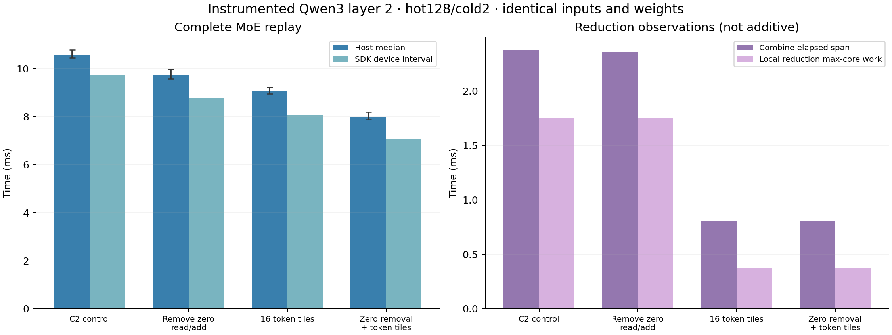
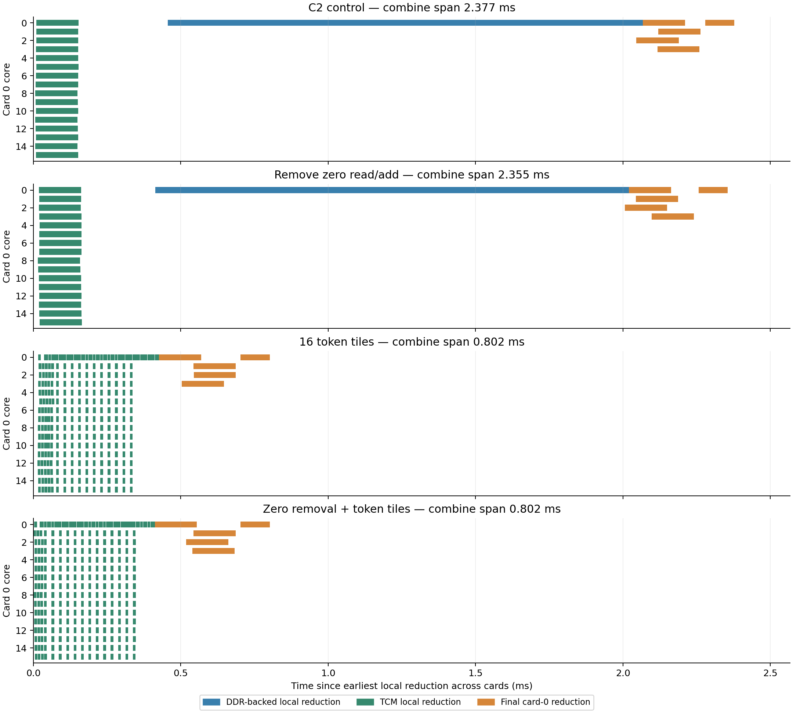

# Qwen3 layer-2 overhead ablations

Measured 2026-09-22 on four AI 100 cards, 16 cores each; SDK 1.21.6, FP16. Stats-level-70 ablations are followed by a separate stats-level-0 confirmation.

**With profiling instrumentation disabled, zero-read removal plus token-tiled reduction lowers isolated MoE host latency from 10.305 to 7.776 ms (24.54% lower latency; 1.325× speedup).** All saved timing and profiling outputs match the original C2 output bit for bit.

## Controlled changes

The replay uses the trained Qwen3-30B-A3B zero-based layer 2, captured expert inputs and already-regrouped routing from the same GSM8K prompt 41, batch 1 / 128 tokens. Hot capacity stays 128 and cold capacity stays 2. The six trained weight banks, expert order, GEMM nodes, capacities, final cross-card reduction and four-card partition configuration stay identical. Physical tiling, placement and scheduling can change when the compiler sees a rewritten graph.

- **Zero-read removal:** the first `CtxGather3D_2` reads the all-zero accumulator. Its only consumer, `Add`, adds those zeros to the weighted hot-group outputs. Remove these two nodes and feed the weighted outputs directly into the existing valid-row mask and scatter. Retain dense zero initialization, the hot scatter and the cold read/modify/write path, which must preserve hot contributions.
- **Token tiling:** replace the local `dpth->dth` reduction with 16 independent reductions of `[4,16,8,2048]` slices and concatenate their token outputs. Every output still reduces the same 16 expert-lane contributions; no tree of partial sums is introduced.
- **Hidden tiling:** screen the alternative of 16 `[4,16,128,128]` slices, concatenating along hidden features.
- **Combined:** apply zero-read removal and the token-tiled local reduction together, after measuring each separately.

The source dense accumulator is still `[64,128,2048]` FP16 (32 MiB). This experiment changes its access and reduction schedule; it does not implement sparse token-oriented combination or omit inactive experts. The replay starts after routing/permutation. Full-model latency, runtime selection and adaptation overhead are outside this measurement.

## Initial screen

Three rounds of 100 timed invocations per case, 10 warmups each; capacity and weights are fixed. Reverse case order in the middle round.

| Candidate | Host median, ms | Per-round medians, ms |
|---|---:|---|
| C2 control | 10.615 | 10.667, 10.560, 10.606 |
| Remove zero read/add | 9.767 | 9.746, 9.813, 9.741 |
| 16 token tiles | 9.042 | 9.035, 9.001, 9.093 |
| 16 hidden tiles | 9.224 | 9.320, 9.248, 9.105 |

Token tiling was selected for the combined candidate from this screen. A fresh timing cohort compares the control, each selected individual change and their combination; its results below do not mix old and new host timing samples.

## Instrumented confirmation cohort

| Variant | Host median, ms | Host P10–P90, ms | Reduction vs control | SDK device interval, ms |
|---|---:|---:|---:|---:|
| C2 control | 10.566 | 10.443–10.774 | 0.00% | 9.724 |
| Remove zero read/add | 9.719 | 9.569–9.966 | 8.02% | 8.768 |
| 16 token tiles | 9.083 | 8.942–9.224 | 14.03% | 8.053 |
| Zero removal + token tiles | 7.994 | 7.877–8.194 | 24.34% | 7.092 |

Host time includes set-data, enqueue, input/output transfer and wait. Compilation, loading, activation and warmup are excluded. Host P10/P90 are invocation spread, not confidence intervals. Device metrics use the same median whole-device duration trace for every metric in a row, from three validated captures per variant.

## Confirmation without profiling instrumentation

Recompile the unchanged control and combined graphs with `-stats-level=0`; all other compiler flags stay the same. Run another three rounds × 100 invocations per graph, reversing order in round 2. These host timings have their own matched control and are kept separate from the instrumented cohort.

| Variant | Host median, ms | P10–P90, ms | Per-round medians, ms |
|---|---:|---:|---|
| C2 control | 10.305 | 10.140–10.480 | 10.378, 10.299, 10.283 |
| Zero removal + token tiles | 7.776 | 7.653–7.976 | 7.739, 7.789, 7.801 |



## What the compiler actually changed

| Variant | Hot span, ms | Between groups, ms | Cold span, ms | Combine span, ms | Local reduction max-core work, ms | DDR-backed reduction cores | Total outgoing P2P, MiB |
|---|---:|---:|---:|---:|---:|---:|---:|
| C2 control | 2.840 | 1.654 | 2.205 | 2.377 | 1.754 | 4 / 64 | 63.9851 |
| Remove zero read/add | 2.795 | 0.766 | 2.217 | 2.355 | 1.750 | 4 / 64 | 63.9851 |
| 16 token tiles | 2.875 | 1.673 | 2.176 | 0.802 | 0.374 | 0 / 64 | 63.9851 |
| Zero removal + token tiles | 2.816 | 1.014 | 1.935 | 0.802 | 0.375 | 0 / 64 | 63.9851 |

Expert spans run from first to last HMX event in each group. Combine spans run from first local reduction to last final-combine computation. These are observational windows and may overlap other work. Max-core work sums HVX compute within each core, then takes the largest core total; it is not elapsed latency. The DDR-backed-core count describes the lowered reduction kernels, not an exact memory-traffic counter. P2P payload counts outgoing endpoints once.

Removing the redundant zero read/add shortens the between-group interval from 1.654 to 0.766 ms in its isolated ablation, while leaving the combination span almost unchanged. Token tiling shortens the combination span from 2.377 to 0.802 ms. The combined graph has its own compiled schedule; individual phase savings should not be added to predict its latency.

**The compiler did not distribute the final within-card merge across 16 cores.** Each card still runs that merge on core 0. The original one-shot DDR-backed merge becomes 16 small TCM-backed merge kernels, interleaved with partial reductions. The largest per-card total for those merge kernels drops from 1.611 to 0.229 ms. A DDR-backed HVX kernel duration can include operand-access stalls; this is recorded kernel time, not a pure arithmetic measurement. Tiling improved locality and pipelining while retaining the core-0 merge bottleneck.

All variants send the same 63.9851 MiB of P2P payload per replay. Removing `Add` moves the hot-stage 24 MiB exchange to the first scatter; it does not eliminate that exchange. The observed speedups therefore cannot be explained as fewer P2P bytes. Reduction tiling also changes the attribution of the final 1.5 MiB partial-result exchange from `Einsum_3` to `reduce_tile_0`.

The following timeline shows local reduction work on every core of card 0. Each panel starts at that trace’s first local reduction across all cards. This directly tests whether the intended parallelism survived compilation.



## Validation and limits

- Original graph initializers are unchanged; all six expert projections, capacity Slice/Range nodes and final cross-card reduction pass structural checks.
- Each tiling rewrite is checked using its actual ONNX replacement subgraph against the original reduction on a deterministic random `[4,16,128,2048]` FP32 input. Both tiled candidates are exactly equal in this check.
- Across 3,000 timed invocations, every saved timing-round output is byte-identical to the original C2 replay. All routing counts match and remain within hot128/cold2. The timing host saves the last output of each round (30 total), not every intermediate invocation.
- Three saved profiler outputs per candidate (15 total) also match its timing output bit for bit. All hot/cold expert stages still execute on all 64 cores.
- Devices are checked Ready with 16 free cores, no loaded networks and no active networks before and after every timing/profile run.
- This is one layer, prompt and precision. The result does not establish the same saving for all 48 layers or uninstrumented full-model execution. It also does not establish a global optimum over tile sizes or placements.

## Artifacts and reproduction

`initial.json`, `summary.json` and `uninstrumented.json` hold the three timing cohorts. Each case retains the rewritten ONNX, exact changes, compiler command/log, timing samples, output comparisons, SDK traces and analysis CSVs. QPCs are in RAM scratch and can be rebuilt. PNG/PDF/SVG charts and large model/trace artifacts stay local; scripts and this report are committed.

Use a new output and scratch directory; the original cold-capacity capture and C2 control QPC must be available. Run `export`, `compile`, `timing` for the default four cases with `tools/moe_qwen3_overhead_ablation.py`. Then export/compile `drop_zero_tile_t16`. Run `timing --timing-prefix confirm` on `baseline drop_zero tile_t16 drop_zero_tile_t16`. Profile all five cases using their existing timing prefix (`confirm` for the combined-only case). Analyze the initial four with `--summary-name initial` and the confirmation four with `--timing-prefix confirm --summary-name summary`.

Finally, run `compile` and `timing` on `baseline drop_zero_tile_t16` with `--stats-level 0 --timing-prefix uninstrumented`. Use `timing-summary` with those same arguments and `--summary-name uninstrumented`; no device trace is requested from uninstrumented QPCs. The stats-level-0 binaries and logs have separate paths, preserving the instrumented artifacts.

Shared arguments for the analysis script:

```bash
--cold 9.17.2026/real_model/oracle_padding/cold_capacity_control \
--out 9.17.2026/real_model/oracle_padding/overhead_ablation \
--scratch /dev/shm/qwen3_overhead_wentao_20260922 \
--base-scratch /dev/shm/qwen3_cold_wentao_20260922
```

Use `/home/chihao/qeff-venv/bin/python` for export/compile/run/analyze and `/tmp/qwen3_profile_plot_wentao_20260921/bin/python tools/moe_qwen3_overhead_report.py --root OUTPUT` for this report and plots.
