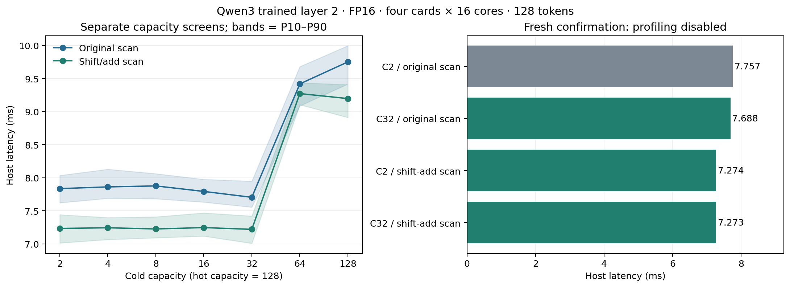
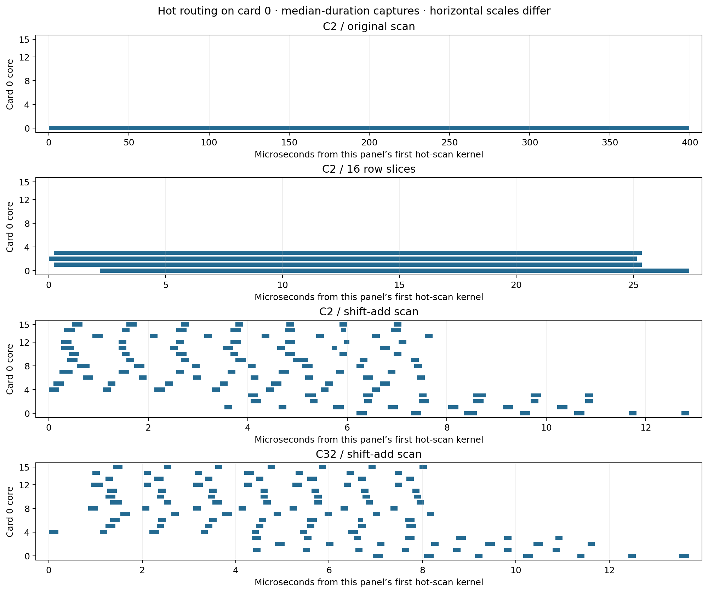

# Qwen3 layer-2 routing scans and padding retuning

Measured 2026-09-22 on four AI 100 cards, 16 cores per card, SDK 1.21.6, FP16.

**The fresh confirmation lowers isolated MoE host latency from 7.757 to 7.274 ms (6.22% lower; 1.066×).** The reported default is `c2_tree`. The control already includes the previous zero-read removal and local reduction split into 16 token tiles; this is an additional gain.

## Scope and graph changes

The source is `../overhead_ablation/drop_zero_tile_t16/model.onnx`: trained zero-based layer 2, batch 1, 128 tokens, hidden 2048, intermediate 768, 128 experts, top-8 routing. The captured input remains the first 128 tokens of GSM8K prompt 41. The six FP16 weight banks, expert order, hot capacity 128, expert projections, accumulator and output reductions are unchanged. Both 64-expert groups span all four cards. The replay excludes router/TopK, expert sorting and routing-column permutation, but includes the integer prefix sums and token packing/unpacking.

- **Row slices:** split each `[64,128]` integer mask along the expert dimension into 4 or 16 slices, independently run the original token-axis `CumSum`, and concatenate rows. This exposes independent work without changing the scan order within each row.
- **Shift/add scan:** replace each inclusive `CumSum` with seven int32 stages. At distance `d = 1,2,4,8,16,32,64`, add the previous stage to itself shifted right by `d` token positions, with zeros on the left. This is an inclusive parallel prefix scan. Values remain exact integers in `[0,128]`; no FP16/FP32 conversion is involved.
- **Padding:** vary only the cold Slice endpoint and Range limit over 2,4,8,16,32,64,128. The captured hot/cold maxima remain 92/2, so every tested capacity is safe for this input.

The routing mask is still a runtime input. No captured prefix sums or token indices are embedded into the graph. These are separately compiled static capacities; runtime selection and changing expert placement are outside this experiment.

## First screen: routing at cold capacity 2

| Scan | Host median, ms | P10–P90, ms | Per-round medians, ms |
|---|---:|---:|---|
| C2 / original scan | 7.835 | 7.621–8.035 | 7.721, 7.878, 7.846 |
| C2 / 4 row slices | 7.475 | 7.229–7.656 | 7.505, 7.432, 7.494 |
| C2 / 16 row slices | 7.396 | 7.150–7.608 | 7.317, 7.458, 7.399 |
| C2 / shift-add scan | 7.245 | 7.107–7.449 | 7.210, 7.345, 7.204 |

## Capacity screens

| Cold capacity | Original scan, ms | Shift/add scan, ms |
|---|---:|---:|
| 2 | 7.835 | 7.233 |
| 4 | 7.861 | 7.243 |
| 8 | 7.876 | 7.225 |
| 16 | 7.792 | 7.246 |
| 32 | 7.703 | 7.219 |
| 64 | 9.419 | 9.272 |
| 128 | 9.751 | 9.197 |

With the shift/add scan, capacities 2–32 span only 7.219–7.246 ms in this screen. This narrow range does not support a strong preference for the lowest screening median alone.

These columns are separate screening cohorts. Each variant has three rounds of 100 timed invocations and 10 warmups per round, with reversed case order in the middle round. Selection from a screen is followed by a fresh matched confirmation; small differences among capacities should be assessed against the round-to-round spread.

## Fresh confirmation, profiling disabled

| Variant | Host median, ms | P10–P90, ms | Reduction vs control | Per-round medians, ms |
|---|---:|---:|---:|---|
| C2 / original scan | 7.757 | 7.629–7.952 | 0.00% | 7.754, 7.741, 7.744, 7.736, 7.803 |
| C32 / original scan | 7.688 | 7.514–7.973 | 0.88% | 7.671, 7.724, 7.714, 7.674, 7.631 |
| C2 / shift-add scan | 7.274 | 7.084–7.506 | 6.22% | 7.343, 7.254, 7.274, 7.277, 7.189 |
| C32 / shift-add scan | 7.273 | 7.092–7.478 | 6.24% | 7.291, 7.262, 7.286, 7.286, 7.218 |

C2 and C32 with the new scan differ by only 1.245 µs in pooled median. C2 is faster in 4 of 5 paired round medians. There is no consistent C32 latency advantage; prefer C2 for its smaller communication footprint.

The confirmation has 5 rounds × 100 timed invocations per variant, reversing order in alternate rounds.

Host timings use `-stats-level=0` and include set-data, enqueue, input/output transfer and wait. Compilation, loading, activation and warmup are excluded. P10/P90 describe invocation spread, not confidence intervals. Compilation of these variants does not overlap device measurements.



## Placement and remaining scheduling cost

The following metrics come from separate `-stats-level=70` builds. Each row uses the same median whole-device-duration sample among three validated captures.

| Variant | Device, ms | Hot/cold scan cores | Hot/cold max-core scan work, µs | Hot/cold max-core scan span, µs | P2P payload, MiB |
|---|---:|---:|---:|---:|---:|
| C2 / original scan | 7.233 | 4/4 | 399.427/399.427 | 399.427/399.427 | 63.9851 |
| C2 / 16 row slices | 6.788 | 16/16 | 25.261/25.156 | 25.261/25.156 | 63.9851 |
| C2 / shift-add scan | 6.585 | 64/64 | 1.407/1.406 | 7.062/66.719 | 63.9851 |
| C32 / shift-add scan | 6.741 | 64/64 | 1.307/1.304 | 6.844/147.970 | 100.5586 |

The original scan runs on core 0 of each card. The 16-row-slice graph places four scans on each card (card 0 cores 0–3, card 1 cores 4–7, card 2 cores 8–11, card 3 cores 12–15). The shift/add graph executes all seven integer-add stages on all 64 cores. This is observed kernel placement, not just potential parallelism in the source graph.

Max-core work sums recorded HVX compute durations on each core and takes the largest sum. Max-core span includes the gaps between that core’s first and last scan kernels. Neither is the end-to-end routing phase: copies, masks, packing, dependencies and staggered core/card readiness also matter. In particular, the cold scan can have a wide global envelope even when each individual core finishes its scan quickly.

| Variant | Hot expert span, ms | Between groups, ms | Cold expert span, ms | Combine span, ms |
|---|---:|---:|---:|---:|
| C2 / original scan | 2.834 | 1.263 | 1.807 | 0.807 |
| C2 / 16 row slices | 2.714 | 1.089 | 1.991 | 0.846 |
| C2 / shift-add scan | 2.516 | 1.075 | 2.013 | 0.798 |
| C32 / shift-add scan | 2.720 | 1.007 | 1.828 | 0.854 |

These are observational windows, not additive arithmetic costs. Changing routing also changes the compiled execution schedule. All three matched C2 routing variants retain the same 63.9851 MiB outgoing P2P payload. Both expert stages still execute on all 64 cores.

C32 with the shift/add scan sends 100.559 MiB, 57.2% more than C2, without a large latency advantage. C2 is therefore a useful default when latency is comparable and communication volume matters. This is a choice within the measured cases, not a universal optimum for other layers or workloads.



## Validation and limitations

- 7,100 timed invocations across the three cohorts. All 71 saved timing-round outputs are byte-identical to the original FP16 C2 replay; only the final output of each round is saved, not every invocation.
- 12 saved profiling outputs also match their uninstrumented timing reference bit for bit. Counts are exact, sum to 1024 and never overflow.
- Every routing rewrite is checked using the actual replacement ONNX subgraph against an int32 CPU prefix sum for empty, full, deterministic random and captured masks, separately for hot and cold groups. Export checks preserve all other original nodes and all original initializers except the two cold-capacity constants.
- Every device run checks all four cards Ready, 16 free cores, zero loaded and active networks before and after execution.
- This remains one captured layer/prompt/precision. Full-model gain and behavior across other routing distributions have not been measured. No empty experts are removed, and the dense accumulator, expert group widths and four-card partition configuration remain unchanged. Physical tiling and scheduling remain compiler decisions.

## Artifacts and reproduction

`screen.json`, `combined.json`, `confirm.json` and `profiles.json` hold the cohorts. Each case retains graph/export checks, exact compile commands, logs, timing samples and output validation. Profiled cases also retain raw SDK captures, decoded full-flow traces and per-core analysis CSVs. QPCs are in `/dev/shm/qwen3_retune_wentao_20260922`; the C2 control reuses the byte-identical graph and binaries from the overhead experiment.

Use `/home/chihao/qeff-venv/bin/python tools/moe_qwen3_routing_retune.py ACTION` with:

```bash
--cold 9.17.2026/real_model/oracle_padding/cold_capacity_control \
--overhead 9.17.2026/real_model/oracle_padding/overhead_ablation \
--out NEW_OUTPUT_DIRECTORY --scratch NEW_RAM_SCRATCH_DIRECTORY \
--base-scratch /dev/shm/qwen3_cold_wentao_20260922 \
--overhead-scratch /dev/shm/qwen3_overhead_wentao_20260922
```

Run `export`, `compile`, `timing`, then `timing-summary`. Case names are `c2` through `c128`, optionally suffixed `_rows4`, `_rows16`, `_rows64` or `_tree`; rows64 is supported but was not measured here. The default stats level is 0. Use distinct timing prefixes and summary names for each cohort. Export each graph once; use `compile --stats-level 70` for separately stored profiling binaries, then `profile` and `analyze` with stats level 70. Profiling may validate against saved stats-level-0 timing outputs from the same graph.

Recorded timing cohorts (pass the name as both `--timing-prefix` and `--summary-name`):

- `screen`: `--cases c2 c4 c8 c16 c32 c64 c128 c2_rows4 c2_rows16 c2_tree --rounds 3 --iterations 100`.
- `combined`: `--cases c2_tree c4_tree c8_tree c16_tree c32_tree c64_tree c128_tree --rounds 3 --iterations 100`.
- `confirm`: `--cases c2 c32 c2_tree c32_tree --rounds 5 --iterations 100`.

Profile `c2 c2_rows16 c2_tree` against `--timing-prefix screen` and `c32_tree` against `--timing-prefix combined`; analyze all four with `--summary-name profiles`.

Regenerate this report and PNG/PDF/SVG plots with `/tmp/qwen3_profile_plot_wentao_20260921/bin/python tools/moe_qwen3_routing_retune_report.py --root OUTPUT`. Large artifacts remain local; scripts and Markdown are committed.
