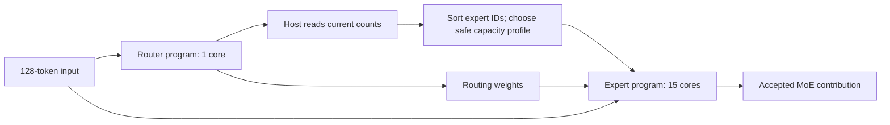

# Current-layer counts before expert dispatch on one card

Measured on card 0, SDK/firmware 1.21.6, 2026-09-21. A one-core router and a
15-core expert program can stay activated together. The host reads the **current
input's** routing counts, regroups the resident experts, chooses a safe compiled
capacity profile, and executes the expert program. Outputs match the fused
controls bit for bit in both tested precisions.

The net latency increase over a fused 15-core control is 0.49–0.61 ms in FP16
and 0.30–0.45 ms with MXFP6 while cycling inputs. Oversubscribing the cores
through either tested ProgramGroup protocol costs substantially more.

This completes the initial current-count boundary probe in the
[single-card roadmap](SINGLE_CARD_ROADMAP.md). All new runs used card 0.
The full single-card exploration is still in progress.

## Implementation and scope

The exporter cuts the [combined-adaptation graph](COMBINED_ADAPTATION.md) after
the global router's dense routing-weight tensor. The first graph contains
routing; the second consumes routing weights as an ordinary graph input and
contains the existing packing, runtime weight-bank gathers and expert compute.
The original expert implementation is unchanged.



- Synthetic weights, Qwen dimensions H=2048/I=768, T=128, global 128-expert/top-8
  routing, and a **partial 32-expert resident contribution**. This is not a full
  trained Qwen layer or a stateful prefill implementation.
- Global top-8 normalization is preserved. Router outputs are FP16
  `route_weights[128,128]` (32 KiB) and int32 resident `counts[32]` (128 bytes).
  The expert input also includes `x[128,2048]` (512 KiB).
- The host sorts all 32 IDs by descending current count, breaking ties by ID.
  It selects the safe profile with the fewest padded expert rows, checking
  `counts[ids[j]] <= capacity[j/4]` for every expert. This deliberately simple
  policy demonstrates dispatch; minimizing padded rows is not a latency-optimal
  scheduling policy.
- The same five capacity profiles and unique shape tags from the combined probe
  are compiled. ID values control membership; row-vector and tag **shapes**
  select a compiled capacity profile through `qaicExecObjSetDataExt`.
- Both programs, their execution objects and maximum-sized host buffers are
  created once per run. The coactive path performs no program reload or
  activation changes during measurement. Resource snapshots stay constant.
- The host copies routing weights back into the expert input and sends the
  activation input to both programs. This measures a host-mediated boundary;
  device-buffer sharing, sparse routing IO and CPU routing remain alternatives.

| Input | Resident assignments | Largest count | Selected profile after sorting |
|---|---:|---:|---|
| normal | 266 | 13 | uniform16: `[16]*8` |
| warm | 310 | 27 | mixed: `[64,32,16,16,32,16,16,16]` |
| hot | 259 | 55 | mixed: `[64,32,16,16,32,16,16,16]` |
| stress | 640 | 128 | full128: `[128]*8` |

The global route tensor has exactly eight selected experts per token, 1,024
assignments in total. The table counts only the resident 32-expert contribution.
The stress input selects five resident experts for all 128 tokens. The current
counts cause the conservative profile to be selected **before expert execution**;
no truncated run or replay is needed in this probe.

## Execution paths and controls

| Path | Core reservation | How it dispatches |
|---|---|---|
| split | Router 1 + experts 15, both active | Two normal programs, one device queue; host waits for routing before selecting experts/profile |
| pg | Router 1 and experts 16 share 16 | ProgramGroup oversubscription, default control-path protocol (`0`) |
| pgdata | Router 1 and experts 16 share 16 | ProgramGroup oversubscription, data-path protocol (`1`) |
| fused15 | 15 cores | Original fused graph, same IDs/profile; precomputed counts supply an **oracle control**, not an online policy |
| fused16 | 16 cores | Original fused graph and existing five-profile QPC, same oracle choices |

All paths execute serial dependencies. Keeping both programs active does not
mean the router and its dependent expert work execute concurrently. ProgramGroup
holds its reservation throughout measurement, but that does not establish that
internal switching is free of weight or program-state transfers.

The installed API documents the protocols and resource reservation in
`/opt/qti-aic/dev/inc/QAicApi.h` under `QAicProgramGroupPropertiesProtocol` and
`qaicProgramGroupEnable`. The observed costs below are for these concrete QPCs;
they do not rule out every possible program-sharing arrangement.

## Latency

Host transaction medians in milliseconds while cycling all four inputs, including
input copies, binding, routing, the host choice and expert execution. Each cell
has 90 samples: three rounds × 30 repetitions. Held-input schedules also have
90 samples per cell. Warmups, file writes and output verification are outside
timing. Every repetition is checked. Setup is recorded separately in metadata.

| Precision / input | Coactive split 1+15 | Fused15 oracle | Fused16 oracle | ProgramGroup control | ProgramGroup data |
|---|---:|---:|---:|---:|---:|
| FP16 normal | 5.761 | 5.275 | 5.381 | 20.461 | 13.097 |
| FP16 warm | 5.782 | 5.174 | 6.584 | 21.007 | 14.316 |
| FP16 hot | 5.736 | 5.166 | 6.726 | 22.465 | 14.432 |
| FP16 stress | 6.956 | 6.380 | 6.733 | 22.053 | 14.319 |
| MXFP6 normal | 4.139 | 3.840 | 3.813 | 18.872 | 11.650 |
| MXFP6 warm | 4.126 | 3.831 | 3.934 | 18.845 | 11.775 |
| MXFP6 hot | 4.165 | 3.797 | 3.937 | 18.907 | 11.771 |
| MXFP6 stress | 3.420 | 2.974 | 2.928 | 17.544 | 10.772 |

For the coactive split, the routing phase takes 0.758–0.778 ms in FP16 and
0.684–0.712 ms in MXFP6. Sorting and profile selection take 1.4–1.8 microseconds;
the host handoff copies take 0.051–0.063 ms. The measured net increase over
fused15 is smaller than the entire routing phase because fused15 also computes
the router and the compiler may schedule the split graph differently. This net
difference is not a pure API dispatch cost. Medians of phases need not sum to
the median total.

The router alone takes approximately 0.59–0.61 ms in repeated same-program
runs. Expert-only repeated normal-input runs in the ProgramGroups take about
5.06–5.13 ms in FP16 and 3.46–3.47 ms in MXFP6. Alternating programs is much
slower even with the data-path protocol. No PCIe transfer trace was collected
here, so the overhead is not attributed to a measured number of weight bytes.

Reserving a router core does not imply a predictable 1/16 compute penalty.
For example, fused15 is faster than fused16 for the tested FP16 mixed profile.
Use the matched fused15 control when estimating the cost of the routing boundary;
core count changes the compiler's schedule as well as available compute.

A separate conservative control runs `[128]*8` on the **same input and sorted
IDs**. Fused16 held-input medians for normal/warm/hot are 16.04/16.08/16.17 ms
in FP16 and 5.01/5.07/5.04 ms in MXFP6. On stress, the conservative profile is
already required and takes 6.74/2.92 ms. The split then adds observation cost
without reducing padded work. Do not compare the stress latency with a different
input's conservative latency to infer an adaptive speedup.

## Correctness and memory

Every tested mode, precision and workload passes these checks:

- Current routing weights and counts match the independent router reference
  bit for bit; the full route tensor retains global normalization.
- Selected IDs and profiles match the count-based policy, with zero overflow.
- All repeated adaptive outputs are bit-identical to their first checked output.
- Adaptive outputs match fused16 bit for bit, and both fused controls match
  their same-ID conservative outputs bit for bit.

FP16 error against the independent FP32 expert reference is at most **0.0706%**
relative L2. MXFP6 error is **5.58–6.03%**, shared with the fused controls.
The mechanism-equivalence gate passes; MXFP6 still fails the separate 5%
absolute-accuracy gate. These results do not resolve trained-model accuracy.

| Allocation / package | FP16 MiB | MXFP6 MiB |
|---|---:|---:|
| Device allocation: coactive router1 + expert15 | 1,338.37 | 716.91 |
| Device allocation: either ProgramGroup protocol | 1,354.65 | 620.81 |
| Device allocation: fused15 | 1,286.77 | 666.07 |
| Device allocation: fused16 | 1,303.17 | 570.07 |
| Packaged expert15 `constants.bin` | 873.59 | 347.38 |
| Packaged expert16 `constants.bin` | 873.73 | 235.07 |
| Packaged router1 `constants.bin` | 0.54 | 0.24 |

Device allocations are changes in SDK-reported free DRAM. The coactive path
reserves one core for the router, then all remaining 15 for experts. Both
programs stay active, with stable DRAM/core reservations after setup. ProgramGroup
reserves all 16 cores on enable and also shows stable resources.

The packaged `constants.bin` figures include compiler constant metadata and
must not be equated with the static packed-weight-only totals in the combined
probe. They use the same SDK field for every row. At MXFP6, expert15 needs
112.30 MiB more packaged constants than expert16. Thus a different core allocation
can change the profile library's storage cost; it is not just a compute tradeoff.
The exact representation-sharing cause has not been isolated.

## Reproduction and artifacts

Sources: [`moe_current_count_probe.py`](../../tools/moe_current_count_probe.py)
and [`moe_current_count_host.cpp`](../../tools/moe_current_count_host.cpp).
Artifact root: `9.17.2026/runtime_constraints/current_count_qwen/`.

```bash
PY=/home/chihao/qeff-venv/bin/python
OUT=9.17.2026/runtime_constraints/current_count_qwen

# Use a fresh output path for a new export; existing artifacts are not overwritten.
$PY tools/moe_current_count_probe.py --out "$OUT" --stage export \
  --source 9.17.2026/runtime_constraints/adaptive_qwen

for PRECISION in fp16 mxfp6; do
  $PY tools/moe_current_count_probe.py --out "$OUT" --stage compile --precision "$PRECISION"
  $PY tools/moe_current_count_probe.py --out "$OUT" --stage run --precision "$PRECISION" --iterations 30
  $PY tools/moe_current_count_probe.py --out "$OUT" --stage run --precision "$PRECISION" \
    --iterations 30 --run-name datapath --modes pgdata
  # Equivalence-only keeps the absolute accuracy result visible without rejecting
  # the already-known MXFP6 accuracy failure. Omit it to enforce both gates.
  $PY tools/moe_current_count_probe.py --out "$OUT" --stage analyze --precision "$PRECISION" --equivalence-only
  $PY tools/moe_current_count_probe.py --out "$OUT" --stage analyze --precision "$PRECISION" \
    --run-name datapath --modes pgdata --equivalence-only
  $PY tools/moe_current_count_probe.py --out "$OUT" --stage audit --precision "$PRECISION"
done
```

`{precision}/run/result.json` contains the four main modes;
`{precision}/datapath/result.json` contains the additional ProgramGroup protocol.
Each mode records `samples.csv`, `full_samples.csv`, `solo_samples.csv`,
`resources.csv`, metadata and checked outputs. `package_audit.json` records QPC
constant segment sizes and the compiled IO/profile interface. The five allowed
profiles are checked against the manifest. Large generated files remain ignored
by Git. The abandoned first export is retained as `current_count_qwen_export_failed/`;
it is not used in compilation or results.

## Algorithm implications and remaining single-card questions

Current-layer reactive scheduling is feasible with a host boundary. Keep the
observation cost in the objective, and compare it with prediction from earlier
chunks plus exact overflow handling. A policy using current counts must save
enough expert execution time to pay for observation, copies and any lost sharing.

The next single-card questions are runtime topology changes, capacity/token-count
cost tables and library scaling, followed by trained weights, full-bank/multiple
layer coverage, and state-safe chunked prefill. These executions vary MoE inputs;
they do not yet establish KV continuity, replay safety after attention, or
end-to-end language-model prefill performance. The single-card roadmap remains
the gate before new multi-card experiments.
