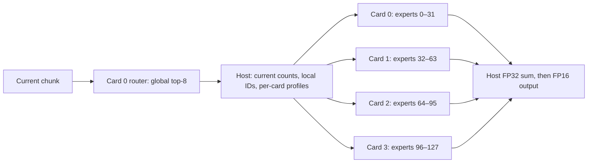

# Current-count profile selection across four cards

Date: 2026-09-21. SDK/firmware: 1.21.6. Cards: 0–3.

This follows the completed [single-card steps 1 and 2](JOINT_SCALING.md).
It is the initial multi-card baseline: four independent resident expert
programs, each owning 32 stationary experts from the same synthetic 128-expert
bank. Matrix dimensions are H=2048, I=768, with global top-8 routing.

## Measured results

**The initial four-card experiment passed 8,640 timed mechanism checks**,
with another 4,560 matching one-card control samples. Both precisions
preserved current router counts, safe capacities, repeatability and the
full-bank result. Device allocations stayed constant through profile changes.

| Precision | Maximum error vs FP32 | Maximum difference vs one-card control | Reference accuracy gate |
|---|---:|---:|---|
| fp16 | 0.0675% | 0.0429% | Pass |
| mxfp6 | 6.0186% | 0.0430% | Fail (>5%) |

Balanced inputs, held median complete-transaction latency in ms. The one-card
column is the **fastest measured safe sorted-ID fused profile** for that input,
an oracle control that avoids the separate current-router invocation. The
serial column uses the same four resident programs and independent policy.

| Tokens | Precision | Best one-card fused | Four-card conservative | Four-card common | Four-card independent | Four-card serial independent |
|---:|---|---:|---:|---:|---:|---:|
| 64 | fp16 | 18.449 | 6.301 | 6.268 | 6.285 | 21.307 |
| 64 | mxfp6 | 12.180 | 5.028 | 5.004 | 5.012 | 15.543 |
| 128 | fp16 | 21.637 | 18.304 | 7.889 | 7.928 | 25.684 |
| 128 | mxfp6 | 14.138 | 8.324 | 6.534 | 6.480 | 19.563 |
| 256 | fp16 | 21.686 | 22.448 | 11.646 | 11.654 | 36.987 |
| 256 | mxfp6 | 14.965 | 12.710 | 10.291 | 10.365 | 31.116 |

At T=128, parallel execution of the independent policy is
3.24× faster than the serial control in FP16 and
3.02× in MXFP6. Relative to the strongest measured one-card fused
profile, the corresponding speedups are 2.73× and 2.18×. These are MoE-block
measurements, not full-model prefill speedups.

**Different cards used different padding in the same chunk.** At T=128,
the observed choices below were the same in both precisions. The warm workload
uses uniform capacity 32 on cards 0/3 and uniform capacity 16 on cards 1/2.

| Load | Peak counts on cards 0/1/2/3 | Per-card profile names | FP16 independent/common ms | MXFP6 independent/common ms |
|---|---|---|---:|---:|
| balanced | [8, 8, 8, 8] | small4, small4, small4, small4 | 7.928 / 7.889 | 6.480 / 6.534 |
| warm | [23, 7, 8, 23] | medium4, small4, small4, medium4 | 7.808 / 7.828 | 6.588 / 6.555 |
| hot | [68, 5, 5, 68] | mixed, small4, small4, mixed | 12.539 / 12.524 | 8.224 / 8.712 |
| concentrated | [128, 0, 0, 128] | mixed, small4, small4, mixed | 11.158 / 11.094 | 7.025 / 7.408 |

At T=128, independent versus common FP16 medians differed by at most 0.064 ms.
MXFP6 improved by 0.488 ms (5.6%) on the hot input and 0.383 ms (5.2%) on the
concentrated input. The heavily loaded cards kept the same profile while the
lighter cards used less padding. These results suggest that unchanged heavy-card
work limits the benefit; per-card device completion traces were not collected,
so this is not an isolated causal measurement. The concentrated
input assigns 768/0/0/256 expert-token pairs to cards 0/1/2/3. This fixed-ownership
baseline therefore motivates testing ownership changes or replicas, rather than
assuming that independent padding alone will balance global work.

T=128 balanced independent parallel path, phase medians in ms. Medians of the
individual phases need not sum exactly to the median total. Dispatch/wait includes
binding and enqueuing all four expert programs and waiting for their outputs.

| Precision | Router | Host decision | Host handoff | Dispatch/wait | Host merge |
|---|---:|---:|---:|---:|---:|
| fp16 | 0.7997 | 0.0078 | 0.2110 | 6.6717 | 0.2059 |
| mxfp6 | 0.7334 | 0.0080 | 0.2189 | 5.2807 | 0.2363 |

Resident device allocation in GiB; card 0 includes the router. All four programs
remain resident across choices, so selecting a smaller profile does not release
the library storage or reserved cores.

| Precision | Card 0 | Card 1 | Card 2 | Card 3 | Total |
|---|---:|---:|---:|---:|---:|
| fp16 | 2.196 | 2.140 | 2.140 | 2.140 | 8.615 |
| mxfp6 | 0.758 | 0.703 | 0.702 | 0.702 | 2.866 |

The measured freedom is independent per-card profile selection and local expert
regrouping between invocations. Physical expert ownership stayed fixed. The next
ownership/replication and card-pair layout comparisons remain open.

At completion, all four cards were Ready with 16 free cores, no loaded constants
and no active networks.

## Execution arrangement

| Card | Global expert IDs | Core reservation |
|---:|---|---|
| 0 | 0–31 | 1 router core + 15 expert cores |
| 1 | 32–63 | 15 expert cores |
| 2 | 64–95 | 15 expert cores |
| 3 | 96–127 | 15 expert cores |

Each expert program has the same 18-profile library: T=64/128/256 and the six
uniform/mixed layouts described in the single-card report. Runtime IDs permute
the card's local bank. The host verifies that these banks are exact slices of
the full-bank reference using SHA-256 hashes for all three expert projections.



The router normalizes over the global selected experts. All cards receive the
same hidden states and dense global routing weights; expert ownership determines
which contribution each card computes. There is no per-card renormalization.
Host handoff and output reduction are included in end-to-end latency.

Three policies are compared on each input:

- **Independent:** sort each owner's current counts and choose its safe profile
  with the fewest padded rows.
- **Common:** choose one safe profile for all four owners, retaining different
  local ID orders.
- **Conservative:** use `full4`, with capacity T for every expert on every card.

The parallel host enqueues all four expert executions before waiting. The serial
control keeps the same five programs resident but waits after each card's expert
execution. Neither mode reloads weights or changes expert ownership during the
sample loop. Three rounds of held and cycling schedules reverse workload order.

Counts, capacity safety, routing weights and output repeatability are checked
on every transaction. Saved outputs are checked against a one-card full-bank
conservative execution, the independent sparse FP32 reference and the four-card
conservative policy. Host FP32 reduction is independently reproduced with NumPy.
The same 0.5% mechanism-equivalence and separate 5% reference-accuracy thresholds
are used as in the single-card probe.

The single-card comparison uses the same inputs, source weights, precision and
15 expert cores. Its fused execution is an oracle control, whereas the four-card
path obtains counts from its current router invocation. Different reduction
orders can introduce small rounding differences. Trained weights, attention,
KV state and model-level prefill throughput are outside this synthetic probe.

## What this experiment constrains

This tests independent profile selection with fixed ownership. It does not
establish weight migration, replica selection, arbitrary runtime weight tensors,
or independent profiles inside a single four-card QPC. The one-four-card-QPC and
two-pair-QPC arrangements remain candidates in the
[broader design space](../multilayer/RUNTIME_ADAPTATION.md).

Per-card padding freedom and global load balancing are different decisions.
Reducing work on a lightly loaded owner can improve its local completion time
without shortening the slowest card's contribution. Cross-card ownership or
replication is a subsequent constraint to measure.

## Reproduction and artifacts

Use `/home/chihao/qeff-venv/bin/python`. The host requires AVX/F16C, verified on
this server, for the measured host FP32 reduction and FP16 conversion.

```bash
python tools/moe_multicard_joint.py export --out <multi-root> --source <128-bank-root> --shard0 <32-bank-root>
python tools/moe_joint_scale.py compile --out <multi-root>/card1 --precision fp16 --variants expert15
# Repeat compilation for cards 2 and 3. Card 0 reuses the validated 32-expert QPC.
python tools/moe_joint_scale.py run --out <multi-root>/global --precision fp16 --modes fused15 --run-name control --iterations 5
python tools/moe_joint_scale.py analyze --out <multi-root>/global --precision fp16 --modes fused15 --run-name control
python tools/moe_multicard_joint.py run --out <multi-root> --precision fp16 --iterations 10
python tools/moe_multicard_joint.py analyze --out <multi-root> --precision fp16
```

Repeat for MXFP6. Artifacts are under `multicard_joint/`: bank hashes and ownership
in `info.json`, workload owner counts in `global/info.json`, one-card controls in
`global/<precision>/control/`, and parallel/serial measurements in
`<precision>/run/`. The latter retain raw timing and resource CSVs, per-card
partial outputs, selected IDs, merged outputs, counts and validation summaries.
Generated binaries/results remain local under the repository tracking policy.
