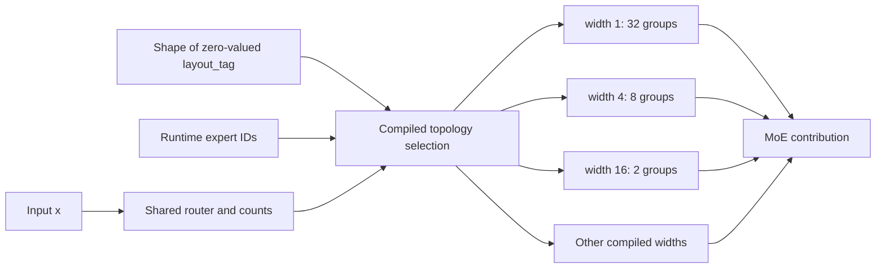

# Runtime group-topology selection in one resident program

Measured on **card 0**, SDK/firmware 1.21.6, 2026-09-21. One QPC and one
activated program can switch between widths **1, 2, 4, 8, 16 and 32 experts per
group**, while also changing resident expert IDs. Each selected layout matches
its corresponding fixed-width control **bit for bit**, in FP16 and MXFP6.

The mechanism is a shape-resolved ONNX `If`: the compiler specializes the
branch condition using an input's shape, and the host chooses one of those
compiled shapes between invocations. Device traces show only the chosen
layout's kernels. The tested input-value-dependent `If` is rejected.

The main constraint is the layout library's cost. All six widths require
**1,407.79 MiB FP16 / 559.98 MiB MXFP6** of packed static constants, roughly
**4.8×** a width-4-only package. At width 4, holding that layout in the six-width
library is **5.8% / 12.3%** slower than the original fixed-width QPC. Switching
is feasible, but retaining many layouts is not free.

## Scope and implementation

This reuses the [group-width sweep](GROUP_WIDTH.md): synthetic weights,
H=2048/I=768, T=128, global 128-expert/top-8 routing, and the partial contribution
of **32 resident experts**. Capacity stays **32** for every group, so every
topology schedules the same 1,024 padded expert rows. There is no attention,
KV state, trained-model inference, or multi-card execution in this probe.

The source graphs come from `group_width_qwen/`. The exporter verifies that
all six graphs have identical gate/up/down/router initializers, keeps one copy
of each initializer at the outer graph scope, and moves the shared router and
canonical expert-count output outside the topology branches. Each branch then
contains its packing, expert weight gathers, GEMMs and reduction.



Only one branch executes. The diagram lists representative choices; the library
contains all six widths. Group width does not specify a physical core count.

The inputs are `x[128,2048]` FP16, `expert_ids[32]` int32, and
`layout_tag[W]` int32. Tag values are zero. The tag length `W` is one of
`1,2,4,8,16,32` and uniquely selects a compiled layout. Its sum is added to
the expert IDs to keep the input live without altering their values.

The C++ host allocates the maximum tag buffer once, changes its active size and
dimension, and calls `qaicExecObjSetDataExt`. It loads and activates the program
once and reuses one execution object. Unlisted lengths such as 3, 0 and 64 are
rejected before enqueue. Runtime IDs continue to select the resident experts;
no weight ownership changes or program reloads occur in the measured loop.

This extends the earlier capacity-specialization result to a finite library of
different graph structures. It does not allow an arbitrary new topology or a
value-controlled device branch after an invocation has started. Combining this
width selection with variable capacities and the separate current-count router
is a subsequent integration experiment.
The host must choose the width before enqueue. Counts returned by this fused
invocation can guide a later invocation. A choice based on current-layer counts
needs an earlier routing boundary, as tested separately in
[current-count dispatch](CURRENT_COUNT_DISPATCH.md).

## Compiler constraints established by small probes

The `frontend` stage reproduces these outcomes without the large expert bank:

| Condition / branch interface | Result on SDK 1.21.6 |
|---|---|
| Condition derived from a specialized input shape; one branch output | Compiles for both tested shapes |
| Same shape condition; two branch outputs | Rejected: `Only single output 'then' subgraph is supported.` |
| Condition derived from an input value; one branch output | Rejected: `If: Non-constant condition tensor not supported.` |

The first full MoE export also hit the two-output restriction. Keeping the
shared router/counts outside the branches resolves that restriction for this
graph. These results concern the tested ONNX/compiler path, rather than every
possible custom device dispatch mechanism.

## Correctness and selected-branch evidence

For each width, the host tests identity, swapped-half and shuffled permutations
of the resident bank. A separate duplicate-half diagnostic changes the output,
confirming that the ID input affects execution; duplicates are not legal
production regroupings and are excluded from timing.

All same-width outputs match their fixed-QPC controls exactly. The single-width
specialization control also matches exactly. Every timed repetition checks its
output and counts against its initial checked result, and every count is within
capacity. The analysis separately compares counts with the reference.

There are **6,480 timed multi-layout samples per precision**: six widths × three
normal ID cases × three rounds × 30 repetitions × four schedules. Seven control
programs add 3,780 timed samples per precision. Every device run uses card 0.

The four schedules hold both choices, cycle only IDs, cycle only widths, or
cycle both. The combined cycle covers the entire width/ID cross-product; it
does not synchronize the two cycles in a way that skips combinations.

Absolute accuracy remains a separate gate. FP16 error is at most **0.0691%**
relative L2 against the independent FP32 reference. MXFP6 normal-case error is
approximately **6.0326%**, rising to **6.0752%** in the duplicate diagnostic.
Those errors are shared with the fixed controls. Mechanism equivalence passes;
MXFP6 continues to fail the separate 5% absolute-accuracy gate.

The audit evaluates each branch's actual packing dependencies and verifies
`[W,32,2048]` inputs to its `32/W` expert groups. It also checks the compiled
allowed tag shapes against the requested library. SDK runner profiling compares
against the benchmark outputs, then records the executed kernels:

| Selected width | Groups | Expert GEMM nodes observed | Expert HMX cores participating |
|---|---:|---:|---|
| 1 | 32 | 96 | 0–15 |
| 2 | 16 | 48 | 0–15 |
| 4 | 8 | 24 | 0–15 |
| 8 | 4 | 12 | 0–15 |
| 16 | 2 | 6 | 0–15 |
| 32 | 1 | 3 | 0–3 |

Both precisions show exactly the selected width's node names, with no expert
nodes from other branches. Every expert GEMM in every MXFP6 layout has observed
dequantization kernels. Logical GEMM-node counts above are not counts of kernel
events or tiles. All program configurations reserve 16 cores even when the
selected expert computation participates on fewer HMX cores.

## Latency

Unprofiled host medians in milliseconds. Each table cell pools 270 samples
across three ID cases and three rounds. Timing includes ID copies, shape binding,
enqueue and completion; x is prebound and unchanged. Warmups, verification and
file writes are excluded. Profiled kernel traces are separate from these times.

| Width | FP16 fixed QPC, held | FP16 library, held | FP16 library, cycle both | MXFP6 fixed QPC, held | MXFP6 library, held | MXFP6 library, cycle both |
|---|---:|---:|---:|---:|---:|---:|
| 1 | 7.135 | 7.298 | 7.447 | 5.665 | 5.673 | 5.819 |
| 2 | 5.966 | 6.444 | 6.592 | 4.151 | 4.710 | 4.803 |
| 4 | 5.379 | 5.692 | 5.800 | 3.566 | 4.005 | 4.063 |
| 8 | 5.494 | 6.102 | 6.176 | 3.876 | 4.510 | 4.552 |
| 16 | 6.670 | 7.318 | 7.327 | 4.879 | 5.614 | 5.476 |
| 32 | 8.392 | 8.899 | 8.944 | 7.266 | 7.694 | 7.723 |

Width 4 remains the fastest tested width in this equal-work case. Holding a
layout in the six-layout library is 2.3–11.1% slower than its fixed QPC in FP16
and 0.1–16.4% slower in MXFP6. This is a recurring library-associated cost even
when no topology switch occurs.

The one-layout width-4 specialization runs in **5.341 ms FP16 / 3.529 ms MXFP6**,
within about 1.1% of the original fixed-width control. Its source still contains
the shape-selecting branch construction, but compilation retains only width 4.
This distinguishes the multi-layout package cost from an unavoidable penalty
for writing a shape-resolved `If`. The precise compiler scheduling/storage cause
of the recurring cost has not been isolated.

Cycling both widths and IDs changes per-width medians relative to held execution
by up to approximately +0.15 ms; the MXFP6 width-16 median decreases by 0.14 ms.
Shape-only cycling has a largest increase of approximately 0.22 ms. These are
schedule comparisons, not isolated API switch costs. Binding itself takes
**3.06–3.19 microseconds FP16 / 0.76–0.91 microseconds MXFP6** in the combined
cycle. Raw samples include all four schedules and percentile summaries.

## Memory and library size

Packed static constants extracted from each QPC, in MiB:

| Compiled library | FP16 | MXFP6 |
|---|---:|---:|
| Width 4 only | 292.55 | 116.74 |
| Widths 4, 8 | 588.59 | 237.29 |
| Widths 2, 4, 8 | 878.63 | 351.82 |
| All six widths | 1,407.79 | 559.98 |

The two- and three-width subsets were **compiled and storage-audited only**;
their separate QPCs were not benchmarked. Do not infer their runtime latency
from this table. The all-six library is 4.81×/4.80× the width-4-only constant
storage. The shared ONNX bank does not guarantee complete sharing of compiler
packed representations. These totals do not establish an exact integer number
of weight copies.

The six-layout program's activation consumes **1,787.24 MiB FP16 / 939.83 MiB
MXFP6** according to the change in SDK free DRAM. The single-width-4
specialization consumes **622.87 / 447.13 MiB**. DRAM and core reservations stay
constant throughout each run, across all ID and topology changes. Static
constant bytes and total device allocation are different measurements.

These results reinforce the [capacity-library memory finding](COMBINED_ADAPTATION.md):
measure the actual compiled library. Count of profiles, source-bank size, and
logical padded rows are insufficient to predict either its storage or latency.

## Implications for the single-card algorithm

Keep group topology as an available **finite, ahead-of-time** choice alongside
runtime expert IDs. Avoid assuming that a broad library is cheap because the
source weights are shared. Compare a compact library's measured benefits with
its added constant storage and its cost even when a layout is held.

This fixed-T, fixed-capacity experiment does not establish when width changes
are useful under realistic routing distributions. The next single-card work
should build capacity/token-count cost tables, combine width and capacity
selection, and test resident-bank/layer scale before trained-weight and
stateful chunked-prefill integration. The [single-card roadmap](SINGLE_CARD_ROADMAP.md)
continues to gate new multi-card experiments.

## Reproduction

Sources: [`moe_topology_probe.py`](../../tools/moe_topology_probe.py) and
[`moe_topology_host.cpp`](../../tools/moe_topology_host.cpp).
Artifact root: `9.17.2026/runtime_constraints/topology_qwen/`.

```bash
PY=/home/chihao/qeff-venv/bin/python
OUT=9.17.2026/runtime_constraints/topology_qwen

# Start with a fresh output path when exporting again.
$PY tools/moe_topology_probe.py --out "$OUT" --stage export \
  --source 9.17.2026/runtime_constraints/group_width_qwen
$PY tools/moe_topology_probe.py --out "$OUT" --stage frontend

for PRECISION in fp16 mxfp6; do
  $PY tools/moe_topology_probe.py --out "$OUT" --stage compile --precision "$PRECISION"
  $PY tools/moe_topology_probe.py --out "$OUT" --stage compile --precision "$PRECISION" \
    --variants pair_w4_w8 triple_w2_w4_w8
  $PY tools/moe_topology_probe.py --out "$OUT" --stage run --precision "$PRECISION" --iterations 30
  # This preserves the reported accuracy failure while allowing mechanism analysis.
  # Omit --equivalence-only to enforce both accuracy and equivalence gates.
  $PY tools/moe_topology_probe.py --out "$OUT" --stage analyze --precision "$PRECISION" --equivalence-only
  $PY tools/moe_topology_probe.py --out "$OUT" --stage audit --precision "$PRECISION" \
    --profile --variants single_w4 pair_w4_w8 triple_w2_w4_w8
done
```

`{precision}/run/result.json` contains timings and correctness checks;
each variant directory contains raw samples, outputs, resource snapshots and
setup metadata. `package_audit.json` contains actual packing shapes, allowed
input shapes, packed constant sizes and trace checks. `frontend/result.json`
records the minimal compiler probes, including the two expected rejections.
The first rejected full export remains in `topology_qwen_multi_output_failed/`
and is not used in these results. Generated ONNX/QPC/trace/output files remain
ignored by Git. All hardware runs clean up their program reservations on exit.
