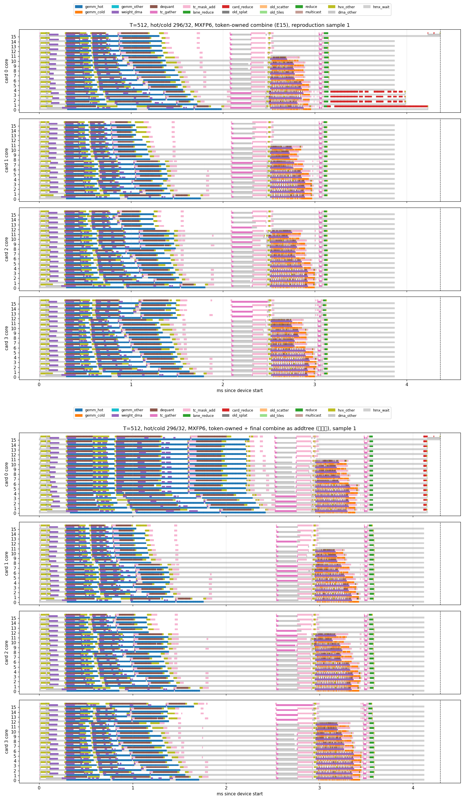

# Final cross-card sum on 16 cores: method, results, and comparison with the original design

Date 2026-09-26. Four AI 100 cards (16 cores each), SDK 1.21.6, Qwen3-30B-A3B layer-2 replay, MXFP6 expert weights,
`-mdts-mos=1`, prompt-41 routing (synthetic routing at T=256/512), hot/cold placement with oracle capacities
(T=128: 92/2, T=256: 158/4, T=512: 296/32). The starting point is the token-owned combine, the final design of Section 3.13
of the original mdts_flag README. Scripts, graphs and profiles live in `/home/chihao/testing`.

## 1. Summary

- The tail of the token-owned design (what card 0 still does after cards 1-3 have finished, 1.23 ms at T=512) is not the
  cross-card transfer but **compute: 16 reduction tiles executed serially on 4 cores of card 0** (1.03 ms). The 6 MiB
  transfer (0.53 ms) is hidden underneath it.
- Rewriting the final sum as elementwise Adds split along the token axis lets the compiler spread it over all 16 cores of
  card 0; the add drops from 1.03 ms to 8 us. Single-layer host latency at T=512 goes from 5.57 ms to 4.91 ms (**-12%**);
  the tail from 1.23 to 0.71 ms.
- With the add gone, the floor of the tail is the link: 6 / 3 / 1.5 MiB take 0.53 / 0.25 / 0.125 ms (T=512/256/128),
  about **12 GB/s**, exactly proportional to bytes. This is the only cost left in the combine; shrinking it further needs
  fewer bytes or a different topology.
- Side effect: card 0's hot stage becomes about 0.4 ms slower (T=512), eating roughly half of the gain. The evidence points
  at the 6 MiB P2P landing buffer being statically resident in card 0's TCM. Four variants that reduce residency did not
  remove it; sending the hot-stage partial early (stagesplit) does, but doubles the bytes and stalls card 0's cold stage,
  so it is worse overall.

## 2. What the original tail actually does

After each card has summed each token's eight rows locally, token-owned (README 3.13) still has to add the four per-card
[T, 2048] partial sums into one. The original graph writes that as 16 `Einsum('dth->th')` tiles of 32 rows plus a Concat.
The compiler lowers every Einsum to the same template:

```
cores 1, 2, 3 each add one incoming share (one core per source card) -> multicast to core 0 -> core 0 adds again (two reduce-adds)
```

All 16 tiles share those 4 cores and the same merge point, so one tile must finish before the next starts. From the T=512
trace (`profile/K_T512_hc_296_32_tokenowned_mxfp6_s70_flag`):

| Item | Value |
|---|---:|
| Cards 1-3 finish | 3.14 ms |
| Partials issued by the three cards (48 P2P sends, 6 MiB) | 3.136-3.151 ms |
| 16 tiles, 5 ops each on cores 0-3 | 3.135-4.162 ms, 73 us per tile |
| Core 0 writes the 2 MiB output back | 4.163-4.230 ms |
| Card 0 finishes | 4.36 ms |

The link delivers one tile's 384 KiB in about 33 us, faster than the 73 us a tile takes, and all 6 MiB have arrived by
about 3.67 ms; the later tiles run on data that is already present. So the 1.03 ms is serialized compute, not transfer.
This matches the README's own description in 3.12 ("a serialized tile pipeline, rooted on card 0") and its observation in
3.14 that fp16 partials do not save time.

## 3. The change: elementwise adds split along the token axis

`scripts/make_final_combine.py <token-owned graph> <out> addtree`:

```
p_c = Slice(to_partials, card c)          # four [T, 2048] slices
out = (p0 + p1) + (p2 + p3)               # elementwise Adds
```

The compiler partitions an elementwise Add by rows: the 16 cores of card 0 each add their own 32 rows, with no
dependency or multicast between cores (op inventory: 48 `elementadd` ops on all 16 cores of card 0). The parallel axis
changes from "source card" (4 -> 4 cores) to "token row" (512 -> 16 cores), which is the same form the per-card local
reduction (green in the figures) already used.

Other forms tried: a variadic `Sum` and `Transpose + ReduceSum` both fall back to the 4-core `aicbatchedreduceadd` plus
a DDR reduce, so they do not help.

## 4. Results

### 4.1 Latency (T=512, one session, 3 alternating rounds x 100, host median)

| Build | Host ms | vs token-owned | Device ms (3 samples) | Card-0 tail |
|---|---:|---:|---|---:|
| anchor, dense combine (README 3.8) | 9.735 | | | |
| token-owned (README 3.13) | 5.573 | - | 4.38 / 4.36 / 4.34 | 1.23 ms |
| **addtree (this note)** | **4.912** | **-12%** | 4.38 / 4.29 / 4.11 | 0.71 ms |
| tileadd, 16 elementwise tiles | 5.140 | -8% | 4.31 / 4.15 / 4.21 | 0.67 ms |
| addtree + fp16 partials | 5.192 | -7% | 4.35 / 4.32 / 4.01 | 0.71 ms |

Uninstrumented, the SDK runner's per-iteration total over 40 iterations is 5.90 ms (token-owned), 5.39 (addtree),
5.22 (tileadd), consistent with the host timing. Outputs differ from the anchor by a relative L2 of 3.5e-4 (fp16
elementwise adds in a different association), against 1.3e-5 for token-owned.

### 4.2 Tail breakdown (device, median sample)

| T | Partial bytes | Idle gap before the add (link) | Add | Output write | Tail: token-owned -> addtree |
|---:|---:|---:|---:|---:|---|
| 128 | 1.5 MiB | 0.125 ms | 8 us | | 0.30 -> 0.16 ms |
| 256 | 3.0 MiB | 0.25 ms | 8 us | | 0.58 -> 0.32 ms |
| 512 | 6.0 MiB | 0.53 ms | 8 us | 0.17 ms | 1.21 -> 0.71 ms |

The gap is reproducible to 0.01 ms across three samples and strictly proportional to bytes, about 12 GB/s. The trace's
P2P events (12-15 us) record when a transfer is issued, not when it completes; arrival can only be inferred from the
first consuming op on the receiving side.

### 4.3 Per-core timelines: before (top) and after (bottom), T=512



How to read it (x axis in ms; the four panels are the four cards, one row per core; blue/orange hot and cold GEMMs,
purple weight DMA, brown dequantize, pink gathers and index build, green local reduction, red final sum, grey waits):

- Top, right end of card 0: four long red bars on cores 0-3 from 3.15 to 4.16 ms; the other 12 cores wait in grey.
- Bottom, right end of card 0: one small red dot per row (4.11 ms, 8 us). Left of the dots, 3.59-4.11 ms, all four cards
  are grey: that is the 6 MiB on the link.
- Bottom, card 0's hot stage (blue) is about 0.4 ms longer than on top (1.99 -> 2.42 ms); the other three cards are
  unchanged. Consequently the pink index build and the orange cold stage shift right by 0.45 ms, and cards 1-3 finish at
  3.58 instead of 3.14.

Single figures: [T512_tokenowned_cores.png](figures/T512_tokenowned_cores.png),
[T512_fc_addtree_cores.png](figures/T512_fc_addtree_cores.png), [T512_fc_tileadd_cores.png](figures/T512_fc_tileadd_cores.png),
[T512_fc_stagesplit_cores.png](figures/T512_fc_stagesplit_cores.png).

## 5. Side effect: card 0's hot stage slows down

| Observation | Data |
|---|---|
| Op structure unchanged | card 0, per core: 36 GEMMs, 36 dequantizes, 36 weight DMAs, same bytes |
| Every op uniformly slower | GEMM 21.7 -> 49.8 us per event, dequantize 12.2 -> 21.6 us; HMX waits on weights double; cards 1-3 unchanged |
| Grows with T | hot-stage end shift: T=128 about 0, T=256 about +0.1 ms, T=512 +0.3 to +0.5 ms; partials are 1.5 / 3 / 6 MiB |

Variants tried to remove it (T=512, device, median sample; `scripts/fc_compare.py`):

| Variant | Device | Card-0 hot end | Card-0 tail | Outcome |
|---|---:|---:|---:|---|
| addtree | 4.29 | 2.42 | 0.71 | baseline |
| rev, (p3+p2)+(p1+p0) | 4.25 | 2.37 | 0.70 | compiler still roots on card 0; no change |
| tileadd, 32 tiles | 4.39 | 2.56 | 0.66 | no change |
| half, two halves | 4.46 | 2.57 | 0.71 | no change |
| stagesplit, hot-stage partial sent early | 4.50 | **2.06** | 0.71 | hot stage recovers, but 12 MiB cross-card and card 0's cold stage is pushed to 3.27 ms; worse overall |

Interpretation: P2P landing buffers are allocated statically; the senders write straight into fixed TCM addresses on
card 0, so the region is reserved for the whole layer. The original design runs its 16 tiles serially and needs one
384 KiB landing buffer reused 16 times; the elementwise forms make all tiles runnable at once, so the whole 6 MiB is
resident and each core loses about 384 KiB of TCM, which shortens the hot stage's weight prefetch. Splitting into 32 tiles
or two halves does not change "everything lands at once", so it does not help; stagesplit needs 12 MiB, more than the
compiler puts in TCM, so it goes through DDR and the hot stage recovers, at the price of DDR contention during the cold
stage. This is inferred from the traces; the compiler's allocation table is not visible.
A testable fix: 16 elementwise tiles with an explicit data dependency between consecutive tiles, so the compiler goes
back to one landing buffer reused 16 times while keeping the 16-core add; expected hot stage back at 1.99 ms, tail
unchanged, layer gain from -12% to about -20%.

## 6. What is left

After the change, a T=512 layer (about 4.2 ms device) consists of: hot stage about 2.1 ms (including the 0.4 ms side
effect), inter-stage index exchange about 0.5, cold stage about 0.5, per-card local reduction 0.05, **cross-card
transfer 0.53**, add 0.01, output write 0.17. The transfer is the only item left in the combine, 12% of the layer, and
only three things can reduce it:

1. Fewer bytes: send only the rows of tokens that touched the card. With the current placements a token touches 3.8 cards
   on average, so this saves only 7% (39% on the sorted layout, which is 0.7 ms slower under the flag); it has to be
   designed together with placement and traded against balance.
2. Overlap: send the hot-stage partial early. stagesplit shows the receiving card pays for the transfer during its cold
   stage, so this only pays if the cold-stage share is sparse and small.
3. Topology: each card receives a quarter of the tokens (reduce-scatter), 1.5 MiB and about 0.13 ms per card. Both the
   original README (3.14) and this round saw the compiler collapse it back onto card 0; it needs compiler support.

## 8. Attempts to remove the hot-stage side effect (2026-09-26, afternoon)

Every untested item of the table in Section 5 was tried (T=512, device, median sample; `scripts/fc_compare.py`):

| Method | Form | Card-0 hot end | Card-0 tail | Device | Outcome |
|---|---|---:|---:|---:|---|
| Chained 16 tiles (chain) | 16 elementwise tiles, tile k+1's input adds row 0 of tile k's output times 1e-5 x 1e-5 | 2.56 | 0.67 | 4.40 | adds run strictly at the link cadence (34 us per tile), tail as expected; hot stage still slow, so "landing-buffer reuse" is not the cause |
| Compiler option `-vtcm-working-set-limit-ratio` 0.5 / 0.25 / 0.1 | addtree graph unchanged, option only | 2.39 / 2.46 / 2.39 | 0.71 | 4.29 / 4.33 / 4.26 | op inventory identical to no option; no effect |
| Hierarchical tree (tree) | 16 Einsum tiles over lanes 0+1, 16 over lanes 2+3, then an elementwise add | 1.98 | 2.41 | 5.54 | compiler puts both Einsum chains on cores 0-1 of card 0, serial (1.5 ms busy each), tail doubles; hot stage normal |
| Four-root reduce-scatter (quarters) | four independent addtrees on quarter row ranges, operands rotated per card | 2.49 | 0.68 | 4.33 | all elementadds still on card 0; operand order is ignored |
| Send only nonzero rows | not expressible in a static graph (rows per card vary with the input); with the current hot/cold placement a token touches 3.8 cards on average, at most 7% fewer bytes | - | - | - | arithmetic only, no experiment |

Pattern: Einsum-based forms (the collective-reduction template) keep the landing buffer small and reused and leave the hot
stage alone, but the template uses 2-4 cores serially; elementwise forms run on 16 cores, but the compiler statically
allocates every slice, partial sum and output in card 0's TCM, costing the hot stage 0.4 ms, and neither ordering
constraints (chain), smaller pieces (32 tiles, halves) nor the compiler option change that allocation. Every attempt to
move the root off card 0 (tree, quarters, rev, the README's reduce-scatter) is folded back onto card 0.

Status: addtree remains the best usable variant (-12% host latency). Getting both the parallel add and an unaffected hot
stage needs a compiler-side way to place reduction inputs in DDR or reuse intermediate buffers; no graph-level expression
is left to try.

Figures (T=512, sample 1): `figures/T512_fc_chain_cores.png`, `figures/T512_fc_tree_cores.png`, `figures/T512_fc_quarters_cores.png`,
`figures/T512_fc_addtree_vtcm0.5_cores.png`, `figures/T512_fc_addtree_vtcm0.25_cores.png`, `figures/T512_fc_addtree_vtcm0.1_cores.png`,
plus the earlier `T512_fc_rev/half/tileadd32/stagesplit_cores.png`.

## 7. Reproduction

```
scripts/make_final_combine.py combine/T512_hc_296_32_tokenowned combine/T512_to_fc_addtree addtree     # or tileadd [N] | rev | half | stagesplit | sum | treduce
scripts/compile_any.sh combine/T512_to_fc_addtree F_T512_fc_addtree_mxfp6_s0_flag mxfp6 0 flag          # s70 for the instrumented build
scripts/timing.py timing/S11b_fc_spec.json timing/S11b_fc.json 3 100                                    # same-session timing
scripts/profile_case.sh qpc/F_T512_fc_addtree_mxfp6_s70_flag profile/F_T512_fc_addtree_mxfp6_s70_flag F_T512_fc_addtree 512 combine/T512_to_fc_addtree/input_f16.bin
plotvenv/bin/python scripts/detail_plot2.py profile/F_T512_fc_addtree_mxfp6_s70_flag/analysis/sample1 "title" figures/x.png 0,1,2,3
scripts/fc_compare.py                                                                                   # variant comparison table
```

Data: `timing/S11b_fc*.json` (timing), `profile/F_T*_fc_*` (traces, per-core CSVs, analysis), `inventory/F_T512_fc_*`
(compile-time op inventories), `combine/T*_to_fc_*` (graphs).
