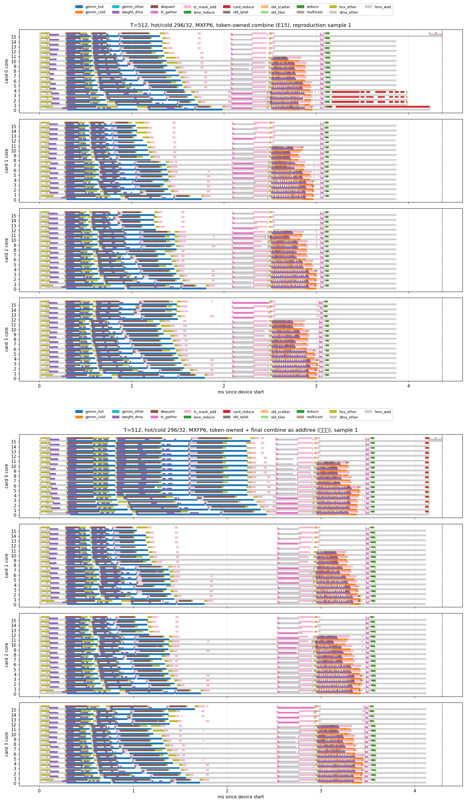
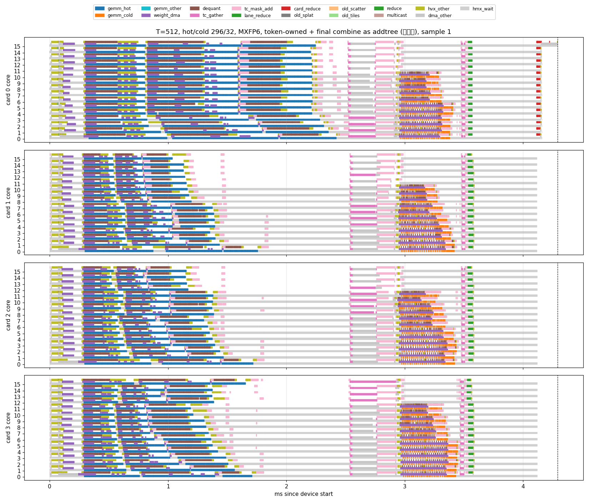

# Final cross-card sum on 16 cores: the elementwise combine (addtree) versus the original design

Date 2026-09-26, updated 2026-09-27. Four AI 100 cards (16 cores each), SDK 1.21.6, Qwen3-30B-A3B layer-2 replay, MXFP6 expert
weights, `-mdts-mos=1`, prompt-41 routing (synthetic routing at T=256/512), hot/cold placement with oracle capacities
(T=128: 92/2, T=256: 158/4, T=512: 296/32). The starting point is the token-owned combine, the final design of Section 3.13
of the original mdts_flag README. Scripts, graphs and profiles live in `/home/chihao/testing`. This note keeps only the design
that was adopted; the variants tried on the way are in the experiment logs, not here.

## 1. Summary

- The tail of the token-owned design (what card 0 still does after cards 1-3 have finished, 1.23 ms at T=512) is not the
  cross-card transfer but **compute: 16 reduction tiles executed serially on 4 cores of card 0** (1.03 ms). The 6 MiB
  transfer (0.53 ms) is hidden underneath it.
- Rewriting the final sum as elementwise Adds split along the token axis (addtree) lets the compiler spread it over all
  16 cores of card 0; the add drops from 1.03 ms to 8 us. Single-layer host latency at T=512 goes from 5.57 ms to 4.91 ms
  (**-12%**); the tail from 1.23 to 0.71 ms.
- In the full model (48 layers, head-parallel attention, KV retained on device, flag, T=128 first chunk) the same rewrite in
  every layer takes the prefill from 147.3 / 147.0 ms to 132.9 / 133.2 ms (**-9.7%**), with the logits no worse
  (relative L2 to the reference 0.1724 -> 0.1682, same next token).
- With the add gone, the floor of the tail is the link: 6 / 3 / 1.5 MiB take 0.53 / 0.25 / 0.125 ms (T=512/256/128),
  about **12 GB/s**, exactly proportional to bytes. This is the only cost left in the combine.
- Side effect: under per-op tracing card 0's hot stage grows from 1.99 to 2.42 ms at T=512. On the production build this is
  an occasional jitter of about 0.1 ms on average, and the host clock shows the full tail gain, so the adopted design needs
  no fix for it (Section 5).

## 2. What the original tail actually does

After each card has summed each token's eight rows locally, token-owned (README 3.13) still has to add the four per-card
[T, 2048] partial sums into one. The original graph writes that as 16 `Einsum('dth->th')` tiles of 32 rows plus a Concat.
The compiler lowers every Einsum to the same template:

```
cores 1, 2, 3 each add one incoming share (one core per source card) -> multicast to core 0 -> core 0 adds again (two reduce-adds)
```

All 16 tiles share those 4 cores and the same merge point, so one tile must finish before the next starts. From the T=512
trace (`profile/K_T512_hc_296_32_tokenowned_mxfp6_s70_flag`):

| Item | Value |
|---|---:|
| Cards 1-3 finish | 3.14 ms |
| Partials issued by the three cards (48 P2P sends, 6 MiB) | 3.136-3.151 ms |
| 16 tiles, 5 ops each on cores 0-3 | 3.135-4.162 ms, 73 us per tile |
| Core 0 writes the 2 MiB output back | 4.163-4.230 ms |
| Card 0 finishes | 4.36 ms |

The link delivers one tile's 384 KiB in about 33 us, faster than the 73 us a tile takes, and all 6 MiB have arrived by
about 3.67 ms; the later tiles run on data that is already present. So the 1.03 ms is serialized compute, not transfer.
This matches the README's own description in 3.12 ("a serialized tile pipeline, rooted on card 0") and its observation in
3.14 that fp16 partials do not save time.

## 3. The change: elementwise adds split along the token axis

`scripts/make_final_combine.py <token-owned graph> <out> addtree`:

```
p_c = Slice(to_partials, card c)          # four [T, 2048] slices
out = (p0 + p1) + (p2 + p3)               # elementwise Adds
```

The compiler partitions an elementwise Add by rows: the 16 cores of card 0 each add their own 32 rows, with no
dependency or multicast between cores (op inventory: 48 `elementadd` ops on all 16 cores of card 0, nothing else). The
parallel axis changes from "source card" (4 -> 4 cores) to "token row" (512 -> 16 cores), which is the same form the
per-card local reduction (green in the figures) already used. Nothing before the final sum is touched.

## 4. Results, single layer

### 4.1 Latency (T=512, one session, 3 alternating rounds x 100, host median)

| Build | Host ms | vs token-owned | Device ms (3 traced samples) | Card-0 tail |
|---|---:|---:|---|---:|
| anchor, dense combine (README 3.8) | 9.735 | | | |
| token-owned (README 3.13) | 5.573 | - | 4.38 / 4.36 / 4.34 | 1.23 ms |
| **addtree (this note)** | **4.912** | **-12%** | 4.38 / 4.29 / 4.11 | 0.71 ms |

Uninstrumented, the SDK runner's per-iteration total over 40 iterations is 5.90 ms (token-owned) and 5.39 ms (addtree),
consistent with the host timing. Three later sessions gave the same gain: 0.43, 0.46 and 0.45 ms. Outputs differ from the
anchor by a relative L2 of 3.5e-4 (fp16 elementwise adds in a different association), against 1.3e-5 for token-owned.

### 4.2 Tail breakdown (device, median traced sample)

| T | Partial bytes | Idle gap before the add (link) | Add | Output write | Tail: token-owned -> addtree |
|---:|---:|---:|---:|---:|---|
| 128 | 1.5 MiB | 0.125 ms | 8 us | | 0.30 -> 0.16 ms |
| 256 | 3.0 MiB | 0.25 ms | 8 us | | 0.58 -> 0.32 ms |
| 512 | 6.0 MiB | 0.53 ms | 8 us | 0.17 ms | 1.21 -> 0.71 ms |

The gap is reproducible to 0.01 ms across three samples and strictly proportional to bytes, about 12 GB/s. The trace's
P2P events (12-15 us) record when a transfer is issued, not when it completes; arrival can only be inferred from the
first consuming op on the receiving side.

### 4.3 Per-core timelines: before (top) and after (bottom), T=512



How to read it (x axis in ms; the four panels are the four cards, one row per core; blue/orange hot and cold GEMMs,
purple weight DMA, brown dequantize, pink gathers and index build, green local reduction, red final sum, grey waits):

- Top, right end of card 0: four long red bars on cores 0-3 from 3.15 to 4.16 ms; the other 12 cores wait in grey.
- Bottom, right end of card 0: one small red dot per row (4.11 ms, 8 us). Left of the dots, 3.59-4.11 ms, all four cards
  are grey: that is the 6 MiB on the link.
- Bottom, card 0's hot stage (blue) is about 0.4 ms longer than on top (1.99 -> 2.42 ms) in this traced run; the other
  three cards are unchanged. Consequently the pink index build and the orange cold stage shift right by 0.45 ms, and
  cards 1-3 finish at 3.58 instead of 3.14. Section 5 shows this shift is mostly an artifact of trace collection.

The addtree run alone, median traced sample:



## 5. Side effect on card 0's hot stage, and what it costs on the production clock

What the traced profile shows (T=512):

| Observation | Data |
|---|---|
| Op structure unchanged | card 0, per core: 36 GEMMs, 36 dequantizes, 36 weight DMAs, same bytes |
| Every op uniformly slower | GEMM 21.7 -> 49.8 us per event, dequantize 12.2 -> 21.6 us; HMX waits on weights double; cards 1-3 unchanged |
| Grows with T | hot-stage end shift: T=128 about 0, T=256 about +0.1 ms, T=512 +0.3 to +0.5 ms; partials are 1.5 / 3 / 6 MiB |

The likely mechanism: the P2P landing buffer and the intermediates of the elementwise adds (about 14 MiB at T=512) are
allocated statically in card 0's TCM for the whole layer, which shortens the hot stage's weight prefetch. The original
Einsum template streams through one small reused buffer and does not have this footprint. This is inferred from the
traces; the compiler's allocation table is not visible.

What the production clock shows. The runtime's own device timer on the same QPC without trace collection (200 runs, two
alternating rounds):

| Build | Mean ms (two rounds) | Min | Max | Std |
|---|---|---:|---:|---:|
| token-owned | 4.26 / 4.31 | 4.08 | 4.47 | 0.07 |
| addtree | 3.90 / 3.78 | 3.44 | 4.40 | 0.18 to 0.19 |

- Without tracing, addtree is 0.36 to 0.53 ms faster than token-owned, close to the whole tail gain (1.23 to 0.71 ms);
  the host gains of four sessions, 0.66 / 0.43 / 0.46 / 0.45 ms, are the same size. Neither is possible if the hot stage
  really lost a steady 0.43 ms.
- addtree has a slow mode: a minority of iterations take up to 4.4 ms (std 0.19 against 0.07 for token-owned). The three
  traced samples, 4.38 / 4.29 / 4.11, all fall in the slow mode: per-op trace collection triggers it reliably.
- So on the production build the hot-stage cost of addtree is an occasional jitter of about 0.1 ms on average, not the
  steady 0.43 ms of the profile. Judge variants on the host clock or the runtime timer; use the traced profile for
  structure only.

## 6. Full model: addtree in all 48 layers

`scripts/build_full_fc.py` replaces every layer's final sum of `hpb_stack_tc` (rewrites + token-centric combine +
head-parallel attention, KV retained on device, flag) by addtree and changes nothing else; compile 8 min, QPC 25 GB,
4 host bindings. Both models ran twice, alternating, in one session (3 rounds x 20 each):

| Full model, T=128 first chunk, MXFP6, flag | run 1 | run 2 | logits rel L2 |
|---|---:|---:|---:|
| hpb_stack_tc (original, Einsum tiles) | 147.3 | 147.0 | 0.1724 |
| **hpb_stack_fc (addtree in every layer)** | **132.9** | **133.2** | 0.1682 |

The next token is the same in both. In the full model there is no root card: because the next layer's attention is
lane-partitioned, the compiler gathers all four partials on every card and each card computes the sum itself (an
all-gather of 4 x 1.5 MiB at T=128 instead of a reduce onto card 0). The elementwise form is still the faster one in that
structure: in a single-layer probe with the residual add, RMSNorm and the per-lane projection appended, it saves 0.3 ms
per layer at T=512, which matches the 14 ms over 48 layers seen here.

## 7. What is left

After the change, a T=512 layer (about 4.2 ms device, traced) consists of: hot stage about 2.0 ms, inter-stage index
exchange about 0.5, cold stage about 0.5, per-card local reduction 0.05, **cross-card transfer 0.53**, add 0.01, output
write 0.17. The transfer is the only item left in the combine, 12% of the layer, and only three things can reduce it:

1. Fewer bytes: send only the rows of tokens that touched the card. With the current placements a token touches 3.8 cards
   on average, so this saves at most 7% (39% on the sorted layout, which is 0.7 ms slower under the flag); it has to be
   designed together with placement and traded against balance.
2. Overlap: send the hot-stage share early. Measured once: the receiving card then pays for the transfer during its cold
   stage and the bytes double, so this only pays if the cold-stage share is sparse and small.
3. Topology: each card receives a quarter of the tokens (reduce-scatter), 1.5 MiB and about 0.13 ms per card. Both the
   original README (3.14) and this work saw the compiler collapse it back onto card 0; it needs compiler support.

## 8. Reproduction

```
scripts/make_final_combine.py combine/T512_hc_296_32_tokenowned combine/T512_to_fc_addtree addtree
scripts/compile_any.sh combine/T512_to_fc_addtree F_T512_fc_addtree_mxfp6_s0_flag mxfp6 0 flag          # 70 instead of 0 for the instrumented build
scripts/timing.py timing/S11b_fc_spec.json timing/S11b_fc.json 3 100                                    # same-session host timing
scripts/profile_case.sh qpc/F_T512_fc_addtree_mxfp6_s70_flag profile/F_T512_fc_addtree_mxfp6_s70_flag F_T512_fc_addtree 512 combine/T512_to_fc_addtree/input_f16.bin
plotvenv/bin/python scripts/detail_plot2.py profile/F_T512_fc_addtree_mxfp6_s70_flag/analysis/sample1 "title" figures/x.png 0,1,2,3
scripts/build_full_fc.py full_model/hpb_stack_tc full_model/hpb_stack_fc                                # full model graph
scripts/full_compile.sh hpb_stack_fc_flag_rs full_model/hpb_stack_fc rs -mxfp6-matmul -mdts-mos=1       # full model compile; fc2/chain_d.sh runs the session
```

Data: `timing/S11b_fc*.json` and `timing/S13_allpaths*.json` (host sessions), `profile/F_T512_fc_addtree_mxfp6_s70_flag`
and `profile/K_T512_hc_296_32_tokenowned_mxfp6_s70_flag` (traces, per-core CSVs, analysis), `fc2/runner/` (runtime timer
logs), `combine/T512_to_fc_addtree` (graph), `full_model/hpb_stack_fc` and `full_model/run_fc*` (full model).
